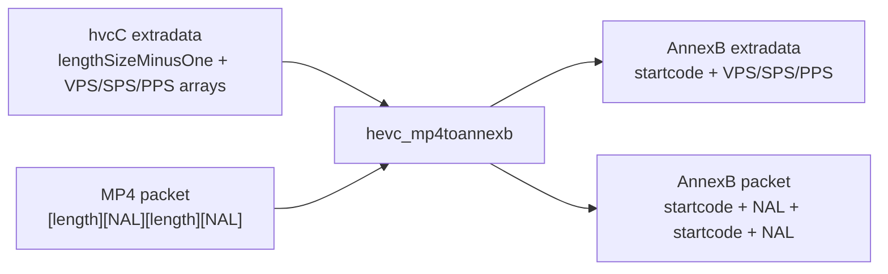
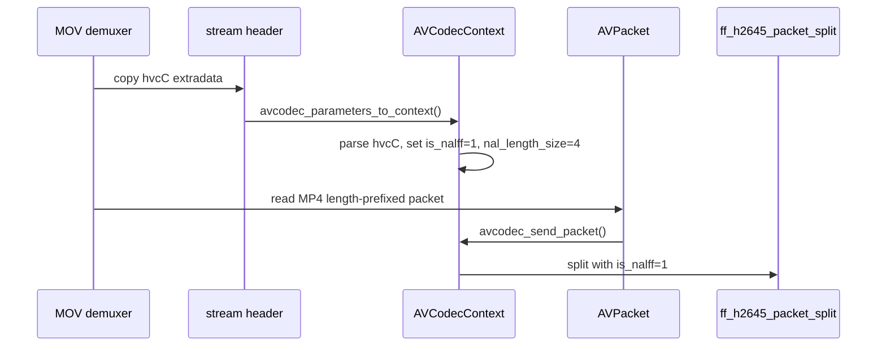
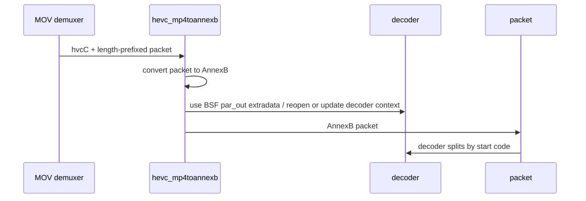
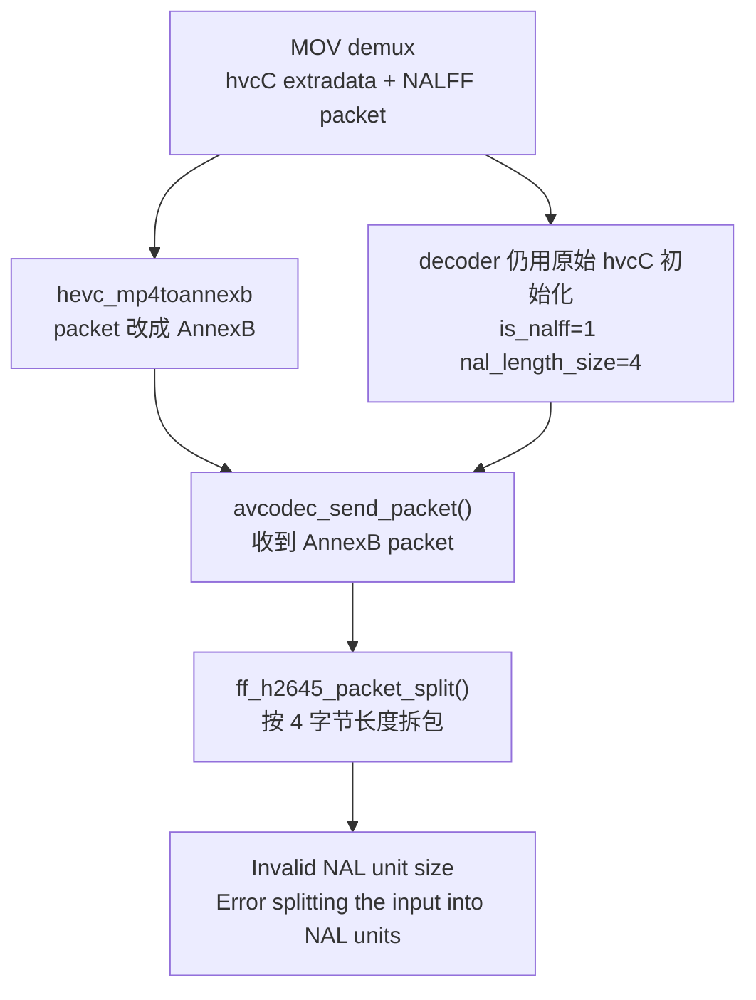
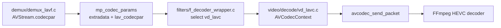

# HEVC hvcC / AnnexB / BSF 诊断

本文用这个样片和当前 FFmpeg/mpv 源码说明一个常见问题：MP4 里的 HEVC 通常不是 AnnexB，而是 `hvcC` 配置记录加 length-prefixed NAL 数据。如果中间插入 `hevc_mp4toannexb` BSF，就必须同步改变 decoder 看到的数据契约。

源码快照：

- FFmpeg 本机路径：`D:/work/player-deps/external/ffmpeg`
- FFmpeg Git describe：`win_1.2.3-88-gb9bb08b48-dirty`
- FFmpeg commit：`b9bb08b48240aa6973ccf2f77a007db018bc81c1`
- mpv 本机路径：`D:/github/mpv`
- 文档日期：2026-06-08

样片：

- 文件：`D:/work/video/[长安的荔枝].The.Lychee.Road.2025.60FPS.2160p.WEB-DL.H265.10bit.DV.DTS.5.1-OurTV.mp4`
- 视频流：`hevc` / `dvhe` / Main 10 / 3840x1608
- Dolby Vision：profile 5，RPU present，BL present
- `extradata_size=23`

## 结论先行

这次日志：

```text
Invalid NAL unit size (22020096 > 6635).
Error splitting the input into NAL units.
```

更像是 decoder 以 NALFF/MP4 length-prefixed 模式拆包，但实际收到的 packet 已经被转换成 AnnexB 或者处在错误字节边界上，而不是简单的 SPS/PPS/RPU 内容脏。

关键理由：

- `Invalid NAL unit size` 来自 `ff_h2645_packet_split()` 的 NALFF 分支。它只有在 `is_nalff=1` 时才会把前 4 字节解释成 NAL 长度。
- 样片的第一帧 packet 以 `00 00 00 03 46 01 10...` 开头，这是合法的 MP4 length-prefixed HEVC。第一个 NAL 长度是 3，NAL payload 是 `46 01 10`。
- 样片的 `hvcC` 只有 23 字节，但这是 HEVCDecoderConfigurationRecord 的最小形式，不等于脏数据。它可以不携带 VPS/SPS/PPS 数组，参数集可以出现在样本 packet 里。
- 如果先用 `hevc_mp4toannexb` 把 packet 改成 `00 00 00 01 ...`，但 decoder 仍然拿着原始 `hvcC` extradata 初始化，decoder 内部会继续按 NALFF 拆包，于是把 AnnexB 数据误读成一个巨大长度，触发当前错误。

最优先验证点：在 `avcodec_send_packet()` 之前打印 packet 前 16 字节和 decoder extradata 前 16 字节。

| packet 开头 | decoder extradata 开头 | 判断 |
| --- | --- | --- |
| `00 00 00 03 46 01 10...` | `01 02 20 00...` | 正常 MP4/NALFF 路径 |
| `00 00 00 01 ...` 或 `00 00 01 ...` | `01 02 20 00...` | 高概率就是本问题 |
| `00 00 00 03 ...` | AnnexB start code 或空 extradata | 反向不一致，也要查 |

## 三个格式概念

### hvcC

`hvcC` 是 MP4/MOV 里保存 HEVC decoder configuration 的 box，FFmpeg 会把它放进 `AVCodecParameters.extradata` / `AVCodecContext.extradata`。

它至少 23 字节，核心信息包括：

- HEVC profile、level、compatibility、constraint 等配置；
- `lengthSizeMinusOne`，告诉 decoder 每个 NAL 前面的长度字段占几个字节，常见值为 4 字节；
- `numOfArrays`，可选地携带 VPS/SPS/PPS/SEI 参数集数组。

本样片的 `hvcC`：

```text
01 02 20 00 00 00 90 00 00 00 00 00 99 f0 00 fc
fd fa fa 00 00 0f 00
```

这里最后一个字节 `00` 表示 `numOfArrays=0`，也就是 `hvcC` 自身没有携带 VPS/SPS/PPS 数组。它很短，但仍然可以是有效 MP4 HEVC 配置。

FFmpeg 读取位置：

- FFmpeg `libavformat/mov.c:2116` `mov_read_glbl()` 读取 `hvcC`/`avcC` 等全局配置。
- FFmpeg `libavformat/mov.c:7972` 将 `hvcC` box 绑定到 `mov_read_glbl()`。

### NALFF / length-prefixed

MP4 sample 里的 HEVC 通常使用 NALFF 格式。每个 NAL 是：

```text
[length_size 字节 big-endian NAL 长度][NAL payload]
```

本样片第一帧开头：

```text
00 00 00 03 46 01 10 00 00 00 19 40 01 0c 01 ff ...
```

按 4 字节长度解释：

- `00 00 00 03`：第一个 NAL 长度 3；
- `46 01 10`：第一个 NAL payload；
- `00 00 00 19`：下一个 NAL 长度 25；
- `40 01 ...`：下一个 NAL payload。

decoder 是否按 NALFF 拆包由 `hevc_decode_extradata()` 设置：

- FFmpeg `libavcodec/hevcdec.c:3304` `hevc_decode_extradata()` 调 `ff_hevc_decode_extradata()`。
- FFmpeg `libavcodec/hevcdec.c:3155` `decode_nal_units()` 把 `s->is_nalff` 和 `s->nal_length_size` 传给 `ff_h2645_packet_split()`。
- FFmpeg `libavcodec/h2645_parse.c:487` NALFF 分支读取 NAL 长度。

### AnnexB

AnnexB 是裸码流、TS 或部分硬件 API 常用格式。每个 NAL 是：

```text
[00 00 01 或 00 00 00 01 start code][NAL payload]
```

AnnexB 不靠前置长度定位 NAL，而靠 start code 扫描边界。参数集 VPS/SPS/PPS 通常在码流起始处，或者在关键帧前被重复插入。

## BSF 做了什么

BSF 是 bitstream filter。`hevc_mp4toannexb` 的职责是把 MP4/NALFF HEVC 改成 AnnexB HEVC。



当前 FFmpeg 的 BSF 逻辑：

- FFmpeg `libavcodec/hevc_mp4toannexb_bsf.c:103` 如果 extradata 太短或看起来已是 AnnexB，就直接透传 packet。
- FFmpeg `libavcodec/hevc_mp4toannexb_bsf.c:109` 否则解析 `hvcC`。
- FFmpeg `libavcodec/hevc_mp4toannexb_bsf.c:112` 保存 `length_size`。
- FFmpeg `libavcodec/hevc_mp4toannexb_bsf.c:145` 从 packet 读 length-prefixed NAL。
- FFmpeg `libavcodec/hevc_mp4toannexb_bsf.c:178` 输出 `00 00 00 01` start code。

本样片的特殊点是 `hvcC` 数组为空。因此 BSF 初始化时可以得到 `length_size=4`，但转换出来的 `ctx->par_out->extradata_size` 可能是 0。packet 仍会被转换成 AnnexB。

这本身不是错，但下游 decoder 必须知道自己收到的是 AnnexB packet，而不能继续按原始 `hvcC` 的 NALFF 状态拆包。

## 两条正确解码路径

### 路径 A：不插 BSF，直接软件解码

这是 mpv 对普通软件 HEVC 解码的主要路径。



这条路径里，extradata 和 packet 是同一套格式：

- extradata：`hvcC`；
- packet：length-prefixed NALFF；
- decoder：`is_nalff=1`，`nal_length_size=4`。

### 路径 B：插 BSF 后再解码

这条路径也可以成立，但必须把 BSF 输出参数当成新的输入契约。



这条路径里，下游不能继续使用原始 `hvcC` 状态。实际工程上更稳的处理是：如果目标是软件解码 MP4 HEVC，不要主动插 `hevc_mp4toannexb`。

## 失败链路

当前错误最符合下面这条链路：



这里的 `Invalid NAL unit size (22020096 > ...)` 不是说 HEVC 图像内容一定坏了，而是拆包器把不该当长度的字节当成了长度。`22020096 = 0x01500000`，这类值通常来自错误边界或格式误判。

## mpv 怎么处理

mpv 的普通播放链路保持 FFmpeg demuxer 给出的契约，不在正常软件解码前主动把 HEVC MP4 转 AnnexB。



关键源码：

- mpv `demux/demux_lavf.c:784` 拷贝 `codec->extradata` 到 `sh->codec->extradata`。
- mpv `demux/demux_lavf.c:827` 保存一份 `lav_codecpar`。
- mpv `common/av_common.c:61` 如果有 `lav_codecpar`，优先复制它。
- mpv `common/av_common.c:116` 调 `avcodec_parameters_to_context()` 填充 `AVCodecContext`。
- mpv `video/decode/vd_lavc.c:837` 调 `mp_set_avctx_codec_headers()`。
- mpv `video/decode/vd_lavc.c:855` 调 `avcodec_open2()`。
- mpv `video/decode/vd_lavc.c:1186` 用 `mp_set_av_packet()` 组装 `AVPacket`。
- mpv `video/decode/vd_lavc.c:1188` 调 `avcodec_send_packet()`。

`mp_set_av_packet()` 会保留 demux packet 的 side data：

- mpv `common/av_common.c:179` `mp_set_av_packet()`。
- mpv `common/av_common.c:190` 如果 `mpkt->avpacket` 存在，传递 `side_data`。

因此遇到多 `stsd` 或中途 extradata 变化时，FFmpeg MOV demuxer 生成的 `AV_PKT_DATA_NEW_EXTRADATA` 也能被传给 decoder：

- FFmpeg `libavformat/mov.c:8925` `mov_change_extradata()`。
- FFmpeg `libavformat/mov.c:8938` 添加 `AV_PKT_DATA_NEW_EXTRADATA`。
- FFmpeg `libavcodec/hevcdec.c:3348` decoder 读取 `AV_PKT_DATA_NEW_EXTRADATA`。

mpv 这套处理的核心不是“清洗 extradata”，而是保持 container extradata、packet、packet side data 三者一致。

## 当前 FFmpeg 修改排查

从当前仓库历史看，直接生成这条错误日志的代码没有被你们最近改动：

- `libavcodec/hevc_mp4toannexb_bsf.c:98-204` blame 都来自基础提交 `613cbf057 新增第三方库源码`。
- `libavcodec/hevcdec.c:3155-3159` 的拆包和报错也来自 `613cbf057`。
- `libavcodec/hevcdec.c:3348-3350` 的 `AV_PKT_DATA_NEW_EXTRADATA` 处理也来自 `613cbf057`。

最近相关提交的风险判断：

| 提交 | 修改 | 与当前错误的关系 |
| --- | --- | --- |
| `514b5302b 更新ffmpeg rpu 解析版本到8.1 版本` | 改 DOVI RPU 和 `hevcdec.c` 中 RPU/side data 处理 | 发生在 NAL split 之后，不能解释 `Error splitting the input into NAL units` 本身 |
| `a05c5811d fix [1132701] 兼容部分非标mp4播放` | MOV atom 解析时忽略 `mov_read_esds` 的 `AVERROR_INVALIDDATA` | 对 HEVC `hvcC` 不直接生效，但属于容器解析容错改动，应回归确认是否让异常 sample entry 继续被使用 |
| `365f45173 avformat/mov: stop root atom scan for non-fragmented files` | 改 `moov`/`mdat` 后 root atom scan 停止条件 | 更偏文件扫描/seek 行为，不直接改变 HEVC NAL split |

所以“哪次修改导致”目前不能指向 `hevc_mp4toannexb_bsf.c` 的某次改动。更可信的定位路径是：

1. 先确认你的播放器是否在软件解码前主动插了 `hevc_mp4toannexb`。
2. 如果插了，确认 BSF 输出 packet 后，decoder 是否仍复用了原始 `hvcC` 初始化出来的 `AVCodecContext`。
3. 如果没有插 BSF，再看 MOV demux 阶段是否错误地把 packet 数据或 `AV_PKT_DATA_NEW_EXTRADATA` 改坏。
4. 对 FFmpeg 源码提交做二分时，优先在 `a05c5811d`、`365f45173` 这类 MOV 解析改动周围验证；`514b5302b` 更适合排查 RPU 元数据解析异常，不适合解释当前 NAL split 报错。

## 建议加的日志

在播放器调用链里加这几组日志，位置越靠近 `avcodec_send_packet()` 越好。

### decoder 打开时

打印 `AVCodecContext`：

- `codec_id`
- `codec_tag`
- `extradata_size`
- `extradata[0..15]`
- 是否来自 BSF `par_out`，还是 demux `codecpar`

判断：

- `extradata[0] == 0x01` 通常是 `hvcC`。
- `extradata` 以 `00 00 01` 或 `00 00 00 01` 开头通常是 AnnexB。
- `extradata_size == 23` 且最后字节为 0，可以是最小 `hvcC`，不能直接判脏。

### BSF 前后

打印：

- BSF 输入 `par_in->extradata_size` 和前 16 字节；
- BSF 输出 `par_out->extradata_size` 和前 16 字节；
- 每个 packet 转换前后前 16 字节；
- `hevc_mp4toannexb` 初始化得到的 `length_size`。

判断：

- BSF 输入 packet 是 `00 00 00 03 46 01 10...` 说明 MP4/NALFF 正常。
- BSF 输出 packet 是 `00 00 00 01 ...` 说明已经变成 AnnexB。
- 如果 BSF 输出 `par_out->extradata_size == 0`，下游不能靠它给 decoder 恢复 VPS/SPS/PPS，但 packet 中仍可能有参数集。

### 送 decoder 前

打印：

- `pkt->size`
- `pkt->data[0..31]`
- `AV_PKT_DATA_NEW_EXTRADATA` 是否存在、大小、前 16 字节；
- 这个 packet 是否是 BSF 输出；
- decoder 是否是同一个已打开的 `AVCodecContext`。

判断：

- `pkt` 是 AnnexB，但 decoder 仍由 `hvcC` 打开，就是高概率根因。
- packet side data 带了旧 `hvcC`，也可能让 decoder 中途切回 NALFF。

## 修复建议

优先选一个一致的数据契约，不要混用。

### 推荐：软件解码不要插 HEVC MP4 to AnnexB

对 MP4/Dolby Vision HEVC 软件解码，直接走：

```text
MOV demux hvcC + NALFF packet -> avcodec_open2() -> avcodec_send_packet()
```

这和 mpv 的普通解码路径一致。样片这种 23 字节 `hvcC` 不需要先转换 AnnexB 才能解。

### 如果必须插 BSF

必须把 BSF 当成新的源：

- 用 `av_bsf_send_packet()` / `av_bsf_receive_packet()` 后的 packet 送 decoder；
- decoder 初始化参数要来自 `bsf_ctx->par_out`，不能继续使用原始 demux `codecpar`；
- 如果 decoder 已经用原始 `hvcC` 打开，转换到 AnnexB 后应重建 decoder 或明确更新到 AnnexB-compatible 状态；
- 小心 `AV_PKT_DATA_NEW_EXTRADATA`，不要让旧 `hvcC` side data 跟 AnnexB packet 一起进入 decoder。

### 不建议

不要把 23 字节 `hvcC` 直接当“脏 extradata”过滤掉。过滤后 decoder 可能失去 `nal_length_size` 信息，反而更难正确拆 MP4 packet。

## 快速自检命令

看样片 extradata：

```powershell
D:\Env_Install\ffmpeg-7.1\ffprobe.exe -v error -select_streams v:0 `
  -show_entries stream=codec_name,profile,codec_tag_string,width,height,extradata_size,extradata `
  -show_data -of default=nw=1 -- `
  "D:\work\video\[长安的荔枝].The.Lychee.Road.2025.60FPS.2160p.WEB-DL.H265.10bit.DV.DTS.5.1-OurTV.mp4"
```

看第一帧 packet 是否是 NALFF：

```powershell
D:\Env_Install\ffmpeg-7.1\ffprobe.exe -v error -select_streams v:0 `
  -read_intervals "0%+#1" -show_packets `
  -show_entries packet=size,flags,data -show_data `
  -of compact=p=0:nk=1 -- `
  "D:\work\video\[长安的荔枝].The.Lychee.Road.2025.60FPS.2160p.WEB-DL.H265.10bit.DV.DTS.5.1-OurTV.mp4"
```

预期第一帧开头：

```text
00 00 00 03 46 01 10 00 00 00 19 40 ...
```

如果你自己的播放器在送 decoder 前看到的是：

```text
00 00 00 01 ...
```

就说明 packet 已经是 AnnexB，需要反查是谁插了 BSF，以及 decoder context 是否同步更新。
