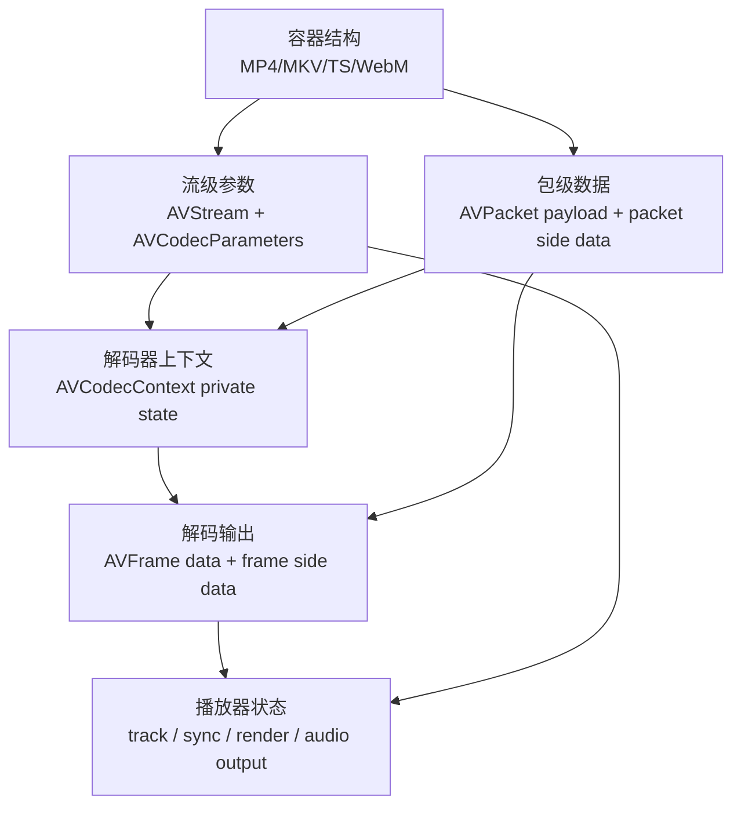
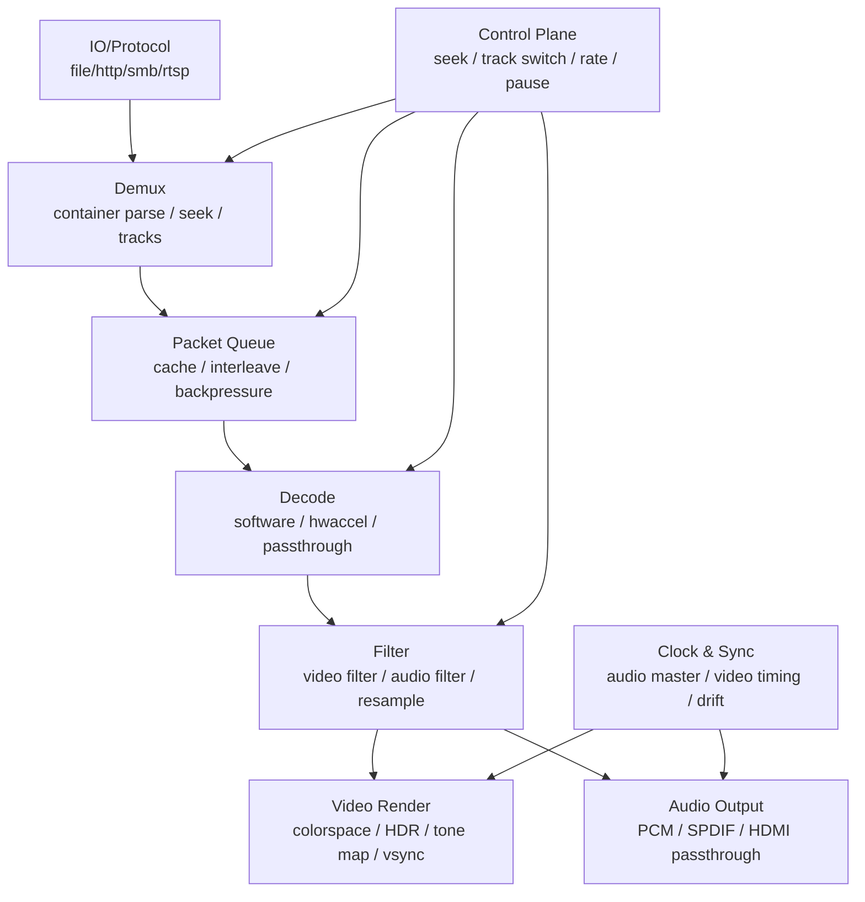
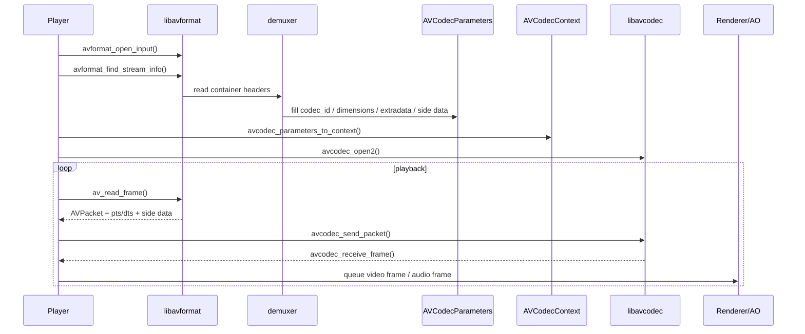
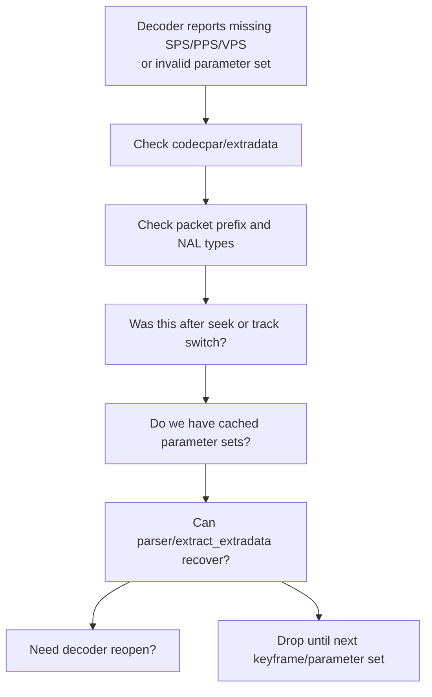
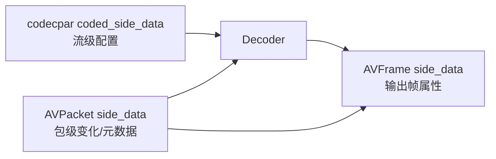
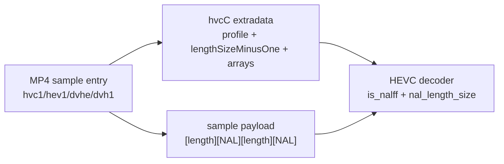
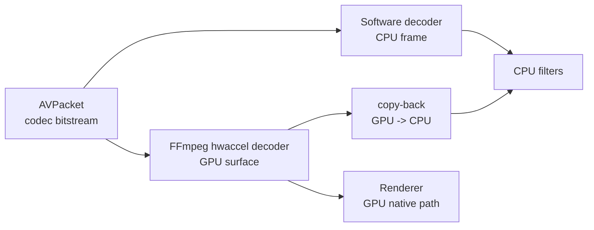
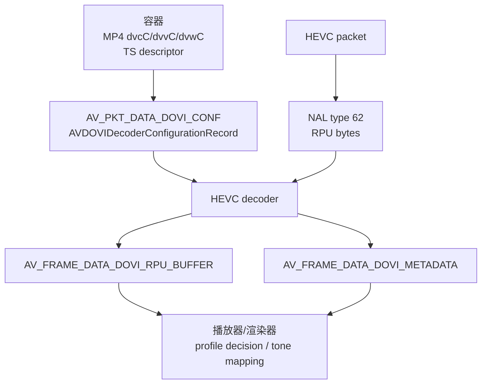
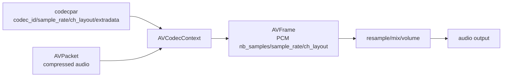

# 播放器高级音视频数据流与工程经验

这篇文档不是针对某个错误，而是建立播放器开发时的高级数据模型：一个媒体文件里的关键信息从哪里解析出来，存放在哪个 FFmpeg/mpv 结构里，什么时候送入解码器，什么时候变成渲染或播放需要的 frame 属性，以及真实工程里哪些地方最容易出问题。

源码快照：

- FFmpeg 本机路径：`D:/work/player-deps/external/ffmpeg`
- FFmpeg Git describe：`win_1.2.3-88-gb9bb08b48-dirty`
- FFmpeg commit：`b9bb08b48240aa6973ccf2f77a007db018bc81c1`
- mpv 本机路径：`D:/github/mpv`
- 文档日期：2026-06-08

## 阅读标记

为了让重点更明显，本文统一使用这些块：

> [!IMPORTANT]
> **核心合同**：必须保持一致的数据关系。播放器出错时，优先检查这些合同有没有被破坏。

> [!WARNING]
> **高风险点**：真实文件、网络流、硬解、透传、切流时最容易踩坑的位置。

> [!TIP]
> **工程经验**：实现播放器时建议采用的策略、日志、fallback 和容错方式。

> [!NOTE]
> **背景知识**：帮助理解标准、容器和 codec 行为，不一定要求每次都处理。

文档命名约定建议：

| 文档类型 | 命名格式 | 示例 |
| --- | --- | --- |
| 架构总览 | `architecture.md` | `architecture.md` |
| 高级工程经验 | `player-*.md` | `player-av-dataflow.md` |
| 专项诊断 | `*-diagnosis.md` 或 `*-bsf.md` | `hevc-hvcc-annexb-bsf.md` |
| 风险清单 | `gaps-and-risks.md` | `gaps-and-risks.md` |
| 面试/问答 | `interview-qa.md` | `interview-qa.md` |

> [!TIP]
> 后续和播放器实现强相关的经验文档建议统一使用 `player-` 前缀，例如 `player-hwdec.md`、`player-audio-passthrough.md`、`player-sync.md`。这样不会和 FFmpeg 自身模块文档混在一起。

## 先建立一张地图

播放器不是“读 packet 然后 decode”这么简单。真实的数据会分散在四个层级：



这四层回答不同问题：

| 层级 | 典型数据 | 什么时候使用 |
| --- | --- | --- |
| 容器 | MP4 box、Matroska element、TS descriptor | 打开文件和读包时解析 |
| 流级参数 | codec id、宽高、采样率、声道、extradata、coded side data | 打开 decoder 前必须复制 |
| 包级数据 | 压缩码流、PTS/DTS、duration、keyframe、packet side data | 每个 packet 送入 decoder |
| 帧级数据 | 像素/PCM、frame PTS、HDR/DV/skip samples 等 frame side data | 渲染、音频输出、同步、滤镜 |

播放器开发时要避免一个误区：不要把“码流 payload”当成唯一真相。很多关键数据不在 payload 里，而是在 extradata 或 side data 里。

> [!IMPORTANT]
> 播放器的第一原则是保持同一条流上的四个合同一致：`codecpar/extradata`、`packet payload 格式`、`packet side data`、`decoder context state`。只要中间插入 parser、BSF、缓存、硬解、转封装、切流，就要重新验证这四者是否仍然匹配。

## 项目架构视角

从播放器架构看，FFmpeg 只解决一部分问题。完整播放器至少要把这些层分清：



高级播放器的复杂性主要来自“数据面”和“控制面”交叉：

| 场景 | 数据面变化 | 控制面动作 |
| --- | --- | --- |
| seek | packet 队列丢弃，decoder flush | 找关键帧、清队列、重建时间基准 |
| 切音轨 | audio decoder/AO 重建 | 保持视频时钟连续 |
| 切清晰度 | codecpar、extradata、timebase 可能变化 | 重新初始化 decoder/filter/render |
| 硬解失败 | frame 从 GPU surface 变成 CPU frame | fallback 软件解码，重送缓存 packet |
| 音频透传开启 | PCM decoder 变成 IEC61937 包装输出 | 禁用混音/音量处理，AO 切 passthrough |
| HDR/DV fallback | metadata 存在但渲染器不支持 | 选择 BL/HDR10/SDR 路径 |

> [!WARNING]
> 不要把 decoder 设计成孤立模块。decoder 的输入合同由 demuxer 和 BSF 决定，decoder 的输出合同会影响 filter、VO、AO、同步和缓存。很多“解码失败”本质上是架构层的数据合同断裂。

## 总流程



FFmpeg API 入口：

- `libavformat/avformat.h:2038` `avformat_open_input()`。
- `libavformat/avformat.h:2062` `avformat_find_stream_info()`。
- `libavformat/avformat.h:2139` `av_read_frame()`。
- `libavcodec/avcodec.h:2348` `avcodec_parameters_to_context()`。
- `libavcodec/avcodec.h:2412` `avcodec_open2()`。
- `libavcodec/avcodec.h:2582` `avcodec_send_packet()`。
- `libavcodec/avcodec.h:2603` `avcodec_receive_frame()`。

mpv 的对应桥接：

- mpv `demux/demux_lavf.c:693` 取得 `AVStream.codecpar`。
- mpv `demux/demux_lavf.c:827` 保存 `lav_codecpar`。
- mpv `common/av_common.c:61` 优先复制 `lav_codecpar`。
- mpv `common/av_common.c:116` 调 `avcodec_parameters_to_context()`。
- mpv `video/decode/vd_lavc.c:1186` 组装 `AVPacket`。
- mpv `video/decode/vd_lavc.c:1188` 送入 video decoder。
- mpv `audio/decode/ad_lavc.c:156` 送入 audio decoder。

## 容器差异：MP4、MKV、TS、M2TS 不是同一种输入

播放器高级问题大量来自容器差异。相同的 HEVC/H.264/AAC/TrueHD 码流，放在不同容器里，decoder 看到的 packet 格式、extradata 来源、时间戳稳定性可能完全不同。

| 容器 | 参数来源 | packet 形态 | 时间戳特点 | 常见风险 |
| --- | --- | --- | --- | --- |
| MP4/MOV | `stsd` 下的 `avcC/hvcC/esds/dac3/dec3/dvcC` | H.264/HEVC 多为 length-prefixed | `stts/ctts/elst` 组合，B 帧依赖 PTS/DTS | edit list、multiple `stsd`、hvcC 数组为空、DV config |
| Matroska/MKV | Track `CodecPrivate`、BlockGroup side data | H.264/HEVC 常可能是 AnnexB 或 CodecPrivate + block | timecode scale，相对稳定 | CodecPrivate 缺失或不标准、HDR/DV side data 映射 |
| MPEG-TS | PMT descriptor、PES、码流内参数集 | H.264/HEVC 通常 AnnexB | 90kHz PTS/DTS，可能跳变/回绕 | 参数集只在起播处、丢包、PAT/PMT 更新、PCR 抖动 |
| M2TS/BDAV | TS 变体，192 字节包，Blu-ray 约束 | H.264/HEVC/TrueHD/DTS-HD 常见 | 90kHz + 4 字节 arrival timestamp | TrueHD/AC3 core、PGS 字幕、playlist/clip 拼接、角度/章节 |
| HLS/DASH | manifest + 分片容器 | 每段可能 MP4/fMP4/TS | 分段时间轴，可能 discontinuity | 切码率后 extradata 变化、时间线不连续 |
| Raw elementary stream | 码流本身 | AnnexB 或 codec 原生帧 | 通常无容器时间戳 | 需要 parser 推断帧边界和参数 |

> [!IMPORTANT]
> MP4 的 H.264/HEVC 常见是 `avcC/hvcC + length-prefixed packet`；TS/M2TS 常见是 `AnnexB packet`。这不是“同样的 NAL 换个外壳”这么简单，decoder 初始化时的 extradata 和 packet 拆包方式必须匹配。

### MP4/MOV 的特点

MP4 是索引型容器，参数集中在 header 和 sample table：

- `stsd` 描述 sample entry，比如 `avc1/hvc1/hev1/dvhe/dvh1/mp4a/ac-3/ec-3/mlpa`。
- `avcC/hvcC` 保存 H.264/HEVC 配置。
- `esds` 保存 AAC 等 MPEG-4 audio 配置。
- `stts/ctts` 负责 DTS/PTS。
- `stsc/stsz/stco/co64` 负责 sample 到文件偏移。
- `elst` edit list 可能改变起播时间。

> [!WARNING]
> MP4 的 packet payload 通常不自带 start code。你看到 `00 00 00 03 46 01 10` 时，前 4 字节是长度，不是 AnnexB start code。把它当 AnnexB 或把 AnnexB 当 length-prefixed，都会导致 NAL split 错误。

### TS/M2TS 的特点

TS/M2TS 更像传输流，适合广播和蓝光：

- packet 很小，TS 是 188 字节，M2TS/BDAV 是 192 字节，前 4 字节通常是 arrival timestamp。
- 时间戳来自 PES PTS/DTS，基准常是 90kHz。
- 视频码流常见 AnnexB，参数集可能在 IDR 前重复，也可能只在起播处出现。
- 丢包、PAT/PMT 更新、PCR 抖动、discontinuity 都需要播放器容错。
- 蓝光 M2TS 常见 TrueHD + AC3 core、DTS-HD、PGS 字幕，实际播放还可能依赖 playlist。

> [!TIP]
> 处理 M2TS/TS 时，不要假设从任意 packet 开始都能立刻解码。seek 后应向前找关键帧和参数集；如果只从切点开始喂 decoder，可能先报缺 SPS/PPS/VPS，直到下一个参数集或 IDR 才恢复。

### Raw stream 的特点

裸流没有容器帮你保存完整上下文。播放器通常要依赖 parser：

- 找帧边界；
- 从 bitstream 提取 SPS/PPS/VPS；
- 推断宽高、profile、timebase；
- 给 decoder 补 extradata 或直接喂 AnnexB。

> [!WARNING]
> Raw stream 和 TS/M2TS 的码流看起来都可能是 AnnexB，但工程处理不同。TS/M2TS 有 PES 时间戳和节目表，raw stream 通常没有可靠时间戳，播放器要自己建立帧率和时钟策略。

## 参数集生命周期：SPS/PPS/VPS 不一定一直在你想要的位置

视频参数集是高级播放器最常见的坑之一。

| Codec | 参数集 | 常见位置 | 作用 |
| --- | --- | --- | --- |
| H.264 | SPS/PPS | `avcC`、AnnexB 码流、IDR 前 | 宽高、profile、参考帧、entropy、slice 解码 |
| HEVC | VPS/SPS/PPS | `hvcC`、AnnexB 码流、IRAP 前 | 层级、profile、宽高、tiles、SAO、slice 解码 |
| AV1 | Sequence Header OBU | `av1C`、OBU stream | profile、bit depth、尺寸、operating point |

参数集可能有这些形态：

1. **只在 extradata 里**：MP4 的 `avcC/hvcC` 常见。
2. **只在码流开头**：部分 TS/raw 文件开头有，后续关键帧前不重复。
3. **每个关键帧前重复**：直播/TS 更稳，利于随机接入。
4. **extradata 很短但 packet 内有参数集**：如一些 Dolby Vision MP4，`hvcC` 只有最小记录，VPS/SPS/PPS 在样本内。
5. **参数集中途变化**：多 `stsd`、切清晰度、拼接流、异常文件。

> [!IMPORTANT]
> “没有 SPS/PPS/VPS”要先分清是哪个层没有：`extradata` 没有，不代表 packet 里没有；当前 packet 没有，不代表前面没送过；seek 后没有，不代表文件坏，可能是切点不具备随机接入条件。

### 缺参数集时的播放器策略



工程策略：

- 起播时把 stream extradata 打印出来，确认是 `avcC/hvcC` 还是 AnnexB。
- 对 AnnexB 输入，可缓存最近一次 SPS/PPS/VPS，用于诊断和某些硬件接口补参。
- seek 后丢弃非 keyframe，直到遇到可随机接入点。
- 对 MP4 不要随意把 `hvcC` 里的数组为空判定为坏文件。
- 如果参数集真的变化，应重建 decoder 或确认 decoder 支持 `AV_PKT_DATA_NEW_EXTRADATA`。

> [!TIP]
> 高级播放器通常会有一个“bitstream inspector”调试工具：输入前 64 字节、NAL type 列表、extradata 前 64 字节、side data 列表、decoder 是否重建。它比只看 FFmpeg error log 更有效。

## 打开文件时拿到什么

`avformat_open_input()` 负责打开协议和探测 demuxer，`avformat_find_stream_info()` 会让 demuxer 解析 header，必要时读少量 packet 来补齐 stream 信息。

一个播放器在这个阶段要保存：

- track 列表：音频、视频、字幕、附件；
- 每个 track 的 `codec_id`、`codec_tag`、profile；
- 视频宽高、像素格式、SAR/PAR、旋转、HDR/DV 信息；
- 音频采样率、声道布局、码率、initial padding、seek preroll；
- `extradata` 和 `coded_side_data`；
- 每个 stream 的 `time_base`。

mpv 在 `demux_lavf.c` 里对音视频做了典型映射：

- mpv `demux/demux_lavf.c:699` 音频流读取 `codec->ch_layout`。
- mpv `demux/demux_lavf.c:707` 保存 `sample_rate`。
- mpv `demux/demux_lavf.c:730` 视频流处理 attached picture。
- mpv `demux/demux_lavf.c:747` 保存视频宽高。
- mpv `demux/demux_lavf.c:754` 保存 SAR/PAR。
- mpv `demux/demux_lavf.c:756` 读取 `AV_PKT_DATA_DISPLAYMATRIX` 得到旋转。
- mpv `demux/demux_lavf.c:763` 读取 `AV_PKT_DATA_DOVI_CONF` 得到 Dolby Vision profile/level。
- mpv `demux/demux_lavf.c:829` 复制完整 `codecpar`。
- mpv `demux/demux_lavf.c:831` 保存 stream 原生 `time_base`。

## AVCodecParameters 是什么

`AVCodecParameters` 是 demuxer 和 decoder 之间的流级合同。它不保存 decoder 的运行状态，只描述“应该用什么方式解释后续 packet”。

常见字段：

| 字段 | 视频含义 | 音频含义 |
| --- | --- | --- |
| `codec_type` | video | audio |
| `codec_id` | H264/HEVC/AV1 等 | AAC/AC3/EAC3/TrueHD/DTS/FLAC 等 |
| `codec_tag` | MP4 sample entry，如 `hvc1`/`hev1`/`dvhe` | `ac-3`/`ec-3`/`mlpa` 等 |
| `extradata` | `avcC`/`hvcC`/`av1C`/VPS/SPS/PPS 等 | AAC AudioSpecificConfig、OpusHead、FLAC STREAMINFO 等 |
| `width/height` | 编码/显示尺寸基础信息 | 不适用 |
| `format` | pixel format，可能未知 | sample format，可能未知 |
| `sample_rate` | 不适用 | 采样率 |
| `ch_layout` | 不适用 | 声道布局 |
| `coded_side_data` | DOVI config、HDR、display matrix 等 | audio service type 等 |

FFmpeg 复制逻辑：

- `libavcodec/codec_par.c:106` `avcodec_parameters_copy()`。
- `libavcodec/codec_par.c:226` `avcodec_parameters_to_context()`。

mpv 的设计是：如果来自 lavf demuxer，就保存并优先使用完整 `lav_codecpar`。这样可以减少自己重建参数时漏字段的风险：

- mpv `common/av_common.c:61` `mp_codec_params_to_av()` 优先 `avcodec_parameters_copy(c->lav_codecpar)`。

## extradata：解码器打开前必须知道的字节

`extradata` 是“不是普通 packet，但 decoder 初始化或拆包需要”的 codec 私有配置。

典型例子：

| Codec | 容器里的名字 | 作用 |
| --- | --- | --- |
| H.264 in MP4 | `avcC` | SPS/PPS、NAL length size、profile/level |
| HEVC in MP4 | `hvcC` | VPS/SPS/PPS arrays、NAL length size、profile/level |
| AV1 in MP4 | `av1C` | AV1 sequence header 配置 |
| AAC in MP4 | `esds` | AudioSpecificConfig，采样率/声道/AOT |
| Opus in Matroska/WebM | `OpusHead` | pre-skip、声道映射 |
| FLAC | STREAMINFO | block size、采样率、声道、MD5 等 |

MP4/MOV 中一些入口：

- FFmpeg `libavformat/mov.c:795` `mov_read_esds()` 读 MPEG-4 `esds`。
- FFmpeg `libavformat/mov.c:2116` `mov_read_glbl()` 读 `avcC`、`hvcC`、`av1C` 这类全局配置。
- FFmpeg `libavformat/mov.c:7934` `avcC` 绑定到 `mov_read_glbl()`。
- FFmpeg `libavformat/mov.c:7972` `hvcC` 绑定到 `mov_read_glbl()`。
- FFmpeg `libavformat/mov.c:7960` `esds` 绑定到 `mov_read_esds()`。

播放器原则：

- decoder 打开前必须把 `codecpar->extradata` 复制到 `AVCodecContext`。
- 如果你改写 packet 格式，比如 HEVC MP4 转 AnnexB，extradata 的语义也要同步改变。
- 不要因为 extradata 短就直接丢弃。比如 HEVC `hvcC` 最小长度 23 字节，数组为空也可能合法。

## packet：每次送入 decoder 的压缩数据

`AVPacket` 是一次 demux 输出的压缩数据单元。它通常不是“一帧画面”这么简单：B 帧、音频帧聚合、字幕、parser、BSF 都会影响它和 frame 的对应关系。

播放器必须保留：

- `data/size`：压缩码流；
- `pts/dts/duration`：以 stream `time_base` 表达；
- `stream_index`：属于哪个 track；
- `flags`：keyframe、corrupt 等；
- `side_data`：包级额外信息；
- `pos`：文件偏移，可用于调试和缓存。

mpv 的读包逻辑：

- mpv `demux/demux_lavf.c:1226` 调 `av_read_frame()`。
- mpv `demux/demux_lavf.c:1253` 包装成自己的 `demux_packet`。
- mpv `demux/demux_lavf.c:1262` 把 `pkt->pts` 用 `st->time_base` 转成秒。
- mpv `demux/demux_lavf.c:1263` 转换 DTS。
- mpv `demux/demux_lavf.c:1264` 转换 duration。
- mpv `demux/demux_lavf.c:1266` 保存 keyframe。

送入 decoder 前，mpv 又把秒单位时间戳转回 `AVPacket` 的 timebase：

- mpv `common/av_common.c:179` `mp_set_av_packet()`。
- mpv `common/av_common.c:190` 传递原始 `AVPacket.side_data`。
- mpv `common/av_common.c:199` 写回 `pts/dts`。

## side data：最容易漏掉的关键数据

side data 是“跟 stream、packet 或 frame 关联，但不属于主 payload”的结构化数据。



常见 packet side data：

| 类型 | 用途 |
| --- | --- |
| `AV_PKT_DATA_NEW_EXTRADATA` | 中途切换 codec private data，如 MP4 多 `stsd` |
| `AV_PKT_DATA_DOVI_CONF` | Dolby Vision 配置记录 |
| `AV_PKT_DATA_DISPLAYMATRIX` | 旋转/翻转矩阵 |
| `AV_PKT_DATA_MASTERING_DISPLAY_METADATA` | HDR10 mastering display |
| `AV_PKT_DATA_CONTENT_LIGHT_LEVEL` | HDR10 MaxCLL/MaxFALL |
| `AV_PKT_DATA_DYNAMIC_HDR10_PLUS` | HDR10+ 动态元数据 |
| `AV_PKT_DATA_SKIP_SAMPLES` | 音频起始/结尾裁剪 |
| `AV_PKT_DATA_AUDIO_SERVICE_TYPE` | AC-3/E-AC-3 服务类型 |

FFmpeg 通用传递：

- `libavcodec/decode.c:1434` 把 mastering display packet side data 映射到 frame side data。
- `libavcodec/decode.c:1435` 把 content light level 映射到 frame side data。
- `libavcodec/decode.c:1433` 把 audio service type 映射到 frame side data。
- `libavcodec/decode.c:1453` 把 `pkt->pts` 写到 `frame->pts`。
- `libavcodec/decode.c:1464` 遍历全局 side data 映射。

播放器原则：

- 自己封装 packet 时必须保留 side data。
- 如果做 packet copy、BSF、缓存、跨线程队列，必须确认 side data 生命周期。
- 如果遇到中途参数变化，优先查 `AV_PKT_DATA_NEW_EXTRADATA` 和 `AV_PKT_DATA_PARAM_CHANGE`。

## 时间戳和同步

时间戳是播放器的核心，不是附属信息。

基础概念：

- `AVStream.time_base`：packet 时间戳的单位；
- `AVPacket.pts`：展示时间；
- `AVPacket.dts`：解码时间；
- `AVPacket.duration`：包时长；
- `AVCodecContext.pkt_timebase`：decoder 输入 packet 的时间单位；
- `AVFrame.pts`：输出帧展示时间；
- `AVFrame.best_effort_timestamp`：FFmpeg 尝试修正后的显示时间。

FFmpeg 输出帧属性：

- `libavcodec/decode.c:676` 设置 `best_effort_timestamp`。
- `libavcodec/decode.c:433` 设置 `frame->pkt_dts`。
- `libavcodec/decode.c:581` 音频 frame 若缺声道布局则从 `avctx` 补。
- `libavcodec/decode.c:595` 音频 frame 若缺采样率则从 `avctx` 补。

mpv 的做法：

- demux 阶段把 `pts/dts/duration` 转成秒，方便播放器核心统一处理。
- decode 前再按 codec timebase 写回 `AVPacket`。
- video 输出后从 `AVFrame.pts/pkt_dts/duration` 转成秒。
- audio 输出后用 frame PTS，不存在时用 `next_pts` 按样本数推导。

相关源码：

- mpv `video/decode/vd_lavc.c:1246` 从 `AVFrame.pts` 得到视频 PTS。
- mpv `video/decode/vd_lavc.c:1247` 从 `AVFrame.pkt_dts` 得到 DTS。
- mpv `audio/decode/ad_lavc.c:181` 从 `AVFrame.pts` 得到音频 PTS。
- mpv `audio/decode/ad_lavc.c:195` 若无 PTS，用 `next_pts`。
- mpv `audio/decode/ad_lavc.c:198` 用 frame 末尾时间更新 `next_pts`。

## 视频：从 codecpar 到画面

视频 decoder 需要两类信息：

1. 打开前的静态配置：codec id、extradata、宽高、像素格式、profile、hw config。
2. 每个 packet 的动态输入：码流、时间戳、side data。

输出 `AVFrame` 后，播放器要读：

- `format`：软件像素格式或硬件像素格式；
- `width/height`；
- `pts/duration`；
- 色彩：`color_primaries`、`color_trc`、`colorspace`、`color_range`；
- `sample_aspect_ratio`；
- crop；
- frame side data：HDR10、HDR10+、Dolby Vision RPU/metadata、display matrix、film grain 等；
- 硬解时的 `hw_frames_ctx`/GPU surface。

FFmpeg 会把部分缺失 frame 属性从 `AVCodecContext` 补齐：

- `libavcodec/decode.c:564` 补 color primaries/TRC/colorspace/range。
- `libavcodec/decode.c:575` 补视频 SAR 和 pixel format。
- `libavcodec/decode.c:658` 补 frame width/height。

mpv 的 video decoder：

- mpv `video/decode/vd_lavc.c:731` 分配 `AVCodecContext`。
- mpv `video/decode/vd_lavc.c:837` 设置 codec headers。
- mpv `video/decode/vd_lavc.c:855` 打开 decoder。
- mpv `video/decode/vd_lavc.c:1186` 送 packet。
- mpv `video/decode/vd_lavc.c:1227` 收 frame。
- mpv `video/decode/vd_lavc.c:1239` 把 `AVFrame` 转成 `mp_image`。

## HEVC、hvcC、AnnexB

HEVC 在 MP4 里常见结构：



如果你做播放器，只要目标是软件解码 MP4 HEVC，通常不需要先转 AnnexB。要保持：

- `hvcC` extradata 给 decoder；
- 原始 length-prefixed packet 给 decoder；
- side data 保留。

如果插 `hevc_mp4toannexb`，就必须让下游 decoder 看到 AnnexB-compatible 的参数，而不能继续复用原始 `hvcC` 初始化状态。细节见 [HEVC hvcC / AnnexB / BSF 诊断](hevc-hvcc-annexb-bsf.md)。

关键源码：

- FFmpeg `libavformat/mov.c:7972` MP4 `hvcC` 读取入口。
- FFmpeg `libavcodec/hevcdec.c:3304` 解析 HEVC extradata。
- FFmpeg `libavcodec/hevcdec.c:3155` 根据 `is_nalff/nal_length_size` 拆 NAL。
- FFmpeg `libavcodec/hevc_mp4toannexb_bsf.c:98` BSF 初始化。

## Parser 和 BSF：不要混淆职责

FFmpeg 里 parser 和 BSF 都会处理 bitstream，但职责不同：

| 组件 | 输入 | 输出 | 主要职责 | 常见例子 |
| --- | --- | --- | --- | --- |
| parser | 不完整或边界不清的码流 | 更适合 decoder 的 packet/frame 边界 | 找帧边界、提取参数、补充时间戳线索 | H.264/HEVC/AAC parser |
| BSF | 已有 packet | 改写 bitstream 格式或 metadata | MP4 to AnnexB、抽 extradata、过滤 SEI | `h264_mp4toannexb`、`hevc_mp4toannexb`、`extract_extradata` |

> [!IMPORTANT]
> Parser 通常解决“边界和解析辅助”问题；BSF 解决“码流格式转换”问题。把 BSF 当 parser 用，或者转换后不更新 decoder 参数，是播放器里非常典型的高级 bug。

常见 BSF 使用场景：

| 场景 | 是否建议 BSF | 原因 |
| --- | --- | --- |
| MP4 HEVC 软件解码 | 通常不需要 | FFmpeg HEVC decoder 能直接处理 `hvcC + NALFF packet` |
| MP4 H.264/HEVC remux 到 TS | 需要 | TS 需要 AnnexB |
| 某些硬件 API 只吃 AnnexB | 可能需要 | 取决于硬件 decoder wrapper |
| 从 AnnexB 提取 extradata | 可用 `extract_extradata` | 用于补全 stream 参数 |
| 调试 NAL 内容 | 可用 `trace_headers` | 只用于诊断，不应进入正常播放路径 |

> [!WARNING]
> 插入 BSF 后，输出 packet 的语义已经变了。你必须重新确认 `bsf_ctx->par_out`、packet payload、packet side data 和 decoder context。最危险的是只拿 BSF 输出的 packet，却继续用原始 `codecpar/extradata` 打开的 decoder。

## 硬解：同一个 codec，不同 API 要求不同输入

硬件解码不是简单地把 `avcodec_find_decoder()` 换成硬解名字。硬解多了两个合同：

1. **输入 bitstream 合同**：硬件 API 接受 AnnexB、avcC/hvcC、还是 driver wrapper 自动转换。
2. **输出 frame 合同**：输出是 CPU 可读像素，还是 GPU surface，需要 copy-back 或直接渲染。



播放器要记录：

- 选择了哪个硬解 API：D3D11VA、DXVA2、NVDEC/CUDA、VAAPI、QSV、VideoToolbox、MediaCodec 等；
- decoder 输出 `AVFrame.format` 是什么；
- 是否有 `hw_frames_ctx`；
- 下游 filter/renderer 是否支持这个硬件格式；
- 失败后是否能软件 fallback；
- fallback 时是否需要重送前面的关键 packet。

mpv 的经验：

- mpv `video/decode/vd_lavc.c:495` 附近选择硬解。
- mpv `video/decode/vd_lavc.c:1188` 硬解和软解最终都走 `avcodec_send_packet()`。
- mpv `video/decode/vd_lavc.c:1288` 硬解失败时尝试 fallback 并重送已缓存 packet。

> [!TIP]
> 做硬解时，日志里不要只打印 decoder 名称。要打印输入 packet 格式、extradata 类型、输出 frame format、是否 copy-back、VO 是否原生支持该 surface。很多“硬解花屏/黑屏”不是 decoder 失败，而是渲染链路不接受输出 surface。

## 格式支持有问题时，先分类再降级

真实播放器不应该把所有异常都归类成“文件坏”。应该先判断是哪一层不支持：

| 问题类型 | 典型现象 | 先查什么 | 降级策略 |
| --- | --- | --- | --- |
| 容器支持弱 | stream 缺失、时间戳跳、seek 错 | demuxer log、stream table、timebase | 换 demuxer、禁用 fast seek、线性读 |
| extradata 异常 | decoder open 失败、缺参数集 | `extradata_size`、前 32 字节、box/CodecPrivate | 尝试 parser/extract extradata、等待关键帧 |
| packet 格式不匹配 | Invalid NAL size、No start code | packet 前 16 字节、decoder extradata | 移除错误 BSF 或重建 decoder |
| 参数集不重复 | seek 后黑屏/报错，起播正常 | keyframe 前是否有 SPS/PPS/VPS | seek 到更早位置，丢到下个 IDR |
| 硬解不支持 profile | 硬解 open 成功但 receive 失败 | profile/level/bit depth/DV/HDR | 软件 fallback 或禁用该 profile 硬解 |
| 音频对象元数据不支持 | Atmos 只出 5.1/7.1 PCM | codec、passthrough、设备能力 | HDMI passthrough 或说明降级 |
| HDR/DV 渲染不支持 | 颜色灰、过曝、偏色 | frame side data、色彩空间、VO 能力 | tone map、转 SDR、使用 BL |

> [!IMPORTANT]
> 高级播放器要把“可解码”和“可正确播放”分开。能输出 frame 不代表颜色正确；能输出 PCM 不代表 Atmos 对象被渲染；能硬解不代表 zero-copy 渲染成功。

## Dolby Vision 视频

Dolby Vision 至少有两类数据：



### 容器配置

MP4 中 DV 配置来自 `dvcC`、`dvvC`、`dvwC`：

- FFmpeg `libavformat/mov.c:7603` `mov_read_dvcc_dvvc()`。
- FFmpeg `libavformat/mov.c:7996` `dvcC`。
- FFmpeg `libavformat/mov.c:7997` `dvvC`。
- FFmpeg `libavformat/mov.c:7998` `dvwC`。

TS 中 DV 配置可来自 descriptor：

- FFmpeg `libavformat/mpegts.c:2227` 添加 `AV_PKT_DATA_DOVI_CONF`。

mpv 在 demux 阶段读取：

- mpv `demux/demux_lavf.c:763` 找 `AV_PKT_DATA_DOVI_CONF`。
- mpv `demux/demux_lavf.c:766` 保存 `dv_profile` 和 `dv_level`。

### bitstream RPU

HEVC bitstream 中，Dolby Vision RPU 通常在 NAL type 62：

- FFmpeg `libavcodec/hevcdec.c:3181` 注释说明 RPU 附在 AU 末尾。
- FFmpeg `libavcodec/hevcdec.c:3188` 检查最后一个 NAL 是否为 type 62。
- FFmpeg `libavcodec/hevcdec.c:3200` 调 `ff_dovi_rpu_parse()`。
- FFmpeg `libavcodec/hevcdec.c:2827` 输出 `AV_FRAME_DATA_DOVI_RPU_BUFFER`。

### 播放器应该怎么理解

Dolby Vision 不是“一个 codec id”就结束了。你要同时检查：

- container sample entry：`dvhe`/`dvh1`/`hvc1`/`hev1`；
- `AV_PKT_DATA_DOVI_CONF`：profile、level、RPU/EL/BL flags；
- HEVC bitstream 是否有 RPU；
- 输出 `AVFrame` 是否带 `AV_FRAME_DATA_DOVI_RPU_BUFFER` 或 `AV_FRAME_DATA_DOVI_METADATA`；
- 渲染链路是否支持对应 profile 的处理，否则要 fallback 到 BL/HDR10/SDR。

## HDR10 / HDR10+ / 色彩数据

视频显示还依赖这些数据：

| 数据 | FFmpeg 位置 | 播放器用途 |
| --- | --- | --- |
| primaries/trc/matrix/range | `AVCodecContext` / `AVFrame` 字段 | 选择色彩空间和 tone mapping |
| mastering display | `AV_FRAME_DATA_MASTERING_DISPLAY_METADATA` | HDR10 tone mapping |
| content light level | `AV_FRAME_DATA_CONTENT_LIGHT_LEVEL` | HDR10 MaxCLL/MaxFALL |
| dynamic HDR10+ | `AV_FRAME_DATA_DYNAMIC_HDR_PLUS` | HDR10+ 动态映射 |
| ICC profile | `AV_FRAME_DATA_ICC_PROFILE` | 色彩管理 |

MP4 读取入口示例：

- FFmpeg `libavformat/mov.c:1764` `mov_read_colr()`。
- FFmpeg `libavformat/mov.c:5973` `mov_read_mdcv()`。
- FFmpeg `libavformat/mov.c:6054` `mov_read_clli()`。
- FFmpeg `libavformat/mov.c:7994` `mdcv`。
- FFmpeg `libavformat/mov.c:7995` `clli`。

通用 packet 到 frame side data 映射：

- FFmpeg `libavcodec/decode.c:1434` mastering display。
- FFmpeg `libavcodec/decode.c:1435` content light。
- FFmpeg `libavcodec/decode.c:1439` dynamic HDR10+。

## 音频：从 codecpar 到 PCM 或透传

音频播放器有两种目标：

1. 解码成 PCM，送音频 filter/resampler/AO。
2. 透传压缩码流，如 AC-3、E-AC-3、DTS、TrueHD，经 SPDIF/HDMI 交给外部设备。

普通解码链路：



音频 decoder 打开前需要：

- `codec_id`；
- `sample_rate`；
- `ch_layout`；
- `extradata`；
- codec options，如 AC-3 DRC、downmix；
- `pkt_timebase`。

mpv 音频解码源码：

- mpv `audio/decode/ad_lavc.c:91` 分配 `AVCodecContext`。
- mpv `audio/decode/ad_lavc.c:96` 设置 `codec_type/codec_id/pkt_timebase`。
- mpv `audio/decode/ad_lavc.c:107` 设置 decoder downmix 选项。
- mpv `audio/decode/ad_lavc.c:116` 设置 AC-3 `drc_scale`。
- mpv `audio/decode/ad_lavc.c:124` 调 `mp_set_avctx_codec_headers()`。
- mpv `audio/decode/ad_lavc.c:132` 打开 decoder。
- mpv `audio/decode/ad_lavc.c:154` 组装 packet。
- mpv `audio/decode/ad_lavc.c:156` `avcodec_send_packet()`。
- mpv `audio/decode/ad_lavc.c:168` `avcodec_receive_frame()`。
- mpv `audio/decode/ad_lavc.c:184` 转换成 mpv audio frame。

FFmpeg 会校验音频 frame：

- `libavcodec/decode.c:581` 补 `ch_layout`。
- `libavcodec/decode.c:595` 补 `sample_rate`。
- `libavcodec/decode.c:782` 校验声道布局和采样率。

## Dolby 音频：AC-3 / E-AC-3 / TrueHD / Atmos

严格说，“杜比视界”是视频技术；音频侧通常是 Dolby Digital、Dolby Digital Plus、Dolby TrueHD、Dolby Atmos。播放器要把它们分开理解。

### AC-3 / E-AC-3

MP4 里 AC-3/E-AC-3 有专门 box：

- FFmpeg `libavformat/mov.c:800` `mov_read_dac3()`。
- FFmpeg `libavformat/mov.c:838` `mov_read_dec3()`。
- FFmpeg `libavformat/mov.c:7961` `dac3`。
- FFmpeg `libavformat/mov.c:7962` `dec3`。

这些 box 会设置：

- codecpar 声道布局；
- `AV_PKT_DATA_AUDIO_SERVICE_TYPE`；
- AC-3/E-AC-3 相关参数。

播放器要关注：

- 是否解码成 PCM；
- 是否允许 passthrough；
- DRC/downmix 设置；
- E-AC-3 JOC/Atmos 元数据通常由设备端或专用 decoder 处理，通用 PCM 解码链路可能只得到床声道。

> [!NOTE]
> E-AC-3 Atmos 常见于流媒体，通常叫 E-AC-3 JOC。通用播放器如果没有对象渲染能力，软件解码多半只得到兼容的 channel-based PCM。要保留 Atmos 体验，常见做法是 HDMI passthrough，让 AVR/电视处理。

### TrueHD / MLP / Atmos

TrueHD 在 MP4 中可见 `mlpa` 相关 sample entry，FFmpeg MOV 解析会设置采样率、frame size、声道布局：

- FFmpeg `libavformat/mov.c:7588` 附近处理 TrueHD channel assignment。
- FFmpeg `libavformat/mov.c:7593` 设置 `frame_size`。
- FFmpeg `libavformat/mov.c:7594` 设置 `sample_rate`。
- FFmpeg `libavformat/mov.c:7598` 设置 `ch_layout`。

TrueHD decoder 也会从 major sync 里更新音频参数：

- FFmpeg `libavcodec/mlpdec.c:400` 设置 `sample_rate`。
- FFmpeg `libavcodec/mlpdec.c:417` 从 major sync 设置 channel layout。
- FFmpeg `libavcodec/mlpdec.c:1154` 设置输出 frame 的 `nb_samples`。

Atmos over TrueHD 的对象元数据是否能被完整渲染，取决于 decoder 和输出设备。很多播放器选择 HDMI passthrough，把 TrueHD/Atmos 交给 AVR/电视处理。

### M2TS/蓝光里的 Dolby 音频

蓝光 M2TS 经常不是单独一个“干净音频流”：

- TrueHD 常带 AC-3 core，便于不支持 TrueHD 的设备 fallback。
- DTS-HD MA/HRA 常带 DTS core。
- packet 在 TS/PES 中传输，播放器要处理 PTS、PES 边界、可能的 clip 拼接。
- 完整蓝光播放还可能依赖 playlist，而不是只打开单个 `.m2ts` 文件。

> [!WARNING]
> 只打开单个 M2TS 文件，可能得到“能播但不完整”的体验：章节、角度、无缝拼接、默认音轨、强制字幕、playlist 顺序都可能不准确。做蓝光级播放器时，容器层不能只看 m2ts demux，还要理解 playlist。

### 透传

mpv 的 SPDIF/HDMI 压缩音频输出不是走普通 PCM decoder，而是 `ad_spdif`：

- mpv `filters/f_decoder_wrapper.c:421` 如果允许 spdif，选择 spdif decoder。
- mpv `audio/decode/ad_spdif.c:185` 选择 `spdif` muxer。
- mpv `audio/decode/ad_spdif.c:205` 设置输出 stream codec id。
- mpv `audio/decode/ad_spdif.c:326` 把输入 packet 转成 `AVPacket`。
- mpv `audio/decode/ad_spdif.c:336` 调 `av_write_frame()` 输出 IEC61937 包装数据。

播放器设计时要把“解码”和“透传”作为两个不同模式：

- 解码：输出 PCM，应用音量、混音、均衡、重采样。
- 透传：输出压缩帧，播放器不能随意改音量或混音，必须保持 bitstream 合法。

| 模式 | 输出 | 可调音量/混音 | Atmos 保留 | 设备要求 |
| --- | --- | --- | --- | --- |
| 软件解码 PCM | PCM samples | 可以 | 通常不完整，取决于 decoder | 普通音频设备 |
| E-AC-3 passthrough | IEC61937/E-AC-3 | 不应处理 | 可保留给设备 | HDMI/支持 E-AC-3 |
| TrueHD passthrough | IEC61937/TrueHD | 不应处理 | 可保留给设备 | HDMI/支持 TrueHD |
| SPDIF AC-3/DTS | IEC61937 core | 不应处理 | 不支持 TrueHD Atmos | SPDIF/HDMI |

> [!TIP]
> 音频设置里要把“解码输出声道”和“压缩音频透传能力”分成两个配置。用户选择 5.1 PCM 不代表设备支持 E-AC-3 passthrough；设备支持 HDMI 7.1 PCM 也不代表支持 TrueHD bitstream。

## 同步：高级问题通常不是 decoder 自己能解决

音视频同步由播放器负责，decoder 只给出帧和时间戳。

常见时钟策略：

| 主时钟 | 优点 | 风险 | 常见用途 |
| --- | --- | --- | --- |
| audio clock | 听感稳定，最常见 | 视频要丢/等帧 | 普通播放 |
| video clock | 画面节奏稳定 | 音频要拉伸/丢样 | 无音频或专业视频 |
| external clock | 适合直播/同步外部源 | drift 处理复杂 | 低延迟/广播 |

同步相关数据来自：

- demux packet `pts/dts/duration`；
- decoder output `AVFrame.pts/pkt_dts/duration`；
- audio output 实际播放位置；
- video renderer vsync 时间；
- seek、pause、speed、drop frame 策略。

> [!WARNING]
> PTS 不连续时不要只怪解码器。HLS discontinuity、TS PCR 抖动、MP4 edit list、B 帧重排、AVI DTS、直播丢包都可能让时间线异常。播放器需要有时间戳修正和异常阈值。

mpv 里有一些典型处理：

- mpv `filters/f_decoder_wrapper.c:672` 处理视频 PTS/DTS 异常。
- mpv `filters/f_decoder_wrapper.c:767` 修正 decoded video PTS。
- mpv `demux/demux_lavf.c:1274` 处理 linearize timestamp。

工程策略：

- 所有内部播放时间统一成秒或统一高精度时基，边界处再转换。
- 日志中同时打印原始 `AVPacket pts/dts` 和播放器转换后的秒。
- seek 后建立新的时间基准，不要把旧 decoder 队列里的 frame 混入新时间线。
- 音频输出是实际主时钟时，要以 AO 已播放样本数修正，而不是只相信送入 AO 的 PTS。

## 参数变化：什么时候要更新或重建 decoder

中途参数变化很常见：

- MP4 多 `stsd`；
- HLS/DASH 切换 representation；
- AAC 配置变化；
- 分辨率变化；
- 音频声道布局变化；
- Dolby Vision config 更新；
- HDR metadata 逐帧变化。

处理原则：

| 变化 | 常见载体 | 处理 |
| --- | --- | --- |
| extradata 改变 | `AV_PKT_DATA_NEW_EXTRADATA` | decoder 支持则更新，否则重建 |
| 宽高/采样率/声道变化 | `AV_PKT_DATA_PARAM_CHANGE` 或 decoder 输出变化 | 更新播放器链路，必要时重建 filter/AO/VO |
| HDR metadata 变化 | packet/frame side data | 不重建 decoder，更新渲染参数 |
| DV config 变化 | `AV_PKT_DATA_DOVI_CONF` | 更新 DV 状态 |
| packet 格式变化 | BSF 或 demuxer 行为 | 必须保证 decoder context 同步 |

FFmpeg MOV 多 `stsd`：

- FFmpeg `libavformat/mov.c:8925` `mov_change_extradata()`。
- FFmpeg `libavformat/mov.c:8938` 添加 `AV_PKT_DATA_NEW_EXTRADATA`。
- FFmpeg `libavformat/mov.c:9090` sample description index 变化时调用。

HEVC decoder 支持读取新 extradata：

- FFmpeg `libavcodec/hevcdec.c:3348` 查 `AV_PKT_DATA_NEW_EXTRADATA`。
- FFmpeg `libavcodec/hevcdec.c:3350` 调 `hevc_decode_extradata()`。

AAC decoder 也会读取新 extradata：

- FFmpeg `libavcodec/aacdec_template.c:3357` 查 `AV_PKT_DATA_NEW_EXTRADATA`。

## 高级日志体系

播放器要想定位复杂文件，日志必须按层输出，而不是只输出 FFmpeg 错误。

### 打开阶段日志

```text
[stream] index=0 type=video codec=hevc tag=dvhe profile=Main10
[stream] tb=1/60000 start=0 duration=...
[stream] video 3840x1608 pix_fmt=unknown sar=1:1 fps=60
[stream] extradata size=23 head=01 02 20 00 ...
[stream] side_data DOVI_CONF profile=5 level=8
```

### packet 阶段日志

```text
[packet] st=0 pts=0.000 dts=-0.033 dur=0.016 key=1 size=451705
[packet] head=00 00 00 03 46 01 10 00 00 00 19 40 ...
[packet] side_data=none
[packet] after_bsf head=00 00 00 01 ...
```

### decoder 阶段日志

```text
[decoder] open codec=hevc extradata_size=23 extradata_type=hvcC
[decoder] pkt_timebase=1/60000 hwdec=d3d11va output_fmt=d3d11
[decoder] receive frame pts=0.000 fmt=d3d11 3840x1608 side_data=DOVI_RPU,HDR
```

### 音频阶段日志

```text
[audio] codec=eac3 samplerate=48000 ch=5.1 bitrate=768k
[audio] mode=passthrough format=iec61937 codec=eac3
[audio] frame pts=12.345 samples=1536 rate=48000 ch=5.1
```

> [!TIP]
> 日志要能回答四个问题：这个数据从哪里来、当前是什么格式、谁改过它、送给谁了。只打印错误码，不足以定位高级音视频问题。

## 你做播放器时的检查清单

打开文件后，对每个 stream 打印：

- `index/type/codec_id/codec_tag/profile`;
- `time_base/start_time/duration`;
- 视频：`width/height/format/fps/sample_aspect_ratio/color_*`;
- 音频：`sample_rate/ch_layout/format/bit_rate/block_align/frame_size`;
- `extradata_size` 和前 32 字节；
- `coded_side_data` 列表；
- track metadata、language、disposition。

每个 packet 送 decoder 前抽样打印：

- `stream_index/pts/dts/duration/flags/size`;
- 前 16 或 32 字节；
- packet side data 列表；
- 是否经过 parser/BSF；
- 当前 decoder 是否新建过，使用的 extradata 是谁的。

每个 decoder 打开时打印：

- `AVCodecContext.codec_id/profile/pix_fmt/sample_fmt`;
- `pkt_timebase`;
- 视频 `width/height/color_*`;
- 音频 `sample_rate/ch_layout`;
- `extradata_size` 和前 32 字节；
- 硬解设备和输出 pix_fmt。

每个 frame 输出时抽样打印：

- 视频：`pts/pkt_dts/duration/format/width/height/color_*`；
- 音频：`pts/nb_samples/sample_rate/ch_layout/format`；
- frame side data 列表；
- 是否发生参数变化；
- 是否进入重采样、tone mapping、copy-back、passthrough。

异常文件排查时额外打印：

- demuxer 名称和 probe score；
- 是否启用 parser/BSF；
- BSF 前后 `codecpar` 和 packet 前缀；
- seek 前后的第一个 keyframe 和参数集；
- `AV_PKT_DATA_NEW_EXTRADATA` 是否出现；
- 硬解 fallback 前缓存了多少 packet；
- AO/VO 实际选择的格式和设备能力；
- HDR/DV metadata 是否被渲染链路消费。

## 经验规则汇总

| 规则 | 含义 |
| --- | --- |
| 先看合同，不先猜文件坏 | extradata、packet 格式、side data、decoder state 必须一致 |
| 容器不同，packet 语义不同 | MP4 NALFF 和 TS AnnexB 不能混用 |
| 参数集位置不固定 | extradata 没有，不代表 bitstream 没有 |
| side data 必须保留 | DV/HDR/skip samples/新 extradata 很多都在 side data |
| 硬解是输入和输出双合同 | bitstream 格式和 surface 格式都要匹配 |
| 透传不是解码 | passthrough 不能随意改音量、混音、重采样 |
| 时间戳由播放器兜底 | decoder 不负责完整同步策略 |
| 降级要有层次 | 容器、解码、硬解、渲染、音频输出分别降级 |

## 一句话模型

播放器里最重要的不是“拿到 packet 就 decode”，而是保持这几组数据一致：

```text
container headers
  -> AVStream/AVCodecParameters/extradata/coded_side_data
  -> AVCodecContext/open decoder
  -> AVPacket payload + pts/dts + side_data
  -> AVFrame data + properties + frame side_data
  -> sync/render/audio output
```

一旦你插入 parser、BSF、缓存、硬解、透传或网络自适应切流，就要重新确认：stream 参数、packet 格式、packet side data、decoder 上下文是否仍然是同一套协议。
