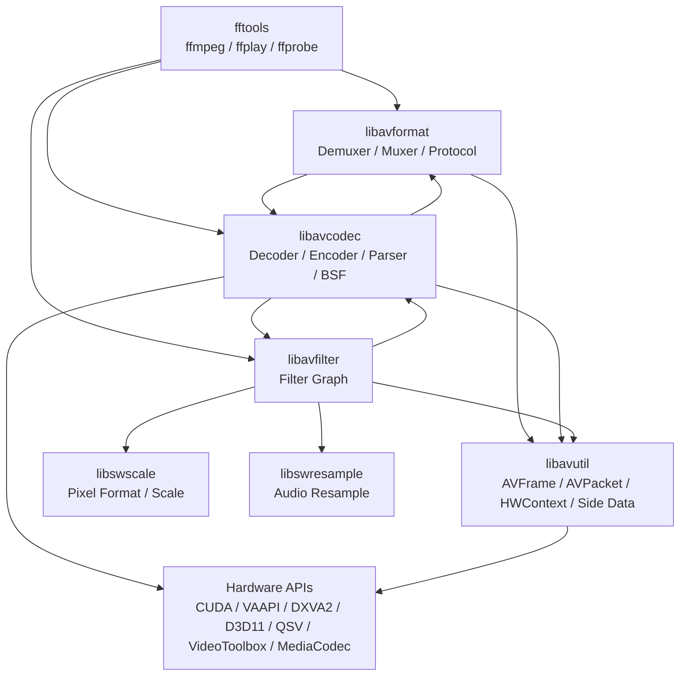

# FFmpeg Overall Architecture

下面这张图先把 FFmpeg 看成“工具层 + 库层”的组合。读代码时不要从所有目录平铺开始，而是先判断当前问题处在哪条链路：输入、解码、过滤、编码、输出。



对应源码入口：`fftools/ffmpeg.c`、`libavformat/demux.c`、`libavcodec/decode.c`、`libavfilter/`、`libavutil/hwcontext.h`。

## 分层

FFmpeg 的核心由命令行工具层和库层组成：

- `fftools/`: `ffmpeg`、`ffplay`、`ffprobe` 等命令行入口。它们负责编排输入、过滤、编码、复用、日志、参数解析。
- `libavformat/`: demuxer/muxer、协议、探测、时间戳和包队列。输入主入口在 `libavformat/demux.c`。
- `libavcodec/`: decoder/encoder/parser/bitstream filter，以及硬件加速桥接。解码主入口在 `libavcodec/decode.c`。
- `libavfilter/`: filter graph，处理音视频帧变换。
- `libavutil/`: 公共数据结构、像素格式、硬件上下文、side data、buffer、字典、时间等。
- `libswscale/`、`libswresample/`: 图像缩放/像素格式转换、音频重采样。

## ffmpeg CLI 主流程

典型转码链路：

```mermaid
sequenceDiagram
    participant User as User CLI
    participant Opt as fftools/ffmpeg_opt.c
    participant Demux as fftools/ffmpeg_demux.c
    participant Format as libavformat/demux.c
    participant Dec as libavcodec/decode.c
    participant Filt as fftools/ffmpeg_filter.c
    participant Enc as libavcodec/encode.c
    participant Mux as libavformat/mux.c

    User->>Opt: parse options
    Opt->>Demux: create input files/streams
    Demux->>Format: avformat_open_input()
    Demux->>Format: avformat_find_stream_info()
    loop packets
        Demux->>Format: av_read_frame()
        Demux->>Dec: avcodec_send_packet()
        Dec-->>Demux: avcodec_receive_frame()
        Demux->>Filt: push AVFrame
        Filt->>Enc: filtered AVFrame
        Enc-->>Mux: AVPacket
        Mux->>Mux: av_interleaved_write_frame()
    end
```

1. 参数解析：`fftools/ffmpeg_opt.c` 定义选项，`fftools/ffmpeg_demux.c` 读取输入相关选项。
2. 打开输入：`fftools/ffmpeg_demux.c:967` 调用 `avformat_open_input()`。
3. 探测流信息：`fftools/ffmpeg_demux.c:989` 调用 `avformat_find_stream_info()`。
4. 读取包：`fftools/ffmpeg_demux.c:256` 调用 `av_read_frame()`。
5. 解码：`fftools/ffmpeg.c` 把 `AVPacket` 送入 decoder，核心 API 是 `avcodec_send_packet()` / `avcodec_receive_frame()`。
6. 过滤：`fftools/ffmpeg_filter.c` 管理 filter graph。硬件帧进入 filter 时需要关注 `hw_frames_ctx`。
7. 编码：`libavcodec/encode.c` 处理 `avcodec_send_frame()` / `avcodec_receive_packet()`。
8. 写出：`fftools/ffmpeg_mux.c:150` 调用 `av_interleaved_write_frame()`。

## libavformat 输入主线

- `libavformat/demux.c:221` `avformat_open_input()` 创建/初始化 `AVFormatContext`，探测输入格式，调用 demuxer read header。
- `libavformat/demux.c:2425` `avformat_find_stream_info()` 读取少量 packet，必要时用 parser/decoder 辅助推断 codec 参数。
- `libavformat/demux.c:1439` `av_read_frame()` 是用户读包入口。
- `libavformat/demux.c:1234` `read_frame_internal()` 负责从 demuxer 读取、parser 拆包、时间戳处理和 stream 状态维护。

## libavformat 输出主线

- `libavformat/mux.c:1194` `av_write_frame()` 直接写 packet，不负责跨流交织。
- `libavformat/mux.c:1241` `av_interleaved_write_frame()` 负责 packet interleave，更适合多流输出。
- `libavformat/mux.c:1437` 内部根据 interleaved 标志选择 `av_interleaved_write_frame()` 或 `av_write_frame()`。

## libavcodec 解码主线

- `libavcodec/avcodec.c:709` `avcodec_receive_frame()` 根据 codec 类型分发到 `ff_decode_receive_frame()`。
- `libavcodec/decode.c:598` `avcodec_send_packet()` 接收压缩包，处理 draining、buffered packet、subtitle 特例等。
- `libavcodec/decode.c:688` `ff_decode_receive_frame()` 是 decoder receive 入口。
- `libavcodec/decode.c:540` `decode_receive_frame_internal()` 调用具体 decoder，并处理 packet/frame 缓冲。
- `libavcodec/decode.c:283` 在 frame threading 场景调用 `ff_thread_decode_frame()`。

## 编解码器注册

- `libavcodec/allcodecs.c` 声明所有内置和外部 codec 符号。
- 每个 codec 以 `FFCodec` 结构定义，例如：
  - H.264 decoder：`libavcodec/h264dec.c:1063` `ff_h264_decoder`
  - HEVC decoder：`libavcodec/hevcdec.c:3707` `ff_hevc_decoder`
  - AV1 decoder：`libavcodec/av1dec.c:1248` `ff_av1_decoder`
  - VP9 decoder：`libavcodec/vp9.c:1873` `ff_vp9_decoder`

## Side Data

FFmpeg 很多扩展元数据不直接塞进 codec 主结构，而是使用 side data：

- packet side data：例如 Dolby Vision 配置 `AV_PKT_DATA_DOVI_CONF`，定义在 `libavcodec/packet.h`。
- frame side data：例如 `AV_FRAME_DATA_DOVI_METADATA`、`AV_FRAME_DATA_DOVI_RPU_BUFFER`，定义在 `libavutil/frame.h`。

这对 HDR、Dolby Vision、硬件帧、动态元数据尤其重要。
