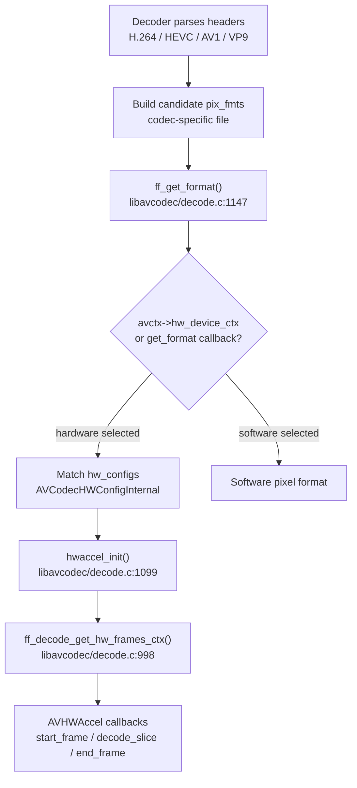
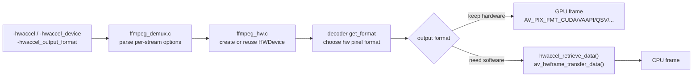
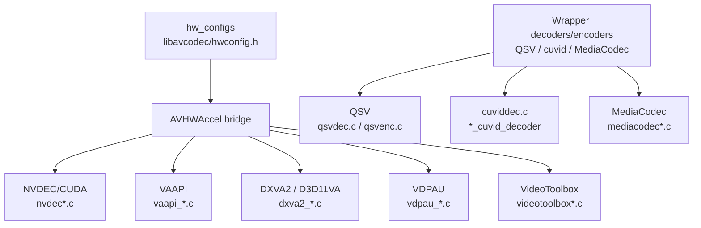

# Codec And Hardware Acceleration

这部分先用两张图建立直觉：第一张图说明普通解码 API 如何落到具体 decoder；第二张图说明硬解不是独立路径，而是在 decoder 选择像素格式和 `AVHWAccel` 后端时接入。

## 软解码调度

外部 API 的核心是：

- `libavcodec/decode.c:598` `avcodec_send_packet()`
- `libavcodec/avcodec.c:709` `avcodec_receive_frame()`
- `libavcodec/decode.c:688` `ff_decode_receive_frame()`
- `libavcodec/decode.c:540` `decode_receive_frame_internal()`

具体 codec 负责把压缩语法解析成帧。硬解不是独立绕过 decoder，而是由 decoder 在合适位置调用 `ff_get_format()` 选择硬件像素格式，再通过 `AVHWAccel` 的 `start_frame`、`decode_slice`、`end_frame` 等回调把参数和 bitstream 交给硬件后端。

## 硬件格式选择

关键函数：

- `libavcodec/decode.c:1147` `ff_get_format()`
- `libavcodec/decode.c:998` `ff_decode_get_hw_frames_ctx()`
- `libavcodec/decode.c:944` 自动从 `avctx->hw_device_ctx` 匹配 codec 的 `hw_configs`
- `libavcodec/decode.c:1099` `hwaccel_init()` 初始化选中的 `AVHWAccel`

配置结构：

- `libavcodec/hwconfig.h:29` `AVCodecHWConfigInternal`
- `libavcodec/hwconfig.h:45` `HW_CONFIG_HWACCEL(...)`
- `libavcodec/hwconfig.h:67` `HWACCEL_DXVA2(codec)`
- `libavcodec/hwconfig.h:69` `HWACCEL_D3D11VA2(codec)`
- `libavcodec/hwconfig.h:71` `HWACCEL_NVDEC(codec)`
- `libavcodec/hwconfig.h:73` `HWACCEL_VAAPI(codec)`
- `libavcodec/hwconfig.h:75` `HWACCEL_VDPAU(codec)`
- `libavcodec/hwconfig.h:77` `HWACCEL_VIDEOTOOLBOX(codec)`
- `libavcodec/hwconfig.h:79` `HWACCEL_D3D11VA(codec)`

公开给用户查询的入口：

- `libavcodec/utils.c:888` `avcodec_get_hw_config()`
- `libavcodec/codec.h` 中的 `AV_CODEC_HW_CONFIG_METHOD_HW_DEVICE_CTX`、`HW_FRAMES_CTX`、`INTERNAL`、`AD_HOC`

## ffmpeg CLI 硬解选项

- `fftools/ffmpeg_opt.c:154` `show_hwaccels()` 输出支持的 hwaccel。
- `fftools/ffmpeg_opt.c:1646` 定义 `-hwaccel`。
- `fftools/ffmpeg_opt.c:1649` 定义 `-hwaccel_device`。
- `fftools/ffmpeg_opt.c:1652` 定义 `-hwaccel_output_format`。
- `fftools/ffmpeg_demux.c:643` 读取每路输入的 `hwaccel`。
- `fftools/ffmpeg_demux.c:674` 把 `nvdec`/`cuvid` 映射为 `cuda` 设备类型。
- `fftools/ffmpeg_demux.c:647` `cuvid` 默认 `hwaccel_output_format=cuda`。
- `fftools/ffmpeg_demux.c:653` `qsv` 默认 `hwaccel_output_format=qsv`。
- `fftools/ffmpeg_demux.c:659` `mediacodec` 默认 `hwaccel_output_format=mediacodec`。
- `fftools/ffmpeg_hw.c:542` `hwaccel_decode_init()` 配置解码侧硬件取帧逻辑。
- `fftools/ffmpeg_hw.c:500` `hwaccel_retrieve_data()` 在需要软件帧时调用 `av_hwframe_transfer_data()`。

## 解码硬解矩阵

由 `libavcodec/hwaccels.h` 和各 decoder 的 `hw_configs` 可见，本快照内主线硬解支持：

| Codec | DXVA2 | D3D11VA | NVDEC | VAAPI | VDPAU | VideoToolbox |
| --- | --- | --- | --- | --- | --- | --- |
| AV1 | `ff_av1_dxva2_hwaccel` | `ff_av1_d3d11va_hwaccel`, `ff_av1_d3d11va2_hwaccel` | `ff_av1_nvdec_hwaccel` | `ff_av1_vaapi_hwaccel` | `ff_av1_vdpau_hwaccel` | - |
| H.264 | `ff_h264_dxva2_hwaccel` | `ff_h264_d3d11va_hwaccel`, `ff_h264_d3d11va2_hwaccel` | `ff_h264_nvdec_hwaccel` | `ff_h264_vaapi_hwaccel` | `ff_h264_vdpau_hwaccel` | `ff_h264_videotoolbox_hwaccel` |
| HEVC | `ff_hevc_dxva2_hwaccel` | `ff_hevc_d3d11va_hwaccel`, `ff_hevc_d3d11va2_hwaccel` | `ff_hevc_nvdec_hwaccel` | `ff_hevc_vaapi_hwaccel` | `ff_hevc_vdpau_hwaccel` | `ff_hevc_videotoolbox_hwaccel` |
| MPEG-1/2 | MPEG-2 DXVA/D3D11VA | MPEG-2 D3D11VA | MPEG-1/2 NVDEC | MPEG-2 VAAPI | MPEG-1/2 VDPAU | MPEG-1/2 VideoToolbox |
| MPEG-4/H.263 | - | - | MPEG-4 NVDEC | MPEG-4/H.263 VAAPI | MPEG-4 VDPAU | MPEG-4/H.263 VideoToolbox |
| VP8 | - | - | `ff_vp8_nvdec_hwaccel` | `ff_vp8_vaapi_hwaccel` | - | - |
| VP9 | `ff_vp9_dxva2_hwaccel` | `ff_vp9_d3d11va_hwaccel`, `ff_vp9_d3d11va2_hwaccel` | `ff_vp9_nvdec_hwaccel` | `ff_vp9_vaapi_hwaccel` | `ff_vp9_vdpau_hwaccel` | `ff_vp9_videotoolbox_hwaccel` |
| VC-1/WMV3 | DXVA2 | D3D11VA | NVDEC | VAAPI | VDPAU | - |
| MJPEG | - | - | `ff_mjpeg_nvdec_hwaccel` | `ff_mjpeg_vaapi_hwaccel` | - | - |
| ProRes | - | - | - | - | - | `ff_prores_videotoolbox_hwaccel` |

对应注册点：

- H.264：`libavcodec/h264dec.c:1075` `ff_h264_decoder.hw_configs`
- HEVC：`libavcodec/hevcdec.c:3724` `ff_hevc_decoder.hw_configs`
- AV1：`libavcodec/av1dec.c:1264` `ff_av1_decoder.hw_configs`
- VP9：`libavcodec/vp9.c:1890` `ff_vp9_decoder.hw_configs`
- MPEG-1/2：`libavcodec/mpeg12dec.c:2872`、`libavcodec/mpeg12dec.c:2901`
- MPEG-4：`libavcodec/mpeg4videodec.c:3872`
- VC-1/WMV3：`libavcodec/vc1dec.c:1406`、`libavcodec/vc1dec.c:1443`
- MJPEG：`libavcodec/mjpegdec.c:2964`

## 具体后端入口

### NVDEC / CUDA

- 通用实现：`libavcodec/nvdec.c`
- H.264：`libavcodec/nvdec_h264.c`
- HEVC：`libavcodec/nvdec_hevc.c`
- AV1：`libavcodec/nvdec_av1.c`
- VP9：`libavcodec/nvdec_vp9.c`
- 帧池参数：`ff_nvdec_frame_params()` 在 `libavcodec/nvdec.c`
- CLI 兼容：`fftools/ffmpeg_demux.c:674` 将 `nvdec`/`cuvid` 视为 `cuda` 设备。

`cuvid` decoder 是另一条 codec wrapper 路径：

- `libavcodec/cuviddec.c:1099` `cuvid_hw_configs`
- `libavcodec/cuviddec.c:1139` 通过宏定义多个 `*_cuvid_decoder`
- `libavcodec/allcodecs.c:844` H.264 cuvid
- `libavcodec/allcodecs.c:853` HEVC cuvid
- `libavcodec/allcodecs.c:883` VP9 cuvid

### VAAPI

- 通用 decode：`libavcodec/vaapi_decode.c`
- H.264：`libavcodec/vaapi_h264.c:388` `ff_h264_vaapi_hwaccel`
- HEVC：`libavcodec/vaapi_hevc.c:601` `ff_hevc_vaapi_hwaccel`
- AV1：`libavcodec/vaapi_av1.c:437` `ff_av1_vaapi_hwaccel`
- VP9：`libavcodec/vaapi_vp9.c:171` `ff_vp9_vaapi_hwaccel`
- 初始化帧上下文：`libavcodec/vaapi_decode.c:664` 调用 `ff_decode_get_hw_frames_ctx()`
- HEVC profile mismatch 处理：`libavcodec/vaapi_hevc.c:594`

### DXVA2 / D3D11VA

- DXVA2 通用：`libavcodec/dxva2.c`
- H.264：`libavcodec/dxva2_h264.c`
- HEVC：`libavcodec/dxva2_hevc.c`
- AV1：`libavcodec/dxva2_av1.c`
- VP9：`libavcodec/dxva2_vp9.c`
- HEVC `ff_hevc_dxva2_hwaccel` / `ff_hevc_d3d11va_hwaccel` / `ff_hevc_d3d11va2_hwaccel` 在 `libavcodec/dxva2_hevc.c:422` 起。

D3D11VA 有两种形式：`D3D11VA_VLD` 的 ad-hoc 旧式，以及 `D3D11` 设备/frames ctx 方式。宏差异在 `libavcodec/hwconfig.h:69` 和 `libavcodec/hwconfig.h:79`。

### QSV

QSV 不主要走 `AVHWAccel` 矩阵，而是独立 decoder/encoder wrapper：

- 解码：`libavcodec/qsvdec.c`
- 编码：`libavcodec/qsvenc.c`
- decoder hw config：`libavcodec/qsvdec.c:113` `qsv_hw_configs`
- encoder hw config：`libavcodec/qsvenc.c:2598` `ff_qsv_enc_hw_configs`
- H.264 QSV encoder：`libavcodec/qsvenc_h264.c:192`
- HEVC QSV encoder：`libavcodec/qsvenc_hevc.c:387`
- AV1 QSV encoder：`libavcodec/qsvenc_av1.c:149`

### VideoToolbox

- 通用 decode：`libavcodec/videotoolbox.c`
- VP9 decode：`libavcodec/videotoolbox_vp9.c`
- H.264 hwaccel：`libavcodec/videotoolbox.c:1314`
- HEVC hwaccel：`libavcodec/videotoolbox.c:1298`
- ProRes hwaccel：`libavcodec/videotoolbox.c:1375`
- 编码：`libavcodec/videotoolboxenc.c`
- H.264 encoder：`libavcodec/videotoolboxenc.c:2763`
- HEVC encoder：`libavcodec/videotoolboxenc.c:2798`
- ProRes encoder：`libavcodec/videotoolboxenc.c:2836`

### MediaCodec

- 解码公共逻辑：`libavcodec/mediacodecdec_common.c`
- decoder wrapper：`libavcodec/mediacodecdec.c`
- encoder wrapper：`libavcodec/mediacodecenc.c`
- decoder hw config：`libavcodec/mediacodecdec.c:535` `mediacodec_hw_configs`
- encoder hw config：`libavcodec/mediacodecenc.c:545`
- CLI 默认输出格式：`fftools/ffmpeg_demux.c:659`

### VDPAU

- 通用：`libavcodec/vdpau.c`
- H.264：`libavcodec/vdpau_h264.c:264` `ff_h264_vdpau_hwaccel`
- HEVC：`libavcodec/vdpau_hevc.c:543` `ff_hevc_vdpau_hwaccel`
- AV1：`libavcodec/vdpau_av1.c:356` `ff_av1_vdpau_hwaccel`
- VP9：`libavcodec/vdpau_vp9.c:226` `ff_vp9_vdpau_hwaccel`

## 硬编码器

主要硬编码器注册：

- NVENC：`libavcodec/nvenc.c:77` `ff_nvenc_hw_configs`；H.264 `libavcodec/nvenc_h264.c:234`，HEVC `libavcodec/nvenc_hevc.c:215`，AV1 `libavcodec/nvenc_av1.c:170`。
- AMF：`libavcodec/amfenc.c:781` `ff_amfenc_hw_configs`；H.264 `libavcodec/amfenc_h264.c:381`，HEVC `libavcodec/amfenc_hevc.c:313`，AV1 `libavcodec/amfenc_av1.c:344`。
- VAAPI：`libavcodec/vaapi_encode.c:34` `ff_vaapi_encode_hw_configs`；H.264 `libavcodec/vaapi_encode_h264.c:1359`，HEVC `libavcodec/vaapi_encode_h265.c:1479`，VP9 `libavcodec/vaapi_encode_vp9.c:300`。
- QSV：`libavcodec/qsvenc.c:2598` `ff_qsv_enc_hw_configs`。
- VideoToolbox：`libavcodec/videotoolboxenc.c`。
- MediaFoundation：`libavcodec/mfenc.c:1229` encoder 宏。
- MediaCodec：`libavcodec/mediacodecenc.c`。

编码侧会在 `libavcodec/encode.c:547` 校验 `avctx->pix_fmt` 是否在 codec `pix_fmts` 中；硬件输入通常依赖 `AVCodecContext.hw_frames_ctx` 或 `hw_device_ctx`。
