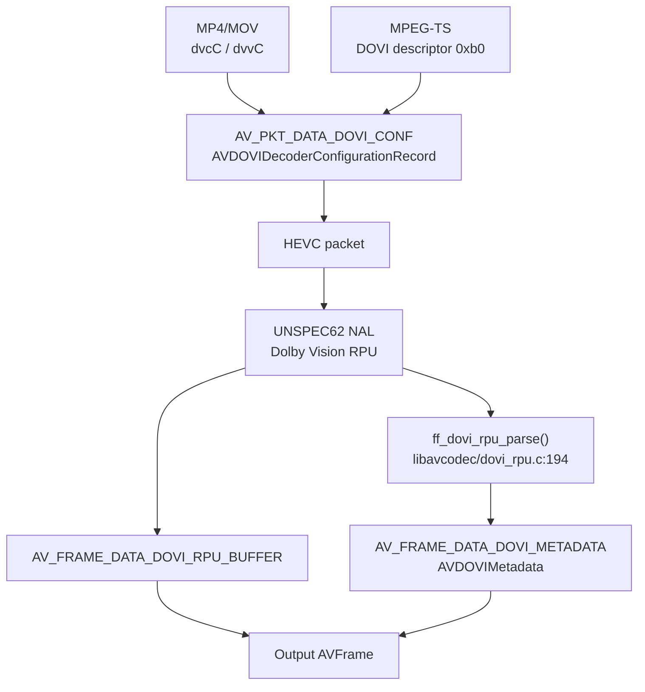
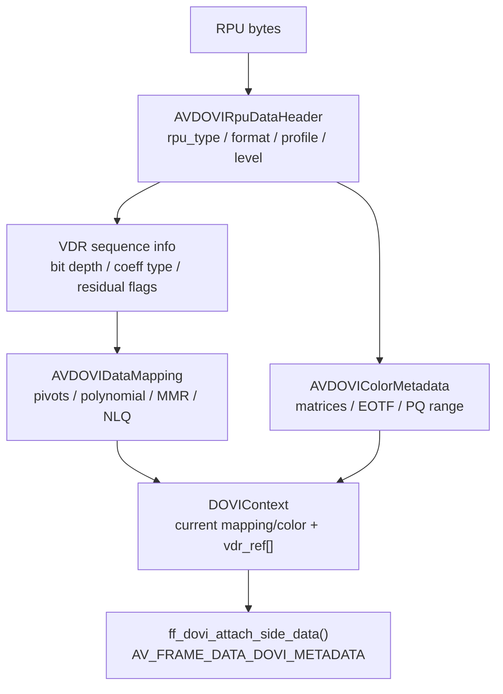

# Dolby Vision Support

这部分先看元数据从容器和 HEVC bitstream 进入 `AVFrame` 的路径。FFmpeg 在这里的核心能力是解析和传递 Dolby Vision 元数据，而不是完成最终显示映射。

## 支持范围概览

本 FFmpeg 快照支持 Dolby Vision 配置记录解析、HEVC RPU NAL 识别、RPU 元数据解析，并通过 packet/frame side data 暴露给上层。它不是完整的 Dolby Vision 渲染引擎：不会把 RPU 动态元数据实际应用到图像重塑/色彩映射输出一帧“已渲染”的 DV 画面。

关键数据类型：

- `libavutil/dovi_meta.h`: `AVDOVIDecoderConfigurationRecord`、`AVDOVIMetadata`、`AVDOVIRpuDataHeader`、`AVDOVIDataMapping`、`AVDOVIColorMetadata`。
- `libavcodec/packet.h`: `AV_PKT_DATA_DOVI_CONF`。
- `libavutil/frame.h`: `AV_FRAME_DATA_DOVI_RPU_BUFFER`、`AV_FRAME_DATA_DOVI_METADATA`。

## 配置记录来源

### MP4/MOV

- `libavformat/mov.c` 解析 Dolby Vision sample entry/box。
- `libavformat/movenc.c:1959` `mov_write_dvcc_dvvc_tag()` 写 `dvcC`/`dvvC`。
- `libavformat/movenc.c:2339` 从 `AV_PKT_DATA_DOVI_CONF` 取得 DOVI 配置。
- `libavformat/movenc.c:5345` 写出时判断流是否有 DOVI side data。

### MPEG-TS

- `libavformat/mpegts.c:2182` 处理 `0xb0` DOVI video stream descriptor。
- `libavformat/mpegts.c:2193` `av_dovi_alloc()` 分配 `AVDOVIDecoderConfigurationRecord`。
- `libavformat/mpegts.c:2197` 读取 `dv_version_major` / `dv_version_minor`。
- `libavformat/mpegts.c:2200` 读取 `dv_profile`。
- `libavformat/mpegts.c:2201` 读取 `dv_level`。
- `libavformat/mpegts.c:2202` 读取 `rpu_present_flag`。
- `libavformat/mpegts.c:2203` 读取 `el_present_flag`。
- `libavformat/mpegts.c:2204` 读取 `bl_present_flag`。
- `libavformat/mpegts.c:2211` 读取 `dv_bl_signal_compatibility_id`。
- `libavformat/mpegts.c:2218` 调用 `av_stream_add_side_data(..., AV_PKT_DATA_DOVI_CONF, ...)`。

## HEVC RPU 识别与传递

HEVC decoder 保存 Dolby Vision 状态：

- `libavcodec/hevcdec.h:594` `AVBufferRef *rpu_buf`
- `libavcodec/hevcdec.h:595` `DOVIContext dovi_ctx`

解码过程中的关键逻辑：

- `libavcodec/hevcdec.c:3187` 检查 RPU delimiter。
- `libavcodec/hevcdec.c:3189` 注释说明 Dolby Vision RPU 伪装为 HEVC `UNSPEC62` NAL。
- `libavcodec/hevcdec.c:3194` 条件判断最后一个 NAL 是否为 `HEVC_NAL_UNSPEC62`，并且 `nuh_layer_id == 0`、`temporal_id == 0`。
- `libavcodec/hevcdec.c:3203` 分配 `s->rpu_buf`。
- `libavcodec/hevcdec.c:3207` 复制 raw RPU 数据到 `s->rpu_buf`。
- `libavcodec/hevcdec.c:3208` 调用 `ff_dovi_rpu_parse(&s->dovi_ctx, nal->data + 2, nal->size - 2)`。
- `libavcodec/hevcdec.c:2844` 把 `s->rpu_buf` 附加为 `AV_FRAME_DATA_DOVI_RPU_BUFFER`。
- `libavcodec/hevcdec.c:2852` 调用 `ff_dovi_attach_side_data(&s->dovi_ctx, out)` 生成结构化 `AV_FRAME_DATA_DOVI_METADATA`。
- `libavcodec/hevcdec.c:3362` 从 packet side data 读取 `AV_PKT_DATA_DOVI_CONF`。
- `libavcodec/hevcdec.c:3364` 调用 `ff_dovi_update_cfg()` 更新 profile。

## RPU 解析细节

核心文件：`libavcodec/dovi_rpu.c`，头文件：`libavcodec/dovi_rpu.h`。

上下文：

- `libavcodec/dovi_rpu.h:30` `DOVI_MAX_DM_ID 15`
- `libavcodec/dovi_rpu.h:31` `DOVIContext`
- `libavcodec/dovi_rpu.h:37` 当前 RPU header
- `libavcodec/dovi_rpu.h:44` 当前 mapping 指针
- `libavcodec/dovi_rpu.h:45` 当前 color 指针
- `libavcodec/dovi_rpu.h:50` `vdr_ref[DOVI_MAX_DM_ID+1]`

重要函数：

- `libavcodec/dovi_rpu.c:43` `ff_dovi_ctx_unref()` 清理上下文。
- `libavcodec/dovi_rpu.c:53` `ff_dovi_ctx_flush()` flush 时保留 `dv_profile`。
- `libavcodec/dovi_rpu.c:64` `ff_dovi_ctx_replace()` 在线程/上下文复制中复制 DOVI 状态。
- `libavcodec/dovi_rpu.c:83` `ff_dovi_update_cfg()` 从 `AVDOVIDecoderConfigurationRecord` 写入 `dv_profile`。
- `libavcodec/dovi_rpu.c:91` `ff_dovi_attach_side_data()` 将解析后的 metadata 放入 `AV_FRAME_DATA_DOVI_METADATA`。
- `libavcodec/dovi_rpu.c:125` `guess_profile()` 在没有 container 配置时尝试推断 profile 5/7/4/8。
- `libavcodec/dovi_rpu.c:194` `ff_dovi_rpu_parse()` 主解析函数。

`ff_dovi_rpu_parse()` 解析内容：

- `nal_prefix`，要求值为 25。
- `rpu_type`，当前只识别 type 2；其他类型记录 warning 后忽略。
- `rpu_format`、`vdr_rpu_profile`、`vdr_rpu_level`。
- `vdr_seq_info_present` 下的 `coef_data_type`、`coef_log2_denom`、bit depth、residual flags。
- `vdr_dm_metadata_present`、`use_prev_vdr_rpu`、`use_nlq`。
- mapping 曲线：`AV_DOVI_MAPPING_POLYNOMIAL` 和 `AV_DOVI_MAPPING_MMR`。
- NLQ：当前代码只接受 `AV_DOVI_NLQ_LINEAR_DZ`。
- color metadata：`ycc_to_rgb_matrix`、`ycc_to_rgb_offset`、`rgb_to_lms_matrix`、EOTF、bit depth、color space、PQ min/max、source diagonal。

## 已知限制

- `libavcodec/dovi_rpu.c:215` 非 type 2 RPU 只 warning 并忽略。
- `libavcodec/dovi_rpu.c:264` 缺少 RPU VDR sequence info 会失败。
- `libavcodec/dovi_rpu.c:274` profile 5 RPU 如果使用 NLQ 会失败。
- `libavcodec/dovi_rpu.c:347` Dolby Vision linear interpolation 触发 `AVERROR_PATCHWELCOME`。
- `libavcodec/dovi_rpu.c:447` 注释写明 CRC32 未校验，因为缺少 `AV_CRC_32_MPEG_2` 实现。
- HEVC 中每个 AU 只保留 0 或 1 个 RPU：`libavcodec/hevcdec.h:594` 注释为 `0 or 1 Dolby Vision RPUs`。
- `libavcodec/hevcdec.c:3198` 如果一个 AU 出现多个 RPU，会跳过前一个并 warning。

## 结论

FFmpeg 这里的 Dolby Vision 重点是“解析和传递元数据”：

- container 级配置通过 `AV_PKT_DATA_DOVI_CONF` 进入 decoder；
- HEVC RPU 通过 `UNSPEC62` NAL 被识别；
- raw RPU 通过 `AV_FRAME_DATA_DOVI_RPU_BUFFER` 透传；
- 结构化元数据通过 `AV_FRAME_DATA_DOVI_METADATA` 暴露；
- 不负责最终 Dolby Vision 显示映射或双层 EL/BL 合成渲染。
