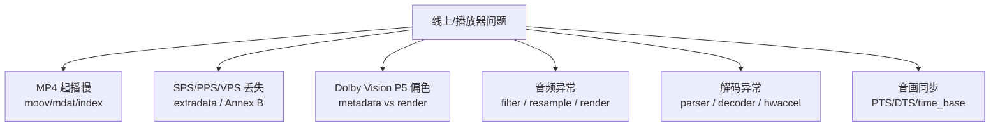
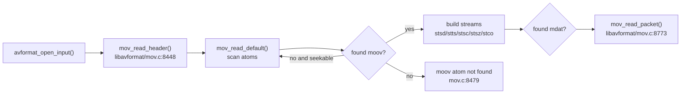
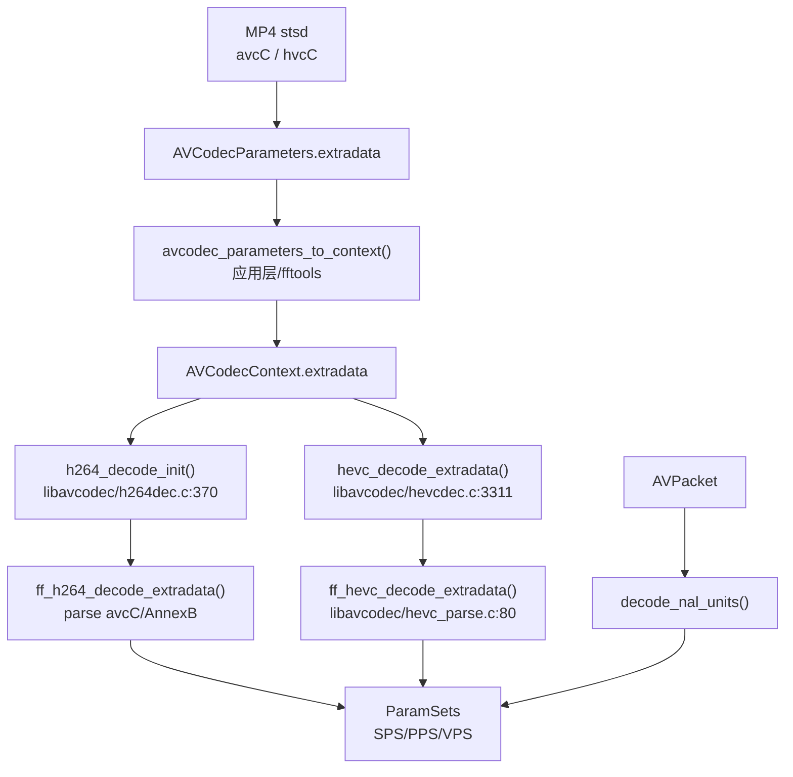
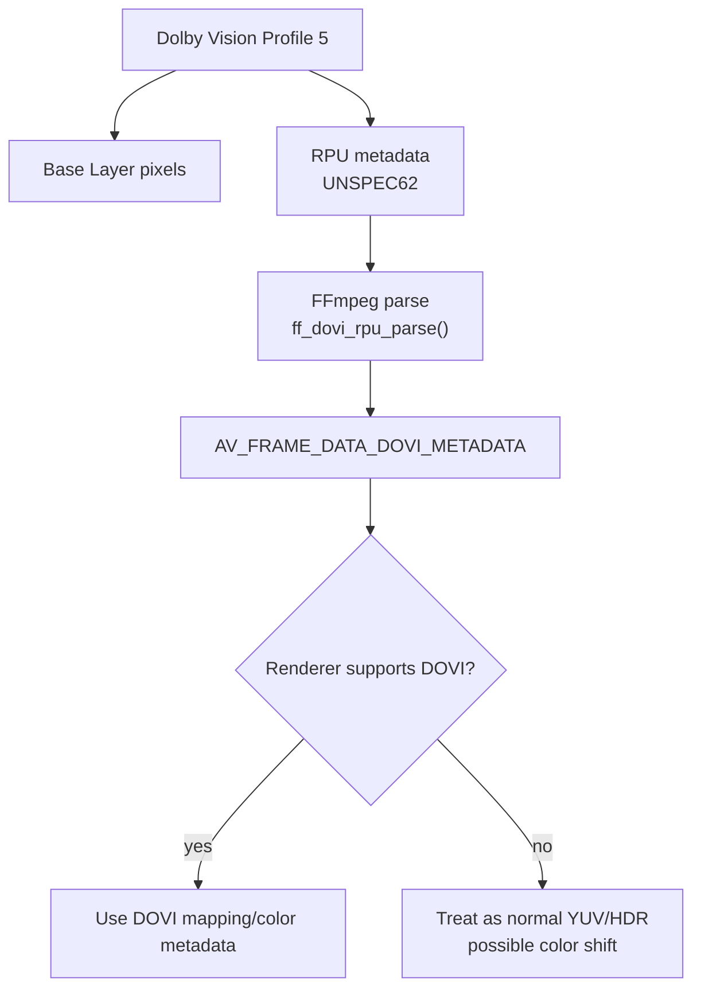
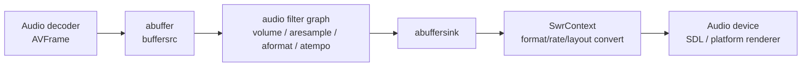
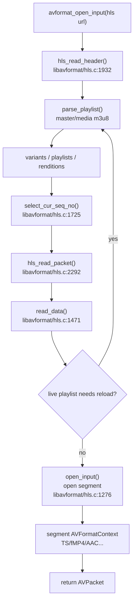
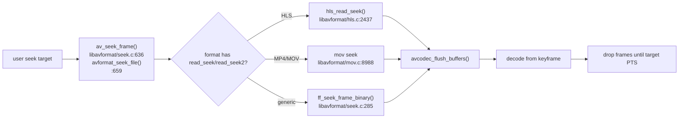
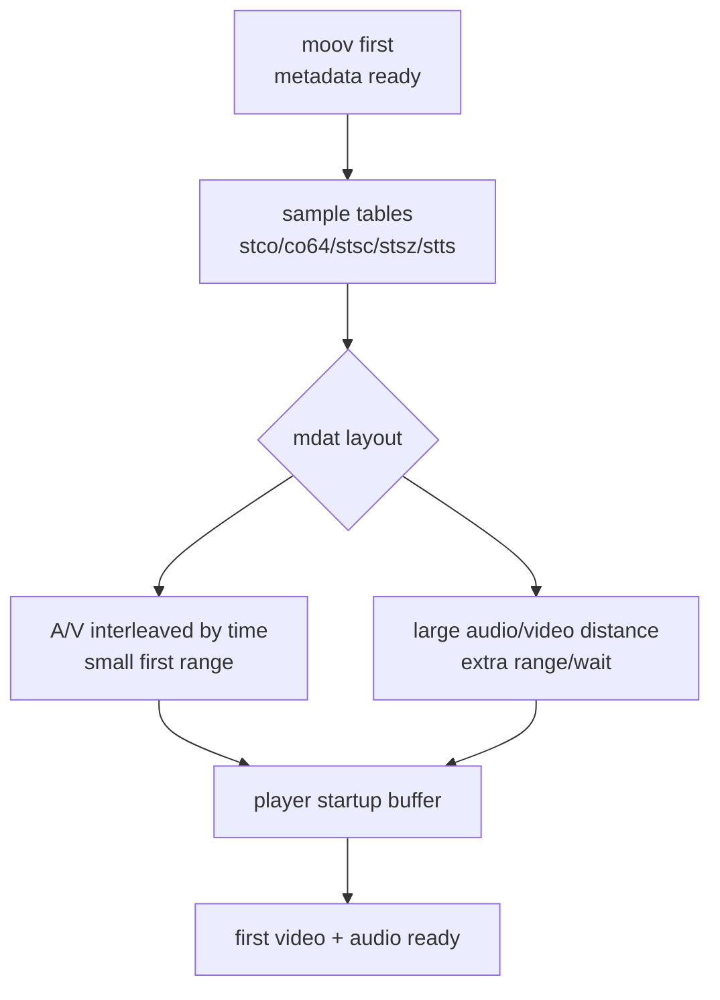
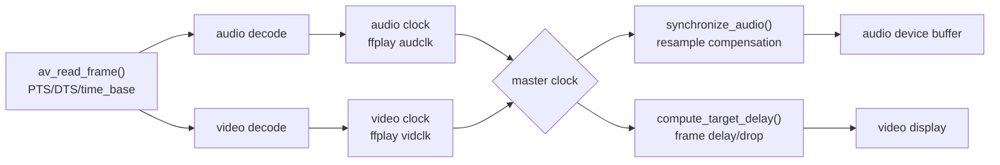

# FFmpeg Engineering Playbook

这篇不是源码目录说明，而是工程排障手册：遇到 MP4 起播慢、Dolby P5 偏色、SPS/PPS、音频 filter/render、解码异常时，先看哪条链路、哪些文件、哪些函数。

## 问题地图

## MP4 起播慢

核心判断：播放器要先拿到 `moov` 里的 track、sample table、codec extradata，才能知道怎么请求和解码 `mdat`。如果 `moov` 在文件尾，普通 HTTP progressive download 要先下载/seek 到尾部，起播就慢。

源码入口：

- `libavformat/mov.c:8448` `mov_read_header()`；注释明确 `.mov`/`.mp4` 只有 `moov` 在 `mdat` 前才适合 progressive download。
- `libavformat/mov.c:1170` `mov_read_moov()`，解析 `moov` 后设置 `found_moov`。
- `libavformat/mov.c:977` `mov_read_mdat()`，记录 `found_mdat`。
- `libavformat/mov.c:8773` `mov_read_packet()`，按 sample table 读包。
- `libavformat/movenc.c:81` `faststart` 选项说明：第二遍把 `moov` 移到文件开头。
- `libavformat/movenc.c:7557` 写尾部时处理 `moov`；`libavformat/movenc.c:7575` 打印 moving moov atom 日志。

工程建议：

- 点播文件优先使用 `-movflags +faststart`，代价是输出结束后需要第二遍移动 `moov`。
- 直播/边下边播场景优先考虑 fragmented MP4：`empty_moov`、`delay_moov`、`separate_moof`、`frag_keyframe` 等，不要用普通尾部 `moov` 的大 MP4。
- 排查起播慢先看文件结构：`moov` 是否在前，sample table 是否完整，首个关键帧位置是否靠前，音视频是否都等到足够 metadata。
- 如果 mux 时日志提示 “Cannot write moov atom before ... packets”，看 `libavformat/movenc.c:372`、`:578`、`:867`，说明某些 codec 需要先解析 packet 才能写正确 `moov`，可考虑 `delay_moov`。

## SPS/PPS/VPS 怎么获取，又怎么送进解码器

H.264/HEVC 有两类常见封装：

- MP4：参数集放在 `avcC`/`hvcC`，进入 `AVCodecParameters.extradata`，packet 里通常是 length-prefixed NAL。
- Annex B：参数集是带 start code 的 NAL，可能在码流开头，也可能在 IDR 前重复。

H.264 关键点：

- `libavformat/mov.c:2618` 注释说明 sample entry 后会读取 `avcC`/`hvcC` 等 extra atoms。
- `libavcodec/h264dec.c:388` decoder init 时读取 `avctx->extradata`。
- `libavcodec/h264dec.c:389` 调用 `ff_h264_decode_extradata()`。
- `libavcodec/h264_parse.c:484` 从 `avcC` 解 SPS；`:499` 从 `avcC` 解 PPS。
- `libavcodec/h264dec.c:680` packet 内遇到 `H264_NAL_SPS` 时解析 SPS。
- `libavcodec/h264dec.c:700` packet 内遇到 `H264_NAL_PPS` 时解析 PPS。
- `libavcodec/h264_slice.c:1703` slice header 读取 `pps_id`，`:1714` 用 `pps_id` 找 PPS，再通过 PPS 找 SPS。
- `libavcodec/h264_slice.c:1091` SPS VUI 写入 `color_range`、`color_primaries`、`color_trc`、`colorspace`。

HEVC 关键点：

- `libavcodec/hevcdec.c:3667` init 时读取 `avctx->extradata`。
- `libavcodec/hevcdec.c:3311` `hevc_decode_extradata()`。
- `libavcodec/hevc_parse.c:80` `ff_hevc_decode_extradata()`，可识别 hvcC 或 Annex B。
- `libavcodec/hevc_parse.c:45` VPS，`:50` SPS，`:55` PPS。
- `libavcodec/hevcdec.c:2973`/`:2986`/`:3000` 解码 packet 时解析 VPS/SPS/PPS。

BSF 相关：

- `libavcodec/h264_mp4toannexb_bsf.c:65` 从 avcC 提取 SPS/PPS 转 Annex B。
- `libavcodec/h264_mp4toannexb_bsf.c:169` filter packet，IDR 前补 SPS/PPS。
- `libavcodec/hevc_mp4toannexb_bsf.c:40` 从 hvcC 提取 VPS/SPS/PPS。
- `libavcodec/hevc_mp4toannexb_bsf.c:159` IRAP 前补 extradata。
- `libavformat/mpegtsenc.c:1761` 写 TS 时如果 H.264 没 startcode，会提示使用 `h264_mp4toannexb`。

工程经验：

- “解码器报 non-existing PPS/SPS”通常是 extradata 没传、BSF 没加、切片从非关键帧开始、或者中间切走了参数集。
- MP4 转 TS、RTP、裸 H.264/H.265 时要关注 `h264_mp4toannexb` / `hevc_mp4toannexb`。
- seek 到中间播放时，如果目标 packet 前没有参数集，依赖 decoder 已经从 extradata 初始化；如果 extradata 为空，就容易失败。
- 动态分辨率/参数集变化看 `AV_PKT_DATA_NEW_EXTRADATA`：`libavformat/mov.c:8729` `mov_change_extradata()` 会通知 decoder extradata changed。

## Dolby Vision P5 偏色

P5 的关键是它通常不是普通 HDR10 的 BT.2020/PQ 画面直接显示。FFmpeg 在当前链路里能解析/透传 DOVI metadata，但不会自动把 P5 RPU 映射成正确 SDR/HDR 输出。

源码入口：

- `libavcodec/hevcdec.c:3187` 识别 RPU delimiter；`:3208` 调用 `ff_dovi_rpu_parse()`。
- `libavcodec/dovi_rpu.c:194` 解析 RPU。
- `libavcodec/dovi_rpu.c:91` `ff_dovi_attach_side_data()` 输出 `AV_FRAME_DATA_DOVI_METADATA`。
- `libavutil/dovi_meta.h:157` `AVDOVIColorMetadata` 明确描述 Dolby Vision RPU colorspace metadata。
- `libavutil/frame.c:823`/`:824` frame side data 名称。
- H.264/HEVC 普通颜色标签来自 SPS/VUI，例如 `libavcodec/h264_slice.c:1091`。

工程判断：

- 如果播放器/渲染器只看 `AVFrame.color_primaries/color_trc/colorspace`，不消费 `AV_FRAME_DATA_DOVI_METADATA`，P5 很容易偏色。
- FFmpeg 能帮你确认 P5 metadata 是否解析出来：看 frame side data 是否有 `AV_FRAME_DATA_DOVI_METADATA` 和 `AV_FRAME_DATA_DOVI_RPU_BUFFER`。
- 修复方向通常在渲染侧：识别 DOVI profile，消费 RPU metadata，或在转码/预处理时转成目标 HDR10/SDR。单靠 `swscale` 不能完成 Dolby Vision P5 的正确显示映射。
- 需要区分“元数据丢失”和“渲染未应用”：前者看 demux/decode side data，后者看播放器 shader/tonemap/color management。

## 音频 filter、重采样和渲染

FFmpeg 的音频链路通常分三段：decoder 输出 `AVFrame`，filter graph 处理格式/音量/混音/重采样，渲染端再按设备格式转换。

ffmpeg CLI filter：

- `fftools/ffmpeg_filter.c:991` 创建 `abuffer`。
- `fftools/ffmpeg_filter.c:687` 创建 `abuffersink`。
- `fftools/ffmpeg_filter.c:745` 可插入 `aformat`。
- `fftools/ffmpeg_filter.c:1152` 设置 `aresample_swr_opts`。
- `fftools/ffmpeg_filter.c:1206` `avfilter_graph_config()`。
- `fftools/ffmpeg_filter.c:1242` `av_buffersrc_add_frame()` 推音频帧。

ffplay 渲染参考：

- `fftools/ffplay.c:1973` 设置 audio graph 的 `aresample_swr_opts`。
- `fftools/ffplay.c:1983` 创建 `abuffer`。
- `fftools/ffplay.c:1990` 创建 `abuffersink`。
- `fftools/ffplay.c:2079` `av_buffersrc_add_frame()`。
- `fftools/ffplay.c:2082` `av_buffersink_get_frame_flags()`。
- `fftools/ffplay.c:2286` `synchronize_audio()` 按主时钟微调样本数。
- `fftools/ffplay.c:2334` `audio_decode_frame()` 做取帧、重采样、同步。
- `fftools/ffplay.c:2368` `swr_alloc_set_opts2()`。
- `fftools/ffplay.c:2406` `swr_convert()`。
- `fftools/ffplay.c:2443` `sdl_audio_callback()`。
- `fftools/ffplay.c:2486` `audio_open()` 打开 SDL 音频设备。

filter 内部：

- `libavfilter/af_aresample.c:137` 调用 `swr_alloc_set_opts2()`。
- `libavfilter/af_aresample.c:144` `swr_init()`。
- `libavfilter/af_aresample.c:180` `swr_get_delay()`。
- `libavfilter/af_aresample.c:212` `swr_convert()`。
- `libavfilter/af_volume.c` 音量 filter，x86 优化在 `libavfilter/x86/af_volume_init.c` 和 `libavfilter/x86/af_volume.asm`。

工程经验：

- 音频“变调/变速/爆音”先查 sample rate、sample format、channel layout 是否在 filter graph 和设备端一致。
- 音画不同步先看 PTS 是否连续、`time_base` 是否正确、重采样补偿是否开启。ffplay 的 `synchronize_audio()` 是很好的参考。
- 多路混音用 `amix`，声道布局合并/拆分用 `amerge`/`pan`/`channelmap`，响度规范化用 `loudnorm`，简单音量用 `volume`。
- 设备渲染通常要求固定格式，例如 ffplay sink 限制到 `AV_SAMPLE_FMT_S16`，实际项目里要显式定义渲染端接受格式，避免隐式转换链路失控。

## HLS/m3u8 收流、解封装和分片读取

HLS 的关键不是“打开一个 URL”，而是先解析 m3u8，再按 variant/playlist/segment 的状态机持续拉片、刷新 live playlist、把每个 segment 包装成内部 demuxer。

源码入口：

- `libavformat/hls.c:1932` `hls_read_header()`：HLS demuxer 初始化入口。
- `libavformat/hls.c:1953` 调用 `parse_playlist()` 解析主 m3u8 或 media playlist。
- `libavformat/hls.c:1725` `select_cur_seq_no()`：决定从哪个 segment sequence 开始读。
- `libavformat/hls.c:1752` 根据 `live_start_index` 选择 live 起始位置；`:1761` 处理 `#EXT-X-START`。
- `libavformat/hls.c:1471` `read_data()`：segment 读取循环。
- `libavformat/hls.c:1506` live playlist reload；`:1517` 处理 segment 过期后跳片。
- `libavformat/hls.c:1560` 打开当前 segment；`:1592` 预打开下一个 segment。
- `libavformat/hls.c:2292` `hls_read_packet()`：对外返回 `AVPacket`。
- 常用选项在 `libavformat/hls.c:2543` 起：`live_start_index`、`prefer_x_start`、`m3u8_hold_counters`、`http_multiple`、`http_seekable`、`seg_format_options`、`seg_max_retry`。

工程建议：

- 直播首帧慢：优先检查 `live_start_index`、`#EXT-X-START`、playlist reload 间隔、首个可用 segment 是否已经过期。低延迟场景不要从过老 segment 起播。
- 卡在 playlist 不更新：看 `m3u8_hold_counters` 和服务端 m3u8 是否真的变化；FFmpeg 会在 `read_data()` 中反复 reload，但业务层仍需要超时、降级和重连策略。
- 多路音频/字幕/码率切换：FFmpeg 能解析 variant/rendition，但 ABR 决策、码率选择、buffer 水位策略通常是播放器层职责。
- segment 网络失败：先使用 `seg_max_retry`、HTTP 连接复用相关选项；如果要做 CDN failover、按错误码切源、按 buffer 水位切码率，通常要在播放器网络层或定制 HLS demuxer。

## 快速 seek：通用 seek、HLS seek 和 MP4 seek

seek 要先区分三种目标：快速跳到附近可播位置、精确到目标时间、还是低成本预览。FFmpeg 提供 seek 入口和容器级实现，但“精确且快”经常需要播放器策略配合。

源码入口：

- `libavformat/seek.c:636` `av_seek_frame()`；`:659` `avformat_seek_file()`。
- `libavformat/seek.c:667` `seek2any` 会影响是否带 `AVSEEK_FLAG_ANY`。
- `libavformat/options_table.h:51` `fflags=fastseek`：快但不精确。
- `libavformat/options_table.h:56` `seek2any`：允许 seek 到非关键帧，是否可播取决于 codec/reference。
- `libavformat/hls.c:2437` `hls_read_seek()`；`:2476` 用 `find_timestamp_in_playlist()` 定位 segment；`:2480` 到 `:2483` 在非 `AVSEEK_FLAG_ANY` 时回退到 segment start/keyframe。
- `libavformat/mov.c:3362`、`:3408`、`:3427` 处理 PTS/DTS、B 帧和关键帧回退；`:9189` MOV demuxer 标记 `AVFMT_SEEK_TO_PTS`。

工程建议：

- “快 seek”：用关键帧 seek，允许落点偏前，解码后丢帧到目标 PTS。优点是稳定；缺点是 GOP 大时慢。
- “准 seek”：seek 到目标前关键帧后 decode+drop；必须 flush decoder、清空 packet/frame 队列、重建音频时钟。
- “预览 seek”：可以 `AVSEEK_FLAG_ANY`/`seek2any`，但 H.264/HEVC 非关键帧经常缺参考帧，只适合缩略图或容忍花屏的预览。
- HLS seek 慢通常不是解码慢，而是目标 segment 定位、HTTP 建连、playlist 与 segment index 不连续、目标 segment 已过期。
- MP4 seek 慢要看 sample table、关键帧间隔、是否需要远距离 Range 请求，以及音视频 sample 是否交错合理。

如果要改 FFmpeg：

- HLS 可以在 `hls_read_seek()` 周边增加更激进的 segment 命中缓存、预取目标 segment、或暴露更多 seek 诊断日志，例如命中的 `seq_no`、`seg_start_ts`、playlist reload 次数。
- MOV/MP4 可以增加统计日志，输出目标 PTS、实际 DTS、关键帧 sample index、Range offset，帮助播放器判断是文件结构问题还是 seek 策略问题。
- 真正的“秒开精确 seek”通常不能只靠改 FFmpeg；还需要编码侧缩短 GOP、服务端提供索引/分片、播放器做异步预取和解码后丢帧。

## MP4 音视频交错导致起播慢

即使 `moov` 在前，`mdat` 里的音频和视频 sample 如果相距很远，播放器也可能为了拿齐首帧所需的音视频数据发起多次 Range 请求，或等待远处音频/视频 chunk，导致起播慢。

源码入口：

- `libavformat/mux.c:819` `ff_interleave_add_packet()`：把 packet 加入交错队列。
- `libavformat/mux.c:893` `interleave_compare_dts()`：按 DTS 比较输出顺序。
- `libavformat/mux.c:923` `ff_interleave_packet_per_dts()`：按 DTS 交错输出。
- `libavformat/mux.c:953` 使用 `max_interleave_delta` 控制最大交错等待。
- `libavformat/mux.c:980` 超过 `max_interleave_delta` 时强制输出 packet。
- `libavformat/mux.c:1241` `av_interleaved_write_frame()`：应用层推荐的交错写入口。
- `libavformat/mux.c:688` 到 `:690` 对 poorly interleaved packets 给出警告，并建议必要时设置 `-max_interleave_delta 0`。

工程建议：

- 生成 MP4 时优先使用 `av_interleaved_write_frame()`，不要简单按一路写完再写另一路。
- 点播文件同时做 `-movflags +faststart` 和合理交错；前者只解决 metadata 位置，后者解决首段媒体数据距离。
- 对首屏体验敏感的播放器，可以统计首个视频关键帧、首个可播音频 sample、首个字幕 sample 的 file offset 距离。
- fMP4/HLS/DASH 更适合边下边播：分片天然把小时间窗口内的音视频组织在一起。

如果要改 FFmpeg：

- 在 MOV muxer 或通用 mux 层增加“首段 A/V 最大字节距离”之类的选项，比单纯 `max_interleave_delta` 更直接服务播放器起播。
- 在 `movenc` 写出阶段增加诊断：首个关键帧 offset、首个音频 offset、两者距离、首个 moof/mdat 时间范围。
- 如果业务只控制打包链路，优先写一个质检工具或 mux 后扫描器，比修改 demuxer 更有收益。

## 音画同步：播放器时钟模型

FFmpeg 能给出 packet/frame 的时间戳和 ffplay 参考实现，但真正的同步策略属于播放器。关键是明确主时钟、队列延迟、音频设备缓冲、视频帧显示时刻。

源码入口：

- `libavformat/demux.c:926` `compute_pkt_fields()`：计算/修正 packet 时间戳。
- `libavformat/demux.c:1040` 注释说明缺失 PTS/DTS 时会尝试插值，但 H.264 等场景有限制。
- `libavformat/demux.c:1439` `av_read_frame()`；`:1442` 处理 `genpts`。
- `libavformat/options_table.h:45` `fflags=genpts`；`:50` `sortdts`。
- `fftools/ffplay.c:1363` `get_clock()`；`:1375` `set_clock_at()`；`:1411` `get_master_sync_type()`；`:1428` `get_master_clock()`。
- `fftools/ffplay.c:1514` `compute_target_delay()`：视频按主时钟调整 delay。
- `fftools/ffplay.c:1778` 视频帧相对主时钟落后时丢帧。
- `fftools/ffplay.c:2286` `synchronize_audio()`；`:2397` `swr_set_compensation()` 微调音频采样。
- `fftools/ffplay.c:2481` 根据设备缓冲估算 audio clock。

工程建议：

- 优先用音频时钟做 master，因为音频设备持续消耗样本，听感对抖动敏感。
- 每次 seek 后必须 flush decoder、清空队列、重置 clock serial，避免旧帧参与同步。
- 直播弱网下不要只看 PTS，还要看 packet 到达时间、buffer 水位和解码耗时；否则会在“追帧”和“卡顿”之间来回震荡。
- 音频轻微漂移用 `swr_set_compensation()`；大漂移要丢/补帧或重建时钟，不能无限拉伸音频。

## 播放器行业问题和解决方案矩阵

这张表用于判断问题应该改 FFmpeg、改打包链路，还是改播放器策略。

| 问题 | 典型现象 | 先看 FFmpeg 位置/选项 | 解决方案 | 是否值得改 FFmpeg |
|---|---|---|---|---|
| HLS live 起播慢 | 打开后等多个 segment 才出画 | `hls_read_header()`、`select_cur_seq_no()`、`live_start_index`、`prefer_x_start` | 选择靠近 live edge 的起播点，缩短 segment，播放器预缓冲只等关键帧和音频可播 | 可改：暴露更详细起播 segment 选择日志；核心策略在播放器/服务端 |
| HLS playlist 卡住 | m3u8 不更新或重复旧片 | `read_data()`、`m3u8_hold_counters` | 设置超时和重连，检测 media sequence 不增长后切 CDN/降级 | 可改：增加错误分类和回调；多 CDN 策略不应放在通用 FFmpeg |
| HLS seek 不准/很慢 | seek 后回到前一个片，或长时间黑屏 | `hls_read_seek()`、`find_timestamp_in_playlist()` | seek 到 segment start 后 decode+drop；服务端提供更短 segment 或 I-frame playlist | 可改：目标 segment 预取、seek 命中日志；精确度依赖切片和 GOP |
| MP4 moov 在尾 | progressive download 长时间无首帧 | `mov_read_header()`、`mov_read_moov()`、`faststart` | 生产侧 `-movflags +faststart` 或 fMP4 | 通常不改 demuxer；应修复文件打包 |
| MP4 A/V 交错差 | metadata 已读到，但首帧仍慢 | `av_interleaved_write_frame()`、`ff_interleave_packet_per_dts()`、`max_interleave_delta` | 重新 mux，限制首段 A/V offset 距离，使用 fMP4 | 可改 muxer：增加首段交错约束和质检日志 |
| GOP 太长 | seek 后黑屏久、首帧慢 | 容器 seek + decoder drop | 编码侧缩短 GOP，生成关键帧索引，播放器异步预解码 | 不主要改 FFmpeg；需要编码/打包策略 |
| PTS/DTS 异常 | 音画不同步、倒退、跳帧 | `compute_pkt_fields()`、`fflags=genpts/sortdts` | 使用 `genpts`，修复源流时间戳，播放器建立异常时间戳保护 | 可改 demuxer 修特定格式；通用层不宜掩盖坏流 |
| 音频爆音/变速 | seek 或切流后音频异常 | `aresample`、`swr_set_compensation()`、`audio_decode_frame()` | 显式约束采样率/格式/声道，seek 后清空音频设备缓冲 | 多数在播放器；FFmpeg filter 配置要正确 |
| 硬解失败回退慢 | 某设备黑屏或卡死后才软解 | `ff_get_format()`、`hw_configs`、`hwaccel_flags` | 按 codec/profile/level/分辨率预判，失败快速释放并软解 | 可改：后端黑名单/错误码更细；策略在播放器 |
| Dolby Vision P5 偏色 | 画面发绿/发紫/亮度异常 | `ff_dovi_rpu_parse()`、`AV_FRAME_DATA_DOVI_METADATA` | 渲染侧消费 DOVI metadata 或转 HDR10/SDR | 不靠单改 FFmpeg 解；需要渲染/tonemap |
| 首帧黑屏 | 解码有帧但显示黑，或第一帧很晚 | extradata、关键帧、硬件帧下载、渲染格式 | 检查是否从关键帧起、是否有 SPS/PPS/VPS、渲染是否支持像素格式 | 可加诊断；根因常在流/渲染 |
| 低延迟直播卡顿 | 延迟低但频繁 buffer underrun | `fflags=nobuffer`、`avioflags=direct`、`max_delay`、`probesize`、`analyzeduration` | 降低 probe/analyze，控制 jitter buffer，按水位丢帧或升降码率 | FFmpeg 可调输入缓冲；端到端低延迟在播放器/协议层 |
| 字幕/多音轨切换慢 | 切换后不同步或等待久 | HLS renditions、demux stream selection | 预打开目标 rendition，切换时对齐 PTS，清队列 | 可改 HLS demuxer预取；体验策略在播放器 |
| DRM/安全解码 | FFmpeg 能 demux 但不能出明文帧 | demux/decode 边界 | 使用平台 DRM/CDM/secure decoder，FFmpeg 只参与非加密段或 metadata | 通常不改通用 FFmpeg，走平台安全链路 |

## 解码时 FFmpeg 能帮你解决什么

FFmpeg 能解决：

- 容器解析、packet timestamp、stream metadata。
- codec parser、extradata、SPS/PPS/VPS、SEI、side data。
- 软件解码、部分硬解、硬件帧下载/上传。
- filter graph、重采样、格式转换、音视频同步参考。
- bitstream filter：MP4/Annex B 转换、metadata 修改、extradata 提取。

FFmpeg 不自动解决：

- 业务播放器缓冲策略和首帧策略。
- 所有硬件设备/驱动 profile 支持差异。
- Dolby Vision P5/P7 的最终正确显示映射。
- 私有 DRM、安全解码路径、平台专有渲染队列。
- 低延迟直播的端到端策略，包括网络抖动缓冲、ABR、渲染调度。

## 常用排障入口

- 看容器：`ffprobe -show_format -show_streams -show_packets -select_streams v:0 input.mp4`
- 看 side data：`ffprobe -show_frames -select_streams v:0 input.mp4`
- 看 packet 参数变化：关注 `AV_PKT_DATA_NEW_EXTRADATA`。
- 转 Annex B：`ffmpeg -i in.mp4 -c copy -bsf:v h264_mp4toannexb out.h264`
- MP4 快起播：`ffmpeg -i in.mp4 -c copy -movflags +faststart out.mp4`
- 音频格式固定：`-af aformat=sample_fmts=s16:sample_rates=48000:channel_layouts=stereo`
