# 常见格式解析地图

源码快照：

- 本机路径：`D:/github/FFmpeg`
- Git describe：`n6.0.1-24-gdc02ba2637-dirty`
- Commit：`dc02ba263755b981b809ad2708b77c82586669d9`
- 文档日期：2026-06-30

这篇文档回答：各种容器格式的关键数据在哪里，FFmpeg 怎么把它们解析成 `AVStream`、`AVCodecParameters`、`AVPacket` 和 side data。

> [!IMPORTANT]
> 读容器不要只看 packet payload。关键数据经常在 header、sample table、CodecPrivate、descriptor、side data、playlist 或 init segment 里。真正的输入合同是：容器 metadata + stream 参数 + packet payload + packet side data + 时间戳。

## 通用解析流程

这张图是所有格式的共同骨架。

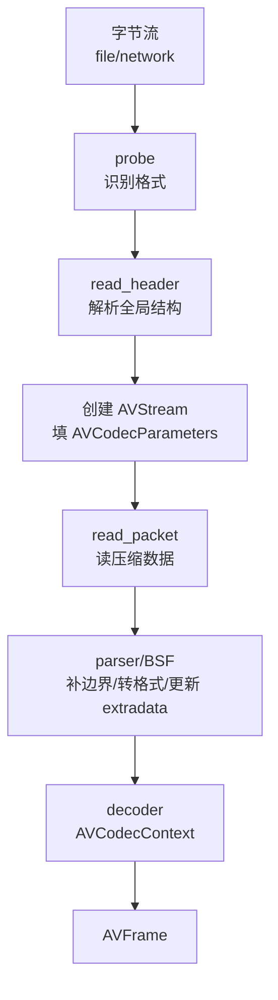

源码入口：

- 格式探测：`libavformat/format.c:225` `av_probe_input_buffer2()`
- 打开输入：`libavformat/demux.c:221` `avformat_open_input()`
- 补充流信息：`libavformat/demux.c:2425` `avformat_find_stream_info()`
- 读包：`libavformat/demux.c:1439` `av_read_frame()`
- packet 内新 extradata：`libavformat/demux.c:2398` 处理 `AV_PKT_DATA_NEW_EXTRADATA`

## 容器关键数据对照表

| 格式 | 关键数据在哪里 | FFmpeg 解析入口 | 输出到哪里 | 常见风险 |
| --- | --- | --- | --- | --- |
| MP4/MOV | `moov`、`trak`、`mdia`、`stsd`、`stts`、`ctts`、`stsc`、`stsz`、`stco/co64`、`avcC/hvcC/dvcC` | `libavformat/mov.c:8448` `mov_read_header()` | `AVStream`、`codecpar->extradata`、sample index | `moov` 在尾、edit list、NAL length 格式、参数集缺失 |
| Matroska/MKV/WebM | EBML header、Segment、Tracks、CodecPrivate、Cluster、Block/SimpleBlock、Cues | `libavformat/matroskadec.c:3003` `matroska_read_header()` | `AVStream`、extradata、packet | CodecPrivate 不规范、lacing、cluster 时间戳、cue seek |
| MPEG-TS/M2TS | PAT、PMT、PID、PES、PCR、PTS/DTS、descriptor | `libavformat/mpegts.c:3099` `mpegts_read_header()` | stream、packet、side data | 丢包、PAT/PMT 更新、PCR 抖动、参数集不重复 |
| HLS | m3u8 playlist、variant、segment、`#EXT-X-MAP`、`#EXT-X-KEY`、`#EXTINF` | `libavformat/hls.c:1932` `hls_read_header()` | 内部子 demuxer + stream | live edge、segment 过期、init segment、切码率 extradata 变化 |
| FLV | FLV header、tag、onMetaData、AudioTagHeader、VideoTagHeader、AVC/AAC sequence header | `libavformat/flvdec.c:765` `flv_read_header()` | stream、extradata、packet | metadata 不可信、时间戳、AAC/H.264 sequence header |
| Raw ES | 码流本身 | parser | codecpar 可能靠探测补 | 无容器时间戳，帧边界和参数集依赖 parser |

## 容器格式和媒体流格式不要混淆

MP4、MKV、TS 是“盒子/运输车”，AAC、MP3、Opus、H.264、HEVC、SRT、ASS 是盒子里装的货。一个 MP4 里可以装 H.264 视频和 AAC 音频；一个 TS 里也可以装 H.264 和 AAC；一个裸 AAC 文件则没有 MP4/MKV 这类外层目录。

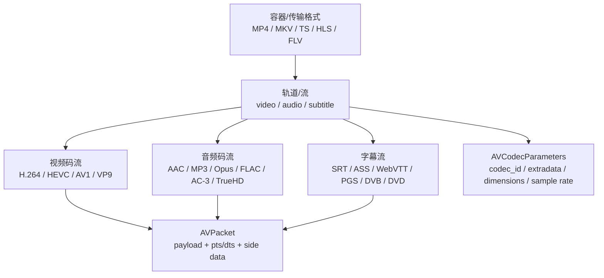

> [!IMPORTANT]
> 判断问题时要先问：这是容器层问题，还是具体音频/视频/字幕流的问题。`MP4 播不了 AAC` 可能是 `esds`/sample table 问题，也可能是 AAC AudioSpecificConfig 问题；`MKV 字幕不显示` 可能是 Track `CodecPrivate` 问题，也可能是播放器没有渲染 ASS 样式。

## 音频格式解析地图

音频格式常见关键数据是：采样率、声道布局、采样格式、frame size、profile、extradata、skip samples、编码延迟和 seek 预滚。

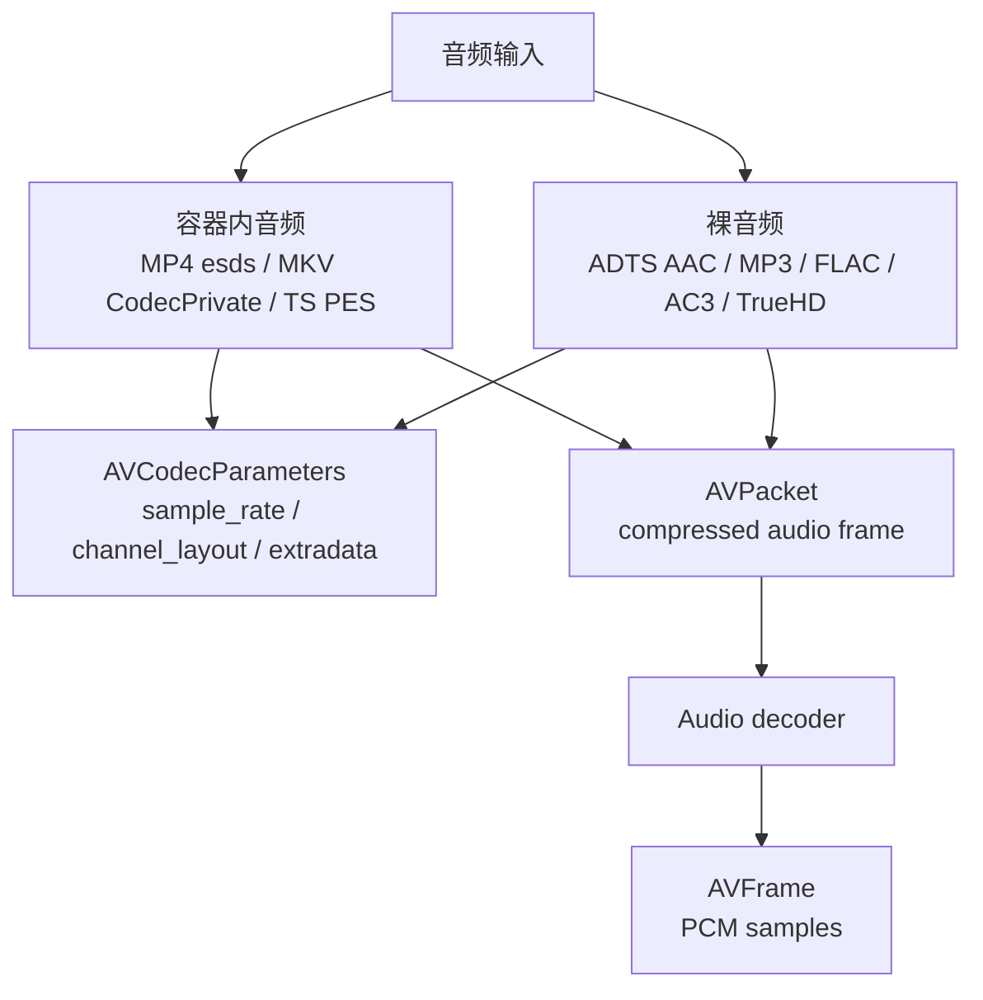

| 音频格式 | 关键数据在哪里 | FFmpeg 解析入口 | 进入哪里 | 常见风险 |
| --- | --- | --- | --- | --- |
| AAC in MP4 | `stsd` 下的 `esds` | `libavformat/mov.c:794` `mov_read_esds()`，`:7769` `esds -> mov_read_esds` | `codecpar->extradata` | extradata 缺失、profile/SBR/PS、采样率变化 |
| AAC ADTS | 每帧 ADTS header | `libavformat/aacdec.c:106` `adts_aac_read_header()`，`:168` `adts_aac_read_packet()` | packet + decoder 解析 ADTS | 裸流时间戳弱、ID3、错误同步 |
| AAC LATM | LATM AudioSpecificConfig | `libavcodec/aacdec.c:281` `latm_decode_audio_specific_config()`，`:481` `latm_decode_frame()` | decoder 私有状态 | 多 program/layer 弱支持，见 gaps |
| MP3 | MPEG audio frame header、Xing/Info/VBRI | `libavformat/mp3dec.c:318` `mp3_parse_vbr_tags()`，`:361` `mp3_read_header()`，`:445` `mp3_read_packet()` | stream duration/packet | VBR 时长估计、ID3、encoder delay |
| Opus in Ogg | `OpusHead`、Ogg granule position | `libavformat/oggparseopus.c:38` `opus_header()`，`libavformat/oggdec.c:725` `ogg_read_header()` | extradata、timebase | pre-skip、seek preroll、granule 时间 |
| Opus decoder | Opus packet TOC | `libavcodec/opusdec.c:477` `opus_decode_packet()`，`:770` `ff_opus_decoder` | PCM `AVFrame` | packet duration、pre-skip、重采样 |
| FLAC | STREAMINFO metadata block、frame header | `libavformat/flacdec.c:49` `flac_read_header()`，`libavcodec/flacdec.c:188` `parse_streaminfo()` | extradata、sample rate、channels | STREAMINFO 缺失、seek table、raw FLAC 探测 |
| AC-3/E-AC-3 | sync frame header，MP4 中 `dac3/dec3` | `libavformat/ac3dec.c:107` `ff_ac3_demuxer`，`libavformat/mov.c:799` `mov_read_dac3()`，`:833` `mov_read_dec3()` | codecpar + decoder | 透传 vs PCM、E-AC-3 substream、声道布局 |
| TrueHD/MLP | major sync、access unit，MP4 中 `dmlp` | `libavformat/mlpdec.c:58` `mlp_read_header()`，`libavcodec/mlpdec.c:1162` `read_access_unit()` | packet + decoder | TrueHD/Atmos substream、蓝光 AC3 core |

音频 decoder 入口示例：

- AAC：`libavcodec/aacdec.c:553` `ff_aac_decoder`
- MP3：`libavcodec/mpegaudiodec_fixed.c:98` `ff_mp3_decoder`
- FLAC：`libavcodec/flacdec.c:828` `ff_flac_decoder`
- Opus：`libavcodec/opusdec.c:770` `ff_opus_decoder`
- AC-3/E-AC-3：`libavcodec/ac3dec_float.c:63` `ff_ac3_decoder`，`:81` `ff_eac3_decoder`
- TrueHD/MLP：`libavcodec/mlpdec.c:1430` `ff_mlp_decoder`，`:1444` `ff_truehd_decoder`

> [!WARNING]
> 音频问题经常不是“解码器坏了”，而是采样率、声道布局、extradata、encoder delay、skip samples、重采样或透传策略不一致。尤其 AAC、Opus、AC-3/E-AC-3、TrueHD 需要区分“解码成 PCM”和“打包透传到 HDMI/SPDIF”。

## 视频格式解析地图

视频格式最关键的数据通常是参数集、序列头、颜色/HDR 元数据、帧边界、关键帧和时间戳。

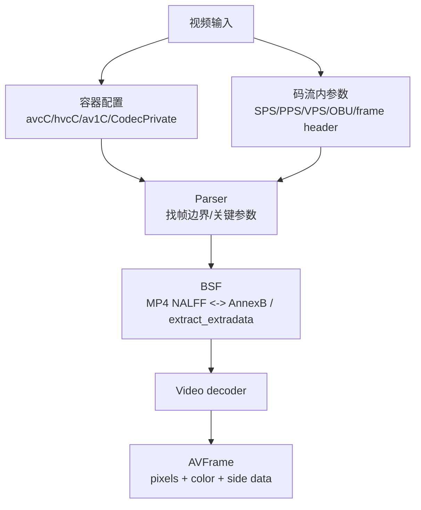

| 视频格式 | 关键数据在哪里 | FFmpeg 解析入口 | 进入哪里 | 常见风险 |
| --- | --- | --- | --- | --- |
| H.264 in MP4 | `avcC` 保存 SPS/PPS，packet 多为 length-prefixed NAL | `libavformat/mov.c:7743` `avcC -> mov_read_glbl`，`libavcodec/h264_parse.c:464` `ff_h264_decode_extradata()` | `codecpar->extradata`、decoder 参数集 | NALFF/AnnexB 混用、SPS/PPS 丢失 |
| H.264 AnnexB | 码流内 start code + SPS/PPS/SEI/slice | `libavcodec/h264_parser.c:589` `h264_parse()`，`:689` `ff_h264_parser` | packet 边界、decoder 参数集 | seek 后缺参数集、非关键帧起播 |
| HEVC in MP4 | `hvcC` 保存 VPS/SPS/PPS，packet 多为 length-prefixed NAL | `libavformat/mov.c:7780` `hvcC -> mov_read_glbl`，`libavcodec/hevc_parse.c:80` `ff_hevc_decode_extradata()` | `codecpar->extradata`、HEVCParamSets | hvcC 数组为空、DV RPU、profile 不匹配 |
| HEVC AnnexB | 码流内 VPS/SPS/PPS/SEI/slice | `libavcodec/hevc_parser.c:300` `hevc_parse()`，`:349` `ff_hevc_parser` | packet 边界、参数集 | 参数集稀疏、硬解 profile/bit depth 限制 |
| AV1 | sequence header OBU，MP4 中 `av1C` | `libavformat/mov.c:7714` `av1C -> mov_read_glbl`，`libavcodec/av1_parser.c:210` `ff_av1_parser` | extradata/OBU parser/decoder | OBU 边界、film grain、硬解支持差异 |
| VP9 | frame header，WebM/MKV 常见 | `libavcodec/vp9_parser.c:67` `ff_vp9_parser`，`libavcodec/vp9.c:510` `decode_frame_header()` | decoder 上下文 | profile/bit depth、alpha、颜色标签 |

常用视频 BSF：

- H.264 MP4 到 AnnexB：`libavcodec/h264_mp4toannexb_bsf.c:139` `h264_mp4toannexb_init()`，`:169` `h264_mp4toannexb_filter()`
- HEVC MP4 到 AnnexB：`libavcodec/hevc_mp4toannexb_bsf.c:98` `hevc_mp4toannexb_init()`，`:119` `hevc_mp4toannexb_filter()`
- 抽取 extradata：`libavcodec/extract_extradata_bsf.c:60` AV1，`:134` H.264/HEVC，`:425` `ff_extract_extradata_bsf`
- AV1 frame merge：`libavcodec/av1_frame_merge_bsf.c:159` `ff_av1_frame_merge_bsf`

> [!IMPORTANT]
> 视频格式排查要同时看三件事：容器里的 codec config、packet payload 的实际形态、decoder 当前参数集状态。只看其中一个，很容易把容器问题、BSF 问题和 decoder 问题混在一起。

## 字幕格式解析地图

字幕分两类：文本字幕和图形字幕。文本字幕最后通常会被转换成 ASS 样式文本交给渲染器；图形字幕则是位图、调色板、显示区域和时间控制。

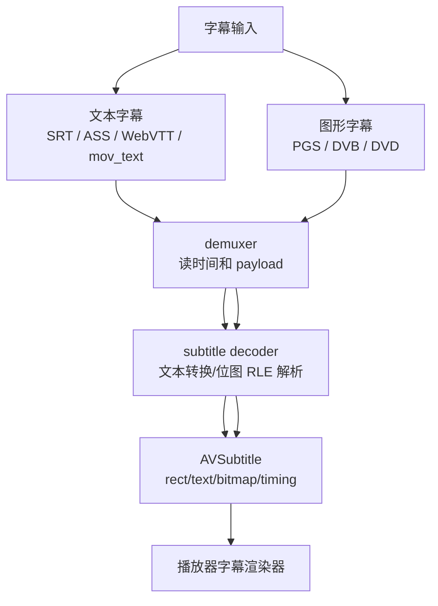

| 字幕格式 | 关键数据在哪里 | FFmpeg 解析入口 | 输出到哪里 | 常见风险 |
| --- | --- | --- | --- | --- |
| SRT/SubRip | 文本时间轴和内容 | `libavformat/srtdec.c:126` `srt_read_header()`，`libavcodec/srtdec.c:58` `srt_decode_frame()` | `AVSubtitle` 文本/ASS | 编码、换行、样式弱 |
| ASS/SSA | `[Script Info]`、`[V4+ Styles]`、`Dialogue` | `libavformat/assdec.c:103` `ass_read_header()`，`libavcodec/assdec.c:43` `ass_decode_frame()` | extradata + dialogue | 样式、字体、渲染器支持 |
| WebVTT | cue 时间和 cue text | `libavformat/webvttdec.c:60` `webvtt_read_header()`，`:171` `webvtt_read_packet()`，`libavcodec/webvttdec.c:83` `webvtt_decode_frame()` | `AVSubtitle` | cue settings、HTML-like markup、HLS 分片 |
| mov_text/tx3g | MP4 text sample + tx3g 样式 box | `libavcodec/movtextdec.c:446` `mov_text_init()`，`:475` `mov_text_decode_frame()` | ASS-like subtitle | 样式映射、字体、位置 |
| PGS | 蓝光 segment：palette/object/presentation/end | `libavcodec/pgssubdec.c:231` object，`:326` palette，`:388` presentation，`:591` decode | 位图字幕 | 调色板、合成窗口、forced subtitle |
| DVB subtitle | page/region/CLUT/object/display definition segment | `libavcodec/dvbsubdec.c:981` object，`:1045` CLUT，`:1142` region，`:1441` decode | 位图字幕 | segment 顺序、CLUT、透明度 |
| DVD subtitle | RLE bitmap + palette/extradata | `libavcodec/dvdsubdec.c:219` `decode_dvd_subtitles()`，`:622` `dvdsub_parse_extradata()` | 位图字幕 | IFO palette、裁剪框、透明色 |

> [!TIP]
> 字幕问题要分清“FFmpeg 是否解析出字幕事件/位图”和“播放器是否正确渲染”。ASS 字体、字号、描边、位置、PGS/DVB 位图缩放、forced subtitle 选择，往往是播放器层的问题。

## MP4/MOV：索引型容器

MP4 像一本带目录的书：`moov` 是目录，`mdat` 是正文。播放器要先读目录，才知道正文每一页在哪里。

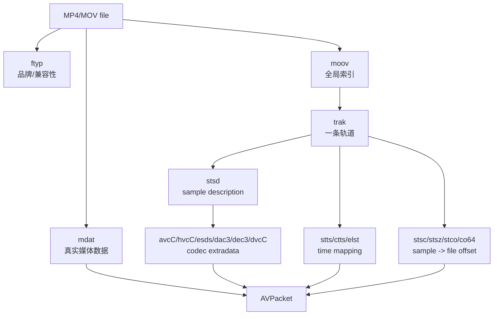

关键源码：

- `libavformat/mov.c:8448` `mov_read_header()` 打开 MP4/MOV
- `libavformat/mov.c:1170` `mov_read_moov()` 解析 `moov`
- `libavformat/mov.c:2646` `mov_read_stsd()` 解析 sample description
- `libavformat/mov.c:2981` `mov_read_stts()` 解析 decoding time
- `libavformat/mov.c:3141` `mov_read_ctts()` 解析 composition offset
- `libavformat/mov.c:5609` `mov_read_elst()` 解析 edit list
- `libavformat/mov.c:8773` `mov_read_packet()` 按 sample table 读 packet
- `libavformat/mov.c:8729` `mov_change_extradata()` 处理中途 extradata 变化

atom 分发表中的关键映射：

- `libavformat/mov.c:7738` `moov -> mov_read_moov`
- `libavformat/mov.c:7751` `stsd -> mov_read_stsd`
- `libavformat/mov.c:7754` `stts -> mov_read_stts`
- `libavformat/mov.c:7718` `ctts -> mov_read_ctts`
- `libavformat/mov.c:7723` `elst -> mov_read_elst`
- `libavformat/mov.c:7804` `dvcC -> mov_read_dvcc_dvvc`

### MP4 关键数据在哪里

| 数据 | 位置 | 进入 FFmpeg 后通常在哪里 |
| --- | --- | --- |
| codec id | `stsd` sample entry | `AVCodecParameters.codec_id` |
| H.264 SPS/PPS | `avcC` | `AVCodecParameters.extradata` |
| HEVC VPS/SPS/PPS | `hvcC` | `AVCodecParameters.extradata` |
| AAC config | `esds` | `AVCodecParameters.extradata` |
| Dolby Vision config | `dvcC/dvvC/dvwC` | `AV_PKT_DATA_DOVI_CONF` stream side data |
| DTS 时间 | `stts` | packet dts |
| PTS 偏移 | `ctts` | packet pts |
| 起播偏移 | `elst` | stream 时间修正 |
| 文件偏移 | `stsc/stsz/stco/co64` | `mov_read_packet()` 定位 sample |

> [!WARNING]
> MP4 里的 H.264/HEVC packet 通常不是 AnnexB start code 格式，而是 length-prefixed NAL。转 TS、RTP、裸流或部分硬件接口时，可能需要 `h264_mp4toannexb` / `hevc_mp4toannexb`。

## Matroska/MKV/WebM：EBML 树形容器

MKV 像一棵树：Tracks 里放轨道说明，Cluster 里放一段段媒体块。

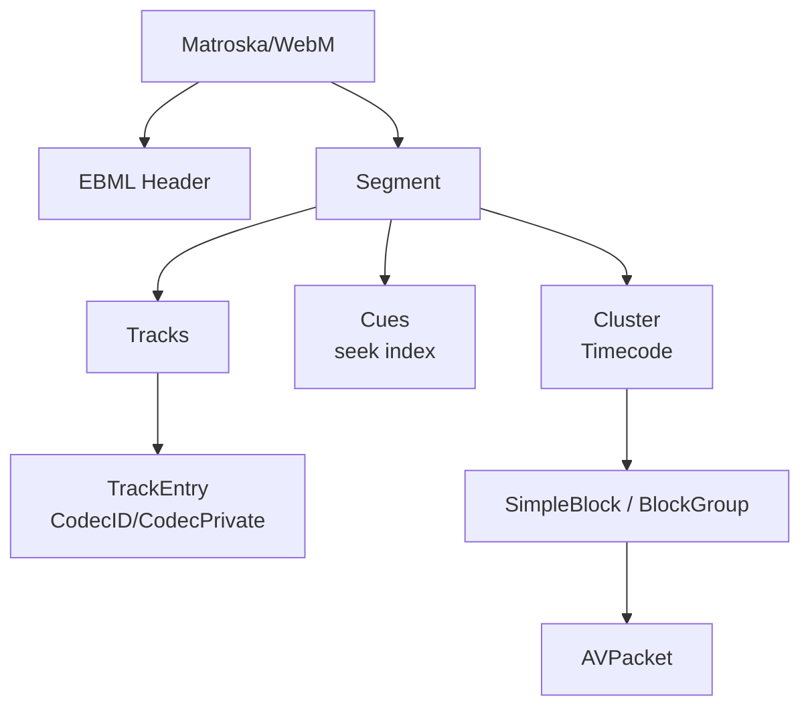

关键源码：

- `libavformat/matroskadec.c:1131` `ebml_parse()`
- `libavformat/matroskadec.c:2430` `matroska_parse_tracks()`
- `libavformat/matroskadec.c:3003` `matroska_read_header()`
- `libavformat/matroskadec.c:3583` `matroska_parse_frame()`
- `libavformat/matroskadec.c:3691` `matroska_parse_block()`
- `libavformat/matroskadec.c:3843` `matroska_parse_cluster()`
- `libavformat/matroskadec.c:3899` `matroska_read_packet()`

### MKV 关键数据在哪里

| 数据 | 位置 | 进入 FFmpeg 后通常在哪里 |
| --- | --- | --- |
| codec id | `TrackEntry.CodecID` | `AVCodecParameters.codec_id` |
| codec private | `TrackEntry.CodecPrivate` | `codecpar->extradata` |
| 轨道时间基 | `TimestampScale`、track timecode | `AVStream.time_base` |
| packet payload | `SimpleBlock` / `BlockGroup` | `AVPacket.data` |
| seek index | `Cues` | seek 使用 |
| HDR metadata | Matroska color elements | stream side data |

> [!TIP]
> MKV 常见问题不是“没有 packet”，而是 `CodecPrivate` 不规范、Block lacing 拆包、Cluster timecode、Cues 不完整。排查时要同时看 track 元数据和 block 时间戳。

## MPEG-TS/M2TS：传输流

TS 像一串 188 字节的小信封。每个信封有 PID，PAT 告诉你节目在哪里，PMT 告诉你每路音视频 PID，PES 里才是连续媒体数据。

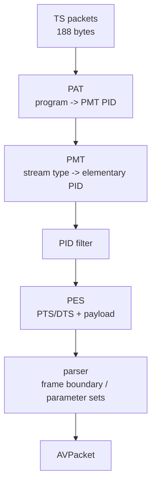

关键源码：

- `libavformat/mpegts.c:3099` `mpegts_read_header()`
- `libavformat/mpegts.c:3127` 打开 PAT filter
- `libavformat/mpegts.c:2531` `pat_cb()`
- `libavformat/mpegts.c:2311` `pmt_cb()`
- `libavformat/mpegts.c:2762` `handle_packet()`
- `libavformat/mpegts.c:2968` `handle_packets()`
- `libavformat/mpegts.c:1140` `mpegts_push_data()` 组 PES
- `libavformat/mpegts.c:3249` `mpegts_read_packet()`

### TS 关键数据在哪里

| 数据 | 位置 | 进入 FFmpeg 后通常在哪里 |
| --- | --- | --- |
| 节目列表 | PAT | program/PMT filter |
| 音视频 PID | PMT | stream 创建和 PID filter |
| codec 类型 | PMT stream_type / descriptor | `AVCodecParameters.codec_id` |
| 时间戳 | PES PTS/DTS，PCR | packet pts/dts，时钟估计 |
| H.264/HEVC 参数集 | AnnexB 码流内 | parser/decoder 参数集 |
| Dolby Vision config | TS descriptor | `AV_PKT_DATA_DOVI_CONF` side data |

> [!WARNING]
> TS/M2TS 更像直播传输，不保证你从任意位置开始都有完整参数集。seek 或切片后缺 SPS/PPS/VPS、PAT/PMT 更新、PCR 抖动、丢包都会影响播放。

## HLS：playlist + segment

HLS 不是单个媒体文件，而是“播放清单 + 很多小媒体文件”。FFmpeg 的 HLS demuxer 会解析 m3u8，再为 segment 打开内部 demuxer。

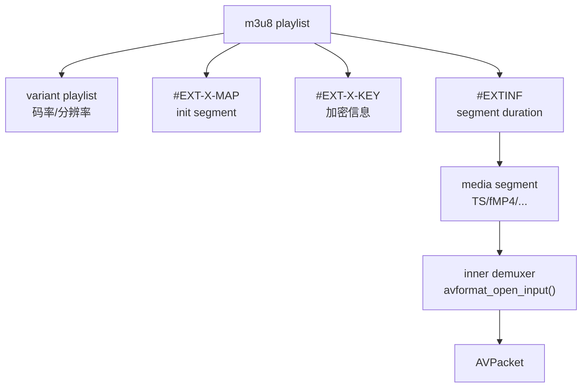

关键源码：

- `libavformat/hls.c:727` `parse_playlist()`
- `libavformat/hls.c:808` 解析 `#EXT-X-KEY`
- `libavformat/hls.c:859` 解析 `#EXT-X-MAP`
- `libavformat/hls.c:915` 解析 `#EXTINF`
- `libavformat/hls.c:1276` `open_input()` 打开 segment
- `libavformat/hls.c:1469` `read_data()` 读取当前 segment
- `libavformat/hls.c:1725` `select_cur_seq_no()` 选择直播起点
- `libavformat/hls.c:1932` `hls_read_header()`
- `libavformat/hls.c:2292` `hls_read_packet()`
- `libavformat/hls.c:2437` `hls_read_seek()`

### HLS 关键数据在哪里

| 数据 | 位置 | 进入 FFmpeg 后通常在哪里 |
| --- | --- | --- |
| 码率/清晰度 | master playlist variant | variant/playlist 结构 |
| segment 时长 | `#EXTINF` | segment duration |
| init segment | `#EXT-X-MAP` | fMP4 初始化信息 |
| 加密信息 | `#EXT-X-KEY` | segment 打开/解密流程 |
| 媒体 payload | segment 文件 | 内部 demuxer 的 packet |
| live 起点 | playlist + live_start_index | `select_cur_seq_no()` |

> [!WARNING]
> HLS 的复杂性不只在 FFmpeg。ABR 策略、live edge、弱网重试、buffer 水位、码率切换、过期 segment、DRM 许可证通常在播放器或业务层。

## FLV：tag 流

FLV 像一串带类型的 tag。metadata tag 里可能有 `onMetaData`，音视频 tag 里可能有 sequence header。

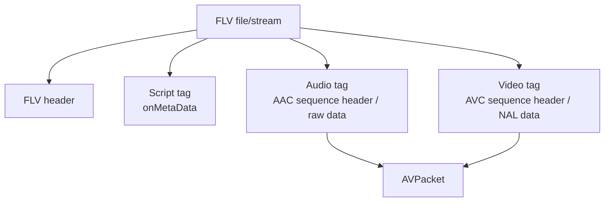

关键源码：

- `libavformat/flvdec.c:503` `amf_parse_object()`
- `libavformat/flvdec.c:708` `flv_read_metabody()`
- `libavformat/flvdec.c:765` `flv_read_header()`
- `libavformat/flvdec.c:1015` `flv_read_packet()`
- `libavformat/flvdec.c:1306` 添加 `AV_PKT_DATA_NEW_EXTRADATA`

### FLV 关键数据在哪里

| 数据 | 位置 | 进入 FFmpeg 后通常在哪里 |
| --- | --- | --- |
| metadata | script tag `onMetaData` | metadata/stream hints |
| AAC AudioSpecificConfig | AAC sequence header | `extradata` 或 new extradata |
| H.264 avcC | AVC sequence header | `extradata` 或 new extradata |
| 时间戳 | tag timestamp | packet pts/dts |
| payload | audio/video tag body | `AVPacket.data` |

## Raw elementary stream

裸流没有容器帮你保存目录。FFmpeg 只能靠 probe、parser 和码流内部参数。

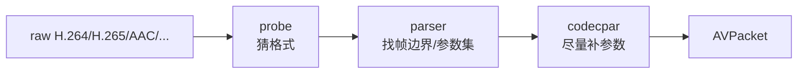

风险：

- 没有可靠 duration。
- 没有容器时间戳。
- 起始位置如果没有参数集，decoder 可能失败。
- H.264/HEVC 需要 parser 找 frame boundary。
- AAC ADTS 可以自带部分音频参数，但不等于所有场景都完整。

## 排查格式解析问题的最小清单

1. 先用 `ffprobe -show_streams -show_format -show_packets -show_data` 看 stream、packet 和 extradata。
2. 分清容器格式和 codec 格式：MP4 里的 H.264 不等于 AnnexB。
3. 看关键数据是在 header、packet、side data，还是 bitstream 内部。
4. 看 `AVCodecParameters.extradata` 是否存在。
5. 看 packet 是否从关键帧开始。
6. 看 `AV_PKT_DATA_NEW_EXTRADATA` 是否出现。
7. 看 time_base、pts、dts 是否单调且符合预期。
8. 对 HLS/DASH，看 representation 切换是否改变 codecpar/extradata/timebase。
