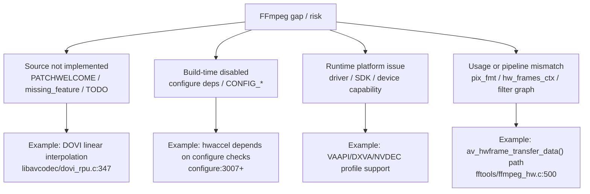

# Gaps And Incomplete Areas

这份清单只基于当前源码快照中的显式代码路径、`AVERROR_PATCHWELCOME`、`avpriv_request_sample()`、注释和架构边界整理，不等同于 FFmpeg 全社区最新版状态。

下面的图把“缺陷”拆成四类。后续记录问题时必须先归类，否则容易把编译选项、驱动限制和源码未实现混在一起。

## Dolby Vision

- 只解析和传递 DOVI 元数据，不执行完整 Dolby Vision 渲染/重塑输出。关键证据是 `libavcodec/dovi_rpu.c` 只生成 `AV_FRAME_DATA_DOVI_METADATA`，没有把 mapping/color metadata 应用到像素。
- `libavcodec/dovi_rpu.c:215` 非 RPU type 2 被忽略。
- `libavcodec/dovi_rpu.c:347` linear interpolation 缺少文档/样本，返回 `AVERROR_PATCHWELCOME`。
- `libavcodec/dovi_rpu.c:447` RPU CRC32 未校验。
- `libavcodec/hevcdec.c:3198` 一个 AU 多个 RPU 时只保留后者。
- 双层 Dolby Vision 的 EL/BL 合成不是这里的完整能力；`mpegts.c` 能记录 `el_present_flag`/`bl_present_flag`，但解码链路主要处理 HEVC RPU 元数据。

## 硬件加速

- 硬解能力由编译配置、驱动、平台 SDK 和运行时设备共同决定。`configure:3007` 起定义各 hwaccel 依赖，启用宏不代表用户机器可运行。
- `fftools/ffmpeg_filter.c:928` 有 TODO：自动插入硬件加速 filter，例如 `transpose_vaapi`，未完成。
- D3D11VA 有旧 ad-hoc 和新 device/frames ctx 两种模式，调用方如果没有正确处理 `hw_frames_ctx`，很容易在 filter/下载帧时失败。
- `fftools/ffmpeg_hw.c:500` 需要软件输出时走 `av_hwframe_transfer_data()`，不是所有硬件格式/方向都支持无损或高效下载。
- `libavcodec/options_table.h:397` `unsafe_output` 说明部分 hwaccel 输出可能需要特殊处理，默认不应假设任意后续 filter 都能消费。
- `libavcodec/pthread_frame.c:600` 非 `HWACCEL_CAP_ASYNC_SAFE` 的 hwaccel 会影响 frame threading。

## 音频格式和场景

源码中有多处音频未完善路径：

- `libavcodec/aacdec.c:367` AAC LATM multiple programs 返回 `AVERROR_PATCHWELCOME`。
- `libavcodec/aacdec.c:375` AAC LATM multiple layers 返回 `AVERROR_PATCHWELCOME`。
- `libavcodec/aacdec_template.c:853` SBR with 960 frame length 缺失。
- `libavcodec/aacdec_template.c:2099` AAC gain control 缺失。
- `libavcodec/ac3dec.c:1008` enhanced coupling 未实现。
- `libavcodec/ac3dec.c:1562` AC-3/E-AC-3 substreams 支持不完整，代码会跳过 unsupported substream。
- `libavcodec/mlpdec.c:395` TrueHD 只解码 3 个 substreams，第 4 个用于 Dolby Atmos 非音频数据。

## 容器/封装边界

源码中大量 demuxer/muxer 对少见变体返回 `AVERROR_PATCHWELCOME`。这类不是核心架构缺陷，但对兼容性评估很重要：

- `libavformat/avienc.c:369` AVI 中非 DivX XSUB 的字幕流缺失。
- `libavformat/cafdec.c:221` CAF multichannel Opus 缺失。
- `libavformat/cafenc.c:128` CAF muxing 某些 codec unsupported。
- `libavformat/flacenc.c:225` FLAC muxer GIF image support 未实现。
- `libavformat/s337m.c:77` SMPTE 337M Dolby E data size 场景报告 missing feature。

## 编码器能力边界

- 硬编码器通常只支持有限输入像素格式。入口在各 encoder 的 `.p.pix_fmts`，例如 NVENC `libavcodec/nvenc.c:55`、QSV `libavcodec/qsvenc_*.c`、VAAPI `libavcodec/vaapi_encode_*.c`。
- `libavcodec/encode.c:547` 会校验输入 `pix_fmt` 是否在 codec 支持列表；格式不匹配需要显式 filter/scale/hwupload。
- Dolby Vision metadata 的转码保留依赖具体 muxer/encoder/bitstream 路径，不能默认认为“解码后再编码”会完整保留 DV 动态元数据。

## 维护建议

后续补充缺陷文档时，建议按下面规则记录：

- 必须写清楚 FFmpeg commit。
- 优先引用源码中的 `AVERROR_PATCHWELCOME`、`avpriv_request_sample()`、`avpriv_report_missing_feature()`、明确 TODO/FIXME。
- 区分“源码未实现”、“编译未启用”、“运行机器硬件/驱动不支持”和“命令行用法不正确”。
- 对硬解缺陷必须记录后端、codec、profile、pixel format、输入容器、命令行和错误日志。
