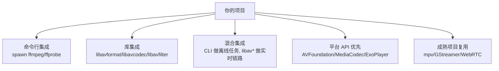
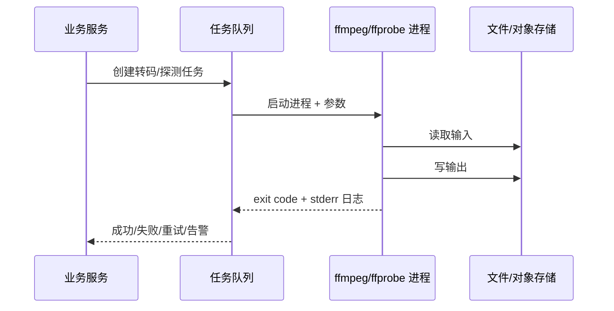
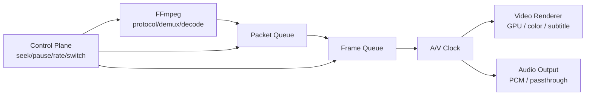
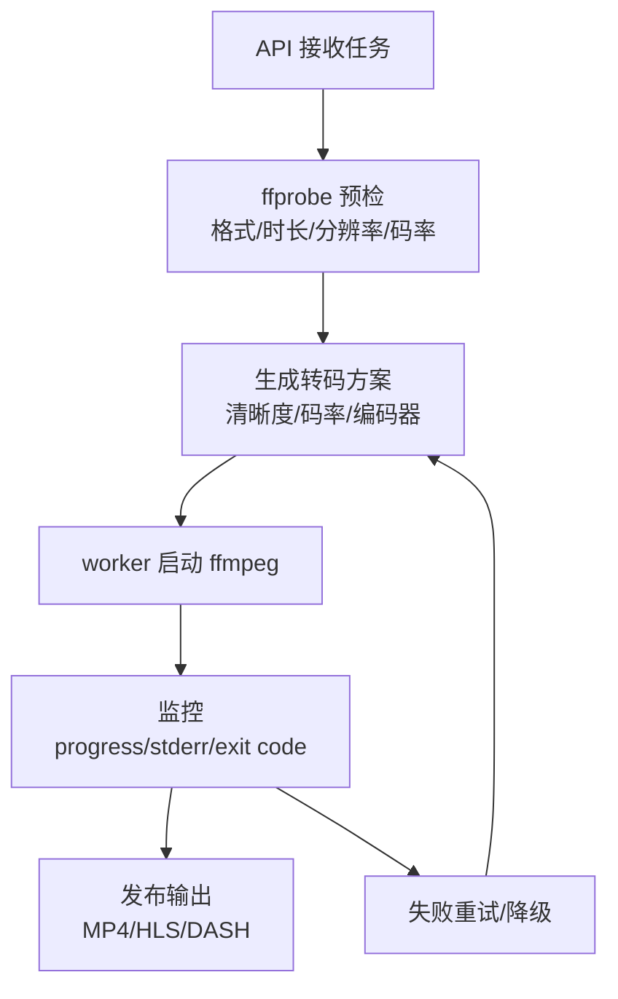

# FFmpeg 集成方式

源码快照：

- 本机路径：`D:/github/FFmpeg`
- Git describe：`n6.0.1-24-gdc02ba2637-dirty`
- Commit：`dc02ba263755b981b809ad2708b77c82586669d9`
- 文档日期：2026-06-30

这篇文档回答：在真实项目里，应该用 FFmpeg 命令行，还是直接集成 `libav*`，播放器、服务端、移动端分别怎么接。

## 集成方式总览

| 方式 | 优点 | 缺点 | 适合场景 |
| --- | --- | --- | --- |
| 命令行 | 快、稳定、隔离进程、易升级 | 进程调度、日志解析、实时控制弱 | 服务端转码、质检、批处理 |
| `libav*` | 控制力强、低延迟、可嵌入 | API 复杂、内存/线程/错误处理成本高 | 播放器、SDK、实时处理 |
| 混合 | 工程成本和控制力平衡 | 架构要清楚边界 | 中大型媒体系统 |
| 平台 API | 最符合移动/系统生态 | 格式覆盖不如 FFmpeg | 移动端/DRM/系统播放器 |
| 复用 mpv/GStreamer/WebRTC | 产品能力更完整 | 学习成本、定制边界 | 播放器、pipeline、RTC |

## 命令行集成

命令行集成像“请一个外包师傅处理一单任务”：你给输入、参数和输出路径，它在独立进程里完成。

适合：

- 服务端转码。
- 媒体探测。
- 抽帧截图。
- 离线音频处理。
- HLS/DASH 切片。

工程重点：

- 参数必须模板化，不要直接拼用户输入。
- 进程要有超时、CPU/GPU 限制、日志截断、退出码处理。
- 输出文件要先写临时路径，成功后原子发布。
- 任务要有幂等 key，避免重复转码覆盖。
- GPU 任务要调度设备和并发数。

## `libav*` 库集成

库集成像“把整套厨房搬进自己店里”：控制力强，但所有安全、内存、线程、异常都要自己负责。

典型解码链路：

源码入口：

- `libavformat/demux.c:221` `avformat_open_input()`
- `libavformat/demux.c:2425` `avformat_find_stream_info()`
- `libavformat/demux.c:1439` `av_read_frame()`
- `libavcodec/decode.c:598` `avcodec_send_packet()`
- `libavcodec/avcodec.c:709` `avcodec_receive_frame()`

库集成必须管理这些合同：

| 合同 | 为什么重要 |
| --- | --- |
| `AVStream.time_base` | packet 时间戳解释依赖它 |
| `AVCodecParameters.extradata` | H.264/HEVC/AAC 等 decoder 初始化依赖它 |
| `AVPacket.pts/dts/duration/flags` | 同步、seek、关键帧判断依赖它 |
| `AVPacket.side_data` | 新 extradata、HDR、DOVI 等可能在这里 |
| `AVFrame.format/hw_frames_ctx` | CPU/GPU frame、filter/renderer 是否能消费依赖它 |
| `AVFrame` side data | HDR/DV/skip samples 等元数据可能在这里 |

> [!IMPORTANT]
> 库集成的第一原则：不要只传 payload。必须保持 stream 参数、extradata、packet 时间戳、side data、decoder context、frame 属性的一致性。

## 播放器集成

播放器集成不能把 FFmpeg 当完整播放器。FFmpeg 通常负责左半边，播放器负责右半边。

播放器自己必须做：

- packet queue 和 frame queue。
- seek 后 flush、丢帧、等待关键帧。
- 音画同步和主时钟选择。
- 渲染时钟和 vsync。
- 音频设备打开、重采样、透传。
- 字幕、旋转、色彩、HDR/DV、截图。
- 弱网、缓冲、低延迟、暂停/恢复。
- 硬解失败 fallback。

FFmpeg 能提供：

- 解封装、解码、filter、基础时间戳。
- ffplay 参考逻辑。
- side data 和 codec metadata。

## 服务端转码集成

服务端更适合命令行或混合方式。

生产级要求：

- 任务幂等。
- 输入输出隔离。
- 进程级超时。
- GPU/CPU 队列隔离。
- 转码参数白名单。
- stderr 结构化解析。
- 失败样本保留。
- 质量检测，如时长、帧数、黑屏、静音、首帧。

## 移动端集成

移动端要特别谨慎。不要因为 FFmpeg 格式多，就默认替代系统播放器。

| 使用目标 | 推荐方式 |
| --- | --- |
| 常规播放 | Android 用 ExoPlayer/Media3，iOS 用 AVFoundation |
| 特殊格式播放 | 系统播放器优先，FFmpeg 做 demux/软解兜底 |
| 后台转码/裁剪 | FFmpeg 可以作为处理引擎 |
| DRM 播放 | 优先系统播放器/商业 SDK |
| 低功耗长时间播放 | 优先系统硬解硬渲染链路 |
| 特殊音频格式 | FFmpeg 解码后交给平台音频输出 |

移动端风险：

- 包体积。
- license 和外部库。
- CPU 软解发热。
- iOS 后台限制。
- Android 厂商 MediaCodec 差异。
- 平台权限和文件访问。
- 多 ABI 编译和符号裁剪。

## 低延迟和直播集成

FFmpeg 能处理 RTMP、HLS、RTSP、SRT、UDP 等，但低延迟不是一个参数能解决。

> [!WARNING]
> `-fflags nobuffer`、`-flags low_delay` 只能减少部分 FFmpeg 输入侧等待。端到端低延迟还取决于协议、GOP、B 帧、网络 jitter、播放器缓冲和渲染调度。

## 集成决策清单

1. 这是离线任务还是实时链路。
2. 能否接受独立进程。
3. 是否需要精细控制 packet/frame。
4. 是否需要平台硬解/DRM/系统播放器。
5. 是否需要低延迟。
6. 是否需要跨平台一致行为。
7. 是否能承担 FFmpeg 编译、升级、安全修复和 license 管理。
8. 是否有日志和样本保留能力。
