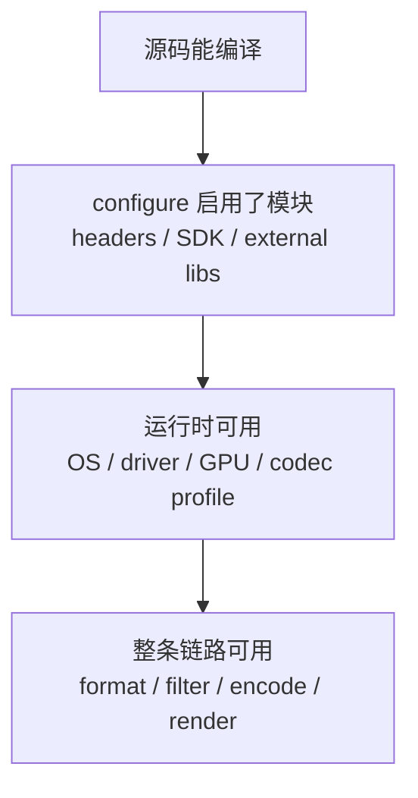
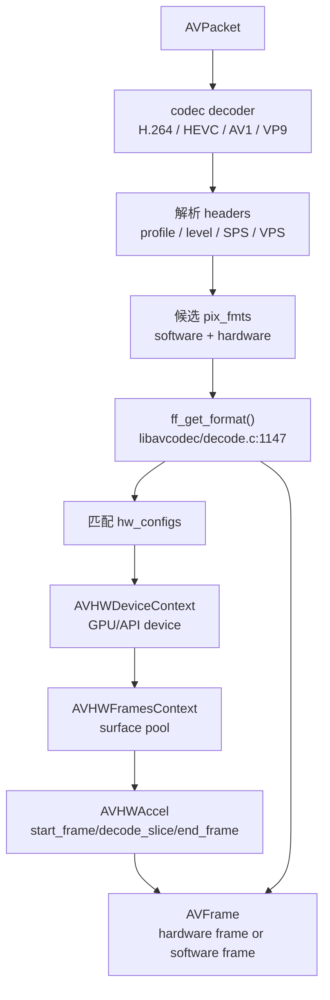
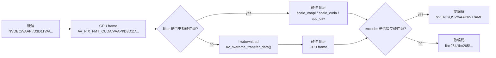

# 平台与硬件加速矩阵

源码快照：

- 本机路径：`D:/github/FFmpeg`
- Git describe：`n6.0.1-24-gdc02ba2637-dirty`
- Commit：`dc02ba263755b981b809ad2708b77c82586669d9`
- 文档日期：2026-06-30

这篇文档回答：FFmpeg 能在哪些平台用，硬解/硬编到底怎么接入，为什么“编译支持”和“运行可用”不是一回事。

## 三层判断模型

平台支持必须分三层看。



> [!IMPORTANT]
> `ffmpeg -hwaccels` 看到某个后端，不代表某个具体视频一定能硬解。真实可用性还要看 codec、profile、level、bit depth、chroma、分辨率、驱动、输出像素格式、filter/encoder 是否接受硬件帧。

源码入口：

- 列出硬件类型：`fftools/ffmpeg_opt.c:154` `show_hwaccels()`
- CLI 选项：`fftools/ffmpeg_opt.c:1646` `-hwaccel`，`:1649` `-hwaccel_device`，`:1652` `-hwaccel_output_format`
- 设备 API：`libavutil/hwcontext.h:27` `AVHWDeviceType`
- 创建设备：`libavutil/hwcontext.c:615` `av_hwdevice_ctx_create()`
- 创建帧池：`libavutil/hwcontext.c:248` `av_hwframe_ctx_alloc()`
- 硬件帧下载/上传：`libavutil/hwcontext.c:448` `av_hwframe_transfer_data()`

## 平台矩阵

| 平台 | 常见后端 | 适合场景 | 主要风险 |
| --- | --- | --- | --- |
| Windows | D3D11VA、DXVA2、NVDEC、QSV、AMF、MediaFoundation | 桌面播放器、转码、采集处理 | 驱动差异、D3D11VA/DXVA2 路径差异、GPU 编码能力限制 |
| Linux | VAAPI、VDPAU、NVDEC、QSV、V4L2 M2M | 服务端转码、嵌入式、桌面播放器 | Mesa/驱动/内核/容器权限、设备节点、profile 支持 |
| macOS | VideoToolbox | 桌面播放、硬编硬解 | 系统版本和硬件限制，色彩/HDR 还要看渲染链 |
| iOS | VideoToolbox | 移动端硬解硬编 | 沙盒、App Store、系统播放器取舍、硬件能力固定 |
| Android | MediaCodec | 移动端播放、部分编码 | 厂商实现差异、Surface 输出、颜色格式、后台生命周期 |
| 服务端 GPU | NVDEC/NVENC、QSV、VAAPI | 批量转码、直播转码 | GPU session、显存、队列、fallback、驱动升级 |

## 硬解不是一条独立捷径

这张图解释硬解在 FFmpeg 里如何被选中。它不是完全绕开 decoder，而是 decoder 在解析头信息后，选择硬件像素格式和硬件后端。



源码入口：

- H.264 硬解配置：`libavcodec/h264dec.c:1075` `ff_h264_decoder.hw_configs`
- HEVC 硬解配置：`libavcodec/hevcdec.c:3724` `ff_hevc_decoder.hw_configs`
- AV1 硬解配置：`libavcodec/av1dec.c:1264` `ff_av1_decoder.hw_configs`
- VP9 硬解配置：`libavcodec/vp9.c:1890` `ff_vp9_decoder.hw_configs`
- 自动匹配设备：`libavcodec/decode.c:977` 调用 `avcodec_get_hw_config()`
- 创建 decode 侧 frames ctx：`libavcodec/decode.c:999` `ff_decode_get_hw_frames_ctx()`

## 硬解、硬滤镜、硬编码的三段链路

很多性能问题来自“只硬解了一段，中间又下载到 CPU”。



> [!WARNING]
> `-hwaccel` 只说明解码侧可能走硬件。后续 filter、scale、tonemap、encoder 如果不接受硬件帧，就会触发 `hwdownload` 或失败。性能优化要看整条链路，不要只看解码。

CLI 相关入口：

- `fftools/ffmpeg_demux.c:643` 读取每路输入的 `hwaccel`
- `fftools/ffmpeg_demux.c:647` `cuvid` 默认 `hwaccel_output_format=cuda`
- `fftools/ffmpeg_demux.c:653` `qsv` 默认 `hwaccel_output_format=qsv`
- `fftools/ffmpeg_demux.c:659` `mediacodec` 默认 `hwaccel_output_format=mediacodec`
- `fftools/ffmpeg_demux.c:674` 把 `nvdec`/`cuvid` 映射成 `cuda` 设备
- `fftools/ffmpeg_hw.c:500` `hwaccel_retrieve_data()` 调用 `av_hwframe_transfer_data()`

## 主要后端判断

| 后端 | 常见平台 | 解码形态 | 编码形态 | 判断重点 |
| --- | --- | --- | --- | --- |
| D3D11VA | Windows | `AVHWAccel` | 通常配合其他 encoder | 推荐新 Windows 播放链路优先看 D3D11 |
| DXVA2 | Windows | `AVHWAccel` | 不是主流编码接口 | 老路径，兼容性仍有价值 |
| NVDEC/CUDA | Windows/Linux | `AVHWAccel` + CUDA device | NVENC | 强转码场景常用，注意 driver/session/显存 |
| VAAPI | Linux | `AVHWAccel` | VAAPI encoder | Intel/AMD/Linux 常见，注意驱动和 DRM 权限 |
| QSV | Windows/Linux | wrapper 路径较多 | QSV encoder | Intel Media SDK/oneVPL 相关，frames ctx 重要 |
| VideoToolbox | macOS/iOS | 系统硬解 | 系统硬编 | Apple 平台首选系统路径 |
| MediaCodec | Android | wrapper/平台解码 | MediaCodec encoder | 厂商实现差异大，Surface/颜色格式要验证 |
| VDPAU | Linux | `AVHWAccel` | 较少作为编码方案 | 较老但仍存在于一些环境 |
| AMF | Windows/Linux AMD | 编码为主 | AMF encoder | AMD 硬编 |

源码入口示例：

- NVENC：`libavcodec/nvenc.c:77` `ff_nvenc_hw_configs`
- AMF：`libavcodec/amfenc.c:781` `ff_amfenc_hw_configs`
- VAAPI 编码：`libavcodec/vaapi_encode.c:34` `ff_vaapi_encode_hw_configs`
- QSV 编码：`libavcodec/qsvenc.c:2598` `ff_qsv_enc_hw_configs`
- H.264 NVENC：`libavcodec/nvenc_h264.c:234` `ff_h264_nvenc_encoder`
- H.264 VAAPI：`libavcodec/vaapi_encode_h264.c:1359` `ff_h264_vaapi_encoder`
- H.264 VideoToolbox：`libavcodec/videotoolboxenc.c:2763` `ff_h264_videotoolbox_encoder`

## 硬件能力发现清单

排查硬解/硬编时，建议按这个顺序：

1. `ffmpeg -hwaccels` 看 FFmpeg 构建是否暴露后端。
2. `ffmpeg -decoders | findstr /i h264` 或 `grep` 看 decoder 是否存在。
3. `ffmpeg -encoders` 看硬编码器是否启用。
4. 用最小命令验证目标文件的目标 codec/profile。
5. 打开 debug 日志，看选择了什么 pixel format。
6. 看是否出现 `av_hwframe_transfer_data()`，判断是否下载到 CPU。
7. 如果失败，先切软解验证文件本身是否正常。

示例命令：

```bash
ffmpeg -hide_banner -hwaccels
ffmpeg -hide_banner -decoders | grep -E "h264|hevc|av1|vp9"
ffmpeg -hide_banner -encoders | grep -E "nvenc|qsv|vaapi|videotoolbox|amf|mediacodec"
ffmpeg -loglevel verbose -hwaccel auto -i input.mp4 -f null -
```

## 常见误区

| 误区 | 正确理解 |
| --- | --- |
| 支持 CUDA 就能所有视频硬解 | CUDA/NVDEC 还要看 codec、profile、driver、GPU 型号 |
| 硬解一定更快 | 如果后面频繁 `hwdownload`，可能比软解更慢 |
| 硬解成功等于渲染正确 | 色彩、HDR、DV、range、matrix 还要渲染侧处理 |
| `-hwaccel auto` 是最佳方案 | 自动选择不一定符合你的 filter/encoder 链路 |
| 服务端只要加 GPU 就能无限转码 | GPU 编码 session、显存、PCIe、队列、散热都会成为瓶颈 |
| 硬件输出格式随便转 | 不同后端支持的 `sw_format` 和 map/transfer 方向有限制 |

> [!TIP]
> 生产系统不要只保存“是否硬解成功”。建议记录：hwaccel 类型、输出 pix_fmt、codec/profile/level、width/height、bit depth、是否发生 hwdownload、encoder 名称、每段耗时、fallback 原因。

