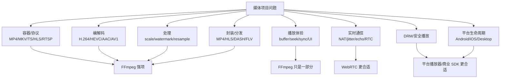
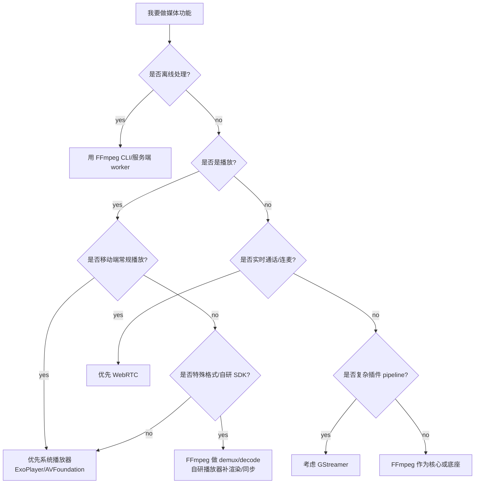

# FFmpeg 方案决策指南

源码快照：

- 本机路径：`D:/github/FFmpeg`
- Git describe：`n6.0.1-24-gdc02ba2637-dirty`
- Commit：`dc02ba263755b981b809ad2708b77c82586669d9`
- 文档日期：2026-06-30

这篇文档回答：什么时候用 FFmpeg，什么时候不要用，什么时候应该选择系统 API、GStreamer、mpv、WebRTC 或商业 SDK。

## 先判断问题属于哪一层

## 方案选择表

| 场景 | 首选方案 | FFmpeg 角色 | 不推荐原因/注意点 |
| --- | --- | --- | --- |
| 服务端离线转码 | FFmpeg | 核心处理引擎 | 需要补任务系统、资源调度、质检 |
| 媒体探测/抽帧 | FFmpeg | 核心工具 | 注意安全隔离和超时 |
| HLS/DASH 切片 | FFmpeg | 封装/切片工具 | ABR 策略和 CDN 不由 FFmpeg 完整负责 |
| 桌面播放器 | FFmpeg + 渲染框架 | demux/decode/filter | 同步、渲染、字幕、UI 要自己做 |
| 高质量视频渲染 | mpv/libplacebo | FFmpeg 负责输入解码 | 色彩/HDR/tone map 更适合交给渲染库 |
| Android 常规播放 | ExoPlayer/Media3 | 特殊格式兜底 | 系统硬解、DRM、生命周期更完整 |
| iOS 常规播放 | AVFoundation | 特殊格式/离线处理 | 系统链路更省电、更合规 |
| 实时音视频通话 | WebRTC | 文件处理或录制辅助 | NAT、jitter、AEC、拥塞控制不是 FFmpeg 强项 |
| 插件化媒体 pipeline | GStreamer | 可作为元素或替代解码库 | GStreamer pipeline/插件模型更强 |
| 商业 DRM 播放 | 平台播放器/商业 SDK | 非 DRM 内容处理 | 安全解密和可信输出不在 FFmpeg 普通链路 |

## FFmpeg 与常见替代方案

### FFmpeg vs 系统播放器

| 维度 | FFmpeg | 系统播放器 |
| --- | --- | --- |
| 格式覆盖 | 强 | 受系统限制 |
| DRM | 弱 | 强 |
| 省电 | 不一定 | 通常更好 |
| 平台生命周期 | 需要自己处理 | 系统负责较多 |
| 可控性 | 很强 | 受 API 限制 |
| 特殊格式 | 强 | 弱 |

结论：

- 常规移动播放优先系统播放器。
- 特殊格式、工具型处理、离线转码用 FFmpeg。
- 商业 DRM 优先系统播放器或专用 SDK。

### FFmpeg vs GStreamer

| 维度 | FFmpeg | GStreamer |
| --- | --- | --- |
| 命令行转码 | 非常强 | 可以但不是最常见选择 |
| 库 API | 低层、直接 | pipeline 和插件化更强 |
| 动态管线 | 需要自己组织 | 天然适合 |
| 嵌入式采集链 | 可用 | 常见且灵活 |
| 学习曲线 | API 多但直观 | pipeline 概念更重 |

结论：

- “一个输入转一个输出”的处理，FFmpeg 更直接。
- “复杂设备、插件、动态 pipeline”，GStreamer 往往更适合。

### FFmpeg vs WebRTC

| 维度 | FFmpeg | WebRTC |
| --- | --- | --- |
| 文件/流处理 | 强 | 不是核心目标 |
| 实时通话 | 弱 | 强 |
| NAT 穿透 | 不是核心 | 核心能力 |
| 拥塞控制 | 不完整 | 核心能力 |
| 回声消除/音频处理 | 有基础处理 | RTC 场景更完整 |

结论：

- 直播转码、录制、文件处理用 FFmpeg。
- 音视频通话、互动连麦、实时会议优先 WebRTC。

### FFmpeg vs mpv/libplacebo

| 维度 | FFmpeg | mpv/libplacebo |
| --- | --- | --- |
| 解封装/解码 | 强 | mpv 依赖 FFmpeg |
| 播放器体验 | 不完整 | mpv 更完整 |
| GPU 渲染 | 不是核心 | libplacebo 很强 |
| HDR/tone map | 有基础 filter | libplacebo 更适合高质量渲染 |

结论：

- 自研播放器如果重视渲染质量，可以参考 mpv/libplacebo，而不是只用 FFmpeg。

## 决策树

## 修改 FFmpeg 源码是否合适

| 问题 | 适合改 FFmpeg 吗 | 更常见处理 |
| --- | --- | --- |
| 某容器解析错误 | 适合 | 改 demuxer/muxer |
| 某 codec 码流解析错误 | 适合 | 改 parser/decoder/BSF |
| timestamp 计算错误 | 适合，但要小心 | 改 demuxer 或时间戳逻辑 |
| 某硬件 profile 判断错误 | 适合 | 改 hwaccel 后端能力判断 |
| 起播策略不符合业务 | 通常不适合 | 应用层缓冲/预取/播放器策略 |
| ABR 选择策略 | 通常不适合 | 播放器/业务层 |
| DRM 授权失败 | 通常不适合 | 平台 DRM/业务服务 |
| Dolby Vision 最终显示偏色 | 多数在渲染侧 | 消费 DOVI metadata 或做预处理 |
| 移动端后台播放异常 | 不适合 | 平台生命周期处理 |

> [!TIP]
> 判断是否该改 FFmpeg 的方法：如果问题发生在“媒体数据如何被解析、解码、编码、封装”，可以考虑改 FFmpeg；如果问题发生在“业务策略、播放体验、平台生命周期、权限、安全、渲染呈现”，通常在 FFmpeg 外处理。

