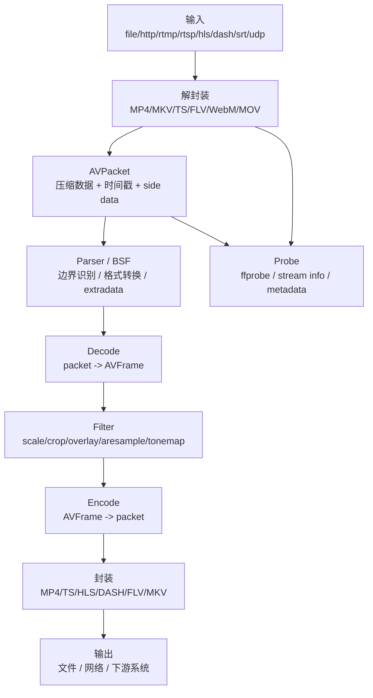
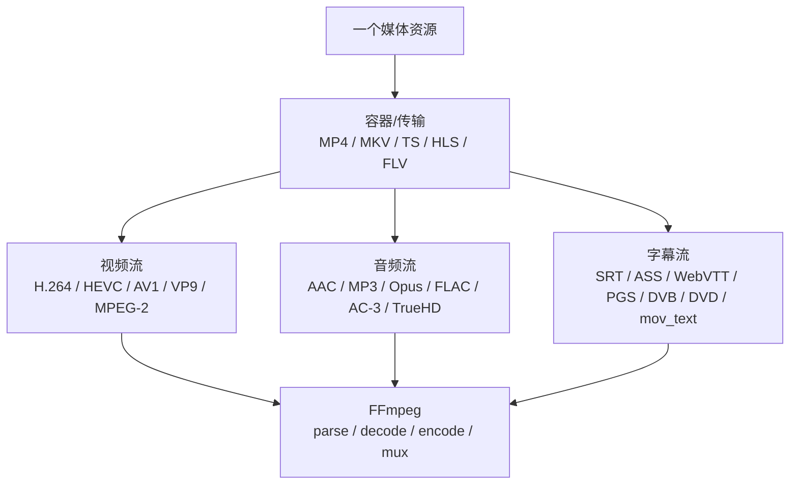
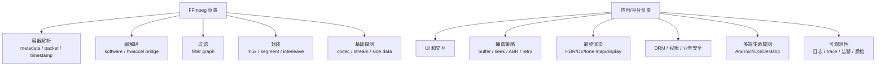
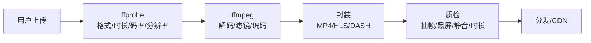
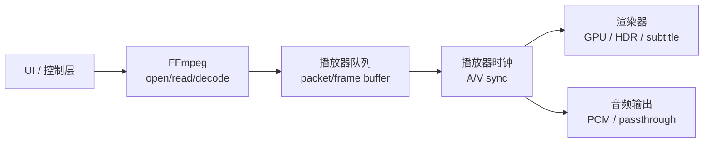

# FFmpeg 能力边界总览

源码快照：

- 本机路径：`D:/github/FFmpeg`
- Git describe：`n6.0.1-24-gdc02ba2637-dirty`
- Commit：`dc02ba263755b981b809ad2708b77c82586669d9`
- 文档日期：2026-06-30

这篇文档回答一个基础问题：FFmpeg 到底能做什么，不能做什么，在项目里应该被放在哪个位置。

> [!IMPORTANT]
> FFmpeg 不是一个完整播放器、直播平台或媒体业务系统。它是媒体数据处理底座，强项是协议/容器、码流、编解码、过滤、封装和大量格式兼容。播放体验、业务策略、UI、DRM、安全鉴权、CDN 调度和最终渲染通常要在 FFmpeg 外面完成。

## 一句话定位

如果把媒体项目比作一家厨房，FFmpeg 不是餐厅经理，也不是服务员，它更像后厨的全套工具和师傅。

这张“漫画式”类比图先建立直觉：不同模块各自负责什么。

对应源码入口：

- 工具层：`fftools/ffmpeg.c`、`fftools/ffprobe.c`、`fftools/ffplay.c`
- 输入打开：`libavformat/demux.c:221` `avformat_open_input()`
- 读包：`libavformat/demux.c:1439` `av_read_frame()`
- 解码：`libavcodec/decode.c:598` `avcodec_send_packet()`，`libavcodec/avcodec.c:709` `avcodec_receive_frame()`
- 过滤：`libavfilter/avfiltergraph.c:82` `avfilter_graph_alloc()`，`libavfilter/avfiltergraph.c:1167` `avfilter_graph_config()`
- 写出：`libavformat/mux.c:1241` `av_interleaved_write_frame()`

## FFmpeg 的能力地图

FFmpeg 的能力要按链路理解，而不是按“支持多少格式”理解。

| 链路 | FFmpeg 能做什么 | 关键库/入口 | 常见用途 |
| --- | --- | --- | --- |
| 输入协议 | 读本地文件、HTTP、RTMP、RTSP、HLS、DASH、UDP 等 | `libavformat` | 拉流、打开文件、网络输入 |
| 容器解析 | 从 MP4/MKV/TS/FLV 等容器里拆出 stream 和 packet | `avformat_open_input()`、`av_read_frame()` | 播放器 demux、转码输入 |
| 码流处理 | parser、bitstream filter、extradata 更新 | `libavcodec` parser/BSF | MP4 H.264 转 AnnexB、抽参数集 |
| 解码 | 压缩包转音视频帧 | `avcodec_send_packet()` / `avcodec_receive_frame()` | 播放、截图、分析、转码 |
| 过滤 | 对帧做变换 | `libavfilter` | 缩放、水印、裁剪、重采样、音量 |
| 编码 | 帧压缩成目标 codec | `libavcodec/encode.c` | 转码、录制、推流 |
| 封装 | 写成目标容器或分片 | `av_interleaved_write_frame()` | MP4、HLS、TS、FLV 输出 |
| 探测 | 读取 codec、duration、metadata、side data | `ffprobe` / `avformat_find_stream_info()` | 媒资分析、上线前质检 |

## 媒体类型覆盖

FFmpeg 的“格式支持”要拆成容器、视频、音频、字幕四层看。MP4/MKV/TS 是外层容器，H.264/AAC/SRT 才是里面的媒体流。

| 类型 | 常见格式 | FFmpeg 主要处理点 | 关键风险 |
| --- | --- | --- | --- |
| 容器/传输 | MP4、MKV、TS、HLS、FLV、MOV、WebM | 读 header、建 stream、读 packet、处理时间戳 | metadata 不完整、seek、分片、索引、时间戳 |
| 视频 | H.264、HEVC、AV1、VP9、MPEG-2、ProRes | 参数集、帧边界、硬解、颜色/HDR side data | SPS/PPS/VPS、NALFF/AnnexB、profile/bit depth |
| 音频 | AAC、MP3、Opus、FLAC、AC-3/E-AC-3、TrueHD | 采样率、声道、extradata、frame size、重采样 | encoder delay、skip samples、透传、声道布局 |
| 字幕 | SRT、ASS、WebVTT、mov_text、PGS、DVB、DVD | 文本 cue、ASS 样式、位图 segment、调色板 | 字体/样式、forced 字幕、位图缩放、播放器渲染 |

更细的关键数据位置和解析入口见 [常见格式解析地图](format-parsing-atlas.md)。

## 工具、库和产品不是一回事

FFmpeg 经常被混用成三个概念：

| 叫法 | 实际含义 | 适合谁用 |
| --- | --- | --- |
| `ffmpeg` 命令 | 命令行转码/处理工具 | 运维、脚本、服务端任务、验证命令 |
| `ffprobe` 命令 | 媒体探测工具 | 媒资系统、排障、自动化检测 |
| `ffplay` 命令 | 简单播放器示例 | 学习播放流程，不适合作为产品播放器 |
| `libav*` 库 | C API 组件 | 自研播放器、转码服务、SDK |
| 基于 FFmpeg 的产品 | 应用层 + FFmpeg 底座 | 播放器、转码平台、直播系统 |

> [!WARNING]
> `ffplay` 能播，不代表你的播放器只要接 `libavformat + libavcodec` 就完整了。产品播放器还需要处理渲染、时钟、缓冲、seek、弱网、硬解 fallback、字幕、音频设备、DRM、崩溃恢复和平台生命周期。

## 能力边界

这张图回答“FFmpeg 到哪里为止，应用从哪里开始”。

| 问题 | FFmpeg 是否负责 | 说明 |
| --- | --- | --- |
| MP4 里 `moov` 在哪里 | 是 | `libavformat/mov.c` 解析 atom |
| H.264 SPS/PPS 从哪里来 | 是 | `avcC`/AnnexB/parser/BSF |
| HLS playlist 怎么读 | 是 | `libavformat/hls.c` |
| 视频怎么解码成帧 | 是 | `libavcodec` |
| GPU 硬解能不能用 | 部分负责 | FFmpeg 适配 API，真正能力由硬件/驱动决定 |
| 播放器是否卡顿 | 部分负责 | 解码和读包相关，但缓冲/渲染/调度在应用层 |
| Dolby Vision P5 是否颜色正确 | 部分负责 | FFmpeg 解析 metadata，最终映射通常在渲染侧 |
| DRM 授权和安全解密链路 | 通常不是 | 商业 DRM 多在平台播放器或专用 SDK |
| ABR 自适应码率策略 | 不是完整负责 | FFmpeg 能读 HLS/DASH，但策略通常在播放器/业务层 |
| UI、播放列表、弹幕、广告 | 不是 | 应用层职责 |

## 典型使用方式

### 服务端转码

适合：

- 点播转码。
- 截图、抽帧、GIF。
- 音频转码。
- 批量媒体质检。
- HLS/DASH 切片。

不自动解决：

- 任务队列、失败重试、资源调度。
- GPU session 管理。
- 版权和安全策略。
- 业务元数据管理。

### 播放器底座

适合：

- 自研桌面播放器。
- 需要特殊格式支持的播放器。
- 内部工具播放器。
- 媒体 SDK 的 demux/decode 层。

不自动解决：

- 完整音画同步策略。
- UI 和平台生命周期。
- 系统音频焦点、耳机、后台播放。
- 平台安全解码/DRM。

### 移动端补充能力

移动端不要默认把 FFmpeg 当完整播放器。更合理的使用方式是：

- 系统播放器能播的，用系统播放器或 ExoPlayer/AVFoundation。
- 系统播放器不支持的特殊格式，用 FFmpeg 解析/转码/软解兜底。
- 对性能敏感的视频播放，优先系统硬解和系统渲染链路。
- 对后台处理任务，如转码、裁剪、抽音频，可以用 FFmpeg。

## 什么时候 FFmpeg 是首选

| 场景 | 判断 |
| --- | --- |
| 服务端转码 | 通常首选 |
| 媒体探测/质检 | 通常首选 |
| 批量抽帧/截图 | 通常首选 |
| 非实时文件处理 | 很适合 |
| 特殊格式兼容 | 很适合 |
| 自研桌面播放器底层 | 适合，但要补播放器工程 |
| 移动端复杂播放器 | 可用，但不要忽略系统 API |
| 实时音视频通话 | 通常不是首选，WebRTC 更合适 |
| 图形化 pipeline/插件系统 | GStreamer 可能更合适 |
| 商业 DRM 播放 | 平台播放器或商业 SDK 通常更合适 |

## 核心学习路径

如果你想真正理解 FFmpeg，建议按下面顺序：

1. 先懂 `AVFormatContext -> AVStream -> AVCodecParameters -> AVPacket`。
2. 再懂 `AVCodecContext -> AVFrame`。
3. 再懂 `extradata`、`side data`、`time_base`、`PTS/DTS`。
4. 再看 MP4/MKV/TS/HLS 等容器如何把关键数据填到这些结构里。
5. 再看硬解的 `hw_device_ctx`、`hw_frames_ctx`、硬件像素格式。
6. 最后看 filter、encoder、muxer 和平台集成。

> [!TIP]
> 学 FFmpeg 不要从“支持多少格式”开始，而要从“容器关键数据如何变成 `AVPacket` 和 `AVCodecParameters`，再如何变成 `AVFrame`”开始。这个链路清楚后，起播慢、花屏、无声、音画不同步、硬解失败都会更容易定位。
