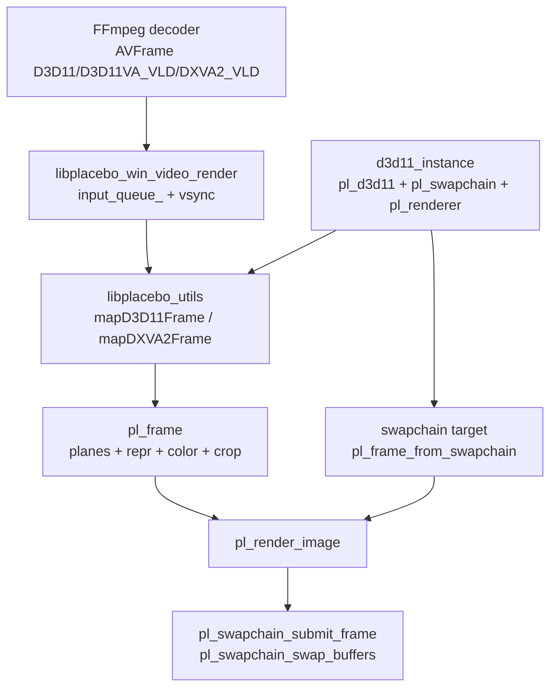
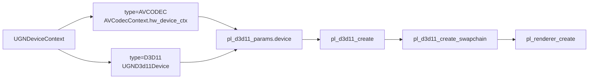
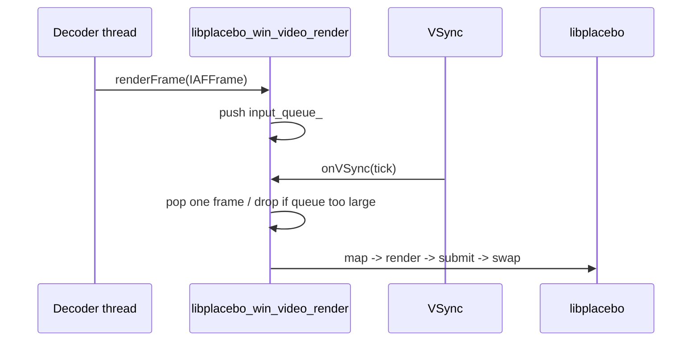
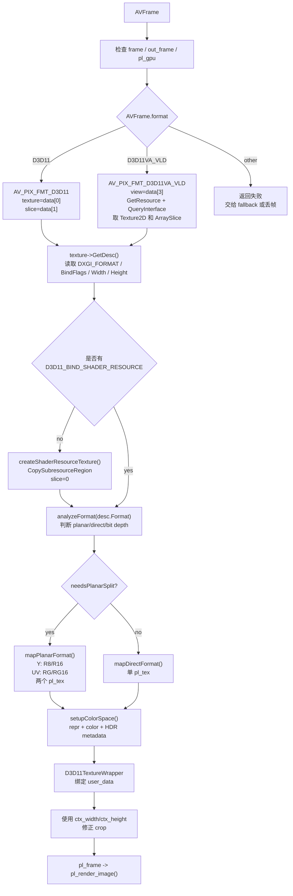
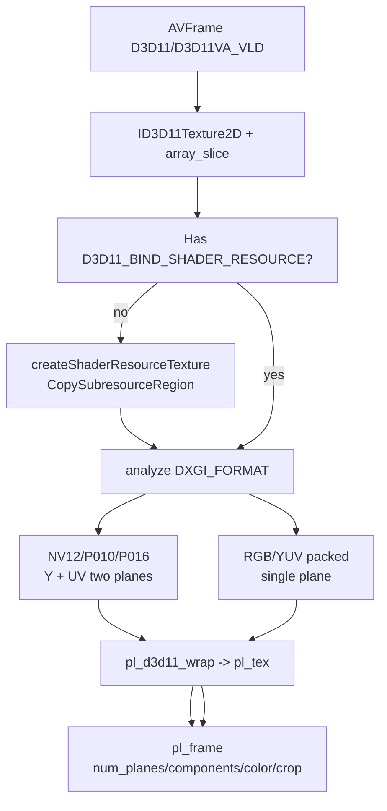
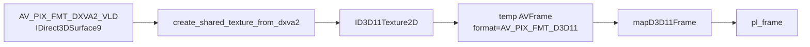
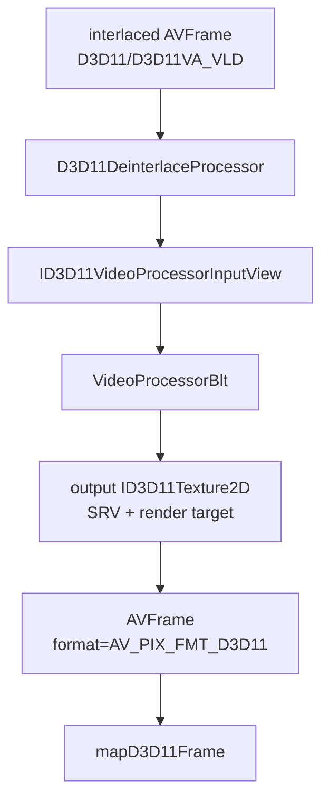
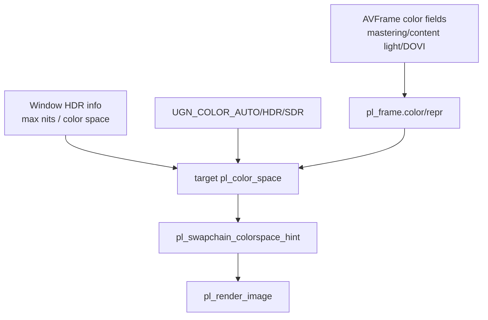
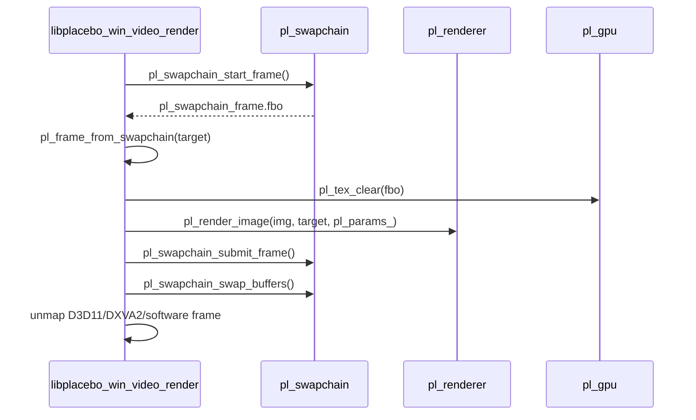

# Windows D3D 硬解直通 libplacebo 渲染链路

这篇文档整理 `nas-player` 在 Windows 上“硬解后直接交给 libplacebo 渲染”的工程逻辑。重点不是解释单个 API，而是把 D3D11VA/DXVA2 解码输出、D3D11 设备复用、`pl_d3d11_wrap()`、`pl_frame`、HDR 目标色彩、swapchain present 串成一条可维护的数据合同。

这条链路里最需要重点理解的是项目自己实现的 `mapD3D11Frame()`。libplacebo 能渲染 `pl_frame`，也能通过 `pl_d3d11_wrap()` 包装外部 D3D11 texture，但它不会自动理解 FFmpeg 硬件帧里 `AVFrame.data[]` 的业务语义、D3D11VA decoder output view、array slice、DXGI planar format、shader resource view 能力、播放器裁剪尺寸和 HDR side data。`mapD3D11Frame()` 正是把这些硬件帧细节翻译成 libplacebo 可渲染输入的核心适配层。

源码快照：

- libplacebo 本机路径：`D:/github/libplacebo`
- libplacebo Git describe：`v7.351.0-145-g1dcaea8b-dirty`
- libplacebo Commit：`1dcaea8b601aa969ffd5bfa70088957ce3eaa273`
- nas-player 本机路径：`D:/work/nas-player`
- nas-player Git describe：`1.0.9-68-g8a6af4f8-dirty`
- nas-player Commit：`8a6af4f894f55923fe3f8a1e56b46c9776f500a7`
- 文档日期：2026-06-08

## 阅读标记

> [!IMPORTANT]
> **核心合同**：硬解输出的 D3D device、纹理格式、array slice、`pl_frame` plane、色彩信息、swapchain target 必须属于同一条 GPU 渲染链。

> [!WARNING]
> **高风险点**：D3D11 decoder texture 不能被 shader 采样、D3D11VA/DXVA2 纹理生命周期错误、HDR metadata 丢失、resize 后 target 过期。

> [!TIP]
> **工程经验**：每帧日志至少能回答“这帧来自哪个硬件 API、是否 zero-copy、wrap 成几个 plane、目标色彩是什么、是否成功 submit”。

## 总体架构

这张图回答：Windows 下硬解帧如何从 FFmpeg/播放器进入 libplacebo D3D11 后端。



项目源码入口：

- nas-player `src/impl/module/render/video/platform/windows/libplacebo_win_video_render.cpp:234` `renderFrame()` 入队。
- nas-player `src/impl/module/render/video/platform/windows/libplacebo_win_video_render.cpp:457` `onVSyncInner()` 每次 vsync 消费一帧并渲染。
- nas-player `src/impl/module/render/video/platform/windows/create_surface_window.cpp:82` `d3d11_instance::create_windows2()` 创建 D3D11/libplacebo 渲染环境。
- nas-player `src/impl/module/render/video/libplacebo/libplacebo_utils.cpp:823` `mapD3D11Frame()` 映射 D3D11 硬件帧。
- nas-player `src/impl/module/render/video/libplacebo/libplacebo_utils.cpp:1040` `mapDXVA2Frame()` 将 DXVA2 surface 转 D3D11 shared texture 后再映射。
- libplacebo `src/d3d11/context.c:342` `pl_d3d11_create()`。
- libplacebo `src/d3d11/swapchain.c:621` `pl_d3d11_create_swapchain()`。
- libplacebo `src/d3d11/gpu_tex.c:350` `pl_d3d11_wrap()`。
- libplacebo `src/renderer.c:3493` `pl_render_image()`。

> [!IMPORTANT]
> 这条链路里最关键的设计是：`pl_d3d11_create()` 优先复用解码器的 `ID3D11Device`。这样 D3D11VA 输出纹理和 libplacebo 渲染后端在同一个 D3D11 device 上，`pl_d3d11_wrap()` 才有机会做到直接包装纹理，而不是跨设备拷贝。

## D3D11 环境创建

`d3d11_instance::create_windows2()` 根据外部传入的 `hw_context` 决定 libplacebo 使用哪个 D3D11 设备。



项目逻辑：

| 输入 | 取设备方式 | 工程含义 |
| --- | --- | --- |
| `UGNDeviceContext::AVCODEC` | 从 `AVCodecContext->hw_device_ctx` 取 `AVD3D11VADeviceContext.device` | FFmpeg D3D11VA 解码和 libplacebo D3D11 渲染共享同一设备 |
| `UGNDeviceContext::D3D11` | 从业务自己的 `UGND3d11Device.d3d_device` 取 `ID3D11Device` | 调用方显式提供 D3D11 设备 |
| 无设备 | libplacebo 自己创建 D3D11 device | 可显示，但不一定能接住硬解纹理 zero-copy |

源码入口：

- nas-player `create_surface_window.cpp:82` `d3d11_instance::create_windows2()`。
- nas-player `create_surface_window.cpp:124` 调 `pl_d3d11_create()`。
- nas-player `create_surface_window.cpp:146` 调 `pl_d3d11_create_swapchain()`。
- nas-player `create_surface_window.cpp:155` 调 `pl_renderer_create()`。
- libplacebo `src/include/libplacebo/d3d11.h:141` `pl_d3d11_create()` API。
- libplacebo `src/include/libplacebo/d3d11.h:207` `pl_d3d11_create_swapchain()` API。

> [!WARNING]
> 如果解码器使用的 D3D11 device 和 libplacebo 创建的 D3D11 device 不是同一个，D3D11VA 输出纹理可能不能直接被 `pl_d3d11_wrap()` 使用。表现可能是 wrap 失败、黑屏、隐式拷贝、同步异常或 GPU device removed。

## 渲染线程和帧队列

播放器不是在 `renderFrame()` 里立即绘制，而是先入队，再由 vsync 驱动消费。



项目源码：

- `libplacebo_win_video_render.cpp:234` `renderFrame()` 将 `IAFFrame` 放入 `input_queue_`。
- `libplacebo_win_video_render.cpp:457` `onVSyncInner()` 真正执行渲染。
- `libplacebo_win_video_render.cpp:221` `clearScreen()` 清空队列并标记丢弃。
- `libplacebo_win_video_render.cpp:68` `VSyncOnInit()` 初始化 `pl_render_fast_params` 和 `d3d11_instance`。
- `libplacebo_win_video_render.cpp:125` `VSyncOnDestroy()` 清理渲染环境。

> [!TIP]
> 这个结构能把 decoder 线程和 present 节奏解耦，但队列策略必须清楚。当前逻辑在 `input_queue_` 超过 `max_in_size_` 时丢帧并重设 `render_clock_`，适合播放实时性优先的播放器。

## 一帧硬件图像如何变成 `pl_frame`

`onVSyncInner()` 取出 `AVFrame` 后先判断硬件格式：

| `AVFrame.format` | 处理路径 | 输出 |
| --- | --- | --- |
| `AV_PIX_FMT_D3D11` | `mapD3D11Frame()` | D3D11 texture wrap 成 `pl_frame` |
| `AV_PIX_FMT_D3D11VA_VLD` | 从 `ID3D11VideoDecoderOutputView` 取 `ID3D11Texture2D` 和 `ArraySlice`，再 `mapD3D11Frame()` | D3D11 decoder surface wrap 成 `pl_frame` |
| `AV_PIX_FMT_DXVA2_VLD` | `mapDXVA2Frame()` 创建 D3D11 shared texture，再走 D3D11 映射 | DXVA2 -> D3D11 -> `pl_frame` |
| 其他软件帧 | `map_frame()` 调 `pl_map_avframe_ex()` | libplacebo utils 映射/上传 |

源码入口：

- `libplacebo_win_video_render.cpp:641` `AV_PIX_FMT_D3D11` 路径。
- `libplacebo_win_video_render.cpp:644` `AV_PIX_FMT_D3D11VA_VLD` 路径。
- `libplacebo_win_video_render.cpp:647` `AV_PIX_FMT_DXVA2_VLD` 路径。
- `libplacebo_utils.cpp:47` `map_frame()` 调用 `pl_map_avframe_ex()`。
- libplacebo `src/include/libplacebo/utils/libav_internal.h:1273` `pl_map_avframe_ex()`。

> [!IMPORTANT]
> `AV_PIX_FMT_D3D11` 和 `AV_PIX_FMT_D3D11VA_VLD` 的 `AVFrame.data` 语义不同：前者通常 `data[0]` 是 `ID3D11Texture2D*`，`data[1]` 是 array slice；后者这里从 `data[3]` 的 `ID3D11VideoDecoderOutputView*` 反查 resource 和 slice。写渲染层时不能混用。

## 为什么必须手写 `mapD3D11Frame()`

libplacebo 的渲染入口是 `pl_render_image()`，它消费的是已经描述清楚的 `pl_frame`。但是 FFmpeg 硬解输出给播放器的是 `AVFrame`，这个 `AVFrame` 只是携带了硬件资源的引用和若干约定字段，并不等价于 libplacebo 可以直接渲染的图像。

> [!IMPORTANT]
> 最终交给 `pl_render_image()` 的不是 `AVFrame`，而是 `mapD3D11Frame()` 构造出来的 `pl_frame`。这个 `pl_frame` 必须明确包含 plane、纹理、组件映射、色彩描述、crop 和资源生命周期。

> [!WARNING]
> 如果绕过这层转换，或者只把 `ID3D11Texture2D*` 粗暴塞给 libplacebo，libplacebo 不会自动知道这是一张 NV12/P010 的 Y/UV 双平面图像，也不会自动知道 array slice、limited/full range、BT.709/BT.2020、PQ/HLG、HDR metadata 或原始 decoder texture 是否可被 shader 采样。

可以把 `mapD3D11Frame()` 理解为播放器和 libplacebo 之间的 ABI 边界：

```text
AVFrame(D3D hardware semantics)
    -> ID3D11Texture2D + array slice
    -> shader-readable D3D11 texture/view
    -> pl_tex planes
    -> pl_frame color/repr/crop/lifetime
    -> pl_render_image()
```

这不是简单的“解析函数”，而是同时做了 7 件事：

| 职责 | 具体动作 | 缺失后的典型现象 |
| --- | --- | --- |
| 硬件资源发现 | 从 `AVFrame.data[]` 取出 D3D11 texture 或 D3D11VA output view | 黑屏、访问非法指针、wrap 失败 |
| array slice 解析 | 识别 decoder texture array 中当前帧所在 slice | 显示上一帧、随机帧、花屏 |
| 可采样性检查 | 检查 `D3D11_BIND_SHADER_RESOURCE`，必要时 GPU copy 到 SRV texture | `pl_d3d11_wrap()` 失败或 shader 采样失败 |
| DXGI 格式解释 | 判断 NV12/P010/P016/RGBA 等格式和 bit depth | 颜色错、亮度错、UV 交换、画面发绿 |
| plane 构造 | 将 planar texture 拆成 Y plane 和 UV plane 并分别 `pl_d3d11_wrap()` | libplacebo 按错误格式读纹理 |
| 色彩合同映射 | 根据 `AVFrame` 色彩字段和 side data 填 `pl_frame.color/repr` | HDR 变灰、过曝、欠曝、色域错误 |
| 生命周期绑定 | 用 `user_data` 保存 wrapper，渲染后 `unmapD3D11Frame()` 释放 | 泄漏、提前释放、GPU 同步异常 |

`mapD3D11Frame()` 的决策流程可以这样看：



硬件帧到 `pl_frame` 的字段合同如下：

| 输入数据 | `mapD3D11Frame()` 如何取 | 转换后的 libplacebo 含义 |
| --- | --- | --- |
| `AVFrame.format == AV_PIX_FMT_D3D11` | `frame->data[0]` 转 `ID3D11Texture2D*`，`frame->data[1]` 转 array slice | 知道实际图像在哪张 texture、哪个 slice |
| `AVFrame.format == AV_PIX_FMT_D3D11VA_VLD` | `frame->data[3]` 转 `ID3D11VideoDecoderOutputView*`，再 `GetResource()` / `QueryInterface()` | 从 decoder output view 反查底层 D3D11 texture |
| `D3D11_TEXTURE2D_DESC.Format` | `texture->GetDesc()` | 决定是 NV12/P010/P016 双平面还是 direct format |
| `D3D11_TEXTURE2D_DESC.BindFlags` | 判断是否包含 `D3D11_BIND_SHADER_RESOURCE` | 决定能否直接 wrap，还是必须 copy 到可采样纹理 |
| `D3D11_TEXTURE2D_DESC.Width/Height` | 作为底层 texture 尺寸 | plane texture 的实际尺寸，不一定等于显示裁剪尺寸 |
| `AVFrame.color_range/color_primaries/color_trc/colorspace` | `setupColorSpace()` | 填充 `pl_frame.repr` 和 `pl_frame.color` |
| `AVFrame` mastering/content light/DOVI side data | `applyHDRMetadata()`、DOVI 映射逻辑 | HDR tone mapping 和 metadata 输出依据 |
| `ctx_width/ctx_height` | 设置 `out_frame->crop` | 修正硬解 texture 对齐宽高导致的绿边/脏边 |
| `ID3D11Texture2D` 引用 | 放入 `D3D11TextureWrapper`，挂到 `out_frame->user_data` | 保证 `pl_render_image()` 期间资源不被提前释放 |

简化后的伪代码：

```text
mapD3D11Frame(frame):
    validate frame/out_frame/gpu

    if frame.format == AV_PIX_FMT_D3D11:
        texture = frame.data[0]
        slice = frame.data[1]
    else if frame.format == AV_PIX_FMT_D3D11VA_VLD:
        view = frame.data[3]
        texture = view.GetResource().QueryInterface(ID3D11Texture2D)
        slice = view.Desc.Texture2D.ArraySlice
    else:
        return false

    desc = texture.GetDesc()
    if not desc.BindFlags has D3D11_BIND_SHADER_RESOURCE:
        texture = createShaderResourceTexture(texture, slice)
        slice = 0

    formatInfo = analyzeFormat(desc.Format)
    if formatInfo.needsPlanarSplit:
        wrap Y/UV views with pl_d3d11_wrap()
    else:
        wrap direct texture with pl_d3d11_wrap()

    setupColorSpace(out_frame, frame, formatInfo, video_is_hdr)
    out_frame.user_data = D3D11TextureWrapper(texture refs)
    out_frame.crop = visible codec size
    return true
```

源码入口：

- nas-player `src/impl/module/render/video/libplacebo/libplacebo_utils.cpp:823` `mapD3D11Frame()`。
- nas-player `src/impl/module/render/video/libplacebo/libplacebo_utils.cpp:891` 无 SRV 时调用 `createShaderResourceTexture()`。
- nas-player `src/impl/module/render/video/libplacebo/libplacebo_utils.cpp:902` planar format 进入 `mapPlanarFormat()`。
- nas-player `src/impl/module/render/video/libplacebo/libplacebo_utils.cpp:904` direct format 进入 `mapDirectFormat()`。
- nas-player `src/impl/module/render/video/libplacebo/libplacebo_utils.cpp:914` 调 `setupColorSpace()`。
- nas-player `src/impl/module/render/video/libplacebo/libplacebo_utils.cpp:933` `unmapD3D11Frame()` 释放映射资源。
- nas-player `src/impl/module/render/video/platform/windows/libplacebo_win_video_render.cpp:781` `pl_render_image()` 消费转换后的 `pl_frame`。
- libplacebo `src/include/libplacebo/d3d11.h:244` `pl_d3d11_wrap()` 只包装外部 texture，不解析 FFmpeg 硬件帧。
- libplacebo `src/include/libplacebo/renderer.h:723` `pl_render_image()` 的输入是 `pl_frame`。

> [!TIP]
> 建议把 `mapD3D11Frame()` 当作硬解渲染链路的核心日志点。它至少要打出：`AVFrame.format`、`DXGI_FORMAT`、`BindFlags`、array slice、是否 copy-to-SRV、plane 数、每个 plane 的 wrap 结果、色彩空间、HDR metadata、crop 和最终 `pl_render_image()` 返回值。

## D3D11VA 纹理 wrap 细节

在完成硬件帧语义解析后，`mapD3D11Frame()` 的下一步才是把 D3D11 texture 包装为 libplacebo `pl_tex`，并填充 `pl_frame.planes`。也就是说，`pl_d3d11_wrap()` 是底层 D3D11 texture 到 `pl_tex` 的包装工具，不是 FFmpeg `AVFrame` 到 libplacebo `pl_frame` 的完整转换器。



关键处理：

- 如果 texture 没有 `D3D11_BIND_SHADER_RESOURCE`，先通过 `createShaderResourceTexture()` 复制到可采样纹理。
- `DXGI_FORMAT_NV12` 拆成 `R8_UNORM` 的 Y plane 和 `R8G8_UNORM` 的 UV plane。
- `DXGI_FORMAT_P010/P016` 拆成 `R16_UNORM` 的 Y plane 和 `R16G16_UNORM` 的 UV plane。
- 非平面格式走单 plane `mapDirectFormat()`。
- `setupColorSpace()` 根据格式、AVFrame 色彩字段和 side data 填 `pl_color_repr` / `pl_color_space`。
- `out_frame->crop` 使用 codec context 宽高修正硬解帧宽高异常。

源码入口：

- `libplacebo_utils.cpp:823` `mapD3D11Frame()`。
- `libplacebo_utils.cpp:639` `createShaderResourceTexture()`。
- `libplacebo_utils.cpp:697` `mapPlanarFormat()`。
- `libplacebo_utils.cpp:722` 包装 Y plane：`pl_d3d11_wrap()`。
- `libplacebo_utils.cpp:735` 包装 UV plane：`pl_d3d11_wrap()`。
- `libplacebo_utils.cpp:795` `mapDirectFormat()`。
- `libplacebo_utils.cpp:805` 单 plane `pl_d3d11_wrap()`。
- `libplacebo_utils.cpp:668` `setupColorSpace()`。
- libplacebo `src/d3d11/gpu_tex.c:350` `pl_d3d11_wrap()`。
- libplacebo `src/include/libplacebo/d3d11.h:249` `pl_d3d11_wrap()` API。

> [!WARNING]
> D3D11 decoder 输出纹理经常只有 `D3D11_BIND_DECODER`，不能直接被 shader 采样。这里的 `createShaderResourceTexture()` 是重要 fallback，但它已经不是纯 zero-copy，而是 GPU 内部 copy。日志里应该区分 direct wrap 和 copy-to-SRV 后 wrap。

## DXVA2 到 D3D11 的桥接

DXVA2 输出是 D3D9 surface，不能直接交给 D3D11 backend。项目通过 shared texture 转成 D3D11 texture，再复用 `mapD3D11Frame()`。



源码入口：

- `libplacebo_utils.cpp:1040` `mapDXVA2Frame()`。
- `libplacebo_utils.cpp:1071` 将临时 D3D11 frame 交给 `mapD3D11Frame()`。
- `libplacebo_utils.cpp:1096` `unmapDXVA2Frame()` 释放共享纹理资源。

> [!TIP]
> DXVA2 路径应视为兼容性路径。新实现优先走 D3D11VA，因为 D3D11VA 更自然地和 libplacebo D3D11 backend 对齐。

## 去隔行处理

如果 D3D11/D3D11VA frame 标记为 interlaced，渲染前会先走 D3D11 VideoProcessor 做去隔行，输出新的 D3D11 texture，再交给 libplacebo。



源码入口：

- `libplacebo_win_video_render.cpp:594` 判断 D3D11/D3D11VA 隔行帧。
- `d3d11_deinterlace_processor.cpp:32` `D3D11DeinterlaceProcessor::Process()`。
- `d3d11_deinterlace_processor.cpp:99` `GetFrameTexture()` 支持两种 D3D11 frame 语义。
- `d3d11_deinterlace_processor.cpp:134` `EnsureProcessor()` 创建/复用 VideoProcessor。
- `d3d11_deinterlace_processor.cpp:239` `CreateBestProcessor()` 按 adaptive/motion/bob/blend 选择能力。
- `d3d11_deinterlace_processor.cpp:263` `ReleaseProcessor()` 释放 D3D11 视频处理资源。

> [!IMPORTANT]
> 去隔行输出帧会 `av_frame_copy_props()` 保留原 frame 属性，再把 `format` 改成 `AV_PIX_FMT_D3D11`。这保证后续映射逻辑统一，但必须正确管理 `output_texture_->AddRef()` 和渲染结束后的 `Release()`。

## HDR 和 Dolby Vision 色彩链路

项目里 HDR 决策分三层：输入 frame 是否 HDR、显示器是否 HDR、用户选择 AUTO/HDR/SDR。



关键逻辑：

| 阶段 | 项目实现 | 作用 |
| --- | --- | --- |
| 输入 HDR 判断 | `isActualHDRContent()`、`applyHDRMetadata()` | 根据 transfer、primaries、mastering display、content light 判断 |
| DOVI profile 5 | `pl_map_avdovi_metadata()` | 将 DOVI metadata 映射到 `pl_frame.color/repr` |
| 显示器状态 | `d3d11_instance::update_windows_info()` | 查询窗口所在显示器 HDR 状态、nits、推荐格式 |
| target 色彩 | `onVSyncInner()` 中按 AUTO/HDR/SDR 构造 `target_colorspace` | 决定原生 HDR 还是 tone map 到 SDR |
| swapchain hint | `update_colorspace_hint()` 调 `pl_swapchain_colorspace_hint()` | 通知 libplacebo/D3D11 swapchain 输出色彩意图 |

源码入口：

- `libplacebo_utils.cpp:447` `isActualHDRContent()`。
- `libplacebo_utils.cpp:529` `applyHDRMetadata()`。
- `libplacebo_win_video_render.cpp:658` DOVI metadata profile 5 映射。
- `libplacebo_win_video_render.cpp:215` `update_colorspace_hint()`。
- `create_surface_window.cpp:180` `d3d11_instance::update_windows_info()`。
- `create_surface_window.cpp:215` `d3d11_instance::get_hdr_status()`。
- libplacebo `src/swapchain.c:57` `pl_swapchain_colorspace_hint()`。
- libplacebo `src/d3d11/swapchain.c:291` `set_swapchain_metadata()`。

> [!WARNING]
> 当前 DOVI 映射里复制 metadata 使用的是旧字段边界，例如 `disable_residual_flag`、`nlq[2].linear_deadzone_threshold`。如果 FFmpeg/DOVI metadata 结构升级到 8.1 风格，应该重新审查这个复制边界，否则可能只复制到旧字段，extension block 丢失。

## 渲染和 present

真正绘制阶段非常接近 libplacebo 标准路径。



源码入口：

- `libplacebo_win_video_render.cpp:752` `pl_swapchain_start_frame()`。
- `libplacebo_win_video_render.cpp:759` `pl_frame_from_swapchain()`。
- `libplacebo_win_video_render.cpp:781` `pl_render_image()`。
- `libplacebo_win_video_render.cpp:782` `pl_swapchain_submit_frame()`。
- `libplacebo_win_video_render.cpp:812` `pl_swapchain_swap_buffers()`。
- libplacebo `src/swapchain.c:73` `pl_swapchain_start_frame()`。
- libplacebo `src/renderer.c:4116` `pl_frame_from_swapchain()`。
- libplacebo `src/renderer.c:3493` `pl_render_image()`。
- libplacebo `src/swapchain.c:82` `pl_swapchain_submit_frame()`。

> [!IMPORTANT]
> unmap 必须发生在 `pl_render_image()` 和 `pl_swapchain_submit_frame()` 之后。项目里 D3D11/DXVA2 成功硬件映射后分别调用 `unmapD3D11Frame()` / `unmapDXVA2Frame()`，软件路径调用 `pl_unmap_avframe()`。

## 资源生命周期

| 资源 | 创建 | 使用 | 释放 |
| --- | --- | --- | --- |
| `pl_d3d11` | `create_surface_window.cpp:124` | 持有 `d3d11->gpu` 和 D3D11 device | `create_surface_window.cpp:243` `pl_d3d11_destroy()` |
| `pl_swapchain` | `create_surface_window.cpp:146` | 每帧 start/submit/swap | `create_surface_window.cpp:239` `pl_swapchain_destroy()` |
| `pl_renderer` | `create_surface_window.cpp:155` | `pl_render_image()` | `create_surface_window.cpp:241` `pl_renderer_destroy()` |
| wrapped `pl_tex` | `libplacebo_utils.cpp:722`、`:735`、`:805` | `pl_frame.planes[i].texture` | `libplacebo_utils.cpp:933` `unmapD3D11Frame()` |
| D3D11 copied texture | `libplacebo_utils.cpp:639` | 无 SRV 原纹理的 copy fallback | `unmapD3D11Frame()` 通过 wrapper release |
| D3D11 VideoProcessor | `d3d11_deinterlace_processor.cpp:134` | 隔行帧处理 | `d3d11_deinterlace_processor.cpp:263` |

> [!WARNING]
> `pl_d3d11_wrap()` 只是把外部 D3D11 resource 包成 libplacebo texture，不代表 libplacebo 拥有原始 `ID3D11Texture2D` 的完整生命周期。项目用 `user_data` 保存 wrapper 并在 unmap 时释放额外引用，这个约定不能被破坏。

## resize、GPU 失败和 renderer 重建

项目处理了几个真实播放器必须面对的异常路径：

| 异常 | 项目处理 | 源码 |
| --- | --- | --- |
| GPU failed | 检测 `pl_gpu_is_failed()`，销毁窗口渲染环境并重新 init | `libplacebo_win_video_render.cpp:506` |
| 窗口 resize | 延迟或立即重建 renderer，再 `pl_swapchain_resize()` | `libplacebo_win_video_render.cpp:522` 到 `:553` |
| renderer pass 异常 | `pl_render_image()` 失败后 `pl_renderer_flush_cache()` | `libplacebo_win_video_render.cpp:803` |
| final clear | 销毁前 start frame、清黑、submit、finish GPU | `libplacebo_win_video_render.cpp:82` |
| 频繁 resize | 小于 100px 或变化不大时延迟处理 | `libplacebo_win_video_render.cpp:517` |

libplacebo 对应入口：

- `src/gpu.c:1276` `pl_gpu_is_failed()`。
- `src/swapchain.c:42` `pl_swapchain_resize()`。
- `src/renderer.c:193` `pl_renderer_flush_cache()`。
- `src/gpu.c:1270` `pl_gpu_finish()`。

> [!TIP]
> resize 后短时间马赛克/模糊，常见原因是旧 renderer pass、旧 target 或旧 swapchain 尺寸仍被复用。项目选择重建 `pl_renderer` 是一种直接但有效的工程处理。

## 渲染参数和性能降级

项目根据帧类型和耗时动态开关 peak detect。

| 输入类型 | 参数策略 | 原因 |
| --- | --- | --- |
| SDR | `color_map_params = nullptr` | 避免不必要色彩映射 |
| HDR + D3D11VA | 可以启用 `peak_detect_params` | 硬解路径性能较好，适合更高质量 HDR |
| HDR + 软件/HLG | 关闭 peak detect 或走快速参数 | 避免性能问题 |
| 渲染耗时过高 | 关闭 peak detect | 保护帧率 |

源码入口：

- `libplacebo_win_video_render.cpp:334` `initRenderParams()`。
- `libplacebo_win_video_render.cpp:356` `ResetRenderParams(HDRFRAME_TYPE)`。
- `libplacebo_win_video_render.cpp:383` `ResetRenderParams(pixel_fmt, color_space)`。
- `libplacebo_win_video_render.cpp:817` 到 `:852` 性能采样和 peak detect 动态切换。

> [!IMPORTANT]
> 高级渲染参数是“质量和实时性”的取舍。播放器不应该对所有路径统一启用最重的 HDR/peak detect 配置，尤其是软件解码、HLG、低端 GPU 或高刷新率显示器。

## 日志矩阵

建议把当前日志扩展成下面这几层，便于定位硬解直通渲染问题。

| 阶段 | 必打字段 |
| --- | --- |
| D3D 环境 | `hw_context type`、是否复用 `AVD3D11VADeviceContext.device`、`d3d11->software`、swapchain 创建结果 |
| 输入帧 | `AVFrame.format`、`width/height`、`interlaced/top_field_first`、`color_trc/primaries/range`、side data 列表 |
| D3D11 wrap | `DXGI_FORMAT`、`BindFlags`、array slice、是否有 SRV、是否发生 `CopySubresourceRegion` |
| plane | `num_planes`、每个 `pl_tex` format/size、component mapping |
| HDR | `video_is_hdr`、`has_meta_data`、`has_dovi`、display HDR enabled、`max_nits/sdr_white`、target csp |
| render | `pl_render_image`、`submit`、`swap`、`pl_gpu_is_failed`、renderer flush/recreate |
| unmap | D3D11/DXVA2/software 哪个 unmap 路径，释放了哪些 texture/ref |

示例：

```text
[pl-d3d] device=reuse-avcodec d3d11_software=0 swapchain=ok renderer=ok
[frame] fmt=d3d11va_vld 3840x2160 interlaced=0 trc=pq prim=bt2020 range=limited
[wrap] dxgi=P010 bind=DECODER|SRV slice=4 copy_to_srv=0 planes=2
[color] video_hdr=1 meta=mastering,cll dovi=0 display_hdr=1 max_nits=850 target=pq/bt2020
[render] ret=1 submit=1 swap=1 gpu_failed=0 peak_detect=1 frame_ms=10
[unmap] path=d3d11 planes=2 release_texture=0
```

## 经验规则

| 规则 | 含义 |
| --- | --- |
| 设备一致性优先 | D3D11VA 解码 device 和 libplacebo D3D11 device 要尽量同源 |
| wrap 不是万能 zero-copy | 没有 SRV 的 decoder texture 需要 GPU copy 后才能采样 |
| NV12/P010 要拆 plane | Y 和 UV 需要不同 DXGI view format，不能按单 RGBA 纹理解释 |
| 色彩合同和纹理同等重要 | `pl_frame.color/repr` 错时，画面会稳定地错误 |
| HDR 输出分两步 | 先决定输入 HDR，再决定目标显示 HDR/SDR，不要混成一个开关 |
| unmap 是合同的一部分 | `pl_tex_destroy()` 和外部 D3D texture `Release()` 必须按映射路径匹配 |
| resize 要重取 target | swapchain frame 不能跨 resize 复用 |
