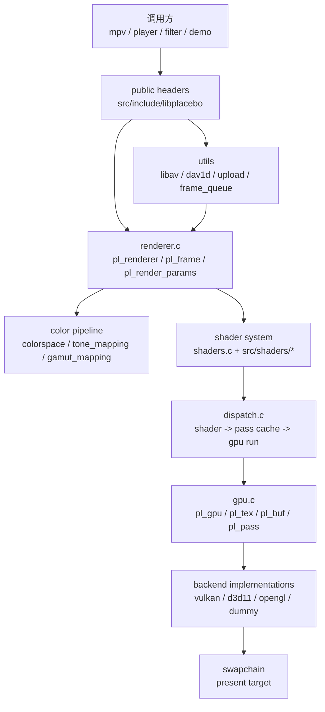
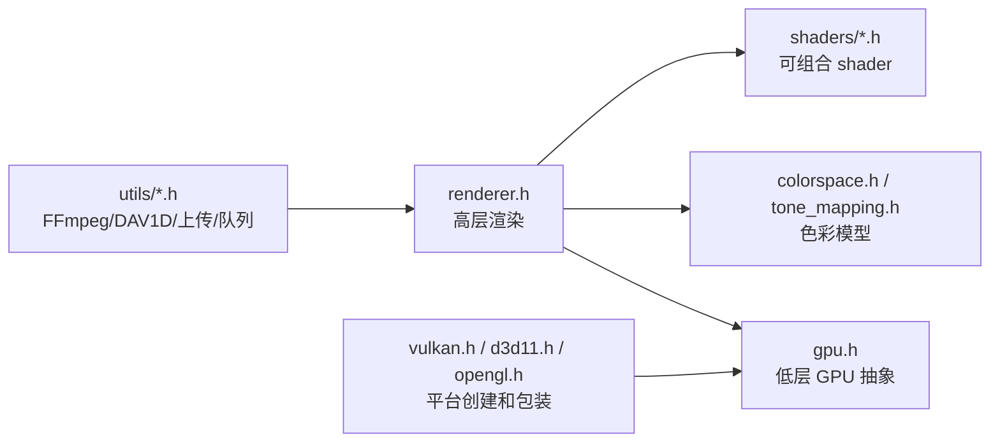
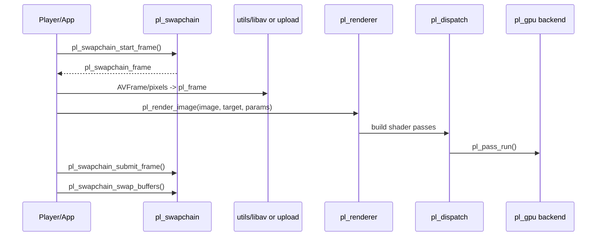
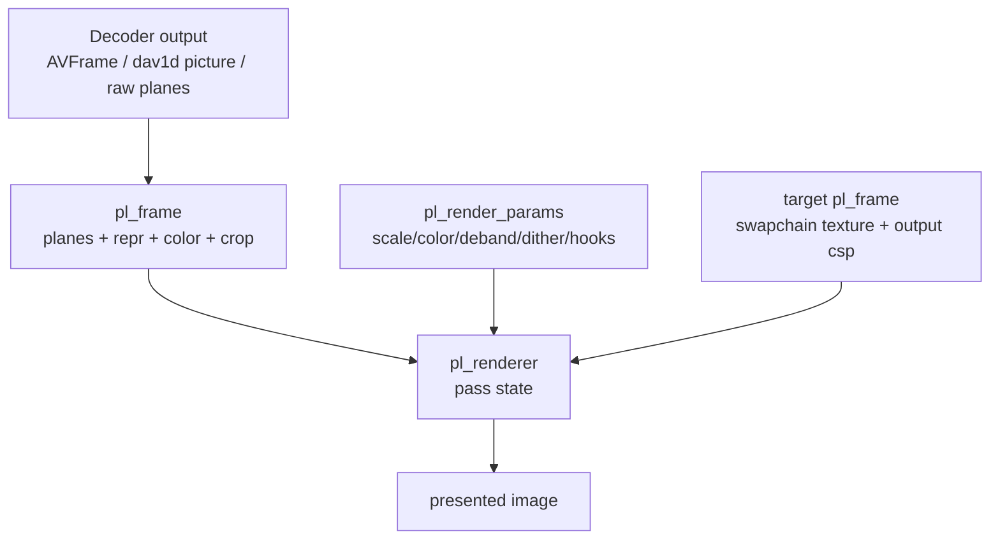

# libplacebo 整体架构

这篇文档说明 libplacebo 的模块边界、公共 API、核心数据结构和典型调用路径。它适合用来理解 mpv、播放器、滤镜或渲染器为什么会把解码后的 frame 交给 libplacebo，而不是自己手写所有 shader。

源码快照：

- 本机路径：`D:/github/libplacebo`
- Git describe：`v7.351.0-145-g1dcaea8b-dirty`
- Commit：`1dcaea8b601aa969ffd5bfa70088957ce3eaa273`
- 文档日期：2026-06-08

## 顶层地图

这张图回答：libplacebo 哪些模块是 API 边界，哪些模块是内部实现，调用方应该把数据交到哪里。

源码入口：

- `src/include/libplacebo/renderer.h:528` 定义 `struct pl_frame`。
- `src/include/libplacebo/renderer.h:130` 定义 `struct pl_render_params`。
- `src/include/libplacebo/gpu.h:233` 定义 `struct pl_gpu_t`。
- `src/renderer.c:107` `pl_renderer_create()` 创建 renderer。
- `src/renderer.c:3493` `pl_render_image()` 是单帧渲染入口。
- `src/renderer.c:3672` `pl_render_image_mix()` 是混帧/插帧渲染入口。
- `src/dispatch.c:1199` `pl_dispatch_finish()` 把 shader 变成实际 GPU pass。
- `src/gpu.c:1025` `pl_pass_create()` 创建 GPU pass。
- `src/gpu.c:1109` `pl_pass_run()` 执行 GPU pass。

> [!IMPORTANT]
> libplacebo 的核心边界是 `pl_frame -> pl_renderer -> pl_dispatch -> pl_gpu backend`。播放器负责准备 frame、时间、音画同步和窗口；libplacebo 负责图像处理和 GPU 命令。

## 公共 API 分层

| 层 | 典型结构/API | 作用 | 调用方要负责什么 |
| --- | --- | --- | --- |
| renderer | `pl_renderer`、`pl_frame`、`pl_render_params` | 把输入 frame 渲染到目标 frame | 准备 plane、crop、color、target |
| GPU 抽象 | `pl_gpu`、`pl_tex`、`pl_buf`、`pl_pass` | 屏蔽 Vulkan/D3D11/OpenGL 差异 | 选择后端、管理生命周期 |
| backend | `pl_vulkan_create()`、`pl_d3d11_create()`、`pl_opengl_create()` | 创建实际 GPU context | 传入平台对象/窗口/设备 |
| swapchain | `pl_swapchain_start_frame()`、`pl_swapchain_submit_frame()` | 获取可渲染 backbuffer 并 present | resize、vsync、HDR 输出策略 |
| color | `pl_color_space`、`pl_color_repr`、HDR metadata | 描述输入/输出色彩合同 | 正确从解码器/容器映射元数据 |
| utils | `pl_map_avframe()`、`pl_upload_plane()`、`pl_queue_update()` | 降低接入 FFmpeg/DAV1D 的成本 | 不丢 AVFrame 的色彩和硬件上下文 |

## 主调用路径

典型播放器渲染一帧时，会先从 swapchain 取得目标，再把解码帧映射成 `pl_frame`，最后调用 renderer。

源码入口：

- `src/swapchain.c:73` `pl_swapchain_start_frame()`。
- `src/renderer.c:4116` `pl_frame_from_swapchain()`。
- `src/include/libplacebo/utils/libav_internal.h:1273` `pl_map_avframe_ex()`。
- `src/include/libplacebo/utils/libav_internal.h:1382` `pl_map_avframe()`。
- `src/renderer.c:3493` `pl_render_image()`。
- `src/swapchain.c:82` `pl_swapchain_submit_frame()`。
- `src/swapchain.c:88` `pl_swapchain_swap_buffers()`。

> [!TIP]
> 调试播放器接入 libplacebo 时，日志至少要打印：GPU 后端、输入 `pl_frame` 的 plane 数量和格式、`pl_color_repr`、`pl_color_space`、目标 frame 格式、swapchain 色彩空间、是否使用硬件纹理导入。

## 核心数据合同

| 数据 | 来源 | 生命周期 | 典型问题 |
| --- | --- | --- | --- |
| `pl_frame.planes` | 解码器硬件纹理、CPU 上传、swapchain backbuffer | 调用方或 acquire/release 管理 | plane 顺序、尺寸、bit depth、modifier 错 |
| `pl_color_repr` | 像素表示：RGB/YUV、range、bit encoding | 跟输入/输出 frame 绑定 | limited/full range 错导致发灰/过曝 |
| `pl_color_space` | primaries、transfer、HDR metadata | 跟 frame 或 swapchain target 绑定 | HDR10/HLG/PQ 元数据丢失 |
| `pl_render_params` | 播放器配置或 preset | 每次 render 可变 | 质量/性能不匹配、动态 shader 频繁重建 |
| `pl_gpu` | Vulkan/D3D11/OpenGL context | 通常全局或窗口级 | 后端能力、格式、外部纹理导入不匹配 |
| `pl_dispatch`/pass cache | renderer 内部 | 随 GPU 和 shader 状态复用 | shader cache 失效或动态参数过多 |

> [!WARNING]
> libplacebo 不会替播放器修复错误的输入语义。比如 AVFrame 的 YUV range、HDR metadata、DOVI 映射、硬件 frame import 语义如果在进入 `pl_frame` 前就错了，后续 shader 只会稳定地渲染错误结果。

## 构建和可选特性

libplacebo 的能力很大一部分由 Meson 选项和依赖决定。

| 特性 | 构建入口 | 影响 |
| --- | --- | --- |
| Vulkan | `src/vulkan/meson.build:1` `get_option('vulkan')` | Vulkan GPU 后端和 swapchain |
| D3D11 | `src/d3d11/meson.build:1` `get_option('d3d11')` | Windows D3D11 后端、DXGI HDR metadata |
| OpenGL | `src/opengl/meson.build:1` `get_option('opengl')` | OpenGL/EGL 后端 |
| shaderc/glslang | `src/glsl/meson.build:1`、`src/glsl/meson.build:22` | GLSL 到 SPIR-V 编译，Vulkan/D3D11 依赖它 |
| lcms2 | `src/meson.build:162` | ICC profile 相关能力 |
| libdovi | `src/meson.build:187` | Dolby Vision 元数据辅助 |
| libav/dav1d utils | `src/meson.build:81`、`src/meson.build:85` | 方便从 FFmpeg/DAV1D 结构映射 frame |

> [!IMPORTANT]
> 判断“libplacebo 支不支持某能力”时，要同时看源码和构建输出。某些 API 头文件存在，但对应 backend 可能因为 Meson 选项或依赖缺失而只编译了 `stubs.c`。

