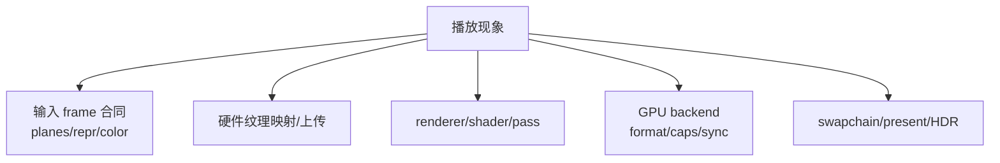
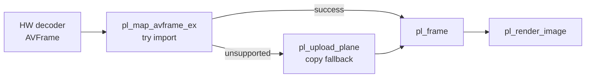

# libplacebo 工程问题手册

这篇文档按真实播放器开发中的症状组织：黑屏、颜色不对、HDR 异常、zero-copy 失败、shader 卡顿、resize/present 问题。重点是定位层级，而不是把所有问题都归因于 libplacebo。

源码快照：

- 本机路径：`D:/github/libplacebo`
- Git describe：`v7.351.0-145-g1dcaea8b-dirty`
- Commit：`1dcaea8b601aa969ffd5bfa70088957ce3eaa273`
- 文档日期：2026-06-08

## 总排查图



> [!IMPORTANT]
> 排查顺序建议固定：先确认 decoder 输出和 `pl_frame` 合同，再确认 map/upload，再确认 render params，再确认 backend caps，最后看 swapchain/present。不要一开始就调 tone mapping 参数。

## 症状矩阵

| 症状 | 先查什么 | 源码入口 | 工程处理 |
| --- | --- | --- | --- |
| 黑屏但无 crash | target frame 是否来自 swapchain、plane texture 是否 valid、pass 是否失败 | `src/renderer.c:3068` `validate_structs()`；`src/renderer.c:4234` `pl_renderer_get_errors()` | 打印 renderer errors；检查 `pl_gpu_is_failed()` |
| 颜色发灰/过曝 | limited/full range、PQ/HLG/SDR transfer、target color | `src/colorspace.c:1703` `pl_color_repr_decode()`；`src/renderer.c:2151` `pass_convert_colors()` | 从 AVFrame 到 `pl_color_repr` 全链路打印 |
| HDR 不触发或触发错误 | swapchain colorspace hint、HDR metadata、OS HDR 模式 | `src/d3d11/swapchain.c:291`；`src/vulkan/swapchain.c:298` | 区分 tone map 到 SDR 和原生 HDR 输出 |
| 硬解 zero-copy 失败 | AVFrame hw context、后端 import caps、同步对象 | `src/include/libplacebo/utils/libav_internal.h:1043`、`:1214`、`:1273` | fallback 到 upload/copy-back，记录原因 |
| 首帧/seek 后卡顿 | shader 编译、pass cache、纹理重建 | `src/dispatch.c:732` `finalize_pass()`；`src/gpu.c:1025` `pl_pass_create()` | 预热 shader cache，减少动态参数造成的重新编译 |
| resize 后黑屏 | swapchain recreate、target frame 过期、suboptimal | `src/vulkan/swapchain.c:687`；`src/d3d11/swapchain.c:147` | resize 后重新取 backbuffer，不复用旧 target |
| 画面撕裂/延迟 | present 阻塞、队列策略、vsync | `src/utils/frame_queue.c:599` `advance()`；`src/swapchain.c:88` | 区分渲染耗时和 present 等待 |

## 日志模板

### 打开后端

```text
[pl] backend=vulkan api=1.3 device=...
[pl] gpu limits max_tex=... max_ssbo=... compute=yes
[pl] import_caps tex={dma_buf,d3d11,vulkan?} sync={...}
[pl] shader_compiler=shaderc cache=enabled
```

对应源码：

- `src/vulkan/context.c:1469` `pl_vulkan_create()`。
- `src/d3d11/context.c:342` `pl_d3d11_create()`。
- `src/opengl/context.c:123` `pl_opengl_create()`。
- `src/gpu.c:1276` `pl_gpu_is_failed()`。

### 映射 frame

```text
[pl-frame] src=AVFrame fmt=d3d11 sw=p010 3840x2160
[pl-frame] map=zero-copy backend=d3d11 planes=2
[pl-frame] repr=sys=ycbcr levels=limited bits=10
[pl-frame] color=bt2020/pq hdr=maxCLL=... mastering=...
```

对应源码：

- `src/include/libplacebo/utils/libav_internal.h:733` `pl_frame_from_avframe()`。
- `src/include/libplacebo/utils/libav_internal.h:1273` `pl_map_avframe_ex()`。
- `src/include/libplacebo/utils/libav_internal.h:1366` fallback upload path 调用 `pl_upload_plane()`。

### 渲染和输出

```text
[pl-render] scaler=ewa_lanczos tone=spline gamut=perceptual dither=blue-noise
[pl-render] target fmt=rgba16f csp=bt2020/pq swapchain_hdr=yes
[pl-render] passes=... shader_cache_hit=... gpu_time=...
[pl-swapchain] resize=3840x2160 suboptimal=false present=...
```

对应源码：

- `src/renderer.c:3575` `render_params_info()`。
- `src/dispatch.c:1199` `pl_dispatch_finish()`。
- `src/gpu.c:1109` `pl_pass_run()`。
- `src/swapchain.c:73` `pl_swapchain_start_frame()`。

## 硬解接入经验



| 场景 | 建议 |
| --- | --- |
| D3D11VA + D3D11 backend | 优先 zero-copy，确认 shared texture/format 能被 `pl_d3d11_wrap()` 接住 |
| Vulkan hw frame + Vulkan backend | 看 `pl_map_avframe_vulkan()` 和 external semaphore/image 支持 |
| VAAPI/DRM PRIME + Vulkan | 看 DRM modifier/import caps，失败时 copy-back |
| CPU frame | 使用 `pl_upload_plane()`，注意 stride/bit depth/range |
| 后端不一致 | 不要假设能跨 API zero-copy，必要时 copy-back |

> [!WARNING]
> 硬解输出能被 FFmpeg 解码成功，不代表 libplacebo 能零拷贝渲染。解码成功只说明 codec/hwaccel 可用；渲染还要满足 texture import、format caps、同步和目标 surface 四个条件。

## 性能排查

| 层 | 可能瓶颈 | 验证方式 |
| --- | --- | --- |
| 上传 | CPU -> GPU 带宽、stride copy | 统计 `pl_upload_plane()` 时间 |
| shader 编译 | 首次播放/参数变化卡顿 | 统计 `pl_pass_create()` 和 cache hit |
| GPU 执行 | scaler/tone map/ICC/film grain 复杂 | 用 timer query 或后端 profiler |
| present | vsync 或 swapchain 阻塞 | 分离 render time 和 swap buffers time |
| frame queue | 插帧/混帧等待 | 打印 `pl_queue_update()` status 和内部估算 |

源码入口：

- `src/utils/frame_queue.c:599` `advance()`。
- `src/utils/frame_queue.c:739` `oversample()`。
- `src/utils/frame_queue.c:800` `interpolate()`。
- `src/utils/frame_queue.c:934` `prefill()`。
- `src/utils/frame_queue.c:1084` `pl_queue_peek()`。

## 经验规则

| 规则 | 含义 |
| --- | --- |
| 先查合同，再调参数 | plane/repr/color/target 错时，tone mapping 参数救不了 |
| 区分渲染和显示 | `pl_render_image()` 成功不代表 swapchain present 正常 |
| 区分 HDR 渲染和 HDR 输出 | 可以 tone map 到 SDR，也可以原生 HDR 输出 |
| zero-copy 是优化，不是基本正确性 | 失败要有 copy fallback |
| shader cache 是起播体验关键 | 首帧卡顿常来自编译，不是 decoder |
| 构建选项决定能力 | stubs 编译时 API 可能存在但运行不可用 |

