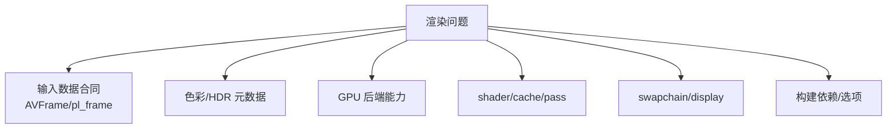

# libplacebo 缺陷与风险清单

这篇文档按层分类 libplacebo 接入中的弱点、限制和高风险误区。它不是说这些都是 libplacebo bug，而是提醒播放器工程里应该在哪一层做验证、日志和 fallback。

源码快照：

- 本机路径：`D:/github/libplacebo`
- Git describe：`v7.351.0-145-g1dcaea8b-dirty`
- Commit：`1dcaea8b601aa969ffd5bfa70088957ce3eaa273`
- 文档日期：2026-06-08

## 风险分类图

## 分层风险表

| 层 | 风险 | 症状 | 先查源码/字段 | 处理 |
| --- | --- | --- | --- | --- |
| 输入 frame | plane 数、format、stride、crop 错 | 颜色错位、花屏、拉伸 | `src/include/libplacebo/renderer.h:528` `struct pl_frame` | 进入 render 前做 frame dump |
| 色彩表示 | limited/full、YUV/RGB、bit depth 错 | 发灰、过曝、黑位错 | `src/include/libplacebo/colorspace.h:154` `struct pl_color_repr` | 从 decoder 到 `pl_color_repr` 打印映射 |
| HDR 元数据 | mastering/CLL/DOVI 丢失 | HDR 灰、偏色、亮度不对 | `src/colorspace.c:442` `pl_hdr_metadata_merge()`；`src/include/libplacebo/utils/libav_internal.h:942` | 保留 AVFrame side data，必要时 fallback HDR10/SDR |
| GPU format | 后端不支持目标 format/FBO/storage | render 失败或 fallback 慢 | `src/gpu.c:94` `pl_find_fmt()` | 根据 caps 选择格式，不硬编码 |
| zero-copy | 外部纹理 import/sync 不支持 | 黑屏、随机闪烁、copy fallback | `src/vulkan/gpu_tex.c:1256`；`src/d3d11/gpu_tex.c:350` | 检查 caps，失败转 copy |
| shader 编译 | 缺 shaderc/glslang 或 cache miss | 首帧卡顿/创建 pass 失败 | `src/glsl/meson.build:1`、`:22`；`src/dispatch.c:732` | 构建依赖检查，启用 cache |
| swapchain | resize/suboptimal/HDR color space 错 | resize 黑屏、HDR 不触发 | `src/vulkan/swapchain.c:1032`；`src/d3d11/swapchain.c:363` | resize 重建 target，更新 colorspace hint |
| 构建选项 | 后端被禁用或编译 stubs | API 返回 NULL/不可用 | `src/vulkan/stubs.c:38`、`src/d3d11/stubs.c:25`、`src/opengl/stubs.c:25` | 启动时打印 components |

> [!IMPORTANT]
> “画面不对”不等于“libplacebo 算法错”。大多数播放器问题来自输入 frame 合同、HDR 元数据、硬件纹理导入和 swapchain 输出之间不一致。

## 平台差异

| 平台/后端 | 优势 | 风险 | 关注点 |
| --- | --- | --- | --- |
| Vulkan | 能力完整、外部资源模型强 | device/queue/sync/descriptor 复杂 | `pl_vulkan_import()`、external memory、swapchain suboptimal |
| D3D11 | Windows 硬解和 DXGI 友好 | HDR metadata、format support、debug layer | D3D11VA texture wrapping、DXGI color space |
| OpenGL | 兼容传统上下文 | 扩展和 FBO 限制多 | GL version、EGL import、FBO completeness |
| Dummy | 测试和离线构造 | 不能代表真实 GPU | 只用于测试/验证 API 行为 |

## 需要验证而不是假设的场景

- 10bit SDR 是否走 10bit swapchain，还是 tone map/dither 到 8bit。
- HDR10 metadata 是否被 OS/display 接收，而不只是 libplacebo 内部存在。
- DOVI metadata 是否映射到了 `pl_frame`，以及 profile fallback 是 BL/HDR10/SDR 哪条路。
- 解码器输出的硬件 frame 是否和当前 libplacebo 后端同 API。
- shaderc/glslang 是否实际可用，尤其 Windows 静态链接场景。
- resize 后 target frame 是否重新获取。

> [!TIP]
> 风险文档要和日志体系绑定。每个 fallback 都要输出“失败在哪一层”：map/import、format caps、shader compile、render pass、swapchain present、HDR metadata submit。

