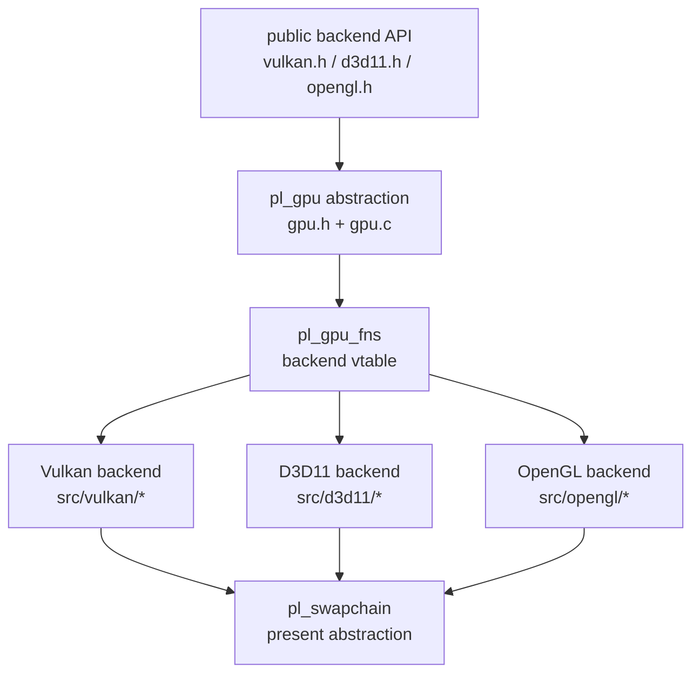
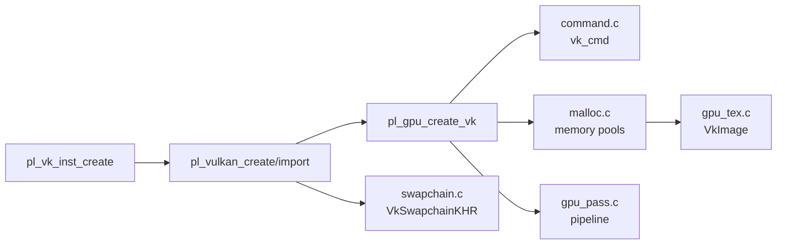
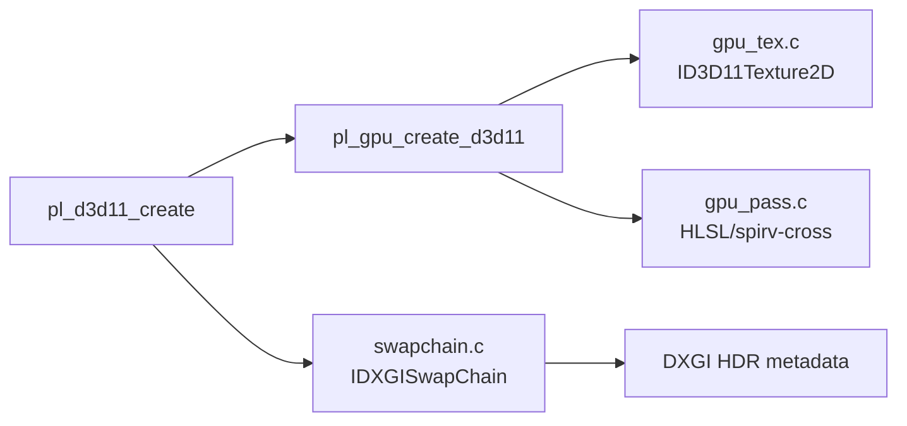
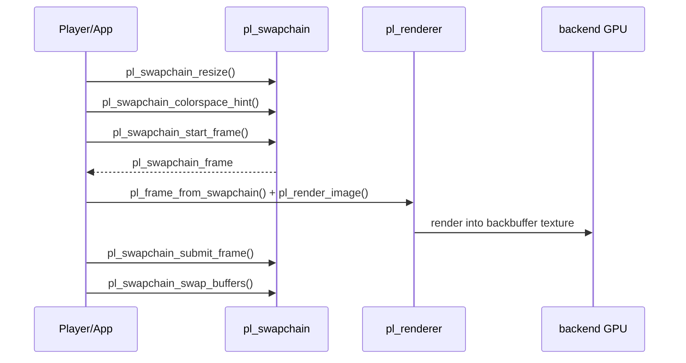

# libplacebo GPU 后端与 Swapchain

这篇文档说明 libplacebo 如何把统一的 `pl_gpu` 抽象映射到 Vulkan、D3D11、OpenGL，以及 swapchain 如何把渲染结果提交到窗口或平台表面。

源码快照：

- 本机路径：`D:/github/libplacebo`
- Git describe：`v7.351.0-145-g1dcaea8b-dirty`
- Commit：`1dcaea8b601aa969ffd5bfa70088957ce3eaa273`
- 文档日期：2026-06-08

## 后端关系图

这张图回答：统一 API 和各平台实现之间如何对应。

源码入口：

- `src/include/libplacebo/gpu.h:233` `struct pl_gpu_t`。
- `src/gpu.c:189` `pl_tex_create()`。
- `src/gpu.c:543` `pl_buf_create()`。
- `src/gpu.c:1025` `pl_pass_create()`。
- `src/vulkan/gpu.c:800` `pl_fns_vk`。
- `src/d3d11/gpu.c:364` `pl_fns_d3d11`。
- `src/opengl/gpu.c:640` `pl_fns_gl`。

> [!IMPORTANT]
> `pl_gpu` 是能力抽象，不是某个后端的薄封装。调用方应根据 `pl_gpu.limits`、format caps、import/export caps 做决策，而不是假设 Vulkan/D3D11/OpenGL 都支持同一组纹理格式和同步方式。

## GPU 资源合同

| 抽象 | 公共入口 | Vulkan | D3D11 | OpenGL |
| --- | --- | --- | --- | --- |
| texture | `pl_tex_create()` `src/gpu.c:189` | `vk_tex_create()` `src/vulkan/gpu_tex.c:249` | `pl_d3d11_tex_create()` `src/d3d11/gpu_tex.c:164` | `gl_tex_create()` `src/opengl/gpu_tex.c:313` |
| buffer | `pl_buf_create()` `src/gpu.c:543` | `vk_buf_create()` `src/vulkan/gpu_buf.c:97` | `pl_d3d11_buf_create()` `src/d3d11/gpu_buf.c:39` | `gl_buf_create()` `src/opengl/gpu.c:328` |
| pass | `pl_pass_create()` `src/gpu.c:1025` | `vk_pass_create()` `src/vulkan/gpu_pass.c:289` | `pl_d3d11_pass_create()` `src/d3d11/gpu_pass.c:827` | `gl_pass_create()` `src/opengl/gpu_pass.c:218` |
| timer | `pl_timer_create()` `src/gpu.c:1285` | Vulkan query | D3D11 query | GL timer query |
| import/export | `pl_tex`/`pl_buf` handle caps | external memory/semaphore | shared resources | EGL/GL interop |

> [!WARNING]
> 硬解 zero-copy 最容易卡在纹理 import/export 和同步。FFmpeg 输出的是 D3D11/Vulkan/DRM/VAAPI 等硬件 frame，不代表当前 libplacebo 后端一定能零拷贝接住。

## Vulkan 后端

Vulkan 是 libplacebo 最完整的后端之一，包含 instance/device 创建、队列、内存分配、pipeline、descriptor、swapchain 和外部资源包装。

源码入口：

- `src/vulkan/context.c:573` `pl_vk_inst_create()`。
- `src/vulkan/context.c:1162` `device_init()`。
- `src/vulkan/context.c:1469` `pl_vulkan_create()`。
- `src/vulkan/context.c:1591` `pl_vulkan_import()`。
- `src/vulkan/gpu.c:418` `pl_gpu_create_vk()`。
- `src/vulkan/swapchain.c:343` `pl_vulkan_create_swapchain()`。
- `src/vulkan/gpu_tex.c:1256` `pl_vulkan_wrap()`。
- `src/vulkan/gpu_tex.c:1401` `pl_vulkan_hold_ex()`。

## D3D11 后端

D3D11 后端对 Windows 播放器很关键，尤其是 D3D11VA 解码输出、DXGI swapchain、HDR10 metadata 和 P010/NV12 类格式。

源码入口：

- `src/d3d11/context.c:342` `pl_d3d11_create()`。
- `src/d3d11/gpu.c:390` `pl_gpu_create_d3d11()`。
- `src/d3d11/gpu_tex.c:350` `pl_d3d11_wrap()`。
- `src/d3d11/gpu_pass.c:339` `shader_compile_glsl()`。
- `src/d3d11/swapchain.c:273` `set_hdr10_metadata()`。
- `src/d3d11/swapchain.c:291` `set_swapchain_metadata()`。
- `src/d3d11/swapchain.c:621` `pl_d3d11_create_swapchain()`。

> [!TIP]
> Windows 播放器里如果画面 SDR/HDR 切换异常，除了看 shader tone mapping，还要看 DXGI swapchain 的 color space 和 HDR10 metadata 是否被设置。入口在 `src/d3d11/swapchain.c`。

## OpenGL 后端

OpenGL 后端覆盖传统 GL/EGL 场景，但能力受上下文版本、扩展、FBO 格式、timer query、external image 支持影响更大。

源码入口：

- `src/opengl/context.c:123` `pl_opengl_create()`。
- `src/opengl/gpu.c:106` `pl_gpu_create_gl()`。
- `src/opengl/formats.c:241` `add_format()`。
- `src/opengl/gpu_tex.c:581` `pl_opengl_wrap()`。
- `src/opengl/swapchain.c:44` `pl_opengl_create_swapchain()`。

> [!WARNING]
> OpenGL 后端的问题通常表现为“能跑但格式不对、FBO 不完整、extension 缺失或同步弱”。不要直接套用 Vulkan 的能力假设。

## Swapchain 生命周期

这张图回答：窗口目标如何变成可渲染的 `pl_frame`。

源码入口：

- `src/swapchain.c:42` `pl_swapchain_resize()`。
- `src/swapchain.c:57` `pl_swapchain_colorspace_hint()`。
- `src/swapchain.c:73` `pl_swapchain_start_frame()`。
- `src/swapchain.c:82` `pl_swapchain_submit_frame()`。
- `src/swapchain.c:88` `pl_swapchain_swap_buffers()`。
- `src/renderer.c:4116` `pl_frame_from_swapchain()`。

## 构建时后端选择

| 后端 | Meson 入口 | 没启用时 |
| --- | --- | --- |
| Vulkan | `src/vulkan/meson.build:1` | 编译 `src/vulkan/stubs.c` |
| D3D11 | `src/d3d11/meson.build:1` | 可能编译 `src/d3d11/stubs.c` |
| OpenGL | `src/opengl/meson.build:1` | 编译 `src/opengl/stubs.c` |
| GLSL compiler | `src/glsl/meson.build:1` shaderc, `src/glsl/meson.build:22` glslang | Vulkan/D3D11 shader 编译能力受限 |

> [!IMPORTANT]
> 文档或调用方判断能力时，必须区分“头文件里有 API”“运行时创建成功”“后端格式支持”“swapchain 能 present”这四件事。

