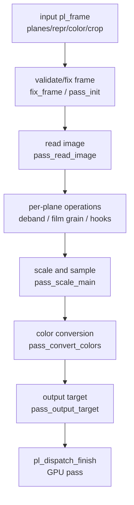
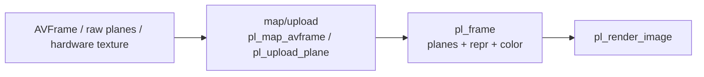
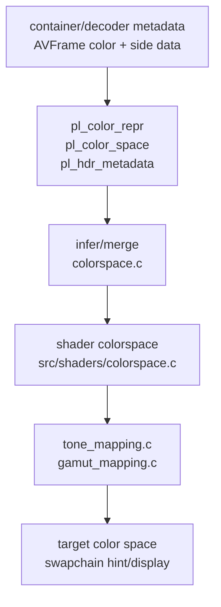
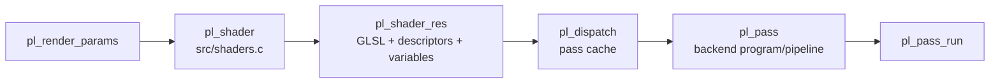

# libplacebo 渲染、色彩与 HDR 管线

这篇文档关注播放器最关心的问题：一个解码后的图像如何进入 libplacebo，如何经历缩放、色彩转换、HDR tone mapping、gamut mapping、dither、overlay/custom shader，最后变成显示设备上的一帧。

源码快照：

- 本机路径：`D:/github/libplacebo`
- Git describe：`v7.351.0-145-g1dcaea8b-dirty`
- Commit：`1dcaea8b601aa969ffd5bfa70088957ce3eaa273`
- 文档日期：2026-06-08

## 阅读标记

> [!IMPORTANT]
> **核心合同**：输入 `pl_frame`、输出 `pl_frame`、色彩表示、目标色域和 GPU 格式必须一致。

> [!WARNING]
> **高风险点**：HDR 元数据丢失、range 错误、硬件纹理导入失败、目标 swapchain 色彩空间错误。

> [!TIP]
> **工程经验**：把每一层的色彩和格式都打出来，不要只看最终画面。

> [!NOTE]
> **背景知识**：libplacebo 不负责 demux/decode，它消费的是已经准备好的 frame 和 GPU 资源。

## 渲染主流程

这张图回答：`pl_render_image()` 内部大致会经历哪些阶段。

源码入口：

- `src/renderer.c:3068` `validate_structs()` 校验输入结构。
- `src/renderer.c:3221` `fix_frame()` 补全 frame 缺省信息。
- `src/renderer.c:3377` `pass_init()` 初始化一次 render pass 状态。
- `src/renderer.c:1549` `pass_read_image()` 读取输入 plane。
- `src/renderer.c:1314` `plane_deband()`。
- `src/renderer.c:1351` `plane_film_grain()`。
- `src/renderer.c:1960` `pass_scale_main()`。
- `src/renderer.c:2151` `pass_convert_colors()`。
- `src/renderer.c:2645` `pass_output_target()`。
- `src/renderer.c:3493` `pl_render_image()`。

## `pl_frame` 数据合同

`pl_frame` 是 libplacebo 的高层图像合同。它描述的是“这帧图像如何被采样和解释”，不是解码器原始结构。

| 字段 | 含义 | 典型来源 | 错误后果 |
| --- | --- | --- | --- |
| `planes` | 输入纹理、component mapping、plane rect | AVFrame data/hw texture 或 CPU 上传 | 颜色错位、UV 颠倒、采样越界 |
| `repr` | YUV/RGB、limited/full、bit encoding | `AVFrame.color_range`、pixel format | 黑位/白位错误 |
| `color` | primaries、transfer、HDR metadata | AVFrame side data、容器 metadata | HDR/SDR 映射错误 |
| `crop`/rect | 可见区域 | decoder crop、显示尺寸 | 拉伸、裁剪错 |
| `acquire/release` | 外部纹理生命周期 | 硬件帧导入、frame queue | GPU 使用时资源被释放 |

源码入口：

- `src/include/libplacebo/renderer.h:528` `struct pl_frame`。
- `src/renderer.c:3363` `pl_frames_infer()`。
- `src/renderer.c:4116` `pl_frame_from_swapchain()`。
- `src/include/libplacebo/utils/libav_internal.h:733` `pl_frame_from_avframe()`。
- `src/include/libplacebo/utils/libav_internal.h:1273` `pl_map_avframe_ex()`。
- `src/utils/upload.c:225` `pl_upload_plane()`。

> [!IMPORTANT]
> 播放器接入时不要只传纹理。必须同时传正确的 `pl_color_repr` 和 `pl_color_space`。否则 libplacebo 无法知道这张纹理是 limited YUV、full RGB、PQ HDR、HLG 还是 SDR。

## 色彩和 HDR 流

这张图回答：HDR 和色彩信息从哪里进入，在哪些模块里被消费。

| 处理 | 入口 | 作用 |
| --- | --- | --- |
| AVFrame 到 libplacebo 色彩 | `src/include/libplacebo/utils/libav_internal.h:390` `pl_color_space_from_avframe()` | 读取 FFmpeg 色彩字段 |
| Dolby Vision 映射 | `src/include/libplacebo/utils/libav_internal.h:942` `pl_map_avdovi_metadata()` | 从 DOVI metadata 补充色彩/表示 |
| frame DOVI 映射 | `src/include/libplacebo/utils/libav_internal.h:978` `pl_frame_map_avdovi_metadata()` | 将 DOVI 信息作用到 `pl_frame` |
| 色彩空间推断 | `src/colorspace.c:848` `pl_color_space_infer()` | 补齐未知 primaries/transfer/luma |
| HDR 判断 | `src/colorspace.c:514` `pl_color_space_is_hdr()` | 判断是否 HDR |
| tone map 函数 | `src/tone_mapping.c:751` `pl_tone_map_functions[]` | 注册 tone mapping 算法 |
| gamut map 函数 | `src/gamut_mapping.c:979` `pl_gamut_map_functions[]` | 注册 gamut mapping 算法 |
| shader 色彩映射 | `src/include/libplacebo/shaders/colorspace.h:368` `pl_shader_color_map()` | 生成 shader 色彩转换逻辑 |

> [!WARNING]
> HDR 问题通常不是一个开关能解决。输入 frame 的 transfer/primaries、metadata、目标 swapchain 色彩空间、显示器 HDR 模式、tone mapping 参数必须共同正确。只看“是否启用 HDR”很容易误判。

## tone mapping 和 gamut mapping

libplacebo 把色彩处理拆成两个层面：亮度映射和色域映射。

| 层 | 典型函数 | 解决的问题 | 常见风险 |
| --- | --- | --- | --- |
| tone mapping | `pl_tone_map_st2094_40`、`pl_tone_map_bt2390`、`pl_tone_map_spline` | HDR 到 SDR/HDR 目标亮度映射 | 峰值估计错、metadata 缺失 |
| gamut mapping | `pl_gamut_map_perceptual`、`pl_gamut_map_softclip`、`pl_gamut_map_relative` | BT.2020/P3 到目标色域 | 过饱和、clip、肤色偏移 |
| 色彩矩阵 | `pl_get_color_mapping_matrix()` | RGB primaries 转换 | primaries 未知或被错误猜测 |
| transfer | `pl_color_linearize()` / `pl_color_delinearize()` | EOTF/OETF 转换 | PQ/HLG/SDR 混淆 |

源码入口：

- `src/tone_mapping.c:78` `pl_tone_map_params_infer()`。
- `src/tone_mapping.c:147` `pl_tone_map_generate()`。
- `src/tone_mapping.c:299` `st2094_40()`。
- `src/tone_mapping.c:462` `bt2390()`。
- `src/gamut_mapping.c:412` `pl_gamut_map_generate()`。
- `src/gamut_mapping.c:995` `pl_find_gamut_map_function()`。
- `src/colorspace.c:1529` `pl_get_color_mapping_matrix()`。

## shader/pass 生成链路

这张图回答：高层渲染参数如何变成底层 GPU pass。

源码入口：

- `src/shaders.c:93` `pl_shader_alloc()`。
- `src/shaders.c:802` `pl_shader_finalize()`。
- `src/dispatch.c:732` `finalize_pass()`。
- `src/dispatch.c:1199` `pl_dispatch_finish()`。
- `src/dispatch.c:1370` `pl_dispatch_compute()`。
- `src/dispatch.c:1462` `pl_dispatch_vertex()`。
- `src/gpu.c:1025` `pl_pass_create()`。
- `src/gpu.c:1109` `pl_pass_run()`。

> [!TIP]
> 性能问题要区分 shader 编译慢、pass cache miss、纹理上传慢、GPU 执行慢和 present 阻塞。只看 `pl_render_image()` 总耗时不够，需要拆日志。

## 播放器接入检查清单

| 阶段 | 必打日志 | 目的 |
| --- | --- | --- |
| decoder 输出 | pixel format、hw format、width/height、color fields、HDR/DOVI side data | 确认进入 libplacebo 前的信息没丢 |
| map/upload | plane 数、每个 plane format/size/stride、import/copy 路径 | 判断 zero-copy 是否成功 |
| render params | scaler、tone map、gamut map、dither、deband、custom hooks | 定位配置造成的画质/性能变化 |
| target | swapchain format、target color、HDR metadata hint | 判断输出端是否匹配 |
| dispatch | pass 数、shader cache hit/miss、compile backend | 定位卡顿 |
| present | resize/suboptimal/vsync latency | 定位黑屏、卡顿、HDR 模式切换 |

