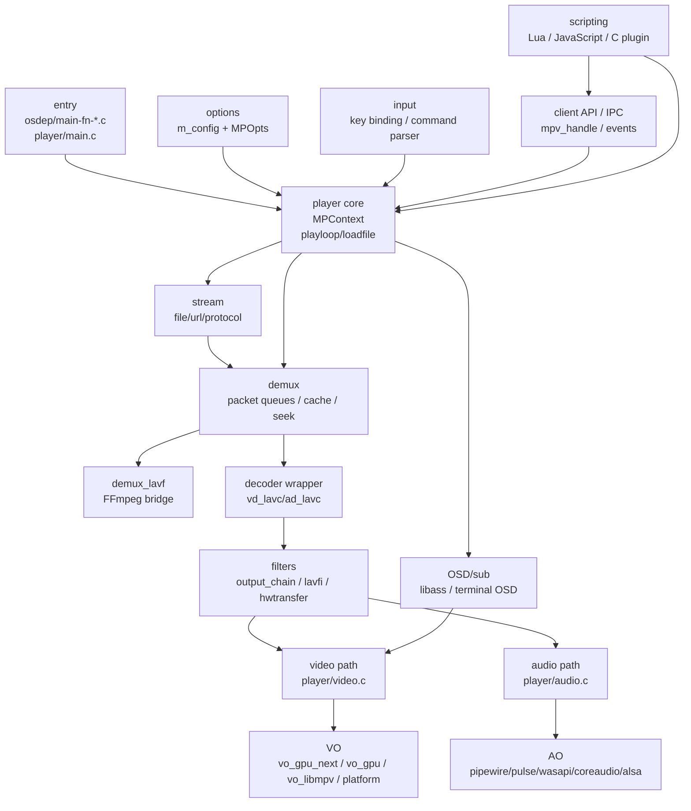
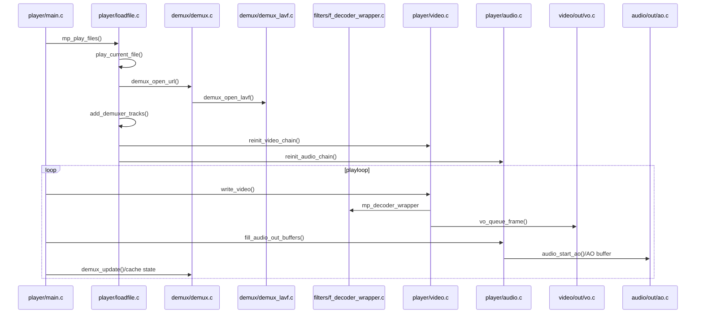
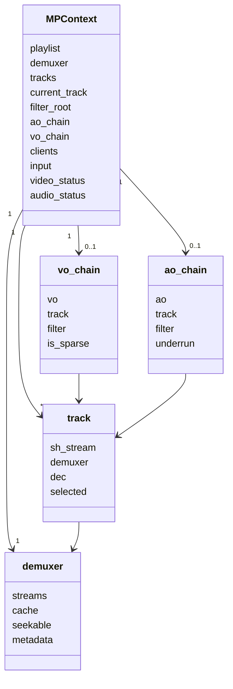
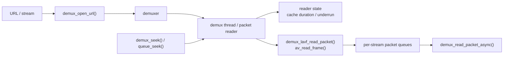
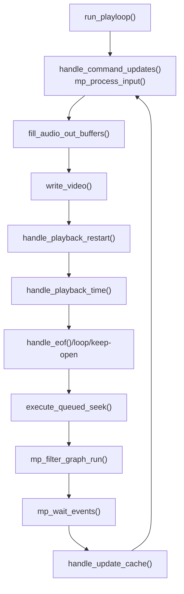
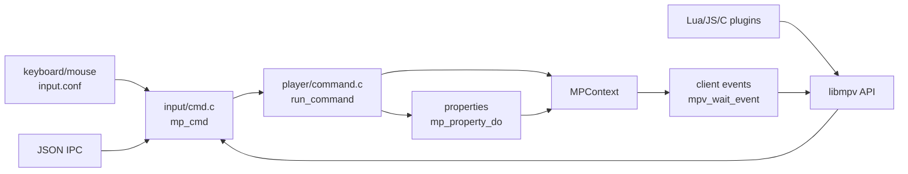

# mpv 整体架构

mpv 的核心不是“一个解码器”，而是 `MPContext` 驱动的播放器状态机。它把输入命令、播放列表、demuxer、decoder/filter、音视频输出、脚本和 libmpv 客户端事件都收束到 `player/`。

这张图回答“读源码时先看哪些模块，以及数据/控制大致怎么流动”。

源码入口：

- `osdep/main-fn-unix.c:3`、`osdep/main-fn-win.c:56`、`osdep/main-fn-mac.c:4` 是平台 `main()` 包装。
- `player/main.c:446` `mpv_main()` 负责命令行生命周期。
- `player/main.c:256` `mp_create()` 构造 `MPContext`、global、client API。
- `player/main.c:335` `mp_initialize()` 解析配置并初始化 core。
- `player/core.h:235` `struct MPContext` 保存播放状态、当前 track、demuxer、filter root、VO/AO、client 和 playlist。
- `options/options.c:479` `mp_opts[]` 定义主选项表，`options/options.c:1194` `mp_opt_root` 是根配置组。

## 主播放流程

这张图回答“播放一个文件时，从 URL 到音视频输出经历哪些真实函数”。

源码入口：

- `player/loadfile.c:2080` `mp_play_files()` 是播放列表循环。
- `player/loadfile.c:1630` `play_current_file()` 管理单个文件生命周期。
- `player/loadfile.c:1216` `open_demux_reentrant()` 打开主 demuxer。
- `demux/demux.c:3485` `demux_open_url()` 从 URL 创建 stream 并选择 demuxer。
- `demux/demux_lavf.c:973` `demux_open_lavf()` 桥接 FFmpeg libavformat。
- `player/loadfile.c:433` `add_demuxer_tracks()` 把 demux stream 变成播放器 track。
- `player/video.c:204` `reinit_video_chain()`，`player/audio.c:546` `reinit_audio_chain()` 建立当前 AV 链。
- `player/playloop.c:1256` `run_playloop()` 是播放调度主循环。

## 核心状态对象

这张图回答“mpv 的对象关系为什么经常从 `mpctx` 出发，而不是从某个 codec 或 renderer 出发”。

源码入口：

- `player/core.h:104` `struct track` 持有 demuxer、stream、decoder。
- `player/core.h:157` `struct vo_chain` 绑定视频 track、filter chain 和 VO。
- `player/core.h:180` `struct ao_chain` 绑定音频 track、filter chain 和 AO。
- `player/core.h:309` `tracks` 保存所有轨道，`player/core.h:317` `current_track` 保存当前选中的音频/视频/字幕轨道。
- `player/core.h:319` `filter_root` 是 filter graph 根。

## demux 与缓存

mpv 自己维护 demux 包队列、缓存状态和 seek 调度，FFmpeg 主要作为 `demux_lavf` 后端。不要把 `av_read_frame()` 误认为播放器主循环；播放器读包入口在 mpv 的 demux 队列层。

源码入口：

- `demux/demux.c:1187` `demux_start_thread()` 启动异步 demux。
- `demux/demux.c:2162` `read_packet()` 从具体 demuxer 拉包。
- `demux/demux.c:2624` `dequeue_packet()` 从 stream 队列取包。
- `demux/demux.c:2770` `demux_read_packet_async()` 是 decoder/filter 侧读包入口。
- `demux/demux.c:3798` `demux_seek()` 接收播放器 seek。
- `demux/demux.c:4167` `update_cache()` 更新缓存状态。
- `demux/demux.c:4513` `demux_get_reader_state()` 暴露缓存/seek range 给属性和播放循环。
- `demux/demux_lavf.c:1217` `demux_lavf_read_packet()` 调用 libavformat 读取 packet。

## 播放循环

`run_playloop()` 一次迭代会处理输入、命令、音频补包、视频出帧、播放重启、时间线、EOF、seek、OSD、filter graph 和缓存。很多“卡住”“seek 后没画面”“缓存一直低”的问题，都要从这个函数看状态顺序。

源码入口：

- `player/playloop.c:109` `mp_process_input()` 从输入队列读取命令。
- `player/command.c:7783` `handle_command_updates()` 处理 deferred command 更新。
- `player/playloop.c:493` `execute_queued_seek()` 执行排队 seek。
- `player/playloop.c:706` `handle_update_cache()` 管理低缓存暂停。
- `player/playloop.c:1124` `handle_playback_time()` 选择当前播放时钟。
- `player/playloop.c:1149` `handle_playback_restart()` 完成 A/V ready 到 playing 的切换。
- `player/playloop.c:1226` `handle_eof()` 判断 EOF。
- `filters/filter.c:211` `mp_filter_graph_run()` 推动 filter graph。

## 输入、命令、脚本和 libmpv

输入、脚本、JSON IPC 和 libmpv API 最终都进入同一套 command/property/event 机制。这是 mpv 很适合嵌入和自动化的原因，也是 API 兼容性压力的来源。

源码入口：

- `input/input.c:1670` `mp_input_init()` 初始化输入系统。
- `input/input.c:1356` `mp_input_read_cmd()` 被播放循环读取。
- `input/cmd.c:449` `mp_input_parse_cmd_str()` 解析命令字符串。
- `player/command.c:5532` `run_command()` 执行命令。
- `player/command.c:4693` `mp_property_do()` 是属性访问总入口。
- `player/client.c:609` `mpv_create()`，`player/client.c:665` `mpv_initialize()` 是 libmpv 生命周期入口。
- `player/client.c:1144` `mpv_command()`，`player/client.c:1309` `mpv_set_property()`，`player/client.c:1536` `mpv_observe_property()` 是常见 API。
- `player/client.c:892` `mpv_wait_event()` 读取事件。
- `player/scripting.c:276` `mp_load_scripts()`，`player/scripting.c:262` `mp_load_builtin_scripts()` 加载脚本。
