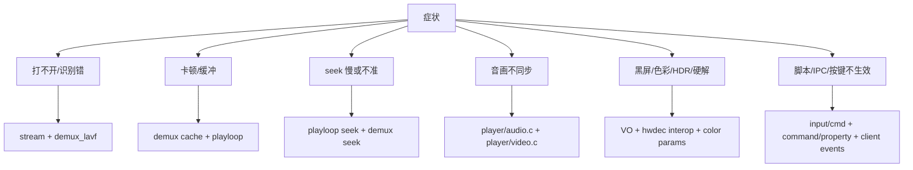

# mpv 工程问题手册

这份手册按“症状 -> 相关源码 -> 优先排查 -> 是否适合改源码”组织。mpv 很多问题来自配置、构建选项、平台驱动和外部库组合，不应一开始就判断为 core bug。

## 总体排查路径

这张图回答“遇到播放问题先在哪一层切入”。

通用命令：

- `mpv --no-config --msg-level=all=v file`：排除用户配置和脚本干扰。
- `mpv --log-file=mpv.log --msg-level=all=trace file`：收集完整日志。
- `mpv --profile=fast file`：验证是否是渲染负载问题。
- `mpv --hwdec=no file` 与 `mpv --hwdec=auto-safe file`：对比软解/硬解。
- `mpv --vo=gpu-next file`、`mpv --vo=gpu file`、`mpv --vo=null --ao=null file`：分离渲染、解码和 demux。

## 启动慢或打开失败

症状：

- URL 或大文件打开很慢。
- 文件格式识别错误。
- 网络流打开后长时间无画面。

源码入口：

- `stream/stream.c:470` `stream_create()` 创建 stream。
- `demux/demux.c:3485` `demux_open_url()` 打开 URL。
- `demux/demux_lavf.c:423` `lavf_check_file()` 做格式探测。
- `demux/demux_lavf.c:973` `demux_open_lavf()` 调用 FFmpeg 打开输入和查流。
- `demux/demux_lavf.c:687` `handle_new_stream()` 导入 AVStream 为 mpv stream。
- `player/loadfile.c:1216` `open_demux_reentrant()` 是播放侧打开 demuxer 的入口。

优先排查：

- 用 `--demuxer-lavf-probesize`、`--demuxer-lavf-analyzeduration` 限制或扩大探测，判断是探测不足还是探测过慢。
- 网络源先验证 FFmpeg 是否能稳定读；mpv 依赖 libavformat 对很多协议的行为。
- 加 `--no-config --load-scripts=no` 排除脚本 hook，例如 ytdl hook。

是否适合改源码：

- 格式探测错误优先看 `demux/demux_lavf.c` 和 FFmpeg 版本；如果 FFmpeg 本身识别不出，mpv 源码改动通常不是第一选择。
- 特定 URL scheme 或嵌套协议可以考虑改 `stream/` 或 lavf option 传递。

## seek 慢、不准或 seek 后卡住

症状：

- seek 后等待很久才出图。
- seek 点不准，尤其是非关键帧、直播、HLS 或无索引文件。
- seek 后音频先出、视频迟迟不出。

源码入口：

- `player/playloop.c:455` `queue_seek()` 排队 seek。
- `player/playloop.c:493` `execute_queued_seek()` 执行 seek。
- `player/playloop.c:289` `mp_seek()` 更新播放器 seek 状态。
- `demux/demux.c:3798` `demux_seek()` 进入 demux 层 seek。
- `demux/demux.c:3816` `queue_seek()` 把 seek 交给 demux 线程。
- `demux/demux.c:2419` `execute_seek()` 在 demux 内部执行。
- `demux/demux_lavf.c:1327` `demux_seek_lavf()` 桥接到 libavformat seek。
- `player/video.c:466` `video_output_image()` 处理精确 seek 后的丢帧直到目标 PTS。

优先排查：

- 对比 `--hr-seek=no` 和默认行为，确认是否是精确 seek 代价。
- 对网络流或 HLS，观察 `demuxer-cache-state`、`cache-buffering-state`、`seeking` 属性。
- 对无索引或时间戳异常文件，FFmpeg demuxer 的 seek 精度通常决定上限。

是否适合改源码：

- seek 策略、等待条件和播放重启可以看 `player/playloop.c`。
- 容器索引、时间戳和关键帧定位问题多数在 demuxer/FFmpeg 或文件本身。

## 卡顿、缓冲和低延迟

症状：

- 网络播放频繁 buffering。
- 本地文件也周期性卡顿。
- 低延迟直播延迟越来越大。

源码入口：

- `demux/demux.c:4167` `update_cache()` 更新 demux cache。
- `demux/demux.c:4513` `demux_get_reader_state()` 提供 cache duration/seek ranges。
- `player/playloop.c:706` `handle_update_cache()` 决定是否 paused-for-cache。
- `player/playloop.c:1149` `handle_playback_restart()` 决定何时从 ready 进入 playing。
- `player/audio.c:869` `fill_audio_out_buffers()` 填 AO buffer。
- `player/video.c:1048` `write_video()` 填 VO frame。

优先排查：

- `--no-cache`、`--cache=yes`、`--demuxer-max-bytes`、`--demuxer-readahead-secs` 对比缓存策略。
- `--untimed --no-audio` 可以判断是解码/渲染速度还是 A/V 同步等待。
- 低延迟源优先试 `--profile=low-latency`，但要确认是否牺牲抗抖动。

是否适合改源码：

- 缓存状态误判、pause 条件和 underrun 传播可以改 `player/playloop.c`。
- 网络吞吐不足或服务器分片太慢通常不是 mpv core 能解决。

## 音画不同步

症状：

- 音频领先或落后视频。
- display sync 模式下视频轻微抖动。
- 变速播放或 SPDIF passthrough 后同步异常。

源码入口：

- `player/audio.c:617` `written_audio_pts()` 估算写入音频 PTS。
- `player/audio.c:624` `playing_audio_pts()` 估算正在播放的音频 PTS。
- `player/audio.c:832` `audio_start_ao()` 启动 AO。
- `audio/out/buffer.c:295` `ao_get_delay()` 读取 AO delay。
- `player/video.c:343` `adjust_sync()` 调整 A/V delay。
- `player/video.c:590` `update_avsync_before_frame()` 在送帧前更新同步。
- `player/video.c:810` `handle_display_sync_frame()` 处理 display sync。

优先排查：

- `--video-sync=audio`、`--video-sync=display-resample`、`--audio-delay` 做定位。
- SPDIF passthrough 场景要注意音频不能任意重采样补偿。
- 如果只有某个 AO 出问题，换 `--ao=` 后端排查平台 delay 报告。

是否适合改源码：

- A/V 策略问题看 `player/video.c` 和 `player/audio.c`。
- AO delay 返回不准通常在 `audio/out/` 的具体后端。

## 黑屏、硬解失败或色彩/HDR 异常

症状：

- 有声音无画面。
- `--hwdec` 后黑屏或颜色错误。
- HDR/Dolby Vision/色彩矩阵看起来不对。

源码入口：

- `player/video.c:558` `check_for_hwdec_fallback()` 处理硬解 fallback。
- `video/out/vo_gpu_next.c:998` `draw_frame()` 是 gpu-next 绘制入口。
- `video/out/vo_gpu_next.c:2057` `load_hwdec_api()` 加载硬解 interop。
- `video/out/gpu/hwdec.c:168` `ra_hwdec_mapper_map()` map 硬件帧。
- `video/out/gpu/video.c:3407` `gl_video_render_frame()` 是旧 GPU renderer 主入口。
- `video/out/vo.c:921` `render_frame()` 调用 VO driver。

优先排查：

- 对比 `--hwdec=no`、`--hwdec=auto-safe`、`--hwdec=<backend>-copy`。
- 对比 `--vo=gpu-next` 和 `--vo=gpu`。
- 用 `--profile=fast` 判断是不是 shader/scale/tonemap 负载。
- 检查日志里的 `hwdec-current`、`hwdec-interop`、`VO:`、`Using hardware decoding`。

是否适合改源码：

- interop map 失败看具体 `video/out/hwdec/` 或 `video/out/opengl/hwdec_*`。
- HDR/tone mapping 更多在 libplacebo 或 renderer 参数传递层；先确认 libplacebo 版本和构建选项。

## 字幕、OSD 和脚本 UI 问题

症状：

- 字幕延迟、样式不对或缺字体。
- OSC、stats、console 不出现。
- 脚本消息或快捷键不生效。

源码入口：

- `player/sub.c` 管理字幕轨道更新和预读。
- `player/osd.c` 管理 OSD 状态。
- `player/scripting.c:276` `mp_load_scripts()` 加载用户脚本。
- `player/scripting.c:262` `mp_load_builtin_scripts()` 加载内置脚本。
- `player/command.c:6740` `cmd_script_binding()` 处理 script binding。
- `player/command.c:6792` `cmd_script_message_to()` 处理定向脚本消息。
- `input/input.c:1525` `bind_keys()` 解析按键绑定。
- `input/input.c:1356` `mp_input_read_cmd()` 被播放循环读取。

优先排查：

- `--no-config --load-scripts=no` 判断是否是用户脚本。
- `--msg-level=cplayer=v,script=v,input=v` 看脚本和输入日志。
- 字幕字体问题先看 libass/fontconfig 环境和 `--sub-fonts-dir`。

是否适合改源码：

- 内置脚本行为可看 `player/lua/` 和生成的内置脚本资源。
- 兼容性相关命令/属性变更要谨慎，因为脚本、JSON IPC 和 libmpv 都可能依赖。

## 嵌入式 libmpv 问题

症状：

- 嵌入应用不刷新画面。
- 退出时崩溃或卡住。
- OpenGL FBO 尺寸、翻转或 swap timing 错误。

源码入口：

- `player/client.c:609` `mpv_create()` 创建 client handle。
- `player/client.c:665` `mpv_initialize()` 初始化。
- `video/out/vo_libmpv.c:164` `mpv_render_context_create()` 创建渲染上下文。
- `video/out/vo_libmpv.c:230` `mpv_render_context_set_update_callback()` 设置回调。
- `video/out/vo_libmpv.c:336` `mpv_render_context_render()` 渲染。
- `video/out/vo_libmpv.c:429` `mpv_render_context_report_swap()` 上报 swap。
- `video/out/vo_libmpv.c:252` `mpv_render_context_free()` 释放。

优先排查：

- 确保 update callback 触发后在正确线程调用 render。
- 退出前先释放 render context，再销毁 mpv handle。
- OpenGL 上下文必须和创建 render context 的线程/上下文约束一致。

是否适合改源码：

- 大多数嵌入问题是 API 使用时序问题。只有在日志显示 `vo_libmpv` 状态机无法退出或 frame 队列异常时，才进入源码调试。
