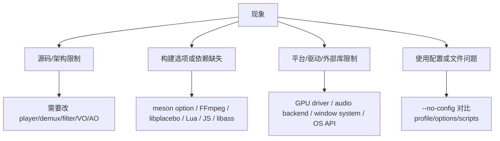
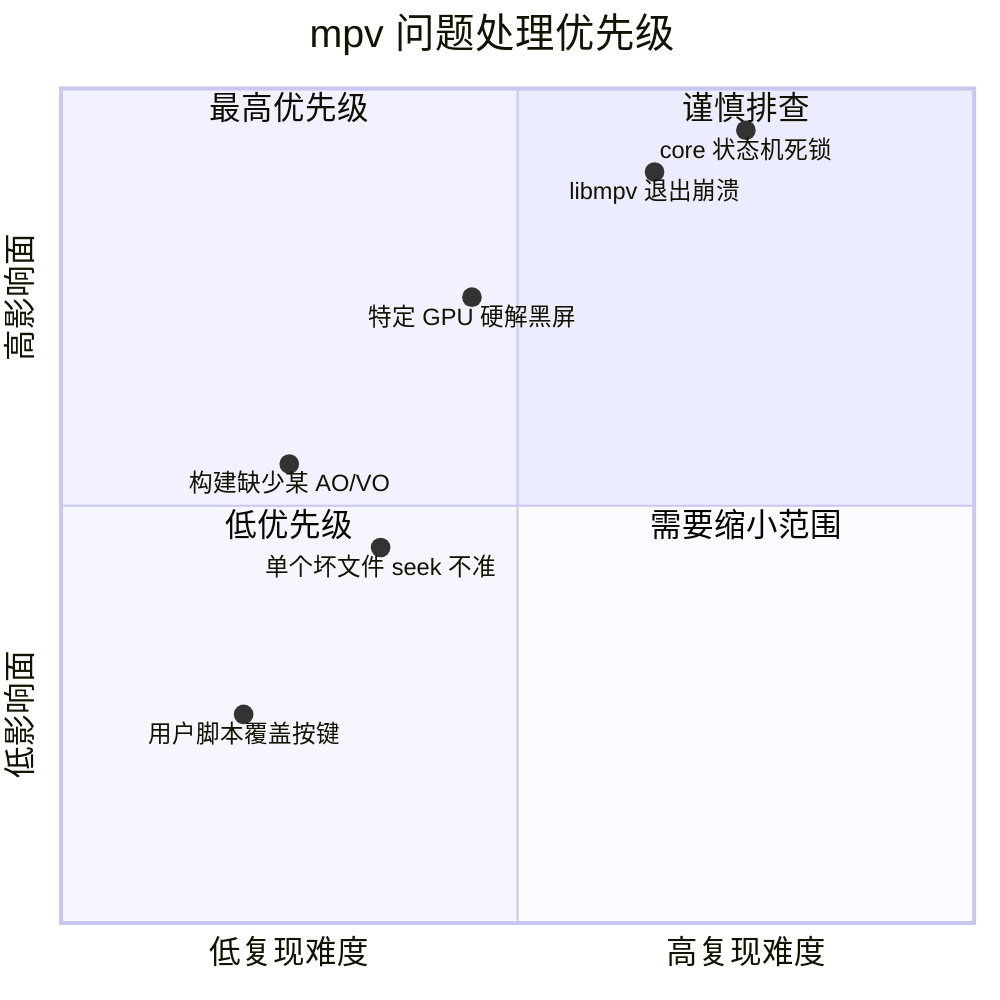

# mpv 缺陷与风险分类

mpv 问题要先分类：源码限制、构建选项缺失、平台/驱动限制、使用配置问题。不要因为一个后端失败就判断“mpv 不支持”。

## 源码或架构限制

典型表现：

- 播放循环某个状态组合没有覆盖，例如 seek + keep-open + sparse video。
- 某个命令/属性没有暴露所需状态。
- 某个 VO/AO 后端缺少特定能力上报。
- libmpv render context 生命周期在复杂嵌入场景下暴露 race。

源码入口：

- `player/playloop.c:1256` `run_playloop()` 是状态组合最多的地方。
- `player/loadfile.c:1630` `play_current_file()` 管理单文件生命周期。
- `player/command.c:4693` `mp_property_do()` 处理属性。
- `player/command.c:5532` `run_command()` 处理命令。
- `video/out/vo.h:317` `struct vo_driver` 定义 VO 能力。
- `audio/out/ao.h` 定义 AO 后端接口。
- `video/out/vo_libmpv.c:336` `mpv_render_context_render()` 是嵌入渲染关键点。

判断方法：

- `--no-config` 下仍稳定复现。
- 更换 VO/AO、禁用硬解、禁用脚本后仍复现。
- 日志显示 core 状态矛盾，而不是外部库返回错误。

## 构建选项或依赖缺失

典型表现：

- 某个 VO/AO 不存在。
- Lua/JavaScript 脚本不可用。
- libass 字幕或 libplacebo GPU 路径能力不足。
- FFmpeg 没有编进某 codec、protocol、hwaccel。

源码入口：

- `meson.build` 定义依赖探测和源文件条件编译。
- `meson.options` 定义可配置 feature。
- `audio/out/ao.c:58` `audio_out_drivers[]` 只包含构建启用的 AO。
- `video/out/vo.c:70` `video_out_drivers[]` 只包含构建启用的 VO。
- `player/scripting.c:47` `scripting_backends[]` 只包含可用脚本后端。
- `player/lua.c:1351` `mp_scripting_lua`，`player/javascript.c:1253` `mp_scripting_js`。

判断方法：

- 看 `mpv --version` 的构建配置。
- 用 `--vo=help`、`--ao=help`、`--hwdec=help`、`--vd=help` 确认运行时可用项。
- Windows/macOS/Linux 发行包的功能集可能不同，不要只看源码是否存在。

## 平台、驱动或外部库限制

典型表现：

- 某 GPU 驱动硬解 map 失败。
- Wayland/X11/Windows/macOS 下窗口、HDR、vsync 行为不同。
- AO delay 报告不准导致音画不同步。
- FFmpeg/libplacebo/libass 版本差异引发行为差异。

源码入口：

- `video/out/gpu/hwdec.c:168` `ra_hwdec_mapper_map()` 是硬件 frame map 失败常见点。
- `video/out/vo_gpu_next.c:2057` `load_hwdec_api()` 受平台 interop 能力影响。
- `audio/out/buffer.c:295` `ao_get_delay()` 依赖 AO 后端 delay。
- `video/out/vo.c:921` `render_frame()` 汇聚 VO 绘制。
- `demux/demux_lavf.c:973` `demux_open_lavf()` 依赖 FFmpeg 版本和协议能力。

判断方法：

- 同一文件在 `--hwdec=no` 下正常，硬解才异常，多半是硬解/driver/interop。
- 同一文件在另一 VO/AO 正常，多半是后端或平台层。
- 同一文件在不同 FFmpeg/libplacebo 版本行为不同，先对外部库做 bisect 或版本对比。

## 使用配置或文件问题

典型表现：

- 用户脚本改写 URL、profile、滤镜或按键。
- `input.conf` 绑定覆盖默认行为。
- 文件时间戳坏、容器索引缺失、字幕字体缺失。
- HDR/色彩选项被手动覆盖导致错误输出。

源码入口：

- `options/parse_commandline.c:121` `m_config_parse_mp_command_line()` 解析 CLI。
- `options/options.c:479` `mp_opts[]` 定义选项。
- `input/input.c:1570` `parse_config()` 解析 input 配置。
- `player/scripting.c:276` `mp_load_scripts()` 加载脚本。
- `player/command.c:7783` `handle_command_updates()` 处理命令触发的状态更新。

判断方法：

- 第一步运行 `mpv --no-config --load-scripts=no file`。
- 第二步逐个恢复用户配置、脚本、profile。
- 文件问题用 `ffprobe`、其他播放器和 mpv `--demuxer-lavf-o` 参数交叉验证。

## 风险优先级

处理建议：

- 高影响且 `--no-config` 可复现：进入源码调试。
- 只在一个平台/驱动复现：先收集 VO/AO/hwdec 日志和驱动版本。
- 只在用户配置下复现：优先做配置最小化。
- 只在一个文件复现：优先定位容器、时间戳、索引、字幕和 codec side data。
