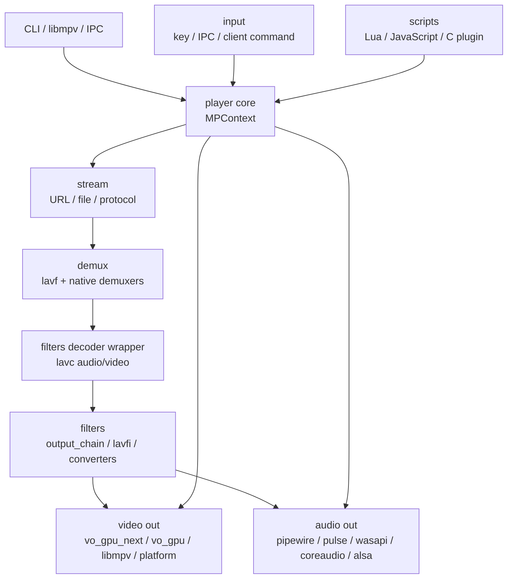

# mpv 项目文档

源码快照：
- 本机路径：`D:/github/mpv`
- Git describe：`v0.40.0-403-gcac8fe0ddb-dirty`
- Commit：`cac8fe0ddb808e0c81c4694fc34db42cdc48a619`
- 文档日期：2026-06-08

mpv 是一个以播放器状态机为核心的媒体播放器。它把 FFmpeg/libavformat/libavcodec、libplacebo、libass、平台音视频输出、输入系统、脚本系统、JSON IPC 和 libmpv API 组合在 `player/` 主循环里，而不是像 FFmpeg 那样主要提供一组独立媒体库。

源码入口：

- `player/main.c:256` `mp_create()` 创建 `MPContext`。
- `player/main.c:335` `mp_initialize()` 初始化配置、输入、脚本和播放环境。
- `player/main.c:446` `mpv_main()` 是命令行入口。
- `player/core.h:235` `struct MPContext` 是核心状态对象。
- `player/core.h:104` `struct track` 连接 demux stream、decoder 和当前选择状态。
- `player/core.h:157` `struct vo_chain`，`player/core.h:180` `struct ao_chain` 是视频/音频播放链。

## 文档索引

- [整体架构](architecture.md)：模块分层、主播放流程、数据结构和调度边界。
- [渲染与硬解](rendering-and-hwdec.md)：VO、libplacebo/OpenGL 路径、硬解 interop 和 fallback。
- [工程问题手册](engineering-playbook.md)：启动、seek、缓存、同步、字幕、脚本/IPC、性能排查。
- [缺陷与风险](gaps-and-risks.md)：源码限制、构建选项、平台/驱动、使用配置四类问题。
- [面试问答](interview-qa.md)：架构、调试、源码导航和工程取舍题。

## 快速定位

- 启动和核心：`player/main.c`，`player/core.h`。
- 播放文件生命周期：`player/loadfile.c`。
- 主循环、seek、缓存、输入处理：`player/playloop.c`。
- 音频链：`player/audio.c`，`audio/out/`。
- 视频链：`player/video.c`，`video/out/`。
- 解码/filter：`filters/f_decoder_wrapper.c`，`filters/f_output_chain.c`，`filters/f_lavfi.c`。
- demux：`demux/demux.c`，`demux/demux_lavf.c`。
- libmpv API：`player/client.c`，`include/mpv/`，`video/out/vo_libmpv.c`。
- 输入和命令：`input/input.c`，`input/cmd.c`，`player/command.c`。
- 脚本：`player/scripting.c`，`player/lua.c`，`player/javascript.c`。
