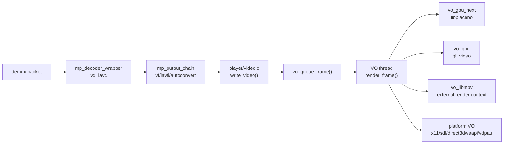
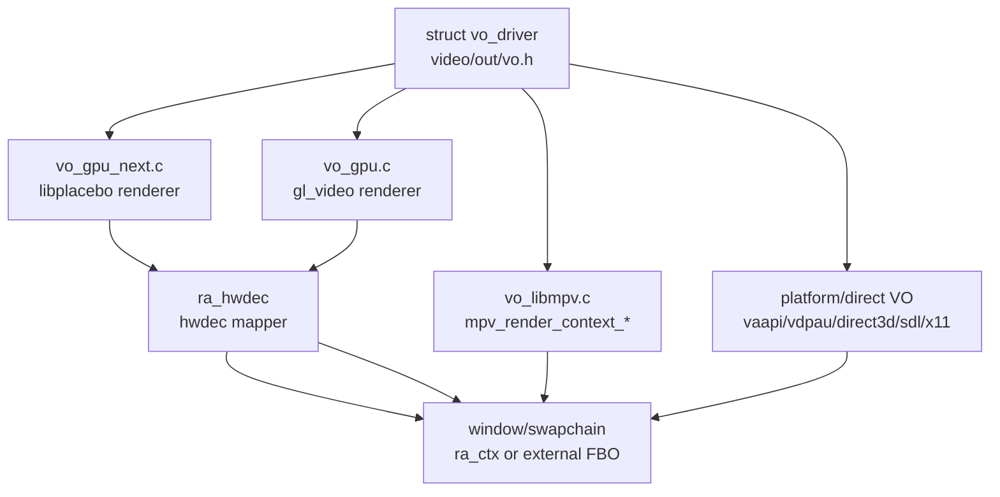
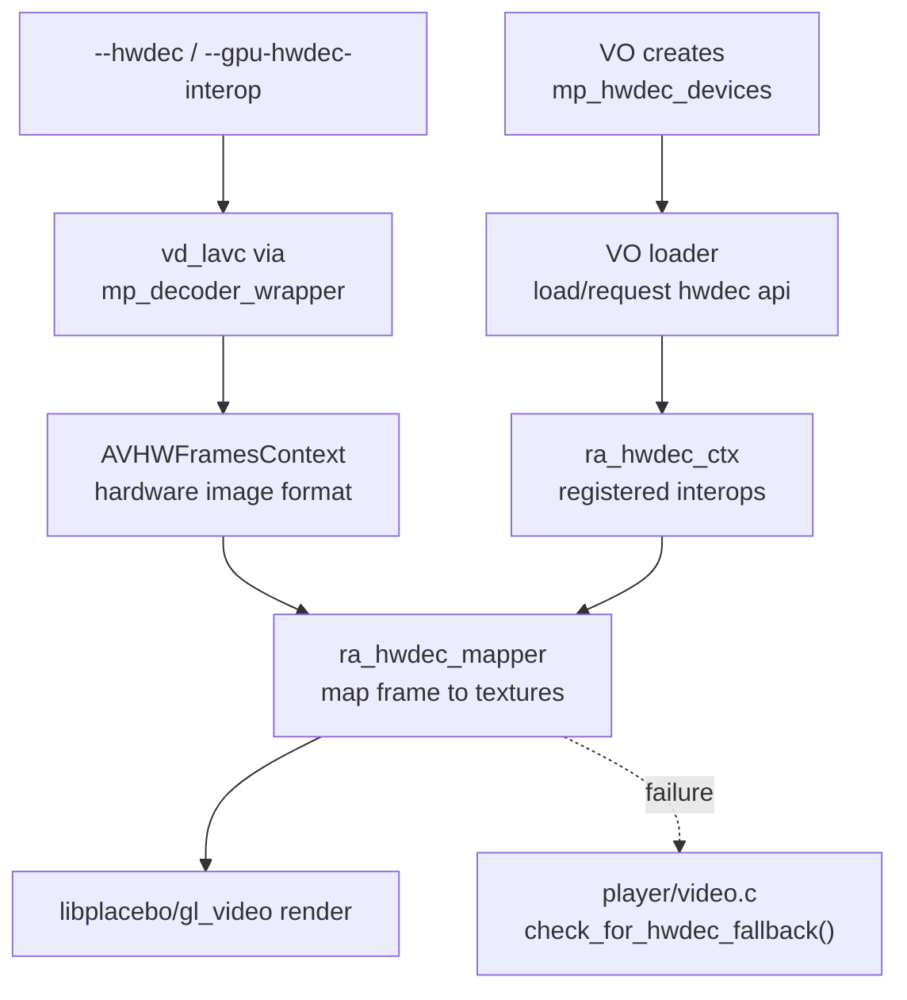
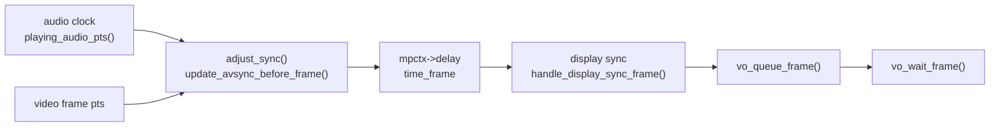
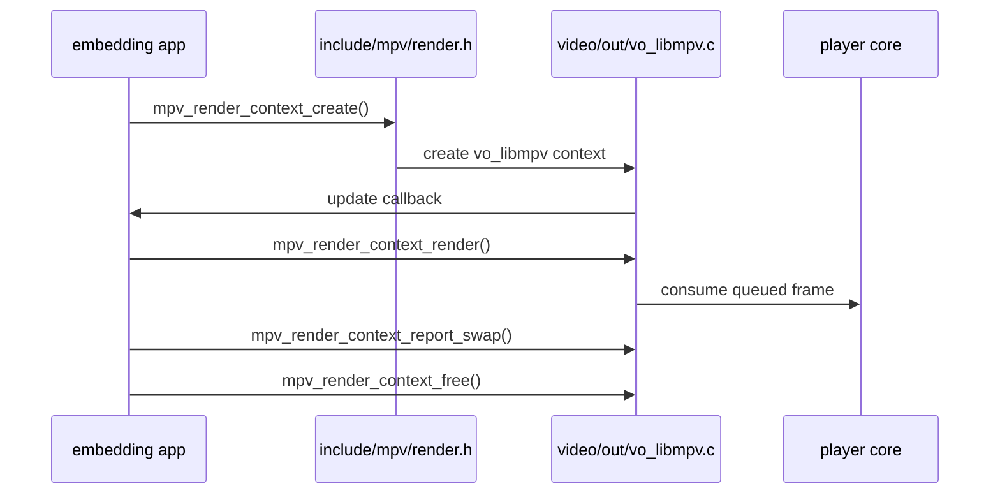

# mpv 渲染与硬解

mpv 的视频路径分两段：`player/video.c` 负责解码、同步、丢帧、排队；`video/out/` 负责真正的显示、GPU 渲染或嵌入式 libmpv 渲染。硬解不是单独的“decoder 开关”，它需要 decoder、filter、VO 和 GPU interop 同时成立。

## 视频输出链路

这张图回答“一个 decoded frame 到屏幕之间经过哪些模块”。

源码入口：

- `player/video.c:171` `init_video_decoder()` 创建视频 decoder wrapper。
- `player/video.c:204` `reinit_video_chain()` 建立视频链。
- `player/video.c:466` `video_output_image()` 从 filter/decoder 拉新帧。
- `player/video.c:946` `schedule_frame()` 计算帧显示时间。
- `player/video.c:1048` `write_video()` 推动视频输出。
- `video/out/vo.c:70` `video_out_drivers[]` 是 VO 注册表。
- `video/out/vo.c:334` `init_best_video_out()` 选择 VO。
- `video/out/vo.c:880` `vo_queue_frame()` 把 frame 送到 VO。
- `video/out/vo.c:921` `render_frame()` 在 VO 侧调用 driver `draw_frame`。

## VO 后端边界

这张图回答“`--vo=gpu-next`、`--vo=gpu`、嵌入式渲染和平台 VO 的职责差异”。

源码入口：

- `video/out/vo.h:317` `struct vo_driver` 定义 VO driver 接口。
- `video/out/vo_gpu_next.c:998` `draw_frame()` 是 gpu-next 的每帧绘制入口。
- `video/out/vo_gpu_next.c:2565` `video_out_gpu_next` 注册 gpu-next。
- `video/out/vo_gpu.c:73` `draw_frame()` 是旧 `vo_gpu` 绘制入口。
- `video/out/vo_gpu.c:327` `video_out_gpu` 注册旧 GPU VO。
- `video/out/gpu/video.c:3407` `gl_video_render_frame()` 是旧 GPU renderer 的主渲染函数。
- `video/out/vo_libmpv.c:744` `video_out_libmpv` 是嵌入式 VO。

## 硬解 interop

硬解链路里，decoder 产出的可能是硬件帧格式；VO 必须能加载对应 interop，并把硬件 frame map 成 renderer 可消费的 texture。如果 map 失败或 VO 不支持，播放器要么回落 copy，要么触发 hwdec fallback。

源码入口：

- `video/hwdec.c:20` `hwdec_devices_create()` 创建 VO/decoder 共享的硬解设备集合。
- `video/hwdec.c:89` `hwdec_devices_set_loader()` 注册懒加载函数。
- `video/out/vo_gpu_next.c:2057` `load_hwdec_api()` 在 gpu-next 中加载 interop。
- `video/out/vo_gpu.c:132` `request_hwdec_api()` 在旧 GPU VO 中转到 VO 线程加载。
- `video/out/gpu/hwdec.c:250` `ra_hwdec_ctx_init()` 初始化硬解 interop 上下文。
- `video/out/gpu/hwdec.c:298` `ra_hwdec_ctx_load_fmt()` 按图像格式加载 interop。
- `video/out/gpu/hwdec.c:336` `ra_hwdec_get()` 查找支持某个 hw image format 的 interop。
- `video/out/gpu/hwdec.c:128` `ra_hwdec_mapper_create()` 创建 mapper。
- `video/out/gpu/hwdec.c:168` `ra_hwdec_mapper_map()` map 单帧。
- `player/video.c:558` `check_for_hwdec_fallback()` 检查硬解失败后的回退。

## 同步和丢帧

mpv 的视频同步在播放器层，不在 renderer 内。renderer 提供显示队列和 vsync 信息，播放器计算 `time_frame`、A/V diff、display sync 补偿，并决定是否丢帧或等待。

源码入口：

- `player/audio.c:617` `written_audio_pts()` 估算已写入音频位置。
- `player/audio.c:624` `playing_audio_pts()` 估算正在播放的音频位置。
- `player/video.c:343` `adjust_sync()` 调整 A/V 同步。
- `player/video.c:590` `update_avsync_before_frame()` 在送帧前更新同步状态。
- `player/video.c:810` `handle_display_sync_frame()` 处理 display sync。
- `player/video.c:946` `schedule_frame()` 安排显示。
- `video/out/vo.c:897` `vo_wait_frame()` 等待 VO frame 消费。

## libmpv 渲染

libmpv 嵌入模式不是让应用直接拿 decoder frame，而是创建 `mpv_render_context`，由宿主提供 OpenGL FBO 或软件 surface，mpv 的 `vo_libmpv` 在外部 swapchain 上渲染。

源码入口：

- `include/mpv/render.h:578` 声明 `mpv_render_context_create()`。
- `include/mpv/render.h:709` 声明 `mpv_render_context_render()`。
- `video/out/vo_libmpv.c:164` `mpv_render_context_create()` 创建 render context。
- `video/out/vo_libmpv.c:230` `mpv_render_context_set_update_callback()` 设置更新回调。
- `video/out/vo_libmpv.c:336` `mpv_render_context_render()` 渲染。
- `video/out/vo_libmpv.c:429` `mpv_render_context_report_swap()` 报告 swap。
- `video/out/vo_libmpv.c:252` `mpv_render_context_free()` 释放 context。
