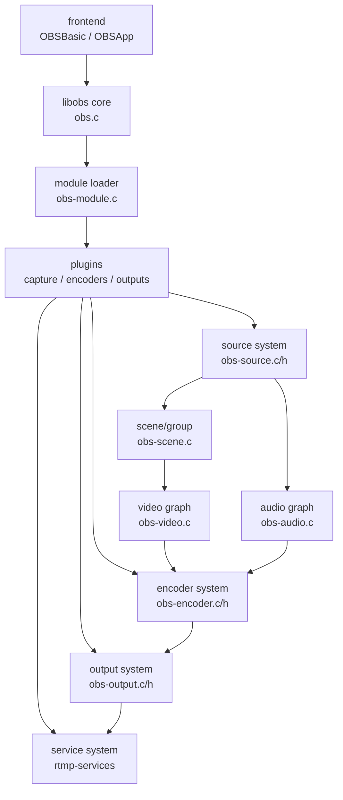
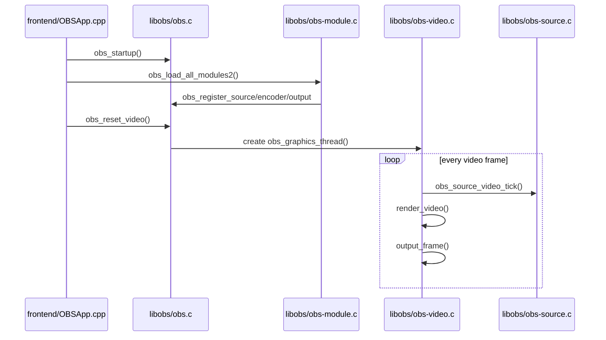
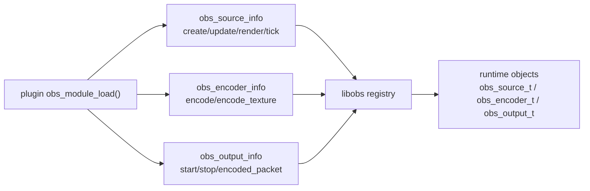

# OBS Studio 整体架构

OBS 的核心是 `libobs`，它提供 source、scene、audio、video、encoder、output、service 的统一抽象；平台能力和具体格式能力通过插件注册进来。前端 UI 主要负责编排场景、创建 source/encoder/output，并调用 libobs API。

源码入口：

- `frontend/OBSApp.cpp:1112` 调用 `obs_startup()`。
- `frontend/OBSApp.cpp:1866` 调用 `obs_load_all_modules2()`；`:1870` 调用 `obs_post_load_modules()`。
- `libobs/obs.c:1299` `obs_startup()` 初始化核心上下文。
- `libobs/obs-module.c:578` `obs_load_all_modules2()` 加载模块；`:605` `obs_post_load_modules()` 做后置处理。
- `libobs/obs-module.c:956` `obs_register_source_s()`；`:1126` `obs_register_encoder_s()`。
- `libobs/obs-output.h:41` `struct obs_output_info` 定义 output 插件接口。
- `libobs/obs-source.h:222` `struct obs_source_info` 定义 source 插件接口。
- `libobs/obs-encoder.h:197` `struct obs_encoder_info` 定义 encoder 插件接口。

## 启动和渲染主循环

OBS 启动后先初始化 audio/video，再加载插件。视频渲染线程周期性 tick source、渲染 scene、输出 raw frame 或 GPU texture 给编码器。

源码入口：

- `libobs/obs.c:1504` `obs_reset_video()`；`:689` `obs_init_video()`；`:714` 创建 `obs_graphics_thread`。
- `libobs/obs.c:1580` `obs_reset_audio2()`；`:885` `obs_init_audio()`。
- `libobs/obs-video.c:1099` `obs_graphics_thread_loop()`；`:1163` `obs_graphics_thread()`。
- `libobs/obs-video.c:870` `output_frame()`；`:887` 调用 `render_video()`；`:924` 遍历所有 video mix 输出。
- `libobs/obs-source.c:1292` `obs_source_video_tick()`；`:1362` 调 source 的 `video_tick` 回调。
- `libobs/obs-source.c:2841` source 层 `render_video()`。

## 插件注册模型

OBS 的平台采集、编码器和输出都不是写死在 core 里，而是通过 `obs_source_info`、`obs_encoder_info`、`obs_output_info` 注册。

典型注册点：

- `plugins/win-capture/plugin-main.c:151` 注册 Windows game capture。
- `plugins/linux-v4l2/linux-v4l2.c:33` 注册 V4L2 source。
- `plugins/obs-outputs/obs-outputs.c:63` 注册 RTMP output。
- `plugins/obs-nvenc/nvenc.c:1506` 起注册 NVENC encoder。
- `plugins/obs-ffmpeg/obs-ffmpeg.c:352` 起注册 FFmpeg audio/video encoder。
- `plugins/obs-qsv11/obs-qsv11-plugin-main.c:92` 起注册 QSV encoder。
- `plugins/mac-videotoolbox/encoder.c:1522` 注册 VideoToolbox encoder。
