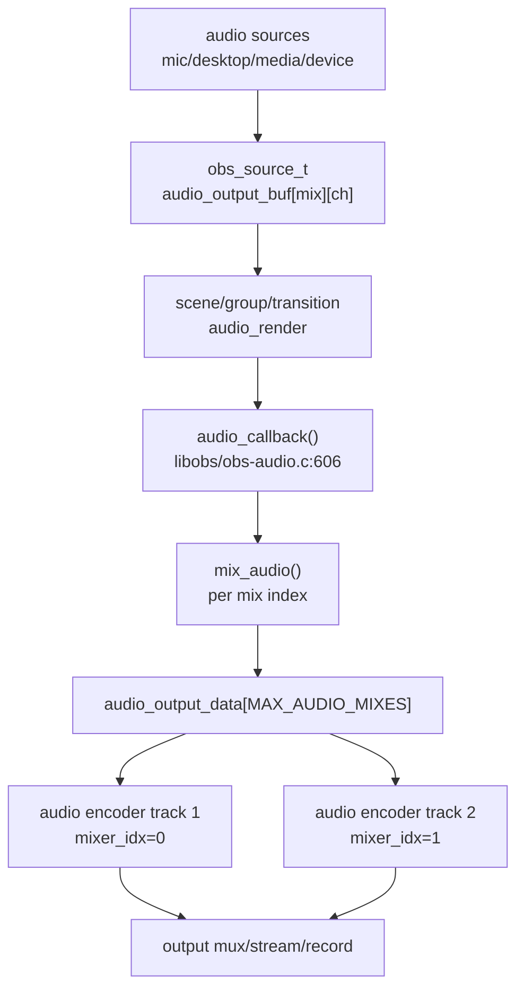
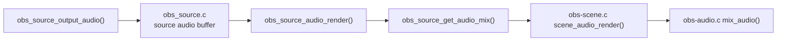
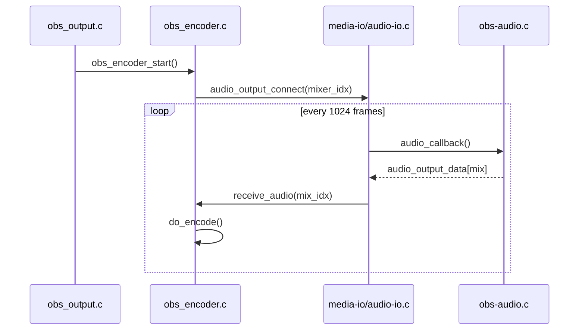

# OBS 音频混音与多音轨

OBS 的“多音轨”不是每个 source 自动生成独立物理轨道，而是每个 source 带一个 mixer mask，libobs 每 1024 帧把 source 混到最多 6 个 mix 中；每个音频编码器再绑定某一个 mix index。

关键常量：

- `libobs/media-io/audio-io.h:28` `MAX_AUDIO_MIXES 6`，OBS 默认最多 6 个音轨 mix。
- `libobs/media-io/audio-io.h:31` `AUDIO_OUTPUT_FRAMES 1024`，音频处理块大小。
- `libobs/media-io/audio-io.h:33` `TOTAL_AUDIO_SIZE`。

## Source 到 mix 的链路

源码入口：

- `libobs/obs-source.c:3964` `obs_source_output_audio()` 接收异步 source 音频。
- `libobs/obs-source.c:5273` `custom_audio_render()`，处理自定义 audio_render source。
- `libobs/obs-source.c:5390` `obs_source_audio_render()`。
- `libobs/obs-source.c:5434` `obs_source_get_audio_mix()`。
- `libobs/obs-scene.c:1613` `scene_audio_render()`。
- `libobs/obs-scene.c:1603` scene 层 `mix_audio()`。
- `libobs/obs-audio.c:606` `audio_callback()`，从 root sources 组织最终混音。
- `libobs/obs-audio.c:139` core 层 `mix_audio()`，把 source buffer 加到 `audio_output_data`。
- `libobs/obs-audio.c:747` 实际调用 core `mix_audio()`。

## 音频输出和编码器绑定

音频编码器不是直接从 source 取音频，而是通过 `audio_output_connect()` 连接到某个 mix index。

源码入口：

- `libobs/obs-encoder.c:167` `obs_audio_encoder_create()`，传入 `mixer_idx`。
- `libobs/obs-encoder.c:351` `audio_output_connect(encoder->media, encoder->mixer_idx, ...)`。
- `libobs/obs-encoder.c:1723` `receive_audio()`。
- `libobs/obs-encoder.c:1390` `do_encode()`。
- `libobs/media-io/audio-io.c:289` `audio_output_connect()`。
- `libobs/media-io/audio-io.c:353` `audio_output_open()`。
- `libobs/media-io/audio-io.c:162` 每次准备 `audio_output_data data[MAX_AUDIO_MIXES]`。
- `libobs/media-io/audio-io.c:202` 对每个 mix 调 `do_audio_output()`。

## 多音轨录制和推流的工程判断

- Source 属于哪些轨道由 source 的 audio mixers mask 决定，查看 `libobs/obs.c:2425` `obs_source_get_audio_mixers(source)`。
- 输出侧如果需要多音轨，必须创建多个音频编码器或让输出连接多个 audio encoder；`libobs/obs-output.c:2451` 起遍历 `MAX_AUDIO_MIXES` 连接 raw audio callback。
- `libobs/obs-output.c:1075` `obs_output_set_audio_encoder()` 把 encoder 设置到 output 的某个音频 slot。
- 推流常见只用一路音频 track；录制容器可以承载多音轨，具体取决于 output/muxer。
- 音频监听不等于推流音轨；监听链路在 `libobs/audio-monitoring`，例如 Windows `wasapi-output.c`、macOS `coreaudio-output.c`、Linux `pulseaudio-output.c`。

常见问题：

| 问题 | 关键检查点 |
|---|---|
| 某个音轨没有声音 | source mixer mask、对应 `mixer_idx` 是否连接 encoder、output 是否支持该 track |
| 桌面音频被采两次 | 是否同时有系统 output capture 和监控设备重复混入，见 `libobs/obs-audio.c:53` 起监控设备检查 |
| 录制多音轨正常但直播只有一路 | RTMP/平台协议和推流 output 支持限制，不能只看 OBS mixer |
| 音频爆音/削波 | `audio-io.c` 的 mix buffer 是否 clipping，source 音量/滤镜是否过大 |
