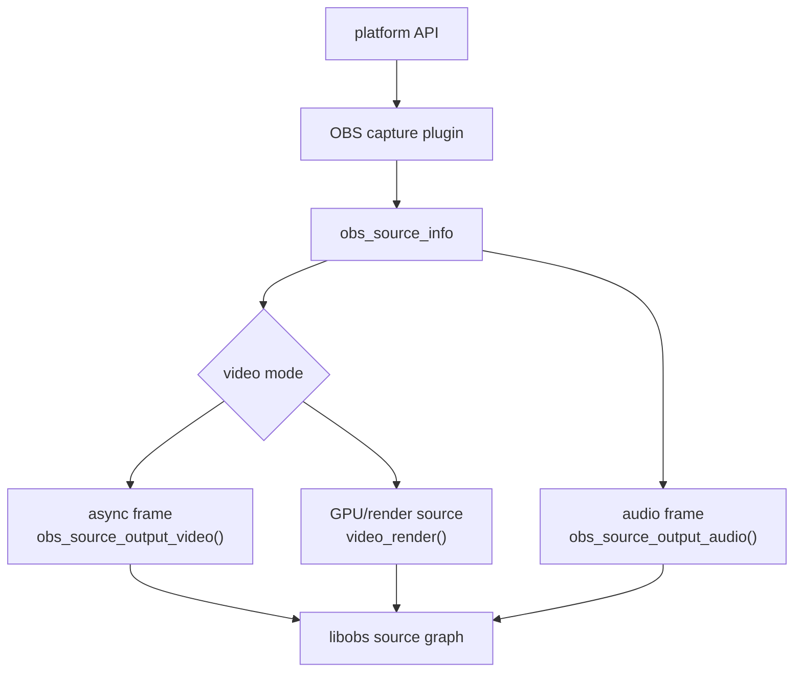
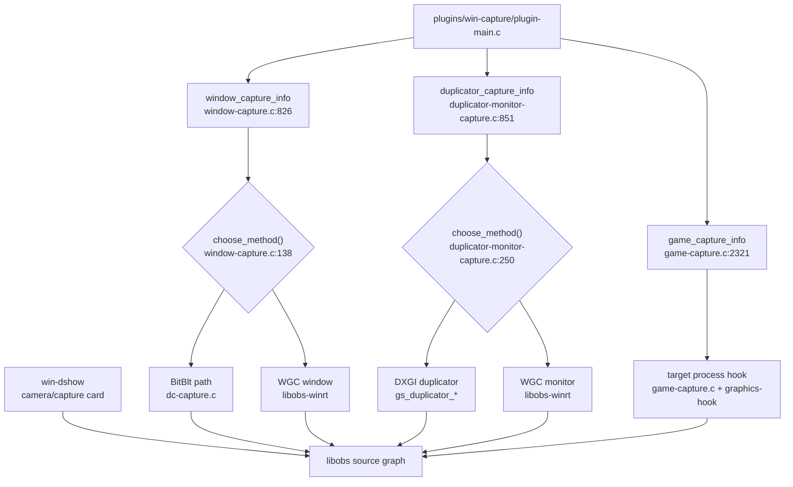
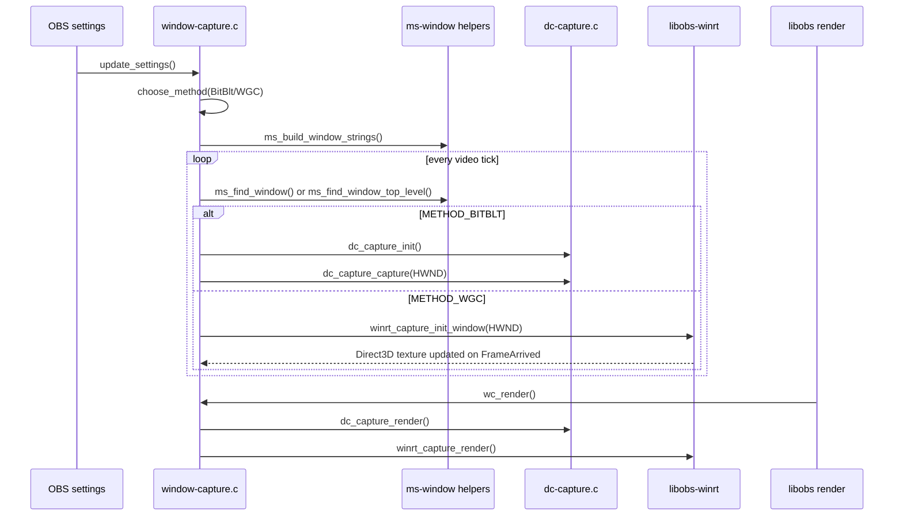
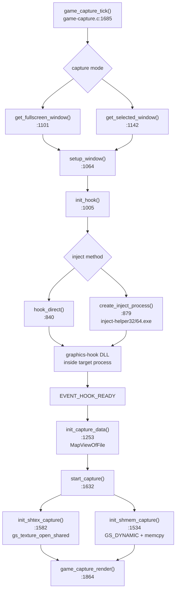
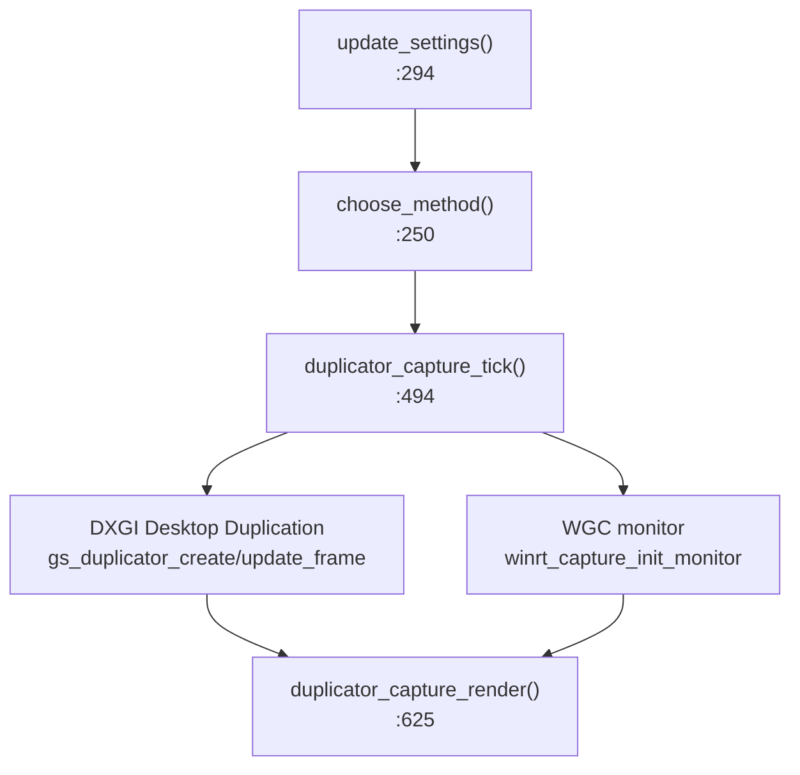
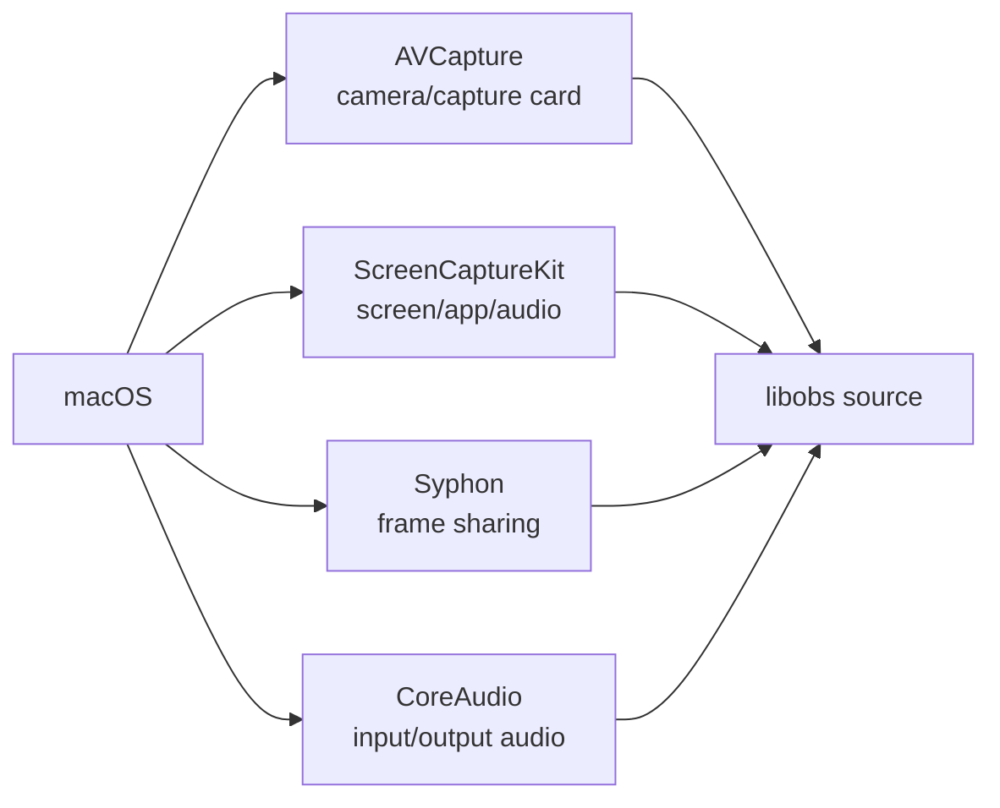
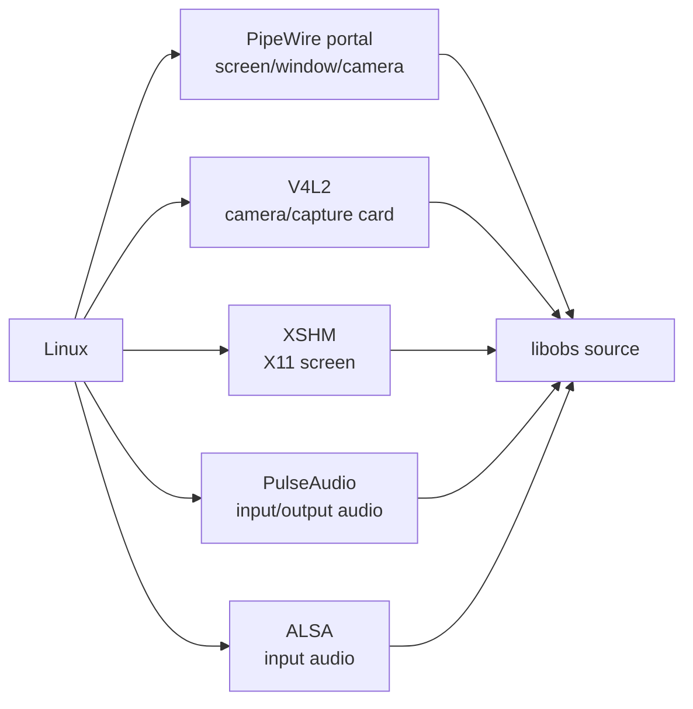
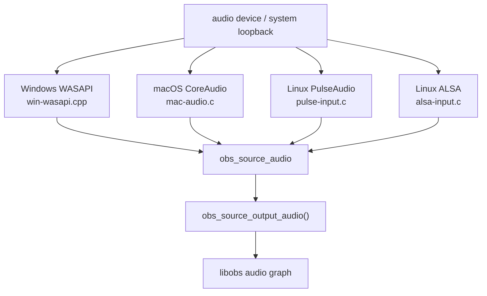

# OBS 平台采集：视频与音频

OBS 采集插件把平台 API 的帧转换成 `obs_source_frame`、GPU texture 或 `obs_source_audio`，再通过 `obs_source_output_video()`、source 的 `video_render()`，或 `obs_source_output_audio()` 进入 libobs。

核心 API：

- `libobs/obs-source.h:93` 注释说明 raw audio source 用 `obs_source_output_audio()`。
- `libobs/obs-source.h:105` 注释说明 raw video source 用 `obs_source_output_video()`。
- `libobs/obs-source.c:3530` `obs_source_output_video()`。
- `libobs/obs-source.c:3545` `obs_source_output_video2()`。
- `libobs/obs-source.c:3964` `obs_source_output_audio()`。
- `libobs/obs-source.h:222` `struct obs_source_info`，定义 `create`、`update`、`video_tick`、`video_render`、`audio_render` 等回调。

## Windows 视频采集

Windows 侧要把“窗口采集”“游戏采集”“显示器采集”分开看。它们最终都作为 `obs_source_info` 注册到 libobs，但拿帧的方式完全不同：窗口采集偏系统合成层或 GDI，游戏采集进入目标进程 hook 图形 API，显示器采集偏 DXGI Desktop Duplication 或 Windows Graphics Capture。

### Windows 窗口采集：应用窗口是怎么被采下来的

窗口采集的 source 入口是 `plugins/win-capture/window-capture.c:826` 的 `window_capture_info`，核心回调是 `.create = wc_create`、`.video_tick = wc_tick`、`.video_render = wc_render`。窗口采集不是在 `video_render()` 里找窗口，而是在 `wc_tick()` 里持续维护 HWND、初始化采集对象、更新纹理；`wc_render()` 只负责把已有纹理画到 OBS。

关键代码路径：

- `plugins/win-capture/window-capture.c:301` `wc_create()`：创建 `window_capture` 上下文；如果当前图形后端是 D3D11，动态加载 `libobs-winrt`，导入 `winrt_capture_init_window()`、`winrt_capture_render()`、`winrt_capture_get_color_space()` 等函数。
- `plugins/win-capture/window-capture.c:206` `update_settings()`：从配置里的 `window` 字符串解析出 `class/title/executable`，设置 `priority`、`cursor`、`capture_audio`、`force_sdr`、`compatibility`、`client_area`，并调用 `setup_audio_source()` 给“窗口音频捕获”建立子音频源。
- `plugins/win-capture/window-capture.c:138` `choose_method()`：如果系统不支持 WGC，强制 BitBlt；如果用户选了固定方法就按用户选择；如果是自动模式，会根据窗口类名把 Office、UWP、SDL、WinUI 等窗口倾向到 WGC，否则默认 BitBlt。
- `plugins/win-capture/window-capture.c:589` `wc_tick()`：周期性查找目标窗口。WGC 走 `ms_find_window_top_level(INCLUDE_MINIMIZED, ...)`，BitBlt 走 `ms_find_window(INCLUDE_MINIMIZED, ...)`。这点很关键：WGC 要拿顶层窗口，BitBlt 可以按更传统的窗口匹配方式处理。
- `plugins/win-capture/window-capture.c:650` 附近：如果窗口最小化或不可见，直接返回。WGC 对不可见 HWND 初始化容易失败，OBS 在这里先挡掉。
- `plugins/win-capture/window-capture.c:661` 附近：通过 `GetForegroundWindow()` 和 `GetWindowThreadProcessId()` 判断前台进程是否等于目标进程，不一致时隐藏采集光标。
- `plugins/win-capture/window-capture.c:704`：BitBlt 路径在尺寸变化或第一次采集时调用 `dc_capture_init()`。
- `plugins/win-capture/window-capture.c:732`：BitBlt 路径每 tick 调用 `dc_capture_capture(&wc->capture, wc->window)`。
- `plugins/win-capture/window-capture.c:746` 附近：WGC 路径调用 `winrt_capture_init_window(wc->cursor, wc->window, wc->client_area, wc->force_sdr)`。
- `plugins/win-capture/window-capture.c:775` `wc_render()`：WGC 调 `winrt_capture_render()`；BitBlt 调 `dc_capture_render()`。

BitBlt 的真实采帧在 `plugins/win-capture/dc-capture.c`：

- `dc-capture.c:34` `dc_capture_init()`：创建 OBS 纹理。常规路径用 `gs_texture_create_gdi()` 创建可拿 HDC 的 GDI 纹理；兼容模式或 GDI texture 不可用时，创建 `GS_DYNAMIC` 纹理和 DIB section。
- `dc-capture.c:151` `dc_capture_capture()`：先 `GetCursorInfo()`，再 `dc_capture_get_dc()` 拿目标纹理的 HDC，随后 `GetDC(window)` 拿窗口 DC，核心复制是 `BitBlt(hdc, 0, 0, width, height, hdc_target, x, y, SRCCOPY)`。
- `dc-capture.c:88` `draw_cursor()`：如果启用光标采集，通过 `CopyIcon()`、`GetIconInfo()`、`DrawIconEx()` 把光标画进采集 HDC。
- `dc-capture.c:124` `dc_capture_release_dc()`：兼容模式走 `gs_texture_set_image()` 上传 DIB 数据；非兼容模式走 `gs_texture_release_dc()` 释放 GDI texture DC。
- `dc-capture.c:183` `dc_capture_render()`：根据当前 OBS 色彩空间选择 `Draw`、`DrawSrgbDecompress`、`DrawMultiply` 等 effect 技术，最终 `gs_draw_sprite()`。

WGC 的真实采帧在 `libobs-winrt/winrt-capture.cpp`：

- `winrt-capture.cpp:3` `winrt_capture_supported()`：检查 `Windows.Foundation.UniversalApiContract` 8，也就是 Windows 10 1903 级别的 WGC interop 能力。
- `winrt-capture.cpp:244` `winrt_capture_create_item()`：窗口采集调用 `IGraphicsCaptureItemInterop::CreateForWindow()`，显示器采集调用 `CreateForMonitor()`。
- `winrt-capture.cpp:340` `winrt_capture_init_internal()`：从 OBS D3D11 device 创建 WinRT `IDirect3DDevice`，创建 `Direct3D11CaptureFramePool` 和 `GraphicsCaptureSession`，然后 `session.StartCapture()`。
- `winrt-capture.cpp:126` `winrt_capture::on_frame_arrived()`：每来一帧，`TryGetNextFrame()` 获取 `Direct3D11CaptureFrame`，从 `frame.Surface()` 拿 `ID3D11Texture2D`。如果只采客户区，调用 `get_client_box()` 算 `D3D11_BOX` 后 `CopySubresourceRegion()`；否则 `CopyResource()` 整帧复制到 OBS texture。
- `winrt-capture.cpp:424` `winrt_capture_init_window()`：窗口采集的导出入口。
- `winrt-capture.cpp:516` `winrt_capture_render()`：根据 HDR/SDR 和当前 OBS 色彩空间选择 tonemap/multiply 的 shader 技术，并画出 `capture->texture`。

工程判断：

- 浏览器、Electron、UWP、Office、硬件加速窗口黑屏时，优先切到 WGC。BitBlt 只复制窗口 DC，很多 GPU 合成内容不会真实出现在 GDI DC 里。
- WGC 能解决很多硬件加速窗口黑屏，但依赖系统能力、D3D11 后端和窗口可见性；如果 `winrt_capture_init_window()` 返回空，要看系统版本、窗口 HWND、权限和 `CreateForWindow` 错误日志。
- BitBlt 的“兼容模式”本质是 DIB/CPU 上传路径，稳定性可能更好，但性能和色彩链路不如 GPU 路径。

### Windows 游戏采集：游戏画面是怎么被 hook 出来的

游戏采集和窗口采集差异最大。它不靠 `BitBlt(HWND)`，而是把 OBS 的 hook DLL 注入目标游戏进程，在游戏的图形 API present/swap 附近拦截帧，然后通过共享纹理或共享内存把帧交回 OBS 进程。

目标窗口选择：

- `plugins/win-capture/game-capture.c:2321` `game_capture_info`：游戏采集 source 入口，回调里 `.video_tick = game_capture_tick`、`.video_render = game_capture_render`，并带 `OBS_SOURCE_CUSTOM_DRAW`，说明它自己在 render 回调里画 GPU texture。
- `game-capture.c:1162` `try_hook()`：根据模式决定找任意全屏程序还是指定窗口。
- `game-capture.c:1101` `get_fullscreen_window()`：取 `GetForegroundWindow()`，检查窗口矩形是否覆盖 monitor，排除普通最大化窗口，然后进入 `setup_window()`。
- `game-capture.c:1142` `get_selected_window()`：按 class/title/executable 用 `ms_find_window()` 找用户选中的窗口；如果 class 是 `dwm`，走 `FindWindowW()`。
- `game-capture.c:1064` `setup_window()`：拿进程 ID，判断 App/UWP，处理重 hook 和启动等待。很多“刚启动游戏抓不到”的问题来自这里的等待和重试策略。

hook 初始化：

- `game-capture.c:1005` `init_hook()`：总控函数。它会先过滤黑名单进程和 suspended 线程，再依次调用 `open_target_process()`、`init_keepalive()`、`init_pipe()`、`attempt_existing_hook()` 或 `inject_hook()`、`init_texture_mutexes()`、`init_hook_info()`、`init_events()`，最后 `SetEvent(gc->hook_init)` 通知目标进程 hook 开始工作。
- `game-capture.c:692` `open_target_process()`：打开目标进程并判断 32/64 位、UWP/App SID。
- `game-capture.c:708` `init_keepalive()`：创建 keepalive mutex，目标 hook 用它判断 OBS 侧是否还活着。
- `game-capture.c:820` `init_pipe()`：创建 IPC pipe，hook 侧日志通过 pipe 回到 OBS。
- `game-capture.c:745` `attempt_existing_hook()`：如果目标进程里已有 hook，打开 `EVENT_CAPTURE_RESTART` 并触发重启采集，避免重复注入。
- `game-capture.c:914` `inject_hook()`：选择 `inject-helper64.exe` 或 `inject-helper32.exe`，并通过 `get_hook_path(gc->process_is_64bit)` 找对应 hook DLL。
- `game-capture.c:840` `hook_direct()`：同架构且非反作弊兼容模式时，直接打开目标进程并注入 DLL。
- `game-capture.c:879` `create_inject_process()`：跨架构或反作弊兼容时，启动 inject helper，由 helper 完成注入。
- `game-capture.c:723` `init_texture_mutexes()`：打开双缓冲纹理 mutex；如果还没有，说明 hook 还没准备好，会进入 retry。
- `game-capture.c:776` `init_hook_info()`：映射 hook info 共享内存，写入 `offsets`、`capture_overlay`、`force_shmem`、`allow_srgb_alias` 和帧率限制。这里也会用 `gs_shared_texture_available()` 判断是否强制退到共享内存。
- `game-capture.c:1195` `init_events()`：打开 `EVENT_CAPTURE_RESTART`、`EVENT_CAPTURE_STOP`、`EVENT_HOOK_INIT`、`EVENT_HOOK_READY`、`EVENT_HOOK_EXIT`。

采集数据回传：

- `game-capture.c:1685` `game_capture_tick()`：每帧维护 hook 状态。注入 helper 退出、hook ready、窗口失效、复制共享内存纹理、采集光标都在这里处理。
- `game-capture.c:1253` `init_capture_data()`：收到 `EVENT_HOOK_READY` 后，打开 hook 侧创建的 shared map，并 `MapViewOfFile()` 到 OBS 进程。
- `game-capture.c:1632` `start_capture()`：检查 hook 版本；如果 `global_hook_info->type == CAPTURE_TYPE_MEMORY` 就走共享内存，否则走共享纹理。
- `game-capture.c:1582` `init_shtex_capture()`：共享纹理路径，核心是 `gs_texture_open_shared(gc->shtex_data->tex_handle)`。这是高性能路径，GPU texture 句柄在进程间共享。
- `game-capture.c:1534` `init_shmem_capture()`：共享内存路径，创建 `GS_DYNAMIC` 纹理，把 `texture_buffers[0/1]` 指向共享内存双缓冲。
- `game-capture.c:1477` `copy_shmem_tex()`：共享内存路径每帧等 texture mutex，`gs_texture_map()` 后 `memcpy()` 共享内存到 OBS 动态纹理。16-bit 格式会走 `copy_16bit_tex()` 转换。
- `game-capture.c:1769` 附近：如果 active 且 `copy_texture` 不为空，`game_capture_tick()` 在 graphics context 内调用复制函数。
- `game-capture.c:1864` `game_capture_render()`：根据纹理格式处理 `GS_R10G10B10A2`、`GS_RGBA16F`、PQ/HDR、alpha 和 cursor overlay，最终把 `gc->texture` 画到 source。

hook 侧可以从这些文件继续追：

- `plugins/win-capture/graphics-hook/graphics-hook.h:74` `capture_init_shtex()`，`:76` `capture_init_shmem()`，`:80` `global_hook_info`。
- `plugins/win-capture/graphics-hook/graphics-hook.c:542` `capture_init_shtex()`：设置共享纹理的 hook info 并通知 ready。
- `plugins/win-capture/graphics-hook/graphics-hook.c:709` `capture_init_shmem()`：设置 `global_hook_info->type = CAPTURE_TYPE_MEMORY`、format、map id、map size、pitch、宽高，并启动 copy thread。
- `plugins/win-capture/graphics-hook/gl-capture.c:531` 附近：OpenGL hook 优先 `gl_shtex_init()`，如果不支持或 `force_shmem` 则 `gl_shmem_init()`；`:730` 附近每帧调用 `gl_shtex_capture()` 或 `gl_shmem_capture()`。
- `plugins/win-capture/graphics-hook/vulkan-capture.c:856` `vk_shtex_init()`；`:959` `vk_shtex_capture()`；`:1184` 附近在有效 rect 后初始化；`:1196` 附近每次 swap/present 时采集。

工程判断：

- 游戏采集黑屏优先看是否注入成功：`inject_hook()`、helper 退出码、`EVENT_HOOK_READY`、`init_capture_data()`、`start_capture()` 日志。
- OBS 和游戏权限不一致会导致打开进程或注入失败。管理员游戏通常需要管理员 OBS。
- 反作弊、overlay、不同图形 API、32/64 位进程都会改变注入路径。问题定位时先确认 `hook_direct()` 还是 `create_inject_process()`。
- 共享纹理失败时会退到共享内存，性能会差，CPU 拷贝会明显增加。关注 `init_hook_info()` 中 `force_shmem` 和 `gs_shared_texture_available()`。

### Windows 显示器采集：桌面是怎么采下来的

显示器采集入口是 `plugins/win-capture/duplicator-monitor-capture.c:851` 的 `duplicator_capture_info`。自动模式通常优先 DXGI Desktop Duplication；当 DXGI 找不到显示器索引，或笔记本多显卡/电池场景下，可能切到 WGC。

关键代码路径：

- `duplicator-monitor-capture.c:250` `choose_method()`：WGC 不支持时强制 DXGI；自动模式先选 DXGI，再用 `gs_duplicator_get_monitor_index()` 判断显示器是否能被 DXGI duplicator 找到。找不到就改 WGC；多适配器且电池场景也可能选 WGC。
- `duplicator-monitor-capture.c:425` `duplicator_capture_create()`：和窗口采集一样，D3D11 后端下动态加载 `libobs-winrt`。
- `duplicator-monitor-capture.c:494` `duplicator_capture_tick()`：source 不显示时释放采集资源，避免全屏游戏时显示器采集造成系统卡顿。
- `duplicator-monitor-capture.c:535` 附近：WGC 路径调用 `winrt_capture_init_monitor(capture_cursor, handle, force_sdr)`。
- `duplicator-monitor-capture.c:577` 附近：DXGI 路径调用 `gs_duplicator_create(dxgi_index)`。
- `duplicator-monitor-capture.c:585` 附近：DXGI 路径每 tick 先 `cursor_capture()`，再 `gs_duplicator_update_frame()` 更新桌面帧。
- `duplicator-monitor-capture.c:625` `duplicator_capture_render()`：WGC 调 `winrt_capture_render()`；DXGI 路径用 `gs_duplicator_get_texture()` 拿桌面纹理，并处理旋转、HDR/SDR、force SDR、光标绘制。

工程判断：

- 桌面采集卡顿、全屏游戏掉帧时，要看 source 是否仍在 showing；OBS 代码特意在不显示时 `free_capture_data()`，防止 duplicator 持续影响系统。
- HDR 桌面偏色或亮度异常，要看 DXGI/WGC 两条路径的 color space：DXGI 在 `duplicator_capture_render()` 根据 `gs_duplicator_get_color_space()` 做 tonemap/multiply；WGC 在 `winrt_capture_get_color_space()` 和 `winrt_capture_render()` 里处理。
- 多显卡笔记本、外接屏、混合显卡导致 DXGI 找不到 monitor index 时，WGC 往往更稳。

### Windows 摄像头/采集卡：DirectShow 路径

摄像头和 HDMI 采集卡不在 `win-capture`，而在 `plugins/win-dshow`。这类源通常由 DirectShow graph 回调推音视频帧，再进入 libobs。

- `plugins/win-dshow/win-dshow.cpp:2010` DirectShow source info。
- `plugins/win-dshow/win-dshow.cpp:508`、`:605` 附近输出视频帧。
- `plugins/win-dshow/win-dshow.cpp:632`、`:671` 附近输出音频帧。

工程判断：

- 摄像头/采集卡问题优先查设备格式协商、分辨率/帧率、颜色格式、音视频是否同源。
- 采集卡黑屏和游戏采集黑屏不是一类问题：采集卡通常是 DirectShow 设备链路，游戏采集是进程注入和图形 API hook。

## macOS 视频采集

macOS 主要使用 AVFoundation 采集摄像头/采集卡，ScreenCaptureKit 采集屏幕/应用音频，Syphon 用于帧共享。

源码入口：

- `plugins/mac-avcapture/plugin-main.m:289` 注册 `av_capture_info`；`:302` `obs_register_source()`。
- `plugins/mac-avcapture/plugin-main.m:17` `av_capture_create()` 创建 `OBSAVCapture`。
- `plugins/mac-avcapture/OBSAVCapture.m:1221` `captureOutput:didOutputSampleBuffer:` 接收 AVFoundation sample buffer。
- `plugins/mac-avcapture/OBSAVCapture.m:1400` 调用 `obs_source_output_video()`。
- `plugins/mac-avcapture/OBSAVCapture.m:1464` 调用 `obs_source_output_audio()`。
- `plugins/mac-capture/mac-display-capture.m:665` `display_capture_info`。
- `plugins/mac-capture/mac-sck-audio-capture.m:124` 创建 `SCStream`；`:130` 添加 screen output；`:142` 添加 audio output；`:302` `sck_audio_capture_info`。
- `plugins/mac-capture/mac-audio.c:452` CoreAudio 调用 `obs_source_output_audio()`；`:1033` `coreaudio_input_capture_info`；`:1046` `coreaudio_output_capture_info`。
- `plugins/mac-syphon/syphon.m:136` `handle_new_frame()`；`:731` `syphon_info`。

工程判断：

- 摄像头/采集卡色彩和 range 问题优先看 `OBSAVCapture.m` 的 pixel format、color space、range 识别逻辑，例如 `formatFromSubtype()`、`colorspaceFromDescription()`。
- macOS 系统音频/屏幕采集和权限强相关；ScreenCaptureKit 链路要先确认系统版本、授权和 `SCStream` 状态。

## Linux 视频采集

Linux 有三条常见链路：PipeWire portal 做 Wayland/XDG 桌面采集，V4L2 做摄像头/采集卡，XSHM 做传统 X11 屏幕采集。

源码入口：

- PipeWire screen/window：
  - `plugins/linux-pipewire/screencast-portal.c:512` desktop create；`:526` window create；`:541` generic screen create。
  - `plugins/linux-pipewire/screencast-portal.c:692` `pipewire-desktop-capture-source`；`:714` `pipewire-window-capture-source`；`:736` `pipewire-screen-capture-source`。
  - `plugins/linux-pipewire/screencast-portal.c:154` portal 打开 PipeWire remote；`:197` 调 `obs_pipewire_connect_stream()`。
  - `plugins/linux-pipewire/pipewire.c:1228` `pw_stream_new()`；`:1243` `pw_stream_connect()`；`:1324` `obs_pipewire_stream_video_render()`。
- PipeWire camera：
  - `plugins/linux-pipewire/camera-portal.c:1177` `pipewire_camera_create()`。
  - `plugins/linux-pipewire/camera-portal.c:280` 调 `obs_pipewire_connect_stream()`。
  - `plugins/linux-pipewire/camera-portal.c:1319` `pipewire_camera_info`。
- V4L2：
  - `plugins/linux-v4l2/v4l2-input.c:160` `v4l2_thread()` 采集线程。
  - `plugins/linux-v4l2/v4l2-input.c:195` 准备 `obs_source_frame`；`:270` 调 `obs_source_output_video()`。
  - `plugins/linux-v4l2/v4l2-input.c:956` `v4l2_create_mmap()`；`:971` 创建采集线程。
  - `plugins/linux-v4l2/v4l2-input.c:1098` `v4l2_input`。
- XSHM：
  - `plugins/linux-capture/xshm-input.c:219` `xshm_capture_start()`。
  - `plugins/linux-capture/xshm-input.c:487` `xshm_video_tick()`；`:511` `gs_texture_set_image()`；`:523` `xshm_video_render()`。
  - `plugins/linux-capture/xshm-input.c:576` `xshm_input`。

## 音频采集入口

音频采集最终都要构造 `obs_source_audio`，然后调用 `obs_source_output_audio()`。平台差异集中在设备枚举、采样格式、时间戳和回调线程。

源码入口：

- Windows WASAPI：`plugins/win-wasapi/win-wasapi.cpp:707` 设置 loopback flag；`:1007` 构造 `obs_source_audio`；`:1026`/`:1030` 输出音频；`:1536` 起注册 input/output/process capture。
- macOS CoreAudio：`plugins/mac-capture/mac-audio.c:452` 输出音频；`:1033` 输入采集；`:1046` 输出采集。
- Linux PulseAudio：`plugins/linux-pulseaudio/pulse-input.c:180` `pulse_stream_read()`；`:216` 输出音频；`:571` input source；`:584` output source。
- Linux ALSA：`plugins/linux-alsa/alsa-input.c:358` `snd_pcm_open()`；`:549` `snd_pcm_readi()`；`:569` 输出音频；`:79` `alsa_input_capture`。
