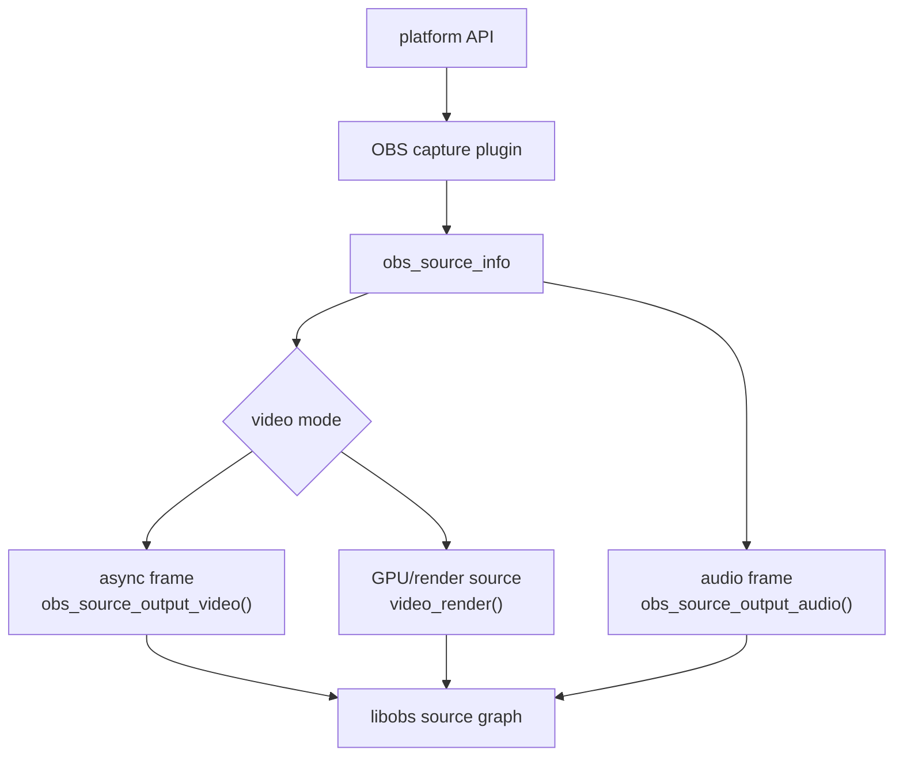
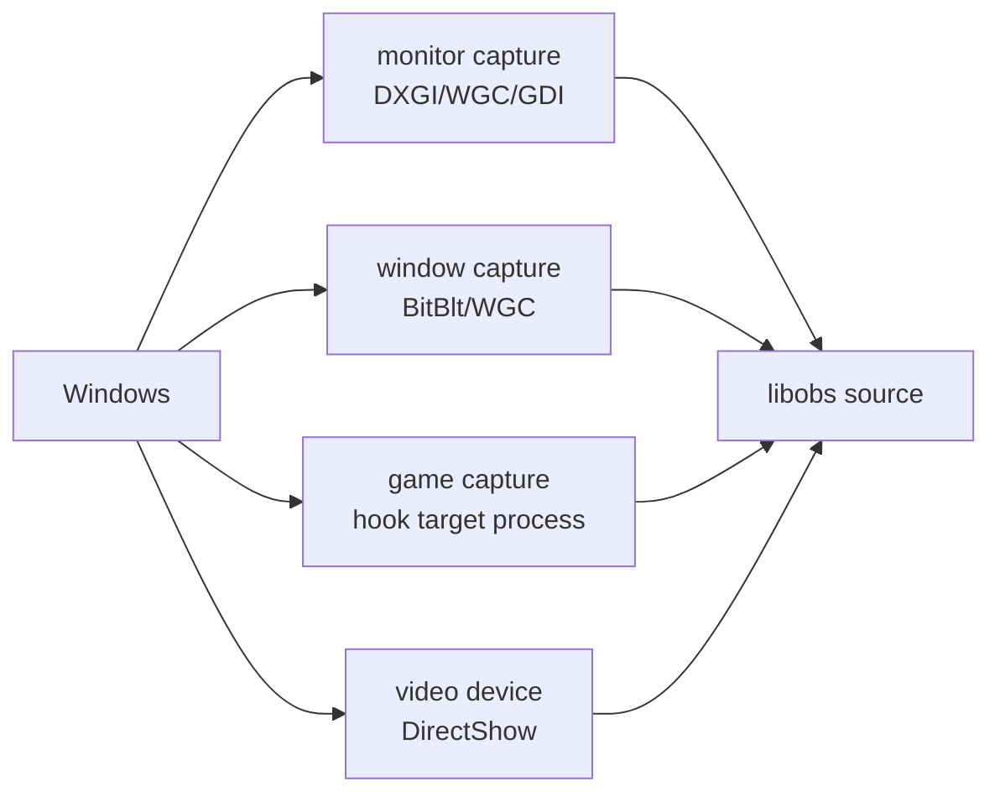
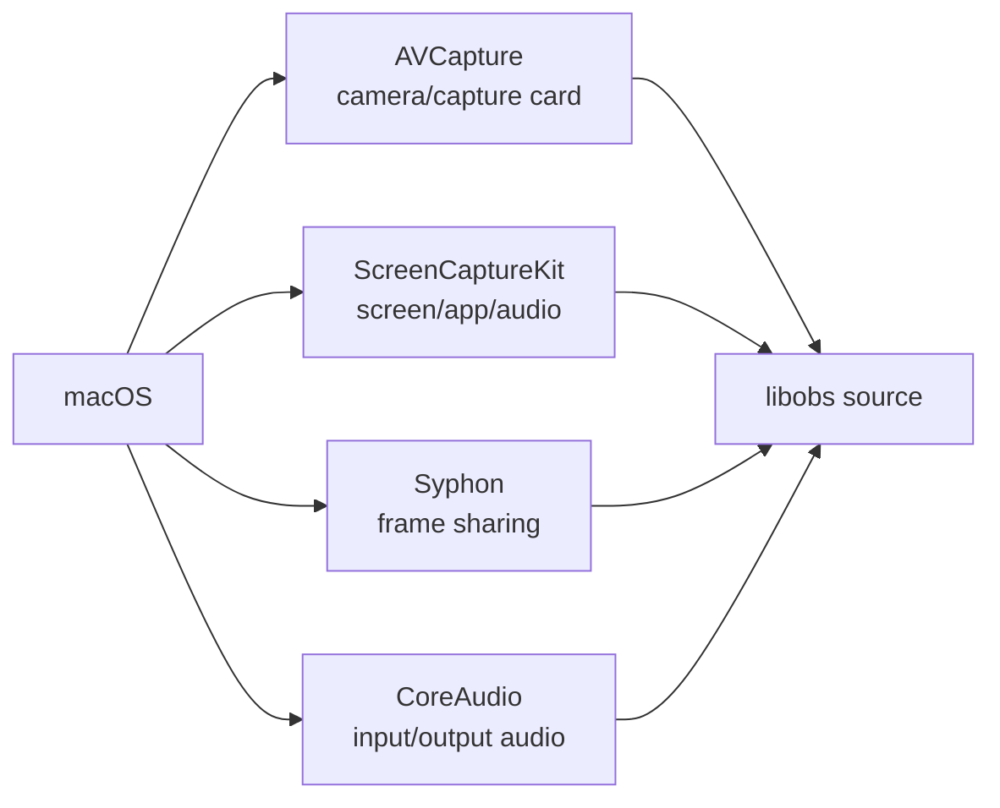
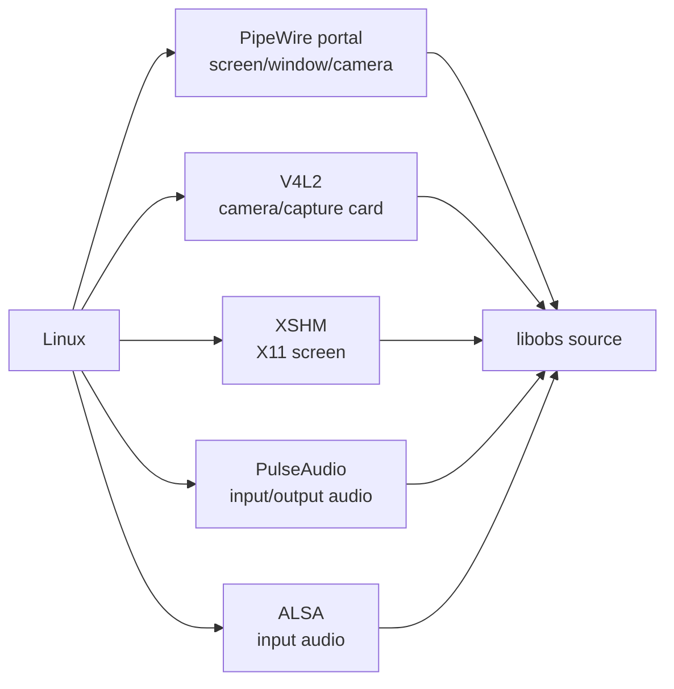
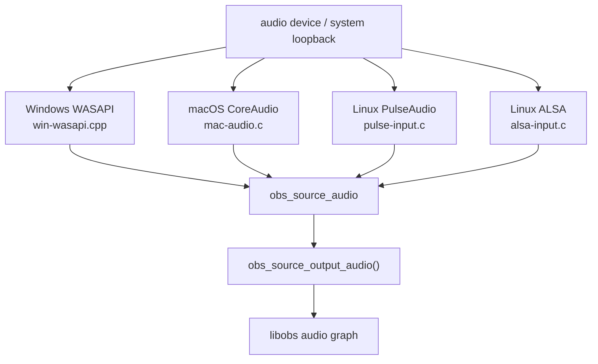

# OBS 平台采集：视频与音频

OBS 采集插件把平台 API 的帧转换成 `obs_source_frame`、GPU texture 或 `obs_source_audio`，再通过 `obs_source_output_video()`、source 的 `video_render()`，或 `obs_source_output_audio()` 进入 libobs。

核心 API：

- `libobs/obs-source.h:93` 注释说明 raw audio source 用 `obs_source_output_audio()`。
- `libobs/obs-source.h:105` 注释说明 raw video source 用 `obs_source_output_video()`。
- `libobs/obs-source.c:3530` `obs_source_output_video()`。
- `libobs/obs-source.c:3545` `obs_source_output_video2()`。
- `libobs/obs-source.c:3964` `obs_source_output_audio()`。
- `libobs/obs-source.h:222` `struct obs_source_info`，定义 `create`、`update`、`video_tick`、`video_render`、`audio_render` 等回调。

## Windows 视频采集

Windows 主要分三类：显示器采集、窗口采集、游戏采集。窗口/显示器采集可以走 BitBlt、DXGI Desktop Duplication 或 Windows Graphics Capture；游戏采集通过注入 hook 进目标进程拿渲染纹理。

源码入口：

- `plugins/win-capture/duplicator-monitor-capture.c:851` `duplicator_capture_info`，source id 是 `monitor_capture`。
- `plugins/win-capture/duplicator-monitor-capture.c:250` `choose_method()`，选择 DXGI/WGC 等显示器采集方式。
- `plugins/win-capture/window-capture.c:826` `window_capture_info`。
- `plugins/win-capture/window-capture.c:138` `choose_method()`，根据 WGC 支持情况和窗口类名选择 WGC/BitBlt。
- `plugins/win-capture/window-capture.c:589` `wc_tick()`，周期性更新窗口帧；`:775` `wc_render()` 渲染。
- `plugins/win-capture/window-capture.c:704` 初始化 `dc_capture`；`:732` `dc_capture_capture()`；`:792` `dc_capture_render()`。
- `plugins/win-capture/game-capture.c:2321` `game_capture_info`。
- `plugins/win-capture/game-capture.c:914` `inject_hook()` 注入 hook；`:1162` `try_hook()`；`:1632` `start_capture()`。
- `plugins/win-capture/game-capture.c:1685` `game_capture_tick()`；`:1864` `game_capture_render()`。
- `plugins/win-dshow/win-dshow.cpp:2010` DirectShow source info；`:508`/`:605` 输出视频帧；`:632`/`:671` 输出音频帧。

工程判断：

- 游戏采集问题优先查 hook、目标进程权限、反作弊、图形 API 兼容和 `plugins/win-capture/data/compatibility.json`。
- 窗口采集黑屏优先区分 WGC 和 BitBlt；WGC 对 UWP、现代窗口、硬件加速窗口通常更稳，但受系统版本限制。
- 摄像头采集在 `win-dshow`，音视频都可能从同一个设备源输出。

## macOS 视频采集

macOS 主要使用 AVFoundation 采集摄像头/采集卡，ScreenCaptureKit 采集屏幕/应用音频，Syphon 用于帧共享。

源码入口：

- `plugins/mac-avcapture/plugin-main.m:289` 注册 `av_capture_info`；`:302` `obs_register_source()`。
- `plugins/mac-avcapture/plugin-main.m:17` `av_capture_create()` 创建 `OBSAVCapture`。
- `plugins/mac-avcapture/OBSAVCapture.m:1221` `captureOutput:didOutputSampleBuffer:` 接收 AVFoundation sample buffer。
- `plugins/mac-avcapture/OBSAVCapture.m:1400` 调用 `obs_source_output_video()`。
- `plugins/mac-avcapture/OBSAVCapture.m:1464` 调用 `obs_source_output_audio()`。
- `plugins/mac-capture/mac-display-capture.m:665` `display_capture_info`。
- `plugins/mac-capture/mac-sck-audio-capture.m:124` 创建 `SCStream`；`:130` 添加 screen output；`:142` 添加 audio output；`:302` `sck_audio_capture_info`。
- `plugins/mac-capture/mac-audio.c:452` CoreAudio 调用 `obs_source_output_audio()`；`:1033` `coreaudio_input_capture_info`；`:1046` `coreaudio_output_capture_info`。
- `plugins/mac-syphon/syphon.m:136` `handle_new_frame()`；`:731` `syphon_info`。

工程判断：

- 摄像头/采集卡色彩和 range 问题优先看 `OBSAVCapture.m` 的 pixel format、color space、range 识别逻辑，例如 `formatFromSubtype()`、`colorspaceFromDescription()`。
- macOS 系统音频/屏幕采集和权限强相关；ScreenCaptureKit 链路要先确认系统版本、授权和 `SCStream` 状态。

## Linux 视频采集

Linux 有三条常见链路：PipeWire portal 做 Wayland/XDG 桌面采集，V4L2 做摄像头/采集卡，XSHM 做传统 X11 屏幕采集。

源码入口：

- PipeWire screen/window：
  - `plugins/linux-pipewire/screencast-portal.c:512` desktop create；`:526` window create；`:541` generic screen create。
  - `plugins/linux-pipewire/screencast-portal.c:692` `pipewire-desktop-capture-source`；`:714` `pipewire-window-capture-source`；`:736` `pipewire-screen-capture-source`。
  - `plugins/linux-pipewire/screencast-portal.c:154` portal 打开 PipeWire remote；`:197` 调 `obs_pipewire_connect_stream()`。
  - `plugins/linux-pipewire/pipewire.c:1228` `pw_stream_new()`；`:1243` `pw_stream_connect()`；`:1324` `obs_pipewire_stream_video_render()`。
- PipeWire camera：
  - `plugins/linux-pipewire/camera-portal.c:1177` `pipewire_camera_create()`。
  - `plugins/linux-pipewire/camera-portal.c:280` 调 `obs_pipewire_connect_stream()`。
  - `plugins/linux-pipewire/camera-portal.c:1319` `pipewire_camera_info`。
- V4L2：
  - `plugins/linux-v4l2/v4l2-input.c:160` `v4l2_thread()` 采集线程。
  - `plugins/linux-v4l2/v4l2-input.c:195` 准备 `obs_source_frame`；`:270` 调 `obs_source_output_video()`。
  - `plugins/linux-v4l2/v4l2-input.c:956` `v4l2_create_mmap()`；`:971` 创建采集线程。
  - `plugins/linux-v4l2/v4l2-input.c:1098` `v4l2_input`。
- XSHM：
  - `plugins/linux-capture/xshm-input.c:219` `xshm_capture_start()`。
  - `plugins/linux-capture/xshm-input.c:487` `xshm_video_tick()`；`:511` `gs_texture_set_image()`；`:523` `xshm_video_render()`。
  - `plugins/linux-capture/xshm-input.c:576` `xshm_input`。

## 音频采集入口

音频采集最终都要构造 `obs_source_audio`，然后调用 `obs_source_output_audio()`。平台差异集中在设备枚举、采样格式、时间戳和回调线程。

源码入口：

- Windows WASAPI：`plugins/win-wasapi/win-wasapi.cpp:707` 设置 loopback flag；`:1007` 构造 `obs_source_audio`；`:1026`/`:1030` 输出音频；`:1536` 起注册 input/output/process capture。
- macOS CoreAudio：`plugins/mac-capture/mac-audio.c:452` 输出音频；`:1033` 输入采集；`:1046` 输出采集。
- Linux PulseAudio：`plugins/linux-pulseaudio/pulse-input.c:180` `pulse_stream_read()`；`:216` 输出音频；`:571` input source；`:584` output source。
- Linux ALSA：`plugins/linux-alsa/alsa-input.c:358` `snd_pcm_open()`；`:549` `snd_pcm_readi()`；`:569` 输出音频；`:79` `alsa_input_capture`。
