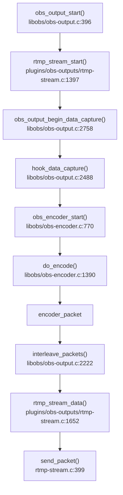
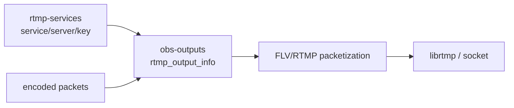
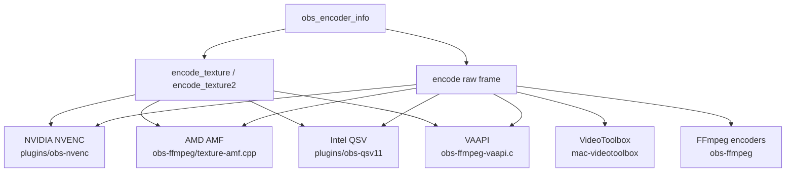

# OBS 编码、硬编与推流

OBS 输出链路是：output 启动后绑定 encoder，encoder 订阅 raw video/audio 或 GPU texture，编码出 `encoder_packet`，output 负责交错、封装和发送。推流常见路径是 RTMP output。

源码入口：

- `libobs/obs-output.c:396` `obs_output_start()`。
- `plugins/obs-outputs/rtmp-stream.c:1397` `rtmp_stream_start()`。
- `plugins/obs-outputs/rtmp-stream.c:1087` 调 `obs_output_begin_data_capture()`。
- `libobs/obs-output.c:2758` `obs_output_begin_data_capture()`；`:2782` `hook_data_capture()`。
- `libobs/obs-output.c:2488` `hook_data_capture()`，选择 `interleave_packets` 或 `default_encoded_callback`。
- `libobs/obs-output.c:2434` 启动 audio encoder；`:2443` 启动 video encoder。
- `libobs/obs-encoder.c:770` `obs_encoder_start()`。
- `libobs/obs-encoder.c:1474` `receive_video()`；`:1723` `receive_audio()`。
- `libobs/obs-encoder.c:1390` `do_encode()`；`:1294` `send_packet()` 回调给 output。
- `libobs/obs-output.c:2222` `interleave_packets()`。
- `plugins/obs-outputs/rtmp-stream.c:1652` `rtmp_stream_data()`；`:399` `send_packet()`；`:426` `send_packet_ex()`。

## Output、Service 和 RTMP

RTMP 地址、key、服务配置由 service 插件提供，真正发送由 output 插件完成。

源码入口：

- `plugins/rtmp-services/rtmp-services-main.c:93` `obs_module_load()`。
- `plugins/rtmp-services/rtmp-services-main.c:125` 注册 `rtmp_common_service`；`:126` 注册 `rtmp_custom_service`。
- `plugins/obs-outputs/obs-outputs.c:52` `obs_module_load()`。
- `plugins/obs-outputs/obs-outputs.c:63` 注册 `rtmp_output_info`。
- `plugins/obs-outputs/rtmp-stream.c:1796` `rtmp_output_info`，`.start = rtmp_stream_start`，`.encoded_packet = rtmp_stream_data`。

## 硬编后端关系

OBS 有两类硬编路径：一种是直接 texture 编码，减少 GPU->CPU 下载；另一种是软件帧/FFmpeg wrapper 或 fallback 路径。

libobs GPU 编码入口：

- `libobs/obs-encoder.h:342` `encode_texture` 回调。
- `libobs/obs-encoder.h:345` `encode_texture2` 回调。
- `libobs/obs-video-gpu-encode.c:151` 判断 `encoder->info.encode_texture2`；`:158` 调 `encode_texture2()`；`:161` 调旧 `encode_texture()`。

## NVENC

源码入口：

- `plugins/obs-nvenc/nvenc.c:1391` `h264_nvenc_info`。
- `plugins/obs-nvenc/nvenc.c:1412` `hevc_nvenc_info`。
- `plugins/obs-nvenc/nvenc.c:1433` `av1_nvenc_info`。
- `plugins/obs-nvenc/nvenc.c:1401` H.264 texture path 使用 `d3d11_encode` 或 `cuda_opengl_encode`。
- `plugins/obs-nvenc/nvenc.c:1506` 起注册 NVENC encoder。
- `plugins/obs-nvenc/nvenc.c:972` 到 `:976` 不支持 texture 或条件不满足时 reroute 到 soft encoder。
- `plugins/obs-nvenc/nvenc-d3d11.c` 是 D3D11 texture 编码路径。
- `plugins/obs-nvenc/nvenc-cuda.c`、`nvenc-opengl.c` 是 CUDA/OpenGL 相关路径。

工程判断：

- Windows D3D11 渲染链路下 NVENC texture path 最理想，少一次 CPU copy。
- Linux/OpenGL 场景关注 CUDA/OpenGL 互操作。
- AV1 NVENC 受 GPU 代际和驱动限制；OBS 代码会有能力检测和 fallback。

## AMF、QSV、VAAPI、VideoToolbox

AMF：

- `plugins/obs-ffmpeg/texture-amf.cpp:1714` 注册 H.264 AMF encoder；`:1722` 设置 `encode_texture = amf_encode_tex`。
- `plugins/obs-ffmpeg/texture-amf.cpp:2102` 注册 H.265 AMF；`:2512` 注册 AV1 AMF。
- `plugins/obs-ffmpeg/texture-amf.cpp:1661`、`:2042`、`:2442` 是 fallback reroute 入口。

QSV：

- `plugins/obs-qsv11/obs-qsv11.c:1292` `obs_qsv_encoder_tex`。
- `plugins/obs-qsv11/obs-qsv11.c:1300` `encode_texture2 = obs_qsv_encode_tex`。
- `plugins/obs-qsv11/obs-qsv11.c:1360` AV1 QSV texture encoder。
- `plugins/obs-qsv11/obs-qsv11.c:1392` HEVC QSV texture encoder。
- `plugins/obs-qsv11/obs-qsv11-plugin-main.c:92` 起注册 QSV encoder。
- `plugins/obs-qsv11/obs-qsv11.c:844` 起处理 fallback/reroute。

VAAPI：

- `plugins/obs-ffmpeg/obs-ffmpeg-vaapi.c:1206` H.264 VAAPI。
- `plugins/obs-ffmpeg/obs-ffmpeg-vaapi.c:1222` H.264 VAAPI texture encoder，`:1229` `encode_texture2 = vaapi_encode_tex`。
- `plugins/obs-ffmpeg/obs-ffmpeg-vaapi.c:1238` AV1 VAAPI；`:1271` HEVC VAAPI。
- `plugins/obs-ffmpeg/obs-ffmpeg-vaapi.c:572` fallback/reroute。

VideoToolbox：

- `plugins/mac-videotoolbox/encoder.c:1439` 构造 `obs_encoder_info`。
- `plugins/mac-videotoolbox/encoder.c:1522` 注册 encoder。

FFmpeg wrapper：

- `plugins/obs-ffmpeg/obs-ffmpeg.c:336` `register_encoder_if_available()`。
- `plugins/obs-ffmpeg/obs-ffmpeg.c:352` 起注册 AAC/Opus/PCM/ALAC/FLAC。
- `plugins/obs-ffmpeg/obs-ffmpeg.c:369`/`:372` 注册 FFmpeg NVENC wrapper。
- `plugins/obs-ffmpeg/obs-ffmpeg-audio-encoders.c:347` audio `do_encode()`。
- `plugins/obs-ffmpeg/obs-ffmpeg-audio-encoders.c:459` AAC encoder info；`:474` Opus encoder info。

## 推流卡顿和编码过载定位

| 现象 | 先看哪里 | 判断 |
|---|---|---|
| Encoding overloaded | `obs-encoder.c:1390` `do_encode()`、硬编插件日志 | encoder 耗时超过帧间隔，降分辨率/FPS/预设或切硬编 |
| Rendering lag | `obs-video.c:870` `output_frame()`、`:887` `render_video()` | 场景渲染/GPU filter/source 过重 |
| Dropped frames network | `rtmp-stream.c` 发送和 socket 状态 | 网络/服务器吞吐问题，不是编码问题 |
| 硬编不可用 | NVENC/AMF/QSV/VAAPI/VT 注册和 fallback 日志 | 驱动、GPU 代际、会话数、像素格式、HDR/10bit/AV1 支持 |
| 推流无音频或多音轨异常 | `obs-output.c:1075`、`obs-encoder.c:351`、`MAX_AUDIO_MIXES` | encoder 绑定的 `mixer_idx` 或 output 协议能力问题 |
