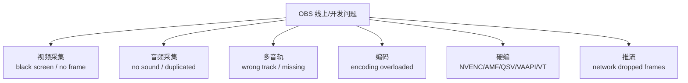
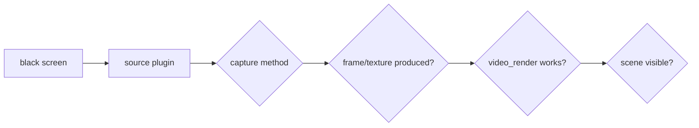
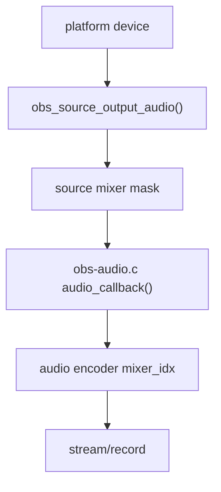
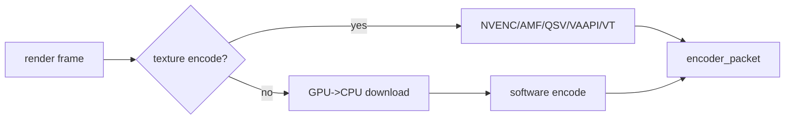

# OBS 工程问题手册

这篇按线上现象组织：采集黑屏、音频重复/无声、多音轨异常、编码过载、硬编不可用、推流丢帧。每个问题都尽量定位到 OBS 内部文件和函数。

## 视频采集黑屏

排查入口：

- Windows 窗口采集：`plugins/win-capture/window-capture.c:138` `choose_method()`，`:589` `wc_tick()`，`:775` `wc_render()`。
- Windows 游戏采集：`plugins/win-capture/game-capture.c:914` `inject_hook()`，`:1632` `start_capture()`，`:1685` `game_capture_tick()`，`:1864` `game_capture_render()`。
- Linux PipeWire：`plugins/linux-pipewire/screencast-portal.c:154` 打开 remote，`:197` 连接 stream；`plugins/linux-pipewire/pipewire.c:1324` 渲染。
- Linux V4L2：`plugins/linux-v4l2/v4l2-input.c:160` 采集线程，`:270` 输出视频。
- macOS AVCapture：`plugins/mac-avcapture/OBSAVCapture.m:1221` sample buffer 回调，`:1400` 输出视频。

解决方案：

- 先确认 source 是否真的产生 frame/texture，再看 scene 可见性和 transform。
- Windows 游戏采集重点看权限、反作弊、注入进程、目标图形 API。
- WGC/BitBlt/DXGI 可互相切换验证，黑屏不等于 OBS core 失败。
- Linux Wayland 下优先 PipeWire portal；X11 下可以对比 XSHM。
- macOS 先查屏幕录制/摄像头权限，再查 `SCStream`/`AVCaptureSession` 是否启动。

## 音频无声、重复或延迟

排查入口：

- Windows WASAPI：`plugins/win-wasapi/win-wasapi.cpp:1007` 构造音频帧；`:1026`/`:1030` 输出。
- macOS CoreAudio：`plugins/mac-capture/mac-audio.c:452` 输出。
- Linux PulseAudio：`plugins/linux-pulseaudio/pulse-input.c:180` read callback；`:216` 输出。
- Linux ALSA：`plugins/linux-alsa/alsa-input.c:549` `snd_pcm_readi()`；`:569` 输出。
- Core mix：`libobs/obs-audio.c:606` `audio_callback()`；`:139` `mix_audio()`。
- Encoder 绑定：`libobs/obs-encoder.c:351` `audio_output_connect()`。

解决方案：

- 无声先查设备源是否有 `obs_source_output_audio()`，再查 source 是否勾选到目标音轨。
- 重复采集常见于 desktop output capture 和 monitoring device 被同时混入，见 `libobs/obs-audio.c:53` 起的监控设备特殊处理。
- 延迟先区分采集 API buffer、OBS audio buffering、encoder/muxer buffer、播放器端 buffer。

## 多音轨异常

核心事实：`MAX_AUDIO_MIXES` 是 6，source mixer mask 决定进哪些 mix，audio encoder 的 `mixer_idx` 决定编码哪一路 mix。

源码入口：

- `libobs/media-io/audio-io.h:28` `MAX_AUDIO_MIXES 6`。
- `libobs/obs-source.c:4775` `obs_source_get_audio_mixers()`。
- `libobs/obs-encoder.c:167` `obs_audio_encoder_create()`。
- `libobs/obs-encoder.c:351` 连接 `encoder->mixer_idx`。
- `libobs/obs-output.c:1075` `obs_output_set_audio_encoder()`。

解决方案：

- 录制多音轨：确认每个音轨都有对应 audio encoder 和 muxer track。
- 直播平台多数只消费一路音频；不要把“OBS 内部 6 mix”误解成“平台一定支持 6 路音频”。
- 如果要做自定义多音轨输出，优先在 output/mux 层扩展，不要改 source 混音基础语义。

## 编码过载和硬编不可用

排查入口：

- `libobs/obs-video.c:870` `output_frame()` 判断渲染输出耗时。
- `libobs/obs-video-gpu-encode.c:151` 走 `encode_texture2`；`:158` 调硬编 texture path。
- `libobs/obs-encoder.c:1390` `do_encode()`。
- NVENC：`plugins/obs-nvenc/nvenc.c:1391`、`:1412`、`:1433`。
- AMF：`plugins/obs-ffmpeg/texture-amf.cpp:1714`、`:2102`、`:2504`。
- QSV：`plugins/obs-qsv11/obs-qsv11.c:1292`、`:1360`、`:1392`。
- VAAPI：`plugins/obs-ffmpeg/obs-ffmpeg-vaapi.c:1206`、`:1238`、`:1271`。
- VideoToolbox：`plugins/mac-videotoolbox/encoder.c:1439`。

解决方案：

- 如果 render lag，高概率是场景/source/filter/GPU 负载问题。
- 如果 encode lag，先切更快 preset、降低分辨率/FPS/码率，再验证硬编是否真的走 texture path。
- 硬编不可用优先看驱动、GPU 代际、会话数、像素格式、10bit/HDR/AV1 支持。
- 自研优化优先加诊断日志：选中的 encoder id、是否 texture path、fallback 原因、每帧 encode 耗时。

## 推流丢帧

推流丢帧要和编码过载分开。编码过载是 encoder 产包慢；网络丢帧是 output 发送慢或 socket 堵。

源码入口：

- `plugins/obs-outputs/rtmp-stream.c:1397` `rtmp_stream_start()`。
- `plugins/obs-outputs/rtmp-stream.c:1652` `rtmp_stream_data()`。
- `plugins/obs-outputs/rtmp-stream.c:399` `send_packet()`；`:426` `send_packet_ex()`。
- `libobs/obs-output.c:2222` `interleave_packets()`。
- `libobs/obs-output.c:424` `log_frame_info()`。

解决方案：

- 网络丢帧：换 ingest、降低码率、检查 TCP 拥塞和服务端返回。
- 编码过载：不会靠换 RTMP 服务器解决，必须减轻 render/encode。
- 音视频时间戳异常：查 `interleave_packets()` 和 encoder packet 时间戳。
