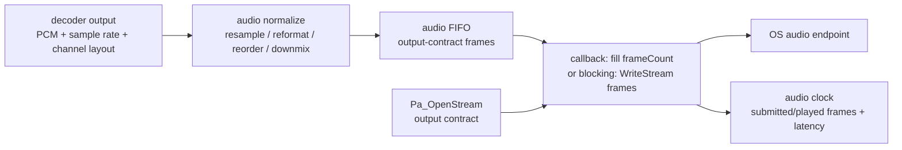
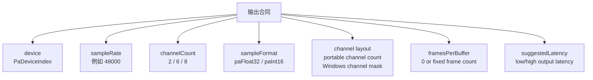
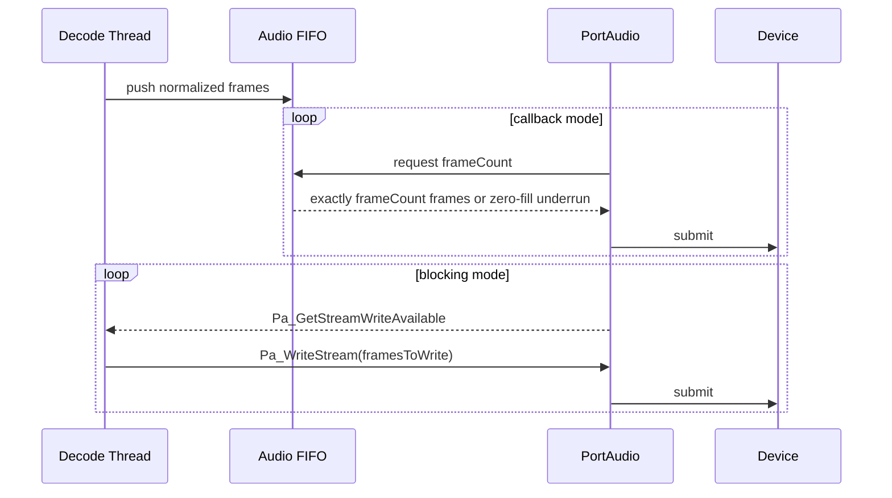
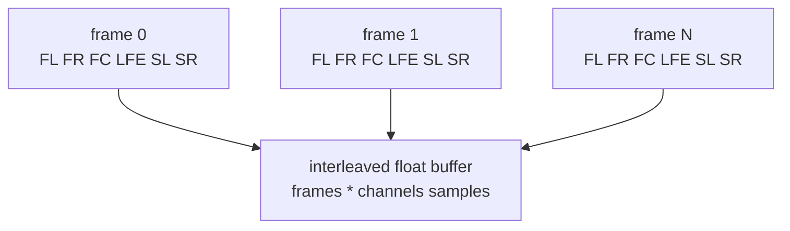
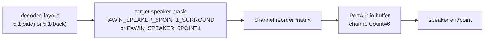
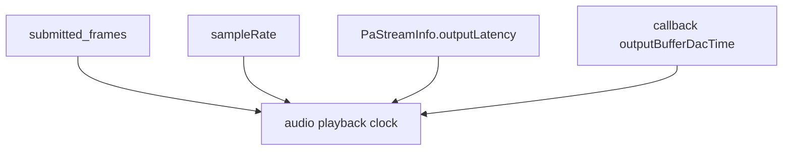
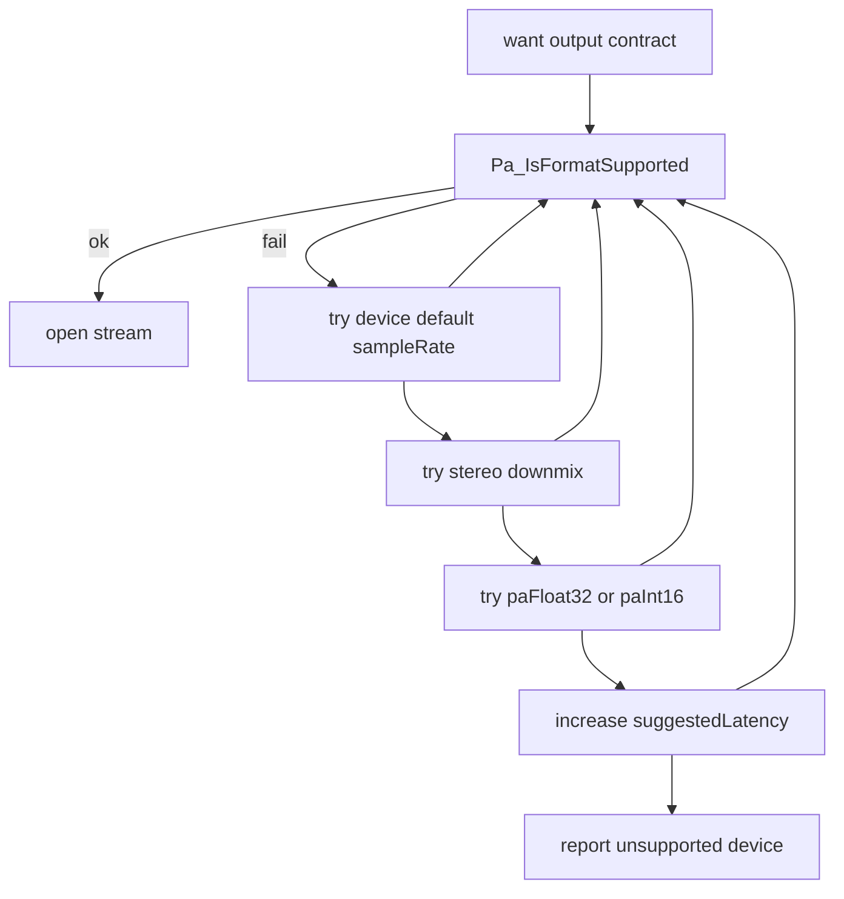

# 解码后 PCM 如何正确送入 PortAudio 渲染

这篇文档假设你已经拿到了音频解码后的 PCM 数据，目标是把它稳定、低延迟、声道正确地送到系统音频设备。重点不是再解释 PortAudio API 列表，而是明确“根据什么送帧”“frame 是什么”“5.1 声道如何送进去”。

源码快照：

- 本机路径：`D:/github/portaudio`
- Git describe：`v19.7.0-RC2-177-gcf218ed`
- Commit：`cf218ed8e3085ac3731106d3636c3c6396ec2d82`
- 文档日期：2026-06-09

## 结论先行

正确渲染不是按 decoder 每次吐出的包大小直接调用 `Pa_WriteStream()`，也不是按视频帧节奏送音频。正确做法是先建立输出设备合同：

1. 选输出设备和 Host API。
2. 确定输出 `sampleRate`、`channelCount`、`sampleFormat`、interleaved/non-interleaved、`framesPerBuffer`、`suggestedLatency`。
3. 把解码 PCM 统一转换成这个合同，包括重采样、声道重排、格式转换和必要 downmix。
4. 使用一个音频 FIFO 保存“已经符合输出合同”的 PCM。
5. callback 模式下按 PortAudio 请求的 `frameCount` 填满输出；blocking 模式下按 `Pa_GetStreamWriteAvailable()` 和目标缓冲水位写入。

> [!IMPORTANT]
> PortAudio 的送帧单位是 sample frame。一个 frame 是同一时间点的所有声道样本。5.1 interleaved float 输出时，1 frame = 6 个 `float`，`Pa_WriteStream(stream, buffer, frames)` 的 `frames` 传帧数，不传 `frames * 6`。

## 整体数据流

这张图回答“解码后 PCM 到设备之间应该有哪些工程层”。



源码入口：

- `include/portaudio.h:547` `PaStreamParameters` 定义设备、通道数、采样格式和建议延迟。
- `include/portaudio.h:618` `Pa_IsFormatSupported()` 用于打开前验证输出合同。
- `include/portaudio.h:904` `Pa_OpenStream()` 打开 stream。
- `include/portaudio.h:839` `PaStreamCallback` 定义 callback 送帧方式。
- `include/portaudio.h:1193` `Pa_WriteStream()` 定义 blocking 写入方式。

## 输出合同

PortAudio 不读取你的解码器 layout，也不会知道某个 PCM buffer 是 stereo、5.1(side) 还是 5.1(back)。这些信息必须在应用层整理成 `PaStreamParameters` 能表达的合同。



关键字段：

| 字段 | 选择依据 | 源码依据 |
| --- | --- | --- |
| `device` | 用户选择或默认输出设备 | `include/portaudio.h:547` |
| `channelCount` | 目标输出声道数，不能超过设备能力 | `include/portaudio.h:558` |
| `sampleFormat` | 建议播放器内部用 `paFloat32`，必要时让 PortAudio/后端转换 | `include/portaudio.h:470`、`:492` |
| `suggestedLatency` | 低延迟交互用 `defaultLowOutputLatency`，稳健播放用 `defaultHighOutputLatency` | `include/portaudio.h:570` |
| `hostApiSpecificStreamInfo` | Windows 多声道 mask、WASAPI 独占/线程优先级、ASIO channel selectors 等 | `include/portaudio.h:582` |
| `sampleRate` | 优先匹配解码输出或设备默认值；不匹配时上层重采样 | `include/portaudio.h:860` |
| `framesPerBuffer` | callback 可用 `paFramesPerBufferUnspecified`，固定 DSP 块才设固定值 | `include/portaudio.h:647`、`:868` |

> [!TIP]
> 打开前先用 `Pa_IsFormatSupported(NULL, &outputParameters, sampleRate)` 验证。失败时按顺序 fallback：降低声道数、改设备默认采样率、改 sample format、增大 latency、换 Host API 或 downmix。

## 根据什么送帧

不要按“解码器一次吐了多少样本”决定设备送帧节奏。解码器输出只是生产端，音频设备才是消费端。



### Callback 模式

callback 模式是推荐的播放器渲染模型。PortAudio 以设备节奏调用你的 callback，并给出本次要处理的 `frameCount`。你必须填满整个 output buffer。

送帧规则：

- 每次 callback 从音频 FIFO 取 `frameCount` 帧。
- FIFO 不够时补静音，并记录 underrun。
- callback 内不要等待解码线程，不做文件 I/O、日志刷盘、锁等待或堆分配。
- callback 返回 `paContinue` 继续播放，结束时可以返回 `paComplete`，异常时返回 `paAbort`。

源码依据：

- `include/portaudio.h:771` callback 由 PortAudio 周期调用。
- `include/portaudio.h:780` callback 运行在高优先级或实时路径，不应阻塞。
- `include/portaudio.h:798` output 是 interleaved buffer 或 non-interleaved 指针数组。
- `include/portaudio.h:803` buffer 格式和声道数由 `Pa_OpenStream()` 参数决定。
- `include/portaudio.h:839` `PaStreamCallback` 函数签名。

interleaved 5.1 callback 形态：

```c
static int audio_cb(const void *input,
                    void *output,
                    unsigned long frameCount,
                    const PaStreamCallbackTimeInfo *timeInfo,
                    PaStreamCallbackFlags statusFlags,
                    void *userData)
{
    AudioRenderer *r = (AudioRenderer *)userData;
    float *out = (float *)output; /* paFloat32, interleaved */
    const int channels = 6;

    unsigned long got = audio_fifo_read_interleaved(r->fifo, out, frameCount);
    if (got < frameCount) {
        memset(out + got * channels, 0,
               (frameCount - got) * channels * sizeof(float));
        r->underrun_count++;
    }

    r->submitted_frames += frameCount;
    return paContinue;
}
```

### Blocking 模式

blocking 模式由你的音频线程主动调用 `Pa_WriteStream()`。它适合简单播放器或已有独立 audio thread 的项目，但要避免把写入线程和解码线程绑死。

送帧规则：

- stream start 后才能写；PortAudio 文档明确 stopped stream 不支持预填充写入。
- 每次写入的 `frames` 是帧数。
- 可以用 `Pa_GetStreamWriteAvailable()` 查询不阻塞可写帧数。
- 维护目标水位，例如保持 50-150 ms 的已转换 PCM，低于水位就写，FIFO 不足时补静音或暂停。

源码依据：

- `include/portaudio.h:1172` stopped stream 不能通过 `Pa_WriteStream()` 预填充。
- `include/portaudio.h:1175` `buffer` 是 sample frames。
- `include/portaudio.h:1181` non-interleaved 时 `buffer` 是每声道指针数组。
- `include/portaudio.h:1193` `Pa_WriteStream()`。
- `include/portaudio.h:1223` `Pa_GetStreamWriteAvailable()`。

blocking 写入形态：

```c
const int channels = 6;
const unsigned long chunk = 480; /* 10 ms at 48 kHz */
float tmp[480 * 6];

while (running) {
    signed long writable = Pa_GetStreamWriteAvailable(stream);
    if (writable < (signed long)chunk) {
        sleep_short();
        continue;
    }

    unsigned long got = audio_fifo_read_interleaved(fifo, tmp, chunk);
    if (got < chunk) {
        memset(tmp + got * channels, 0,
               (chunk - got) * channels * sizeof(float));
    }

    PaError err = Pa_WriteStream(stream, tmp, chunk);
    if (err == paOutputUnderflowed) {
        underrun_count++;
    } else if (err != paNoError) {
        break;
    }
}
```

## Frame、sample、buffer 的关系

这张图回答“5.1 的 frame 在内存里长什么样”。



interleaved 5.1 float 的索引公式：

```c
sample = out[frame_index * 6 + channel_index];
```

non-interleaved 5.1 float 的索引公式：

```c
float *ch[6] = { fl, fr, fc, lfe, sl, sr };
sample = ch[channel_index][frame_index];
```

PortAudio 的 `paNonInterleaved` 只改变 buffer 形态，不表达声道语义。声道语义仍然要由你的 layout/mask 选择和重排逻辑保证。

源码依据：

- `include/portaudio.h:480` `paNonInterleaved` 表示每声道独立 buffer 指针。
- `include/portaudio.h:500` `paNonInterleaved` flag。
- `src/common/pa_process.h:130` buffer processor 支持 interleaved/non-interleaved output。
- `src/common/pa_process.c:593` `PaUtil_SetInterleavedOutputChannels()`。
- `src/common/pa_process.c:615` `PaUtil_SetNonInterleavedOutputChannel()`。

## 5.1 声道如何送

5.1 的正确送法分三步：

1. 确认解码输出 layout：例如 FL/FR/FC/LFE/SL/SR 或 FL/FR/FC/LFE/BL/BR。
2. 确认设备输出 layout：PortAudio portable API 只有 `channelCount=6`，Windows 后端可用 channel mask 指定 speakers。
3. 把解码 PCM 重排成设备 layout 后再写入 PortAudio。



### Windows channel mask

Windows 多声道建议显式设置 channel mask，尤其 5.1。PortAudio 提供了 speaker mask 常量：

| 目标 | mask | 顺序含义 |
| --- | --- | --- |
| 5.1 back | `PAWIN_SPEAKER_5POINT1` | FL, FR, FC, LFE, BL, BR |
| 5.1 side | `PAWIN_SPEAKER_5POINT1_SURROUND` | FL, FR, FC, LFE, SL, SR |

源码依据：

- `include/pa_win_waveformat.h:60` 起定义 speaker bit。
- `include/pa_win_waveformat.h:93` `PAWIN_SPEAKER_5POINT1`。
- `include/pa_win_waveformat.h:100` `PAWIN_SPEAKER_5POINT1_SURROUND`。
- `include/pa_win_wasapi.h:367` `PaWasapiStreamInfo`。
- `include/pa_win_wasapi.h:376` WASAPI `channelMask` 说明。
- `include/pa_win_wmme.h:121` WMME `channelMask` 说明。
- `include/pa_win_ds.h:80` DirectSound `channelMask` 说明。

> [!WARNING]
> 5.1(side) 和 5.1(back) 都是 6 声道，但后两路语义不同。只设置 `channelCount=6` 不能保证 SL/SR 和 BL/BR 不混淆。现代电影/流媒体常见 5.1(side)，而一些旧接口或示例会使用 5.1 back mask。

WASAPI 5.1(side) 打开示例：

```c
#include "portaudio.h"
#include "pa_win_wasapi.h"
#include "pa_win_waveformat.h"

PaWasapiStreamInfo wasapi = {0};
wasapi.size = sizeof(wasapi);
wasapi.hostApiType = paWASAPI;
wasapi.version = 1;
wasapi.flags = paWinWasapiUseChannelMask;
wasapi.channelMask = PAWIN_SPEAKER_5POINT1_SURROUND;

PaStreamParameters out = {0};
out.device = device;
out.channelCount = 6;
out.sampleFormat = paFloat32;
out.suggestedLatency = Pa_GetDeviceInfo(device)->defaultLowOutputLatency;
out.hostApiSpecificStreamInfo = &wasapi;

if (Pa_IsFormatSupported(NULL, &out, 48000.0) != paFormatIsSupported) {
    /* fallback: try stereo downmix or device default sample rate */
}
```

WMME/DirectSound 示例中也演示了用 channel mask 请求 5.1：

- `examples/paex_wmme_surround.c:163` 初始化 `PaWinMmeStreamInfo`。
- `examples/paex_wmme_surround.c:166` 设置 `paWinMmeUseChannelMask`。
- `examples/paex_wmme_surround.c:167` 设置 `PAWIN_SPEAKER_5POINT1`。
- `test/patest_dsound_surround.c:158` 初始化 `PaWinDirectSoundStreamInfo`。
- `test/patest_dsound_surround.c:162` DirectSound 设置 `PAWIN_SPEAKER_5POINT1`。

### 5.1 重排规则

应用内部建议显式维护声道枚举，不要用裸下标表达业务语义。

```text
Canonical 5.1(side): FL FR FC LFE SL SR
Canonical 5.1(back): FL FR FC LFE BL BR
```

如果解码输出是 5.1(side)，目标也是 `PAWIN_SPEAKER_5POINT1_SURROUND`，可以按下面 interleaved 顺序写：

```text
frame0: FL0 FR0 FC0 LFE0 SL0 SR0
frame1: FL1 FR1 FC1 LFE1 SL1 SR1
...
```

如果解码输出是 planar：

```c
for (int i = 0; i < frames; i++) {
    out[i * 6 + 0] = dec_fl[i];
    out[i * 6 + 1] = dec_fr[i];
    out[i * 6 + 2] = dec_fc[i];
    out[i * 6 + 3] = dec_lfe[i];
    out[i * 6 + 4] = dec_sl[i];
    out[i * 6 + 5] = dec_sr[i];
}
```

如果解码输出是 5.1(back)，但目标是 5.1(side)，不要假装它们相同。工程上有三种选择：

| 策略 | 使用场景 | 处理 |
| --- | --- | --- |
| 改目标 mask | 设备/后端支持 back 5.1 | 使用 `PAWIN_SPEAKER_5POINT1` |
| 重映射 | 业务接受 BL/BR 输出到 SL/SR | 明确把 BL->SL、BR->SR，并打日志 |
| downmix | 无法确认环绕语义或设备不支持 6 声道 | 输出 stereo |

> [!IMPORTANT]
> PortAudio 只保证把你给的第 0..5 路样本按 stream 合同交给后端。声道布局从解码器到输出设备的语义一致性，是播放器自己的责任。

## 音频时钟和送帧水位

播放器通常让音频作为主时钟，因为设备按固定 sample rate 消费。关键是估算“已经被设备播放到哪里”，而不是“已经写入多少”。



实用规则：

- callback 模式优先使用 `timeInfo->outputBufferDacTime` 做设备输出时间参考。
- blocking 模式至少记录成功写入的 `submitted_frames`，并减去 `PaStreamInfo.outputLatency` 估算播放位置。
- seek 后必须 flush 应用 FIFO，重置 `submitted_frames` 和音频时钟基准。
- 音频不足时不要重复旧数据；补静音并记录 underrun，必要时让播放状态进入 buffering。

源码依据：

- `include/portaudio.h:708` `PaStreamCallbackTimeInfo` 包含 `outputBufferDacTime`。
- `include/portaudio.h:1051` `PaStreamInfo`。
- `include/portaudio.h:1058` `outputLatency` 可能不同于 `suggestedLatency`。
- `include/portaudio.h:1097` `Pa_GetStreamInfo()`。

## Fallback 决策



常见 fallback：

| 问题 | 处理 |
| --- | --- |
| 设备 `maxOutputChannels < 6` | downmix 到 stereo |
| 48 kHz 不支持 | 用设备 `defaultSampleRate`，上层重采样 |
| 5.1 mask 不支持 | 尝试另一种 5.1 mask，失败则 stereo |
| callback underrun | 增大 FIFO 水位或 latency，降低 DSP 负载 |
| blocking 写入卡住 | 独立音频线程、可取消等待、关闭时先 stop/abort |
| 声道错位 | 打印 decoded layout、target mask、reorder 表，逐通道测试 |

## 日志矩阵

| 阶段 | 必打字段 |
| --- | --- |
| 设备选择 | host API、device name、`maxOutputChannels`、`defaultSampleRate`、默认 latency |
| 输出合同 | `sampleRate`、`channelCount`、`sampleFormat`、interleaved/non-interleaved、`framesPerBuffer` |
| 多声道 | decoded layout、target channel mask、最终 channel order、是否 downmix |
| 打开前 | `Pa_IsFormatSupported()` 返回值 |
| 打开后 | `PaStreamInfo.outputLatency`、实际 `sampleRate` |
| 运行中 | FIFO frames、underrun 次数、callback `statusFlags`、`Pa_GetStreamWriteAvailable()` |
| seek/切流 | FIFO flush、clock reset、layout/rate 是否变化 |

## 经验规则

| 规则 | 含义 |
| --- | --- |
| 先定合同再送帧 | decoder 输出必须转换成 stream 的 rate/format/layout |
| frame 不是 sample | 5.1 的 480 frames 是 480 个时间点，不是 480 个 float |
| callback 按请求填满 | `frameCount` 是设备消费节奏，FIFO 不够补静音 |
| blocking 按水位写 | 用可写帧数和目标缓冲水位控制，不按 decoder 包边界 |
| 5.1 必须关心 layout | 5.1(side) 和 5.1(back) 不能只看声道数 |
| PortAudio 不替你同步 | A/V sync、seek flush、重采样和声道重排在播放器层完成 |
