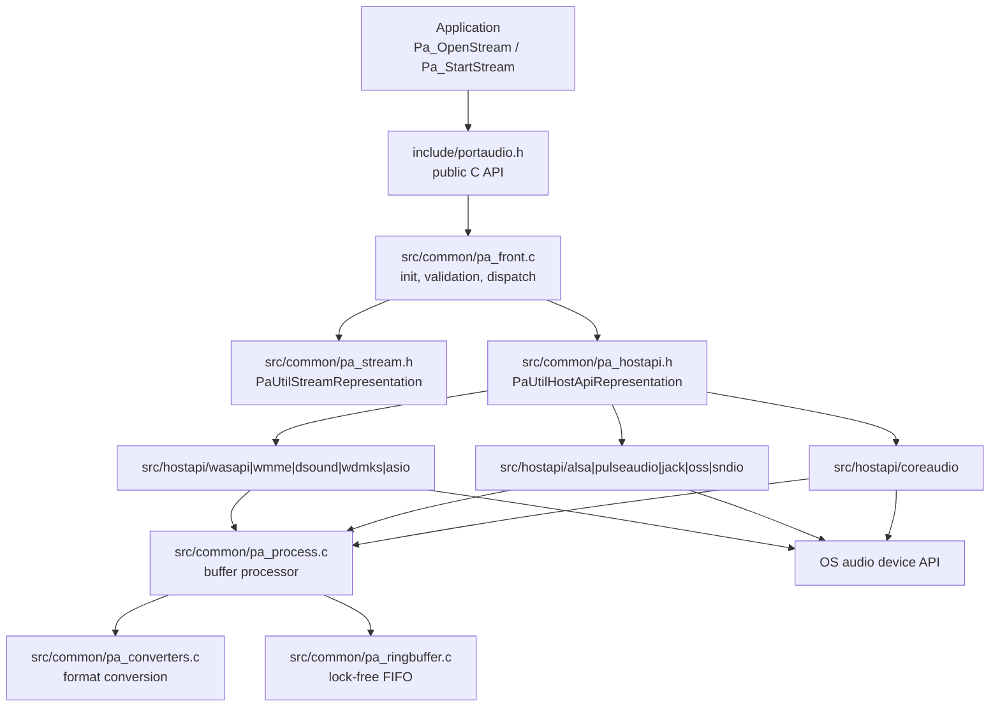
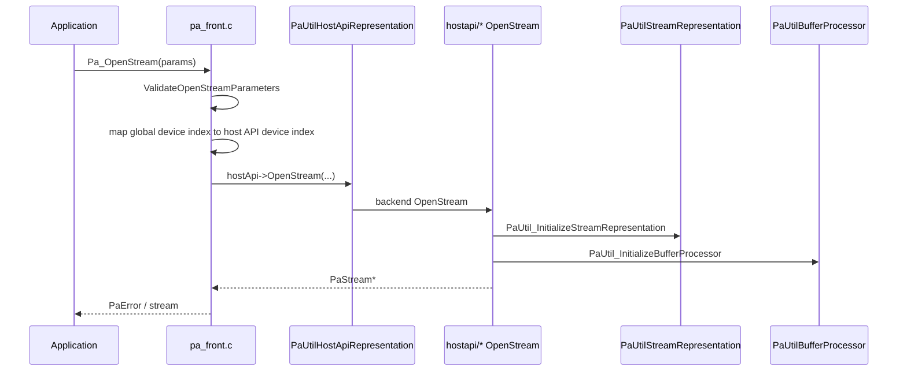
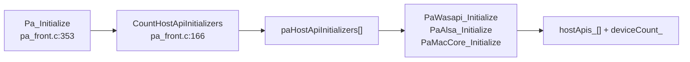
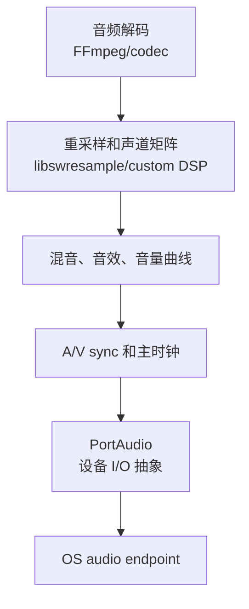

# PortAudio 整体架构

PortAudio 的架构核心是“薄公共 API + 通用前端 + 平台 Host API 后端”。公共 API 保持 C ABI 稳定，`pa_front.c` 负责初始化、参数校验、全局设备索引和 stream 分发，具体音频设备交互由 WASAPI、ALSA、CoreAudio、JACK 等后端完成。

源码快照：

- 本机路径：`D:/github/portaudio`
- Git describe：`v19.7.0-RC2-177-gcf218ed`
- Commit：`cf218ed8e3085ac3731106d3636c3c6396ec2d82`
- 文档日期：2026-06-09

## 分层架构

这张图回答“PortAudio 哪些代码是跨平台公共层，哪些代码属于平台后端”。

源码入口：

- `include/portaudio.h:185` `Pa_Initialize()`，公共初始化入口。
- `include/portaudio.h:904` `Pa_OpenStream()`，公共 stream 打开入口。
- `src/common/pa_front.c:353` `Pa_Initialize()`，进入 Host API 初始化。
- `src/common/pa_front.c:1152` `Pa_OpenStream()`，校验参数并分发到后端。
- `src/common/pa_hostapi.h:201` `PaUtilHostApiRepresentation`，后端必须实现的 Host API 合同。
- `src/common/pa_stream.h:67` `PaUtilStreamInterface`，stream 操作 vtable。

## 公共 API 面

```mermaid
flowchart LR
    Init["Pa_Initialize"]
    Enum["Pa_GetHostApiInfo\nPa_GetDeviceInfo"]
    Check["Pa_IsFormatSupported"]
    Open["Pa_OpenStream\nPa_OpenDefaultStream"]
    Run["Pa_StartStream"]
    IO["callback 或 Pa_ReadStream/Pa_WriteStream"]
    Stop["Pa_StopStream\nPa_AbortStream"]
    Close["Pa_CloseStream"]
    Term["Pa_Terminate"]

    Init --> Enum --> Check --> Open --> Run --> IO --> Stop --> Close --> Term
```

源码入口：

- `src/common/pa_front.c:567` `Pa_GetHostApiCount()`。
- `src/common/pa_front.c:617` `Pa_GetHostApiInfo()`。
- `src/common/pa_front.c:696` `Pa_GetDeviceCount()`。
- `src/common/pa_front.c:763` `Pa_GetDeviceInfo()`。
- `src/common/pa_front.c:1048` `Pa_IsFormatSupported()`。
- `src/common/pa_front.c:1445` `Pa_StartStream()`。
- `src/common/pa_front.c:1651` `Pa_ReadStream()`。
- `src/common/pa_front.c:1691` `Pa_WriteStream()`。

## `Pa_OpenStream()` 主流程

这张图回答“应用调用 `Pa_OpenStream()` 后，PortAudio 如何选择后端并生成 stream”。

源码入口：

- `src/common/pa_front.c:1226` `ValidateOpenStreamParameters(...)`。
- `src/common/pa_front.c:1136` `hostApi->IsFormatSupported(...)`。
- `src/common/pa_front.c:1152` `Pa_OpenStream()`。
- `src/common/pa_hostapi.h:317` `OpenStream` 函数指针合同。
- `src/common/pa_stream.c:80` `PaUtil_InitializeStreamRepresentation()`。
- `src/common/pa_process.c:90` `PaUtil_InitializeBufferProcessor()`。

> [!IMPORTANT]
> `PaStream*` 对调用方是 opaque pointer，但在内部必须以 `PaUtilStreamRepresentation` 开头。`PA_STREAM_INTERFACE(stream)` 才能把 `Pa_StartStream()`、`Pa_WriteStream()` 等公共 API 转发到后端 stream vtable。

## Host API 注册

Host API 初始化表由平台文件提供，`pa_front.c` 在 `Pa_Initialize()` 时按表顺序调用。第一个成功初始化且有默认输入或输出设备的 Host API 会成为默认 Host API。

源码入口：

- `src/common/pa_front.c:198` `InitializeHostApis()`。
- `src/common/pa_front.c:224` 调用 `paHostApiInitializers[i]`。
- `src/common/pa_front.c:236` 默认 Host API 选择逻辑。
- `src/common/pa_hostapi.h:346` `PaUtilHostApiInitializer`。
- `src/common/pa_hostapi.h:349` `paHostApiInitializers` 合同说明。
- `src/os/win/pa_win_hostapis.c:73` Windows 后端表。
- `src/os/unix/pa_unix_hostapis.c:61` Unix/macOS 后端表。

## 核心数据结构

| 数据结构/API | 位置 | 作用 | 工程注意点 |
| --- | --- | --- | --- |
| `PaHostApiInfo` | `include/portaudio.h:301` | Host API 类型、名称、设备数量、默认设备 | index 不是 type id |
| `PaDeviceInfo` | `include/portaudio.h:505` | 设备能力、默认采样率、默认延迟 | 设备列表来自后端枚举，热插拔支持依后端而异 |
| `PaStreamParameters` | `include/portaudio.h:547` | 打开 stream 的设备、通道、格式、建议延迟 | `hostApiSpecificStreamInfo` 必须匹配对应 Host API |
| `PaStreamCallbackTimeInfo` | `include/portaudio.h:708` | callback 时间戳 | 用于同步估计，不等价于播放器主时钟 |
| `PaUtilHostApiRepresentation` | `src/common/pa_hostapi.h:201` | 后端接口和设备表 | 后端实现 `OpenStream`/`IsFormatSupported` |
| `PaUtilStreamInterface` | `src/common/pa_stream.h:67` | stream 操作 vtable | 公共 API 通过它转发 |
| `PaUtilBufferProcessor` | `src/common/pa_process.h:377` | 格式转换、通道布局、buffer 适配 | callback 和 blocking 都会用 |

## PortAudio 不覆盖的层

PortAudio 从 `Pa_OpenStream()` 的 PCM 参数开始工作。它不知道容器、编码格式、packet、decoder delay，也不会替应用决定音视频同步策略。播放器要把上游产生的 PCM、时间戳和缓冲策略整理好，再交给 PortAudio。
