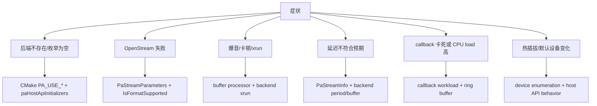

# PortAudio 工程问题手册

这份手册按“症状 -> 先查什么 -> 源码入口 -> 处理策略”组织。PortAudio 问题经常来自构建选项、默认设备、平台后端、callback 实时性、buffer/latency 参数和设备驱动差异，不应一上来判断为公共 API bug。

源码快照：

- 本机路径：`D:/github/portaudio`
- Git describe：`v19.7.0-RC2-177-gcf218ed`
- Commit：`cf218ed8e3085ac3731106d3636c3c6396ec2d82`
- 文档日期：2026-06-09

## 总体排查路径

这张图回答“遇到 PortAudio 播放/采集问题先在哪一层切入”。

## 后端没启用或设备枚举为空

症状：

- `Pa_GetHostApiCount()` 或 `Pa_GetDeviceCount()` 结果和预期不符。
- Windows 上看不到 ASIO/WASAPI，Linux 上看不到 ALSA/JACK/PulseAudio。
- 编译成功但某些平台扩展头或符号不可用。

先查：

- CMake 选项是否启用对应 `PA_USE_*`。
- 编译期依赖是否被找到，例如 ALSA/JACK/PulseAudio/ASIO SDK。
- `paHostApiInitializers[]` 表里是否包含对应初始化函数。

源码入口：

- `CMakeLists.txt:139` `PA_USE_JACK`。
- `CMakeLists.txt:184` `PA_USE_ASIO`，默认关闭。
- `CMakeLists.txt:259` `PA_USE_WASAPI`。
- `CMakeLists.txt:336` `PA_USE_ALSA`。
- `CMakeLists.txt:377` `PA_USE_PULSEAUDIO`。
- `src/os/win/pa_win_hostapis.c:73` Windows Host API 表。
- `src/os/unix/pa_unix_hostapis.c:61` Unix/macOS Host API 表。
- `src/common/pa_front.c:198` `InitializeHostApis()`。

处理：

- 先用 `examples/pa_devs.c` 或自写枚举程序打印 host API 和 device 列表。
- 构建日志里确认 `find_package()` 是否找到依赖。
- 需要专业低延迟时，Windows 优先明确选择 ASIO/WASAPI；Linux 优先区分 ALSA/JACK/PulseAudio。

## `Pa_OpenStream()` 失败

症状：

- 返回 `paInvalidSampleRate`、`paInvalidChannelCount`、`paSampleFormatNotSupported`、`paUnanticipatedHostError`。
- `Pa_IsFormatSupported()` 成功但真正打开 stream 失败。
- 默认设备能打开，指定设备失败。

先查：

- `PaStreamParameters.device` 是全局 device index，不是 Host API 内部 index。
- input/output 是否来自同一个 Host API。PortAudio 前端会校验全双工时两个设备的 Host API 关系。
- `hostApiSpecificStreamInfo` 的 type/version/size 是否匹配后端。
- `suggestedLatency` 是否过低，`framesPerBuffer` 是否和后端 period/buffer 不兼容。

源码入口：

- `src/common/pa_front.c:1048` `Pa_IsFormatSupported()`。
- `src/common/pa_front.c:1152` `Pa_OpenStream()`。
- `src/common/pa_front.c:1226` 参数校验入口。
- `src/common/pa_hostapi.h:227` `OpenStream` 参数保证和后端职责。
- `src/hostapi/wasapi/pa_win_wasapi.c:3175` WASAPI `IsFormatSupported()`。
- `src/hostapi/alsa/pa_linux_alsa.c:1851` ALSA `IsFormatSupported()`。
- `src/hostapi/coreaudio/pa_mac_core.c:887` CoreAudio `IsFormatSupported()`。

处理：

- 打印 `PaDeviceInfo`：`maxInputChannels`、`maxOutputChannels`、`defaultSampleRate`、默认 latency。
- 先用设备默认 sample rate 和 `paFramesPerBufferUnspecified` 验证基本路径，再逐步降低 latency。
- 对 `paUnanticipatedHostError`，读取 `Pa_GetLastHostErrorInfo()`。

## 爆音、卡顿、underflow/overflow

症状：

- 播放间歇性爆音。
- callback status flags 出现 underflow/overflow。
- 阻塞写入偶尔卡住，或者 `Pa_WriteStream()` 返回 underrun 相关错误。

先查：

- callback 是否超时，`Pa_GetStreamCpuLoad()` 是否接近 1。
- `framesPerBuffer` 和 `suggestedLatency` 是否过低。
- 应用是否在 callback 中做锁、日志、文件 I/O、网络 I/O 或堆分配。
- 后端是否处在共享模式、音频服务器模式或低优先级线程。

源码入口：

- `include/portaudio.h:839` `PaStreamCallback`。
- `src/common/pa_front.c:1621` `Pa_GetStreamCpuLoad()`。
- `src/common/pa_process.h:96` callback buffer processor 说明。
- `src/common/pa_process.c:1490` `PaUtil_EndBufferProcessing()`。
- `src/hostapi/wasapi/pa_win_wasapi.c:5093` WASAPI callback 处理状态。
- `src/hostapi/jack/pa_jack.c:760` JACK xrun 处理入口。

处理：

- callback 内只做固定时间的 PCM 填充/消费，跨线程数据通过 `PaUtilRingBuffer` 或应用队列传递。
- 增大 `suggestedLatency` 或 `framesPerBuffer` 验证是否是实时性不足。
- 对比 callback API 和 blocking API，分离“应用生产不及时”和“后端设备调度问题”。

## 延迟不符合预期

症状：

- 指定很低 latency 后实际听感仍高。
- 独占/专业设备表现好，桌面默认设备延迟大。
- input/output 往返延迟和 `PaStreamInfo` 不一致。

先查：

- `PaStreamInfo.inputLatency` 和 `outputLatency`。
- 后端是否使用共享音频服务器，例如 PulseAudio 或 WASAPI shared。
- 设备 period、buffer size、server resampler 是否在中间引入额外延迟。

源码入口：

- `include/portaudio.h:1051` `PaStreamInfo`。
- `src/common/pa_front.c:1556` `Pa_GetStreamInfo()`。
- `src/common/pa_process.h:417` `PaUtil_GetBufferProcessorInputLatencyFrames()`。
- `src/common/pa_process.h:427` `PaUtil_GetBufferProcessorOutputLatencyFrames()`。
- `test/patest_latency.c` 延迟测试入口。
- `test/patest_suggested_vs_streaminfo_latency.c` suggested latency 对比测试。

处理：

- 以 `PaStreamInfo` 作为 PortAudio 层报告，不把 `suggestedLatency` 当实际值。
- 对低延迟产品，明确平台推荐后端：Windows ASIO/WASAPI exclusive，Linux JACK/ALSA hw，macOS CoreAudio。
- 用 loopback 测试测真实往返延迟。

## callback 线程和普通线程通信

症状：

- UI 线程和音频 callback 互相等待。
- 停止播放时死锁。
- callback 读到半更新状态，出现随机噪声或崩溃。

先查：

- 是否在 callback 中持有普通互斥锁。
- 跨线程数据结构是否 lock-free 或至少有实时路径不阻塞。
- 停止和关闭 stream 时是否还在访问 userData。

源码入口：

- `src/common/pa_ringbuffer.h:93` `PaUtilRingBuffer`。
- `src/common/pa_ringbuffer.c:198` `PaUtil_WriteRingBuffer()`。
- `src/common/pa_ringbuffer.c:220` `PaUtil_ReadRingBuffer()`。
- `examples/paex_ocean_shore.c:342` callback 侧读 ring buffer。
- `examples/paex_record_file.c:250` callback 侧写 ring buffer。
- `src/common/pa_front.c:1382` `Pa_CloseStream()`。

处理：

- callback 和 UI/worker 之间只传递小块不可变消息或环形 PCM 缓冲。
- `Pa_StopStream()`/`Pa_AbortStream()` 后再释放 userData 和 ring buffer 内存。
- callback 返回 `paComplete` 后，注意后端可能仍需要 flush 已生成输出。

## 日志和探针矩阵

| 阶段 | 打印内容 | 关键 API/源码 | 判断 |
| --- | --- | --- | --- |
| 初始化 | host API count/name/type | `Pa_GetHostApiCount()`、`Pa_GetHostApiInfo()` | 后端是否存在 |
| 设备枚举 | device name、hostApi、channel、default latency、default sample rate | `Pa_GetDeviceInfo()` | 选错设备还是能力不足 |
| 格式检查 | sampleRate、format、channel、latency、host info | `Pa_IsFormatSupported()` | 参数是否可打开 |
| 打开 stream | framesPerBuffer、flags、host error | `Pa_OpenStream()`、`Pa_GetLastHostErrorInfo()` | 前端校验失败还是后端失败 |
| 运行中 | callback status flags、CPU load、read/write available | `Pa_GetStreamCpuLoad()`、`Pa_GetStreamReadAvailable()`、`Pa_GetStreamWriteAvailable()` | 实时性或缓冲问题 |
| 关闭 | Stop/Abort/Close 返回值 | `Pa_StopStream()`、`Pa_AbortStream()`、`Pa_CloseStream()` | 生命周期是否正确 |

> [!TIP]
> 源码支持 `PA_ENABLE_DEBUG_OUTPUT` 和 `PA_LOG_API_CALLS` 两类调试宏。前者在 `CMakeLists.txt:89` 暴露为 CMake 选项，后者由 `src/common/pa_front.c:61` 注释说明。

## 经验规则

| 规则 | 含义 |
| --- | --- |
| 先枚举再打开 | 不要假设默认设备、默认采样率和通道数跨机器一致 |
| suggested latency 不是实际 latency | 实际值看 `PaStreamInfo` 和后端设备参数 |
| callback 不是普通业务线程 | 不阻塞、不分配、不做慢日志 |
| 先验证构建后端 | 很多“平台不支持”其实是 `PA_USE_*` 没开或依赖没找到 |
| device index 有两层 | 对外全局 index，后端内部 local index，混用会导致选错设备 |
| PortAudio 不做播放器同步 | A/V sync、解码时钟和缓冲策略必须由上层负责 |
