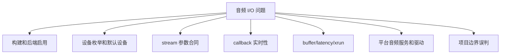
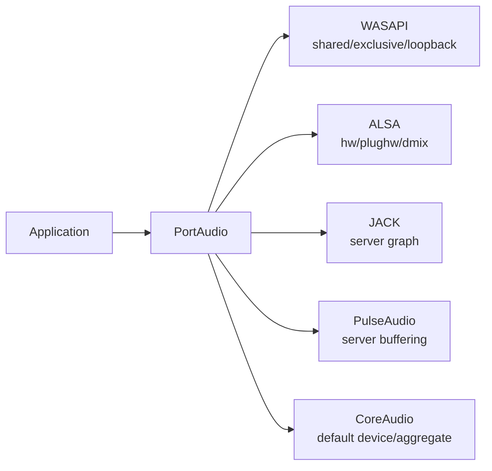

# PortAudio 缺陷与风险清单

这份清单按层分类 PortAudio 集成中的弱点、限制和高风险误区。它不是说这些都是 PortAudio bug，而是提醒跨平台音频工程里应该在哪一层验证、日志和 fallback。

源码快照：

- 本机路径：`D:/github/portaudio`
- Git describe：`v19.7.0-RC2-177-gcf218ed`
- Commit：`cf218ed8e3085ac3731106d3636c3c6396ec2d82`
- 文档日期：2026-06-09

## 风险分类图

## 分层风险表

| 层 | 风险 | 症状 | 先查源码/字段 | 工程处理 |
| --- | --- | --- | --- | --- |
| 构建 | 对应后端未编译进库 | 枚举不到 WASAPI/ALSA/JACK/ASIO | `CMakeLists.txt:139`、`:184`、`:259`、`:336`、`:377` | 打印构建选项和 host API 列表 |
| Host API 表 | 初始化顺序影响默认 Host API | 默认设备不符合预期 | `src/common/pa_front.c:236`、`src/os/win/pa_win_hostapis.c:73` | 显式选择设备，不依赖默认 |
| 设备索引 | 全局 index 和 host-local index 混淆 | 打开了错误设备或参数校验失败 | `src/common/pa_front.c:545` | 所有 UI/配置保存全局 index 或稳定设备名 |
| 参数合同 | sample rate、format、channel 不被设备支持 | `Pa_OpenStream()` 失败 | `src/common/pa_front.c:1048`、`src/common/pa_hostapi.h:227` | 先 `Pa_IsFormatSupported()`，失败后降级 |
| 平台扩展 | `hostApiSpecificStreamInfo` 不匹配 | 后端返回参数错误 | `src/common/pa_hostapi.h:189` | 校验 size/type/version |
| callback | 阻塞或超时 | 爆音、dropout、CPU load 高 | `include/portaudio.h:839`、`src/common/pa_front.c:1621` | callback 内只做固定时间处理 |
| buffer processor | 格式转换/通道交错成本被低估 | CPU 占用高或延迟高 | `src/common/pa_process.h:96`、`src/common/pa_converters.c:176` | 尽量使用设备友好格式，减少转换 |
| blocking API | 把 `WriteStream` 当无延迟队列 | 写入阻塞、关闭卡住 | `src/common/pa_front.c:1691`、`src/hostapi/wasapi/pa_win_wasapi.c:4897` | 单独音频线程写入，设置停止信号 |
| 热插拔 | 设备变更语义依后端 | USB 声卡拔出后无声或错误 | `src/hostapi/wasapi/pa_win_wasapi.c:5664` | 应用层重枚举和重开 stream |
| 项目边界 | 以为 PortAudio 会做解码/同步/混音 | 播放器架构职责混乱 | `include/portaudio.h:904` | 上层维护 PCM、时间戳、混音和 A/V sync |

> [!WARNING]
> PortAudio 的跨平台 API 不抹平所有平台音频语义。WASAPI、ALSA、CoreAudio、JACK、PulseAudio 的设备模型、调度模型、默认采样率和延迟语义都不同。

## 平台风险图

## 需要验证而不是假设的场景

- `Pa_GetDefaultOutputDevice()` 是否稳定，尤其设备热插拔后。
- 用户请求的 sample rate 是否被后端接受，还是被音频服务器/驱动转换。
- `suggestedLatency` 是否被后端尊重。
- callback status flags 是否出现 underflow/overflow。
- `Pa_GetStreamCpuLoad()` 是否长期接近 1。
- blocking API 写入线程是否会影响应用关闭流程。
- Windows ASIO 是否真的编译并加载到目标机器。
- Linux 上用户想要的是 ALSA 直连、PulseAudio 桌面集成，还是 JACK 低延迟 graph。

## Fallback 策略

| 失败点 | 首选 fallback | 不建议 |
| --- | --- | --- |
| 默认设备打开失败 | 重枚举并让用户选择设备 | 无限重试默认设备 |
| sample rate 不支持 | 使用设备 `defaultSampleRate` 或应用重采样 | 强行打开固定 48k/44.1k |
| latency 太低导致 xrun | 增大 suggested latency 或 framesPerBuffer | 在 callback 内补更多业务逻辑 |
| 后端不存在 | 换已编译后端或提示安装依赖 | 把错误描述成“系统无声卡” |
| callback 生产不及时 | ring buffer + 预填充 + 降低 DSP 负载 | callback 内等待 worker |
| 设备拔出 | Stop/Abort/Close 后重建 stream | 继续写旧 stream |

> [!TIP]
> 日志要按层打印：构建后端、Host API、device、stream 参数、actual latency、callback flags、host error。只打印 `PaError` 文本通常不足以定位跨平台问题。
