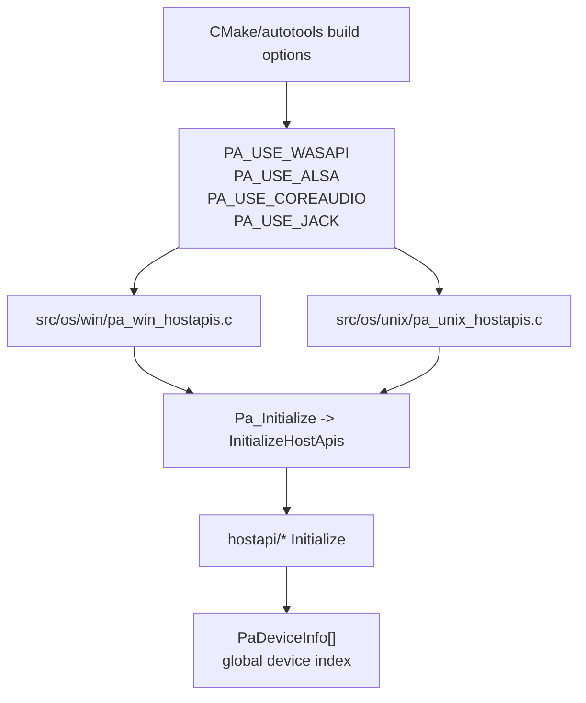
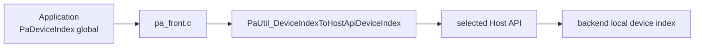
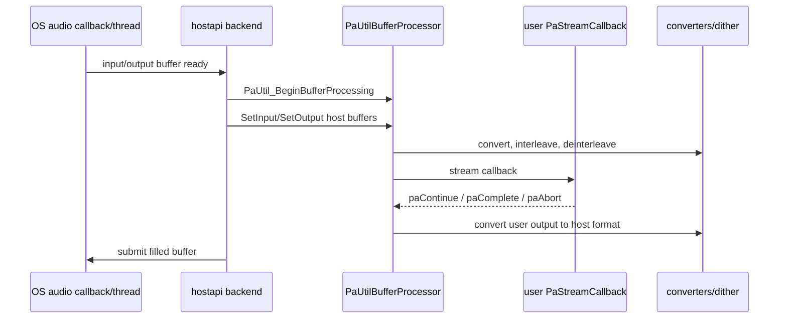
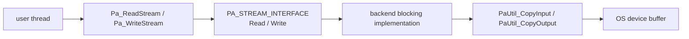
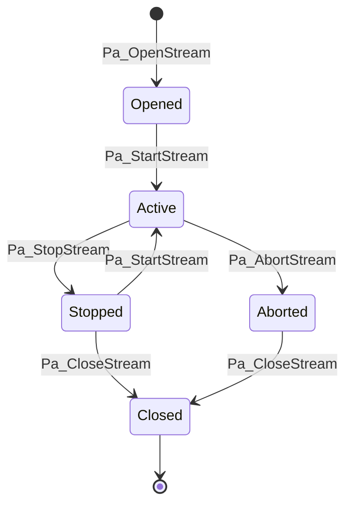
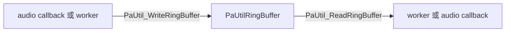

# PortAudio Host API 与 Stream 调度

这篇文档聚焦 PortAudio 最关键的工程合同：Host API 如何注册，stream 如何从公共 API 分发到平台后端，callback 和 blocking 两条数据路径分别如何工作。

源码快照：

- 本机路径：`D:/github/portaudio`
- Git describe：`v19.7.0-RC2-177-gcf218ed`
- Commit：`cf218ed8e3085ac3731106d3636c3c6396ec2d82`
- 文档日期：2026-06-09

## Host API 选择

这张图回答“同一套公共 API 为什么能落到不同平台音频系统上”。

源码入口：

- `CMakeLists.txt:184` `PA_USE_ASIO`。
- `CMakeLists.txt:231` `PA_USE_DS`。
- `CMakeLists.txt:248` `PA_USE_WMME`。
- `CMakeLists.txt:259` `PA_USE_WASAPI`。
- `CMakeLists.txt:270` `PA_USE_WDMKS`。
- `CMakeLists.txt:325` `PA_USE_COREAUDIO`。
- `CMakeLists.txt:336` `PA_USE_ALSA`。
- `CMakeLists.txt:377` `PA_USE_PULSEAUDIO`。
- `src/os/win/pa_win_hostapis.c:73` Windows initializer table。
- `src/os/unix/pa_unix_hostapis.c:61` Unix/macOS initializer table。

> [!WARNING]
> “PortAudio 支持某平台 API”不等于当前构建产物启用了该后端。先看编译选项和导出的头/符号，再看运行时枚举结果。

## 设备索引合同

PortAudio 对外暴露全局 device index，但每个 Host API 后端内部有自己的 device index。`pa_front.c` 负责两者转换。

源码入口：

- `src/common/pa_front.c:545` `PaUtil_DeviceIndexToHostApiDeviceIndex()`。
- `src/common/pa_front.c:658` `Pa_HostApiDeviceIndexToDeviceIndex()`。
- `src/common/pa_front.c:717` `Pa_GetDefaultInputDevice()`。
- `src/common/pa_front.c:740` `Pa_GetDefaultOutputDevice()`。
- `src/common/pa_hostapi.h:204` 后端默认设备需先填 host-local index，再由前端转换。

## Callback 数据路径

这张图回答“callback stream 中用户 callback 在哪里被调用，格式转换在哪里发生”。

源码入口：

- `src/common/pa_process.h:96` callback stream 的 buffer processor 说明。
- `src/common/pa_process.h:113` callback 处理调用顺序。
- `src/common/pa_process.c:675` `PaUtil_BeginBufferProcessing()`。
- `src/common/pa_process.c:1490` `PaUtil_EndBufferProcessing()`。
- `src/common/pa_converters.c:176` `PaUtil_SelectConverter()`。
- `src/hostapi/wasapi/pa_win_wasapi.c:5136` WASAPI callback 路径使用 buffer processor。
- `src/hostapi/jack/pa_jack.c:1358` JACK 初始化 buffer processor。

> [!IMPORTANT]
> PortAudio callback 运行在实时音频路径上。用户 callback 里不应该做阻塞 I/O、锁等待、堆分配或耗时日志；需要跨线程通信时优先使用 ring buffer 或应用自己的无锁队列。

## Blocking 数据路径

Blocking API 没有用户 callback。`Pa_ReadStream()`/`Pa_WriteStream()` 从公共 API 转发到后端，后端再用 buffer processor 做复制和格式转换。

源码入口：

- `src/common/pa_front.c:1651` `Pa_ReadStream()`。
- `src/common/pa_front.c:1691` `Pa_WriteStream()`。
- `src/common/pa_process.h:148` blocking stream 的 buffer processor 说明。
- `src/common/pa_process.h:704` `PaUtil_CopyInput()`。
- `src/common/pa_process.h:729` `PaUtil_CopyOutput()`。
- `src/hostapi/alsa/pa_linux_alsa.c:4443` ALSA `ReadStream()`。
- `src/hostapi/alsa/pa_linux_alsa.c:4503` ALSA `WriteStream()`。
- `src/hostapi/wasapi/pa_win_wasapi.c:4700` WASAPI `ReadStream()`。
- `src/hostapi/wasapi/pa_win_wasapi.c:4897` WASAPI `WriteStream()`。

## Stream 生命周期

源码入口：

- `src/common/pa_front.c:1382` `Pa_CloseStream()`。
- `src/common/pa_front.c:1445` `Pa_StartStream()`。
- `src/common/pa_front.c:1471` `Pa_StopStream()`。
- `src/common/pa_front.c:1497` `Pa_AbortStream()`。
- `src/common/pa_front.c:1523` `Pa_IsStreamStopped()`。
- `src/common/pa_front.c:1539` `Pa_IsStreamActive()`。

## Ring Buffer 使用场景

PortAudio 提供 `PaUtilRingBuffer` 给内部和示例使用，它适合实时 callback 和普通线程之间搬运固定大小元素。

源码入口：

- `src/common/pa_ringbuffer.h:93` `PaUtilRingBuffer`。
- `src/common/pa_ringbuffer.c:66` `PaUtil_InitializeRingBuffer()`。
- `src/common/pa_ringbuffer.c:80` `PaUtil_GetRingBufferReadAvailable()`。
- `src/common/pa_ringbuffer.c:198` `PaUtil_WriteRingBuffer()`。
- `src/common/pa_ringbuffer.c:220` `PaUtil_ReadRingBuffer()`。
- `examples/paex_record_file.c:323` 示例初始化 ring buffer。

## 典型后端差异

| 后端 | 平台 | 强项 | 高风险点 | 源码入口 |
| --- | --- | --- | --- | --- |
| WASAPI | Windows | 现代 Windows 音频路径，支持独占/共享等扩展 | 设备格式、事件/轮询、loopback、线程优先级 | `src/hostapi/wasapi/pa_win_wasapi.c:2320` |
| WMME | Windows | 兼容老系统和简单场景 | 延迟高，能力有限 | `src/hostapi/wmme/pa_win_wmme.c:929` |
| DirectSound | Windows | 旧游戏/传统路径 | 全双工、驱动差异、动态加载 | `src/hostapi/dsound/pa_win_ds.c:1170` |
| ASIO | Windows | 专业低延迟设备 | SDK/驱动依赖，构建默认关闭 | `src/hostapi/asio/pa_asio.cpp:1160` |
| ALSA | Linux | 直连 Linux 设备 | dmix/hw/plughw、period/buffer 参数复杂 | `src/hostapi/alsa/pa_linux_alsa.c:743` |
| PulseAudio | Linux | 桌面音频服务器集成 | server 连接、延迟和 underrun 由服务端影响 | `src/hostapi/pulseaudio/pa_linux_pulseaudio.c:561` |
| JACK | Linux/跨平台 | 专业低延迟 graph | 依赖 JACK server，采样率由 server 主导 | `src/hostapi/jack/pa_jack.c:764` |
| CoreAudio | macOS | macOS 原生音频 | aggregate/default device、设备切换和属性变化 | `src/hostapi/coreaudio/pa_mac_core.c:721` |

> [!TIP]
> 做跨平台封装时，不要把 `suggestedLatency`、`framesPerBuffer` 和“实际硬件 buffer”当成同一个量。先记录 `PaStreamInfo` 返回的 input/output latency，再结合后端日志判断。
