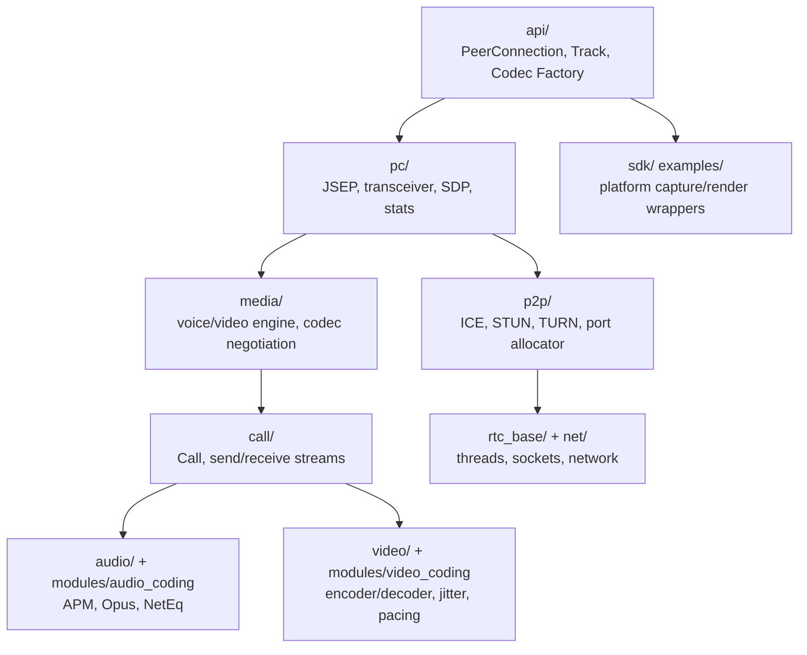
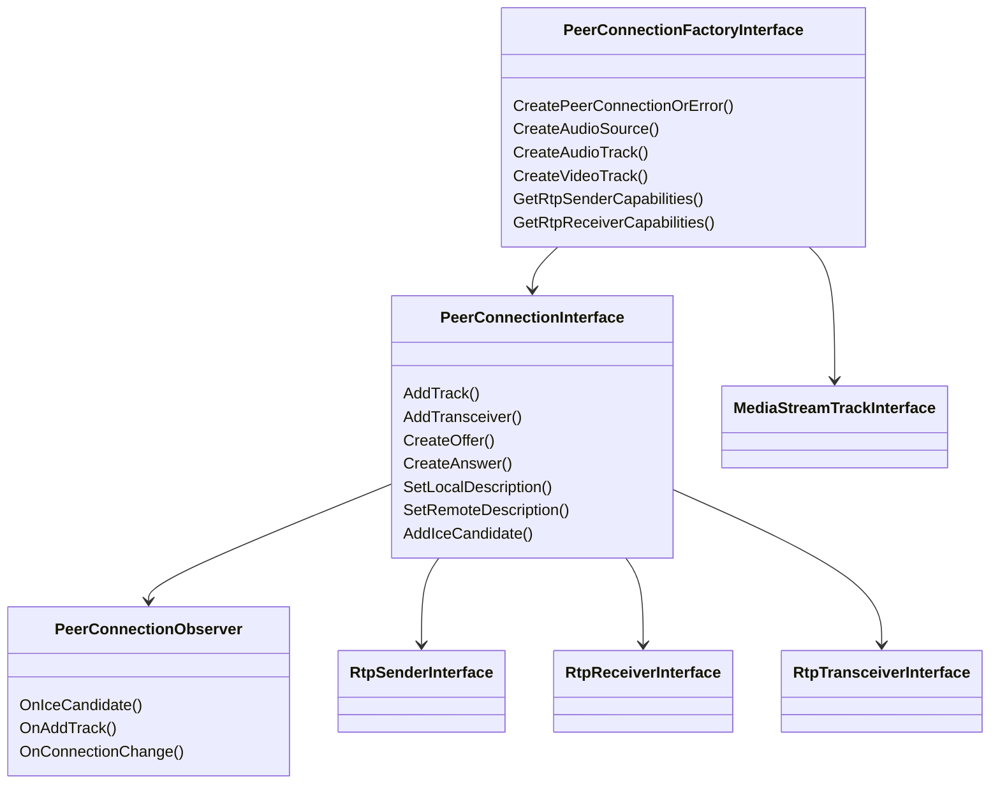
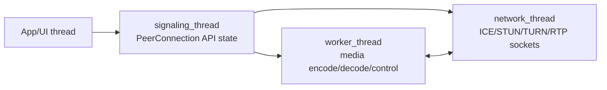

# WebRTC 整体架构

WebRTC 的架构可以按“API 层、会话层、媒体层、网络传输层、平台适配层”理解。C++ 集成者通常只直接接触 `api/` 和少量平台采集/渲染适配，真正的 RTP、ICE、拥塞控制、编解码调度在内部模块完成。

## 目录职责

- `api/`：Native API 面。`peer_connection_interface.h` 是 C++ 集成最重要的头文件；`create_peerconnection_factory.cc` 和 `create_modular_peer_connection_factory.h` 是 factory 创建入口。
- `pc/`：PeerConnection 实现层，负责 JSEP/SDP、RtpTransceiver、RtpSender/RtpReceiver、stats、signaling state。
- `media/`：媒体协商和 voice/video engine。`media/engine/webrtc_voice_engine.cc` 处理音频 codec 和发送/接收 channel；`media/engine/internal_encoder_factory.cc`、`internal_decoder_factory.cc` 管理内置视频编解码 factory。
- `call/`：媒体发送/接收流和 Call 对象，是音视频流与网络控制之间的核心汇合点。
- `audio/`、`modules/audio_coding/`：音频设备、音频处理、Opus 编解码、NetEq 抖动缓冲/丢包隐藏。
- `video/`、`modules/video_coding/`：视频发送/接收、编码器/解码器适配、帧缓冲、NACK/FEC、抖动与渲染路径。
- `p2p/`：ICE/STUN/TURN、候选地址、端口分配、连通性检查。
- `rtc_base/`：线程、日志、socket server、同步原语、基础工具。
- `examples/`：可运行示例。C++ 桌面 demo 的关键文件是 `examples/peerconnection/client/conductor.cc`。

## 核心对象关系

源码锚点：

- `api/peer_connection_interface.h:1472` 说明默认 media disabled，需要 `EnableMedia(PeerConnectionFactoryDependencies&)`。
- `api/peer_connection_interface.h:1525` `CreatePeerConnectionOrError()`。
- `api/peer_connection_interface.h:1544` `CreateAudioSource()`。
- `api/peer_connection_interface.h:1549` `CreateVideoTrack()`。
- `api/peer_connection_interface.h:1554` `CreateAudioTrack()`。
- `api/create_peerconnection_factory.cc:35` `CreatePeerConnectionFactory()`。
- `api/create_peerconnection_factory.cc:75` 调 `EnableMedia(dependencies)`。
- `api/create_peerconnection_factory.cc:77` 调 `CreateModularPeerConnectionFactory()`。
- `api/create_modular_peer_connection_factory.h:29` `CreateModularPeerConnectionFactory()`。

## 线程模型简图

集成时最容易出错的是线程和生命周期：`PeerConnectionFactoryInterface` 创建时可以传入 `network_thread`、`worker_thread`、`signaling_thread`。如果用默认 factory，则调用线程需要运行消息循环；如果自己传线程，就要保证线程先启动、后释放。
