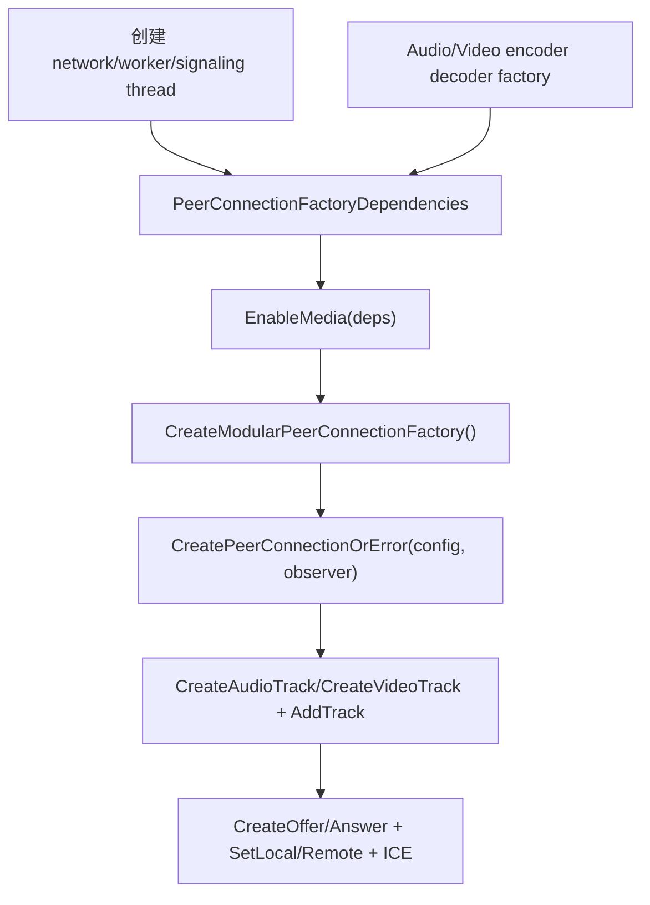

# C++ 集成入口与双端通话流程

WebRTC C++ 集成的中心不是 codec API，而是 `PeerConnectionFactoryInterface` 和 `PeerConnectionInterface`。应用层负责采集/渲染 UI、信令服务器、账号房间、业务状态；WebRTC 负责媒体协商、ICE、RTP/RTCP、拥塞控制、加密和音视频处理。

## C++ 最小入口



代码锚点：

- `examples/peerconnection/client/conductor.cc:198` 调 `EnableMedia(deps)`。
- `examples/peerconnection/client/conductor.cc:200` 调 `CreateModularPeerConnectionFactory(std::move(deps))`。
- `examples/peerconnection/client/conductor.cc:240` `Conductor::CreatePeerConnection()`。
- `examples/peerconnection/client/conductor.cc:252` 调 `CreatePeerConnectionOrError(config, pc_dependencies)`。
- `examples/peerconnection/client/conductor.cc:511` 创建 audio track。
- `examples/peerconnection/client/conductor.cc:515` 调 `AddTrack(audio_track, {kStreamId})`。
- `examples/peerconnection/client/conductor.cc:524` 创建 video track。
- `examples/peerconnection/client/conductor.cc:528` 调 `AddTrack(video_track_, {kStreamId})`。

示例代码中的 factory 依赖：

- `deps.audio_encoder_factory = CreateBuiltinAudioEncoderFactory()`。
- `deps.audio_decoder_factory = CreateBuiltinAudioDecoderFactory()`。
- video encoder factory 使用 `VideoEncoderFactoryTemplate<LibvpxVp8EncoderTemplateAdapter, LibvpxVp9EncoderTemplateAdapter, OpenH264EncoderTemplateAdapter, LibaomAv1EncoderTemplateAdapter>`。
- video decoder factory 使用 `VideoEncoderFactoryTemplate` 对应的 decoder adapter，包括 VP8、VP9、OpenH264、Dav1d AV1。

## 双端通话流程

`api/peer_connection_interface.h` 文件顶部已经直接写了官方流程。发起方和接收方都要创建 factory、创建 peer connection、交换 SDP 和 ICE。

```mermaid
sequenceDiagram
    participant A as Caller C++ App
    participant APC as A PeerConnection
    participant S as Signaling Server
    participant BPC as B PeerConnection
    participant B as Callee C++ App

    A->>APC: CreatePeerConnection + AddTrack
    A->>APC: CreateOffer()
    APC-->>A: offer SDP
    A->>APC: SetLocalDescription(offer)
    A->>S: send offer
    S->>B: deliver offer
    B->>BPC: CreatePeerConnection + AddTrack
    B->>BPC: SetRemoteDescription(offer)
    B->>BPC: CreateAnswer()
    BPC-->>B: answer SDP
    B->>BPC: SetLocalDescription(answer)
    B->>S: send answer
    S->>A: deliver answer
    A->>APC: SetRemoteDescription(answer)
    APC-->>A: OnIceCandidate()
    BPC-->>B: OnIceCandidate()
    A->>S: send candidates
    B->>S: send candidates
    S->>B: remote candidates
    S->>A: remote candidates
    A->>APC: AddIceCandidate()
    B->>BPC: AddIceCandidate()
    APC<->>BPC: DTLS-SRTP RTP/RTCP media
```

源码锚点：

- `api/peer_connection_interface.h:30` 起说明发起方：创建 offer、`SetLocalDescription`、发送 offer、通过 `OnIceCandidate` 发送 candidates、收到 answer 后 `SetRemoteDescription`、收到 remote candidate 后 `AddIceCandidate`。
- `api/peer_connection_interface.h:54` 起说明接收方：`SetRemoteDescription(offer)`、`CreateAnswer()`、`SetLocalDescription(answer)`、处理 remote ICE、通过 `OnIceCandidate` 回发 candidates。
- `api/peer_connection_interface.h:1006` `CreateOffer()`。
- `api/peer_connection_interface.h:1011` `CreateAnswer()`。
- `api/peer_connection_interface.h:1025` `SetLocalDescription()`。
- `api/peer_connection_interface.h:1054` `SetRemoteDescription()`。
- `api/peer_connection_interface.h:1303` `PeerConnectionObserver::OnIceCandidate()`。
- `api/peer_connection_interface.h:1329` `PeerConnectionObserver::OnAddTrack()`。
- `examples/peerconnection/client/conductor.cc:297` 示例里 `OnIceCandidate()` 把 candidate 序列化成 JSON 发给信令。
- `examples/peerconnection/client/conductor.cc:424` 收到 SDP 后 `SetRemoteDescription()`。
- `examples/peerconnection/client/conductor.cc:428` 收到 offer 后 `CreateAnswer()`。
- `examples/peerconnection/client/conductor.cc:498` 主叫调用 `CreateOffer()`。
- `examples/peerconnection/client/conductor.cc:623` `OnSuccess()` 里 `SetLocalDescription()` 并发送 SDP。

## C++ 集成边界

WebRTC 不帮你做这些事：

- 不提供业务信令协议。`offer/answer/candidate` 如何传到对端，由你的 signaling server 决定。
- 不管理房间、用户、鉴权、录制、MCU/SFU。
- 不强制你使用某个采集框架。你可以接平台摄像头、屏幕采集、文件、GPU texture，但最终要变成 `AudioTrack`/`VideoTrackSourceInterface` 或平台 SDK 对应接口。
- 不保证 SDP munging 稳定。`peer_connection_interface.h:1017` 附近注释明确说修改本地 SDP 虽然实现允许一部分，但 HIGHLY DISCOURAGED。

## 集成建议

- 新项目默认使用 Unified Plan：示例在 `examples/peerconnection/client/conductor.cc:245` 设置 `config.sdp_semantics = SdpSemantics::kUnifiedPlan`。
- 用 `AddTrack()` 或 `AddTransceiver()`，不要再基于 legacy `AddStream()` 设计新代码。
- 对外封装时把信令状态、ICE 状态、媒体 track 生命周期、渲染 sink 生命周期分开，不要把 UI 和 `PeerConnectionObserver` 直接耦合。
