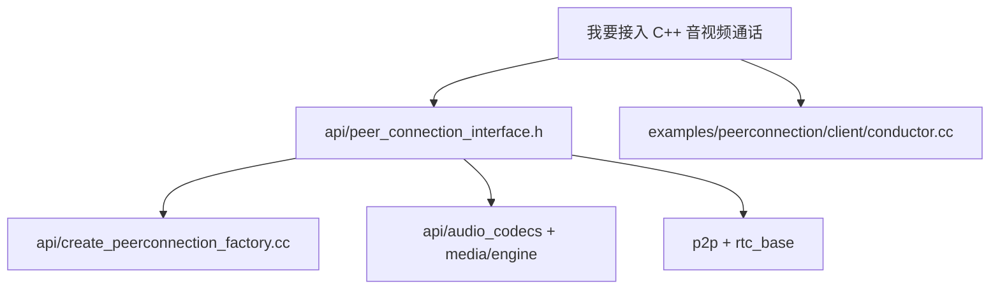

# WebRTC 工程问题手册

## C++ 接入先看哪里

优先阅读：

- `api/peer_connection_interface.h`：官方调用顺序和 C++ 接口定义。
- `examples/peerconnection/client/conductor.cc`：最完整的桌面 C++ 示例。
- `api/create_peerconnection_factory.cc`：传统 factory 创建入口。
- `api/create_modular_peer_connection_factory.h`：模块化 factory 创建入口。
- `media/engine/webrtc_voice_engine.cc`：音频 codec 协商和发送流配置。
- `media/engine/internal_encoder_factory.cc`、`internal_decoder_factory.cc`：内置视频 codec 能力。

## 常见问题

### 1. 为什么我只创建了 PeerConnection 但没有音视频？

`PeerConnection` 本身只是连接和协商容器。你还要：

- 给 factory 启用 media：`EnableMedia(deps)`。
- 创建并添加 track：`CreateAudioTrack()`、`CreateVideoTrack()`、`AddTrack()`。
- 完成 offer/answer 和 ICE candidate 交换。

源码：`examples/peerconnection/client/conductor.cc:198`、`:511`、`:515`、`:524`、`:528`。

### 2. 为什么 SDP 里 Opus 是 48000/2，但我听到的是单声道？

`opus/48000/2` 是 SDP payload format。实际编码声道数由 `stereo` 参数决定。`media/engine/webrtc_voice_engine.cc:1220` 明确说明只有 `stereo=1` 时 encoder 才使用双声道，否则 `num_encoded_channels_ = 1`。

### 3. 可以直接用 AAC 做 WebRTC 通话吗？

默认不能作为标准 WebRTC 浏览器互通音频 codec。Google WebRTC Native 可以自定义 audio encoder/decoder factory，但互通端也必须支持同样 RTP payload、SDP、packetization 和 jitter/解码逻辑。实时通话默认优先 Opus。

### 4. 可以直接把 NV12 或 GPU texture 送进 WebRTC 吗？

可以，但要看路径：

- 软件编码最稳是 I420，因为 `VideoFrameBuffer::ToI420()` 是 fallback。
- NV12 是 `VideoFrameBuffer::Type::kNV12` 支持的 buffer 类型。
- GPU texture 应走 `kNative`，并实现映射或接入硬编 factory，否则软件编码器最终仍可能要求转 I420。

源码：`api/video/video_frame_buffer.h:38`、`:62`、`:87`、`:126`。

### 5. 为什么 H264/AV1 在一台机器能用，另一台不能？

内置 factory 能力受编译宏和依赖影响：

- H264 encoder 依赖 `WEBRTC_USE_H264`。
- AV1 encoder 依赖 `RTC_USE_LIBAOM_AV1_ENCODER`。
- AV1 decoder 依赖 `RTC_DAV1D_IN_INTERNAL_DECODER_FACTORY`。

源码：`media/engine/internal_encoder_factory.cc:35`、`media/engine/internal_decoder_factory.cc:47`。

### 6. WebRTC 帮不帮我做信令？

不帮。WebRTC 只生成 SDP 和 ICE candidate，对端传输由你的业务信令完成。示例 `conductor.cc` 用 JSON 发送 `offer/answer/candidate`，但这只是 demo 协议。

### 7. OWT 和 WebRTC 怎么选？

- 一对一、嵌入式 C++ 通话、自己已有服务端：直接用 Google WebRTC Native。
- 多人会议、服务端录制、转码、混流、发布订阅：评估 OWT 或其他 SFU/MCU。

## 面试问答

Q：C++ Native WebRTC 的核心入口是什么？
A：`PeerConnectionFactoryInterface` 和 `PeerConnectionInterface`。factory 创建 track 和 peer connection；peer connection 负责 `AddTrack()`、`CreateOffer()`、`CreateAnswer()`、`SetLocalDescription()`、`SetRemoteDescription()`、ICE candidate。

Q：发起一次通话的最小流程是什么？
A：创建 factory，创建 peer connection，创建并添加 audio/video track，`CreateOffer()`，`SetLocalDescription()`，通过信令发 offer 和 ICE，收到 answer 后 `SetRemoteDescription()`，收到 remote ICE 后 `AddIceCandidate()`。

Q：为什么 WebRTC 通话默认选 Opus？
A：Opus 低延迟、48kHz clock、可变码率、支持 FEC/DTX/PLC、适配语音和音乐、浏览器和 Native 互通好。WebRTC 还围绕 Opus 做了网络自适应和 NetEq 配合。

Q：WebRTC 的视频输入格式限制是什么？
A：`VideoFrameBuffer` 支持 I420/I420A/I422/I444/I010/I210/I410/NV12/kNative，但软件编码最通用 fallback 是 I420。硬件纹理要走 `kNative` 或平台 SDK 路径。

Q：为什么不建议 SDP munging？
A：`SetLocalDescription()` 注释里说明实现允许部分 munging，但强烈不建议。更稳定的做法是通过 codec factory、transceiver、RtpParameters、field trial 或明确 API 控制能力。
