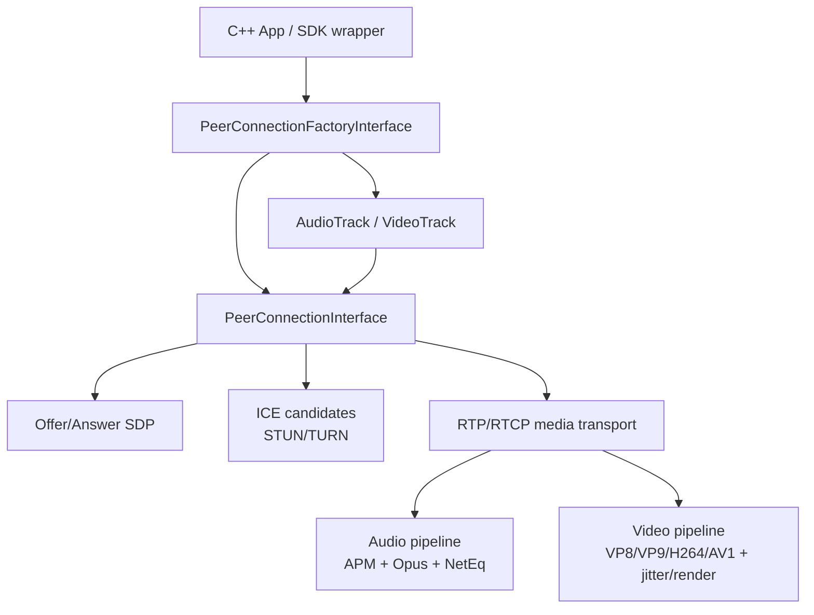

# WebRTC 项目文档

源码快照：`D:/github/google/webrtc`，当前本机提交 `3710345e71`，分支 `main`。

WebRTC 不是一个“播放器/推流器”式项目，而是一套实时通信引擎：C++ Native API 暴露 `PeerConnectionFactoryInterface` 和 `PeerConnectionInterface`，内部把采集、编解码、RTP/RTCP、拥塞控制、ICE/STUN/TURN、DTLS/SRTP、音频处理、视频适配组合成端到端音视频通话。

## 文档索引

- [architecture.md](architecture.md)：整体架构、目录分层、线程和媒体/网络关系。
- [cpp-integration.md](cpp-integration.md)：C++ 平台集成入口、双端通话流程、关键 API 与示例代码路径。
- [media-formats.md](media-formats.md)：音频格式、视频格式、Opus 为什么是通话核心、格式限制。
- [owt.md](owt.md)：OWT 是什么、它和 Google WebRTC 的关系、适合什么场景。
- [engineering-playbook.md](engineering-playbook.md)：工程排查与集成经验问题。
- [interview-qa.md](interview-qa.md)：WebRTC 常见面试问答。

## 资料来源

- 本地源码：`D:/github/google/webrtc`。
- 官方入口：`api/peer_connection_interface.h` 文件顶部直接给出发起方/接收方的 PeerConnection 调用步骤。
- 官方示例：`examples/peerconnection/client/conductor.cc` 展示 C++ demo 如何创建 factory、创建 peer connection、添加 track、交换 SDP/ICE。
- OWT：Open WebRTC Toolkit 是独立项目/生态，常见代码仓库为 `open-webrtc-toolkit/owt-server`，不是 Google WebRTC 源码树内的模块。
