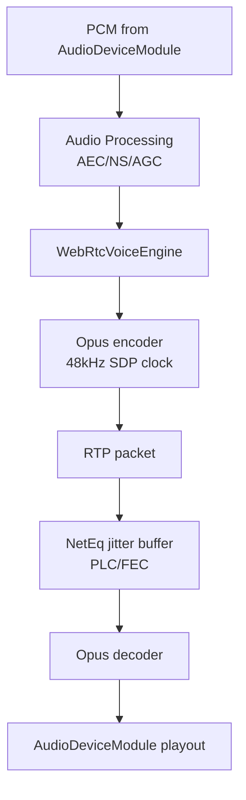
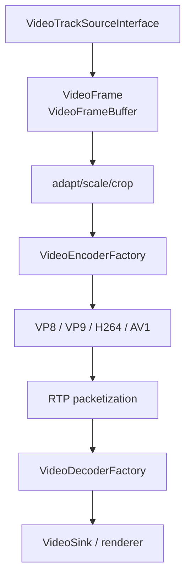

# 音视频格式与 Opus

WebRTC 的格式限制要分两层看：一层是 RTP/SDP 协商的 codec 格式，另一层是内部音视频帧的内存格式。C++ 集成时常见问题是“我能不能直接塞 AAC/H265/NV12/PCM float 进去”。答案通常是：可以自定义扩展，但内置路径有明确边界。

## 音频格式

内置音频 codec factory 在 `api/audio_codecs/builtin_audio_encoder_factory.cc` 和 `api/audio_codecs/builtin_audio_decoder_factory.cc`。Opus 是默认通话主 codec。

关键限制和代码：

- Opus SDP 格式是 `opus/48000/2`。`api/audio_codecs/opus/audio_decoder_opus.cc:41` 检查 `format.name == opus`、`clockrate_hz == 48000`、`num_channels == 2`。
- Opus advertised 参数包含 `minptime=10` 和 `useinbandfec=1`。`api/audio_codecs/opus/audio_decoder_opus.cc:68` 到 `:75` 构造 `SdpAudioFormat({"opus", 48000, 2, ...})`。
- `api/audio_codecs/opus/audio_encoder_opus_config.h:25` 默认 frame size 是 20ms。
- `api/audio_codecs/opus/audio_encoder_opus_config.h:29` 到 `:30` 码率范围是 6000 到 510000 bps。
- `api/audio_codecs/opus/audio_encoder_opus_config.h:41` 默认编码声道数是 1。
- `api/audio_codecs/opus/audio_encoder_opus_config.cc:20` `IsOk()` 校验配置；`:28` 检查声道数不能超过 `AudioEncoder::kMaxNumberOfChannels`；`:33` 检查码率范围。
- `media/engine/webrtc_voice_engine.cc:1220` 注释说明：编码器只有在 SDP 参数 `stereo=1` 时才使用双声道；`:1221` 到 `:1225` 设置 `num_encoded_channels_`。

为什么 SDP 是 `opus/48000/2`，但默认可能只编码单声道：RTP/SDP 的 channel count 表示该 payload format 的能力和 RTP timestamp clock；实际发送单声道还是立体声由 `stereo` 参数和编码器配置决定。WebRTC 通话默认更偏语音质量、码率和抗丢包，所以经常是 mono Opus。

## 为什么用 Opus 做音频通话

Opus 适合 RTC 的原因不是“音质好”这么简单，而是它覆盖了实时语音最关键的工程需求：

- 低延迟：常用 20ms packet，也支持更短帧长，适合交互式语音。
- 宽频带：窄带到全带语音/音乐都能覆盖，WebRTC SDP 使用 48kHz clock。
- 可变码率和复杂度控制：`AudioEncoderOpusImpl` 支持根据码率调整 bandwidth/complexity。
- 抗丢包：支持 in-band FEC、DTX、PLC 配合 NetEq。
- 网络自适应：`AudioCodecInfo.supports_network_adaption = true`，WebRTC voice engine 可结合带宽、丢包、RTT 调整。
- 标准化和互通：浏览器、Native SDK、SFU 基本都支持 Opus。

源码锚点：

- `api/audio_codecs/opus/audio_encoder_opus.cc:33` `AppendSupportedEncoders()`。
- `api/audio_codecs/opus/audio_encoder_opus.cc:47` 创建 encoder 前检查 `config.IsOk()`。
- `modules/audio_coding/codecs/opus/audio_encoder_opus.h:62` `SetFec()`。
- `modules/audio_coding/codecs/opus/audio_encoder_opus.h:66` `SetDtx()`。
- `modules/audio_coding/codecs/opus/audio_encoder_opus.h:70` `SetMaxPlaybackRate()`。
- `modules/audio_coding/codecs/opus/audio_encoder_opus.h:72` `EnableAudioNetworkAdaptor()`。
- `modules/audio_coding/codecs/opus/opus_interface.h:302` `WebRtcOpus_SetComplexity()`。
- `modules/audio_coding/codecs/opus/opus_interface.h:326` `WebRtcOpus_SetBandwidth()`。
- `modules/audio_coding/codecs/opus/opus_interface.h:348` `WebRtcOpus_SetForceChannels()`。

## 视频格式

WebRTC 视频也要分 codec 和 frame buffer。内置软件 codec 的可用性受 GN 编译宏影响。

内置 codec factory：

- `media/engine/internal_encoder_factory.cc:45` `InternalEncoderFactory::GetSupportedFormats()`。
- `media/engine/internal_encoder_factory.cc:50` `InternalEncoderFactory::Create()`。
- `media/engine/internal_encoder_factory.cc:35` 起的 template 组合默认包含 VP8；如果 `WEBRTC_USE_H264` 开启则包含 OpenH264；如果 `RTC_USE_LIBAOM_AV1_ENCODER` 开启则包含 AV1；也包含 VP9 adapter。
- `media/engine/internal_decoder_factory.cc:47` `InternalDecoderFactory::GetSupportedFormats()`：加入 VP8、VP9、H264；如果 `RTC_DAV1D_IN_INTERNAL_DECODER_FACTORY` 开启，则加入 AV1 profile 0/1。
- `media/engine/internal_decoder_factory.cc:82` `InternalDecoderFactory::Create()`：根据 format name 创建 VP8、VP9、H264、AV1 decoder。
- `api/video_codecs/sdp_video_format.h:74` 到 `:82` 定义常见 video SDP format：VP8、H264、H265、VP9 profile 0-3、AV1 profile 0/1。

视频帧内存格式：

- `api/video/video_frame_buffer.h:62` 到 `:70` `VideoFrameBuffer::Type` 包括 `kNative`、`kI420`、`kI420A`、`kI422`、`kI444`、`kI010`、`kI210`、`kI410`、`kNV12`。
- `api/video/video_frame_buffer.h:38` 注释说明 `ToI420()` 是通用 fallback，I420 是软件编码器最广泛接受的格式。
- `api/video/video_frame_buffer.h:41` 说明 `kNative` 用于外部客户端实现自己的纹理/平台帧表示，避免中间转换。
- `api/video/video_frame_buffer.h:126` `GetMappedFrameBuffer()` 允许 `kNative` 映射成指定内存格式，供软件编码使用。
- `api/video/video_frame_buffer.h:321` 附近定义 NV12 buffer。

工程判断：

- 如果你接摄像头/屏幕采集，最稳的输入是 I420；如果要走硬件纹理，使用 `kNative` 并确保 encoder/sink 能识别或能 map。
- H264 是否可用不是只看源码有 `SdpVideoFormat::H264()`，还要看 `WEBRTC_USE_H264` 和 OpenH264/平台硬编 factory 是否接入。
- H265 在 `SdpVideoFormat` 里有声明，但 Google WebRTC 的默认内置 encoder/decoder factory 不等于完整 H265 通话支持；生产上通常要自定义 video codec factory 和 SDP/packetization 互通。
- AV1 encoder/decoder 是否可用取决于 `RTC_USE_LIBAOM_AV1_ENCODER` 和 `RTC_DAV1D_IN_INTERNAL_DECODER_FACTORY`。
