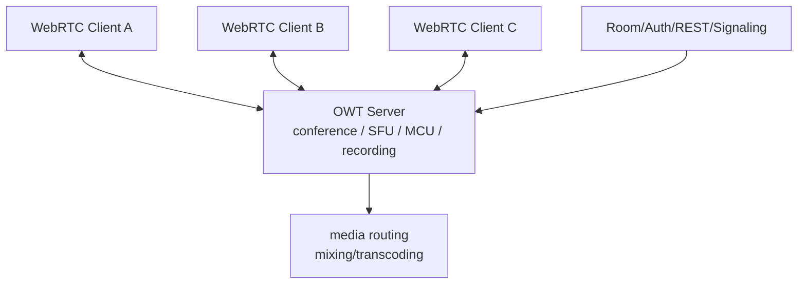
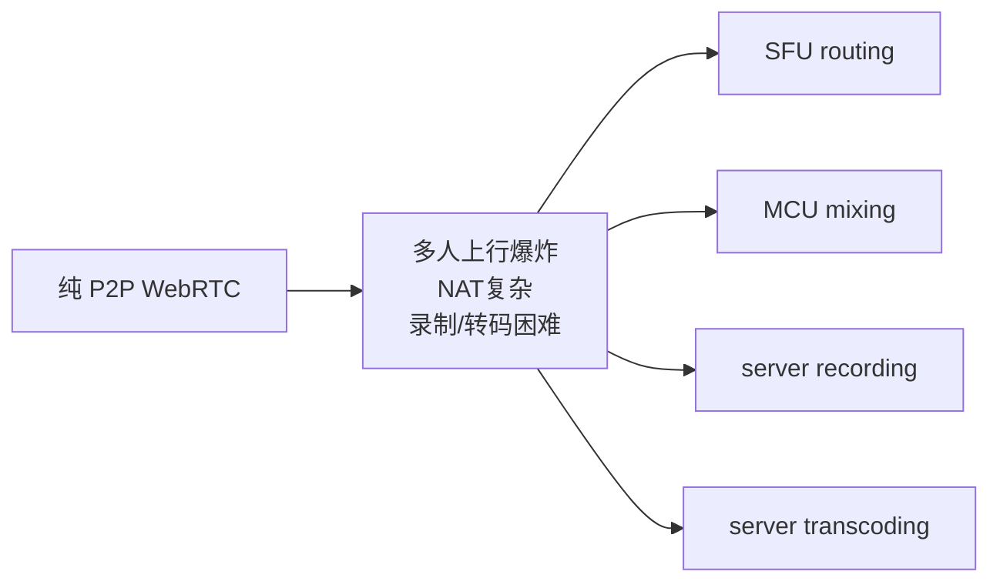

# OWT 是什么

OWT 是 Open WebRTC Toolkit，常见来源是 Intel 开源的 `open-webrtc-toolkit` 系列项目。它不是 Google WebRTC 源码树里的一个目录，也不是 `PeerConnection` 的替代实现；更准确地说，它是建立在 WebRTC 技术栈之上的服务器和 SDK 生态，用来做会议、SFU/MCU、录制、转码、媒体分发等多人实时通信能力。

## 和 Google WebRTC 的关系

- Google WebRTC：底层实时通信引擎，提供 Native API、浏览器实现、ICE/RTP/RTCP/DTLS/SRTP、音视频编解码和网络自适应。
- OWT：上层实时通信平台，关注多人会议、媒体服务器、房间管理、录制、转码、级联、SDK。
- 一对一通话只用 Google WebRTC 就够；多人会议、服务端录制、转码、混流、直播分发，通常需要 SFU/MCU，OWT 属于这类方案。

## OWT 解决的问题

- 多人会议：客户端不需要向每个人单独上行一路。
- 服务端录制：服务端接收 RTP/媒体流并落盘或转封装。
- 混流/转码：服务端可以把多路音视频混成一路，或做分辨率/码率/codec 转换。
- 统一房间和权限：会议系统需要用户、房间、发布/订阅权限，不是 `PeerConnection` 自己负责的。

## 什么时候不需要 OWT

- 只做一对一音视频通话。
- 自己已有 SFU，例如 mediasoup、Janus、LiveKit、Pion、SRS 等。
- 只把 WebRTC 作为低延迟传输的一段，不需要会议平台能力。

## 在文档体系里的定位

OWT 应该作为“WebRTC 上层平台/服务端方案”单独建项目或专题，而不是混在 Google WebRTC 源码架构里。Google WebRTC 文档重点看 Native API、媒体格式、ICE/RTP、音视频 pipeline；OWT 文档重点看 server 架构、房间模型、发布订阅、转码录制和部署。
